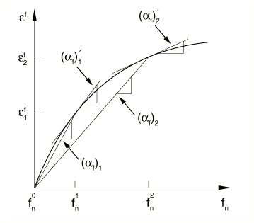
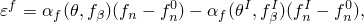
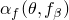
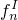
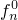
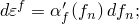

# 26.1.3 场膨胀

**产品：** Abaqus/Standard

##### **参考资料**

- ["材料库：概述，" 第21.1.1节](pt05ch21s01abo18.md)
- ["UEXPAN，" Abaqus用户子程序参考指南第1.1.30节](../sub/sub-link.md#sub-rtn-uuexpan)
- [*EXPANSION](../key/key-link.md#usb-kws-mexpansion)

### 概述

场膨胀效应：
- 可以通过指定场膨胀系数来定义，以便Abaqus/Standard可以计算由预定义场变量变化驱动的场膨胀应变；
- 可以是各向同性、正交各向异性或完全各向异性；
- 定义为从预定义场变量的参考值起的总膨胀；
- 可以指定为温度和/或预定义场变量的函数；
- 可以直接在用户子程序[`UEXPAN`](../sub/sub-link.md#sub-xsl-uexpan)中指定（如果场膨胀应变是场变量和状态变量的复杂函数）；以及
- 可以为多个预定义场变量定义。

### 定义场膨胀系数

场膨胀是包含在材料定义中的材料属性（参见["材料数据定义，" 第21.1.2节](pt05ch21s01aus109.md)），但当它指的是其材料属性未作为材料定义一部分的垫圈的膨胀时除外。在这种情况下，场膨胀必须与垫圈行为定义结合使用（参见["使用垫圈行为模型直接定义垫圈行为，" 第32.6.6节](pt06ch32s06alm51.md)）。

| **输入文件用法：** | 使用以下选项为大多数材料定义与预定义场变量号*n*相关的场膨胀： |
| --- | --- |
|  | ``` [*MATERIAL](../key/key-link.md#usb-kws-mmaterial) [*EXPANSION](../key/key-link.md#usb-kws-mexpansion), FIELD=*n* ``` [*EXPANSION](../key/key-link.md#usb-kws-mexpansion)选项可以使用不同的预定义场变量号*n*值重复，以定义与多个场相关的场膨胀。使用以下选项为其本构响应直接定义为垫圈行为的垫圈定义与预定义场变量号*n*相关的场膨胀： ``` [*GASKET BEHAVIOR](../key/key-link.md#usb-kws-mgasketbehavior) [*EXPANSION](../key/key-link.md#usb-kws-mexpansion), FIELD=*n* ``` [*EXPANSION](../key/key-link.md#usb-kws-mexpansion)选项可以使用不同的预定义场变量号*n*值重复，以定义与多个场相关的场膨胀。 |

#### 场膨胀应变计算

Abaqus/Standard需要场膨胀系数，）。

**图26.1.3-1** 场膨胀系数的定义。



每个指定场的场膨胀根据公式产生场膨胀应变



其中



是场膨胀系数；


是预定义场变量*n*的当前值；



是预定义场变量*n*的初始值；


是预定义场变量的当前值；


是预定义场变量的初始值；以及



是场膨胀系数的预定义场变量*n*的参考值。

上述方程中的第二项表示由预定义场变量*n*的初始值，是温度或场变量的函数，则可以定义, FIELD=*n*, ZERO= ``` |
| --- | --- |

#### 将场膨胀系数从微分形式转换为总形式

如上一节所述，可以直接提供总场膨胀系数。但是，您可能以微分形式获得场膨胀数据：



也就是说，提供了应变-场变量曲线的切线（参见[图26.1.3-1](pt05ch26s01abm53.md#cfieldexpan-def)）。要转换为Abaqus所需的总场膨胀形式，必须从适当选择的场变量参考值，

例如，假设

Abaqus所需的总膨胀系数随后获得为


### 在用户子程序[`UEXPAN`](../sub/sub-link.md#sub-xsl-uexpan)中定义场膨胀应变增量

可以在用户子程序[`UEXPAN`](../sub/sub-link.md#sub-xsl-uexpan)中可以将场膨胀应变增量指定为温度和/或预定义场变量的函数。如果场膨胀应变增量取决于状态变量，则必须使用用户子程序[`UEXPAN`](../sub/sub-link.md#sub-xsl-uexpan)。

您只能在单个材料定义中使用一次用户子程序[`UEXPAN`](../sub/sub-link.md#sub-xsl-uexpan)。特别是，您不能使用用户子程序[`UEXPAN`](../sub/sub-link.md#sub-xsl-uexpan)在同一材料定义中同时定义热膨胀和场膨胀或多个场膨胀。

| **输入文件用法：** | ``` [*EXPANSION](../key/key-link.md#usb-kws-mexpansion), FIELD=*n*, USER ``` |
| --- | --- |

### 定义初始温度和场变量值

如果场膨胀系数，），则在场膨胀应变方程中的）。

在超弹性和超泡沫材料模型中仅允许各向同性场膨胀。

#### 各向同性膨胀

如果直接定义场膨胀系数，则在每个温度和/或预定义场变量下只需要一个，则只需定义一个各向同性场膨胀应变增量（, FIELD=*n*, TYPE=ISO ``` 使用以下选项使用用户子程序[`UEXPAN`](../sub/sub-link.md#sub-xsl-uexpan)定义场膨胀： ``` [*EXPANSION](../key/key-link.md#usb-kws-mexpansion), FIELD=*n*, TYPE=ISO, USER ``` |

#### 正交各向异性膨胀

如果直接定义场膨胀系数，则应将主材料方向上的三个膨胀系数（，则必须定义主材料方向上场膨胀应变增量的三个分量（, FIELD=*n*, TYPE=ORTHO ``` 使用以下选项使用用户子程序[`UEXPAN`](../sub/sub-link.md#sub-xsl-uexpan)定义场膨胀： ``` [*EXPANSION](../key/key-link.md#usb-kws-mexpansion), FIELD=*n*, TYPE=ORTHO, USER ``` |

#### 各向异性膨胀

如果直接定义场膨胀系数，则必须将，则必须定义场膨胀应变增量的所有六个分量（, FIELD=*n*, TYPE=ANISO ``` 使用以下选项使用用户子程序[`UEXPAN`](../sub/sub-link.md#sub-xsl-uexpan)定义场膨胀： ``` [*EXPANSION](../key/key-link.md#usb-kws-mexpansion), FIELD=*n*, TYPE=ANISO, USER ``` |

### 场膨胀应力

当结构不能自由膨胀时，如果存在与该预定义场变量相关的场膨胀，则预定义场变量的变化会引起应力。例如，考虑一个长度为L的两节点桁架，两端完全约束。横截面积；杨氏模量，*E*；和场膨胀系数，）结合使用。

#### 将场膨胀与其他材料模型一起使用

对于大多数材料，场膨胀由单个系数或一组正交各向异性或各向异性系数定义，或者通过在用户子程序[`UEXPAN`](../sub/sub-link.md#sub-xsl-uexpan)中定义增量场膨胀应变来定义。

#### 将场膨胀与垫圈行为一起使用

场膨胀可以与任何垫圈行为定义结合使用。场膨胀将影响垫圈在膜方向上的膨胀和/或垫圈厚度方向上的膨胀。

### 单元

场膨胀可用于Abaqus/Standard中除使用通用截面行为的梁和壳单元外的任何应力/位移单元。
