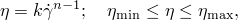
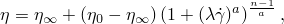
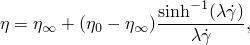
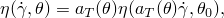

# 26.1.4 粘度

**产品：** Abaqus/Explicit  Abaqus/CFD  Abaqus/CAE

##### **参考资料**

- ["状态方程中的粘性剪切行为，" 第25.2.1节](pt05ch25s02abm50.md#usb-mat-ceos-deviatoricviscous)
- [*VISCOSITY](../key/key-link.md#usb-kws-mviscosity)
- [*EOS](../key/key-link.md#usb-kws-meos)
- [*TRS](../key/key-link.md#usb-kws-mtrs)
- ["在"定义其他机械模型"中定义粘度，" Abaqus/CAE用户指南第12.9.4节](../usi/usi-link.md#usi-prp-mechanical-other-viscosity)

### 概述

材料剪切粘度是流体抵抗流动的内部属性。它可以在Abaqus/Explicit和Abaqus/CFD中指定。

Abaqus/Explicit中的材料剪切粘度：
- 可以是温度和剪切应变率的函数；以及
- 必须与状态方程结合使用（["状态方程，" 第25.2.1节](pt05ch25s02abm50.md)）。

Abaqus/CFD中的材料剪切粘度：
- 对于牛顿模型可以只是温度的函数；
- 可以是剪切应变率的函数；以及
- 不支持场依赖变体。

### 粘性剪切行为

粘性流体对流动的阻力用以下偏应力与应变率的关系来描述


其中

其中。

#### 牛顿模型

牛顿模型用于模拟由牛顿流体的Navier-Poisson定律控制的粘性层流，, DEFINITION=NEWTONIAN (default) ``` |
| --- | --- |

| **Abaqus/CAE用法：** | 属性模块：材料编辑器：****机械****粘度**** |
| --- | --- |

#### 幂律

幂律模型通常用于描述非牛顿流体的粘度。粘度表示为



其中, DEFINITION=POWER LAW ``` |
| --- | --- |

| **Abaqus/CAE用法：** | Abaqus/CAE中不支持幂律模型。 |
| --- | --- |

#### Carreau-Yasuda

Carreau-Yasuda模型描述了聚合物的剪切变稀行为。该模型通常比幂律模型在高和低剪切应变率下都提供更好的拟合。粘度表示为



其中=2时，恢复原始Carreau模型。

| **输入文件用法：** | ``` [*VISCOSITY](../key/key-link.md#usb-kws-mviscosity), DEFINITION=CARREAU-YASUDA ``` |
| --- | --- |

| **Abaqus/CAE用法：** | Abaqus/CAE中不支持Carreau-Yasuda模型。 |
| --- | --- |

#### Cross

Cross模型通常在需要描述粘度低剪切率行为时使用。粘度表示为


其中, DEFINITION=CROSS ``` |
| --- | --- |

| **Abaqus/CAE用法：** | Abaqus/CAE中不支持Cross模型。 |
| --- | --- |

#### Herschel-Bulkley

Herschel-Bulkley模型可用于描述粘塑性流体（如Bingham塑性体）的行为，这种流体表现出屈服响应。粘度表示为


其中=1。

| **输入文件用法：** | ``` [*VISCOSITY](../key/key-link.md#usb-kws-mviscosity), DEFINITION=HERSCHEL-BULKLEY ``` |
| --- | --- |

| **Abaqus/CAE用法：** | Abaqus/CAE中不支持Herschel-Bulkley模型。 |
| --- | --- |

#### Powell-Eyring

该模型源于速率过程理论，主要与分子流体相关，但可在某些情况下用于描述聚合物溶液和粘弹性悬浮液在广泛剪切速率范围内的粘性行为。粘度表示为



其中, DEFINITION=POWELL-EYRING ``` |
| --- | --- |

| **Abaqus/CAE用法：** | Abaqus/CAE中不支持Powell-Eyring模型。 |
| --- | --- |

#### Ellis-Meter

Ellis-Meter模型用有效剪切应力，

其中, DEFINITION=ELLIS-METER ``` |
| --- | --- |

| **Abaqus/CAE用法：** | Abaqus/CAE中不支持Ellis-Meter模型。 |
| --- | --- |

#### 表格形式

在Abaqus/Explicit中，粘度可以直接指定为剪切应变率和温度的表格函数。在Abaqus/CFD中仅支持剪切应变率依赖。

| **输入文件用法：** | ``` [*VISCOSITY](../key/key-link.md#usb-kws-mviscosity), DEFINITION=TABULAR ``` |
| --- | --- |

| **Abaqus/CAE用法：** | 在Abaqus/CAE中不支持直接指定粘度为表格函数。 |
| --- | --- |

#### 用户定义（Abaqus/Explicit仅限）

在Abaqus/Explicit中，您可以在用户子程序[`VUVISCOSITY`](../sub/sub-link.md#sub-xsl-vuviscosity)中指定用户定义的粘度（参见["VUVISCOSITY，" Abaqus用户子程序参考指南第1.2.24节](../sub/sub-link.md#sub-rtn-uexpuviscosity)）。

| **输入文件用法：** | ``` [*VISCOSITY](../key/key-link.md#usb-kws-mviscosity), DEFINITION=USER ``` |
| --- | --- |

| **Abaqus/CAE用法：** | Abaqus/CAE中不支持用户定义的粘度。 |
| --- | --- |

### 粘度的温度依赖性（Abaqus/Explicit仅限）

许多工业上有趣的聚合物材料的粘度温度依赖性服从以下形式的时间-温度平移关系：



其中。

| **输入文件用法：** | 使用以下选项定义热流变简单（TRS）温度依赖粘度： |
| --- | --- |
|  | ``` [*VISCOSITY](../key/key-link.md#usb-kws-mviscosity) [*TRS](../key/key-link.md#usb-kws-mtrs) ``` |

| **Abaqus/CAE用法：** | Abaqus/CAE中不支持定义热流变简单温度依赖粘度。 |
| --- | --- |

### 材料选项

Abaqus/Explicit中的材料剪切粘度必须与状态方程结合使用，以定义材料的体积机械行为（参见["状态方程，" 第25.2.1节](pt05ch25s02abm50.md)）。

### 单元

材料剪切粘度可用于Abaqus/Explicit中除平面应力单元外的任何固体（连续体）单元，以及Abaqus/CFD中的任何流体（连续体）单元。
