# 26.3.1 声学介质

**产品：** Abaqus/Standard  Abaqus/Explicit  Abaqus/CAE

##### **参考资料**

- ["声学、冲击和耦合声学-结构分析，" 第6.10.1节](pt03ch06s10at29.md)
- ["声学和冲击载荷，" 第34.4.6节](pt07ch34s04aus125.md)
- ["材料库：概述，" 第21.1.1节](pt05ch21s01abo18.md)
- ["Abaqus/Standard和Abaqus/Explicit中的初始条件，" 第34.2.1节](pt07ch34s02aus116.md)
- [*ACOUSTIC MEDIUM](../key/key-link.md#usb-kws-macousticmed)
- [*DENSITY](../key/key-link.md#usb-kws-mdensity)
- [*INITIAL CONDITIONS](../key/key-link.md#usb-kws-minitialcond)
- ["定义声学介质，" Abaqus/CAE用户指南第12.12.1节](../usi/usi-link.md#usi-prp-other-acousticmedium)

### 概述

声学介质：
- 用于模拟声波传播问题；
- 可用于纯声学分析或耦合声学-结构分析，如流体中冲击波的计算或振动问题中的噪声水平；
- 是一种弹性介质（通常为流体），其中应力完全是静水压的（无剪切应力），压力与体积应变成比例；
- 作为材料定义的一部分指定；
- 必须与密度定义结合出现（参见["密度，" 第21.2.1节](pt05ch21s02abm01.md)）；
- 在Abaqus/Explicit中，当绝对压力降至极限值时可以包含流体空化；
- 可以定义为温度和/或场变量的函数；
- 可以包含耗散效应；
- 可以模拟小压力变化（小振幅激励）；
- 可以在介质存在稳态底层流动的情况下模拟波；以及
- 仅在动态分析程序期间激活（["动态分析程序：概述，" 第6.3.1节](pt03ch06s03abo07.md)）。

### 定义声学介质

可压缩、无粘性流体流过阻尼矩阵材料的小运动平衡方程为

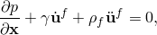

其中*p*是流体中的动态压力（超过任何初始静压力的压力），是流体粒子的空间位置，是流体粒子速度，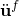是流体粒子加速度，是流体密度，

其中是体积应变。必须定义声学介质的体积模量）或直接解稳态动态分析（["直接解稳态动态分析，" 第6.3.4节](pt03ch06s03at09.md)）期间不变化值；对于这些程序，使用步开始时体积模量的值。

| **输入文件用法：** | 使用以下两个选项定义声学介质： |
| --- | --- |
|  | ``` [*ACOUSTIC MEDIUM](../key/key-link.md#usb-kws-macousticmed), BULK MODULUS [*DENSITY](../key/key-link.md#usb-kws-mdensity) ``` |

| **Abaqus/CAE用法：** | 属性模块：材料编辑器：****其他****声学介质****：** 体积模量******通用****密度**** |
| --- | --- |

### 体积拖曳

能量耗散（和声波衰减）可能由于多种因素在声学介质中发生。这种耗散效应在频域中由传播常数的虚部来现象学地表征，这给出了作为距离函数的指数衰减。在Abaqus中，建模这种效应的最简单方法是通过"体积拖曳系数"，（每单位体积每速度的力）。

在频域程序中，, VOLUMETRIC DRAG ``` |
| --- | --- |

| **Abaqus/CAE用法：** | 属性模块：材料编辑器：****其他****声学介质****：** 体积拖曳**：** 包含体积拖曳** |
| --- | --- |

### 多孔声学材料模型

多孔材料常用于抑制声波；这种衰减效应源于声学流体与固体基体相互作用时的多种效应。对于许多类别的材料，固体基体可以近似为相对于声学流体完全刚性或完全柔软的。在这些情况下，仅解析声波的机械模型就足够了。多孔材料的声学行为可以在Abaqus/Standard中以多种方式建模。

#### Craggs模型

[Craggs (1978)](pt05ch26s03abm58.md#craggs78)中讨论的模型很容易在Abaqus中实现。应用此模型会得到以以下形式表示的流体动态平衡方程：

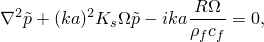

其中](pt05ch26s03abm58.md#delany)提出的著名经验模型，该模型将材料属性确定为频率和用户定义的流动电阻率，](pt05ch26s03abm58.md#miki)提出的该模型的变体也可用。这些模型仅支持稳态动力学程序。

两种模型都根据以下公式计算依赖于频率的材料特性阻抗，

和


常数如下表所示：

|  |  |  |  | 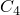 |  | 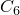 |  |  |
| --- | --- | --- | --- | --- | --- | --- | --- | --- |
| Delany-Bazley | 0.0978 | --0.7 | 0.189 | --0.595 | 0.0571 | --0.754 | 0.087 | --0.732 |
| Miki | 0.1227 | --0.618 | 0.1792 | --0.618 | 0.0786 | --0.632 | 0.1205 | --0.632 |

材料特性阻抗和波数在内部转换为复密度和复体积模量以在Abaqus中使用。这些公式中虚部的符号与Abaqus对时间谐波动力学的符号约定一致。

| **输入文件用法：** | ``` 使用以下选项使用Delany-Bazley模型： [*DENSITY](../key/key-link.md#usb-kws-mdensity) [*ACOUSTIC MEDIUM](../key/key-link.md#usb-kws-macousticmed), BULK MODULUS [*ACOUSTIC MEDIUM](../key/key-link.md#usb-kws-macousticmed), POROUS MODEL=DELANY BAZLEY 使用以下选项使用Miki模型： [*DENSITY](../key/key-link.md#usb-kws-mdensity) [*ACOUSTIC MEDIUM](../key/key-link.md#usb-kws-macousticmed), BULK MODULUS [*ACOUSTIC MEDIUM](../key/key-link.md#usb-kws-macousticmed), POROUS MODEL=MIKI ``` |
| --- | --- |

| **Abaqus/CAE用法：** | Abaqus/CAE中不支持多孔声学材料模型。 |
| --- | --- |

#### 一般频率依赖模型

对于稳态动力学程序，Abaqus/Standard支持一般频率依赖复体积模量和复密度。使用这些参数，可以容纳来自广泛范围模型的数据进行分析；例如，参见[Allard等人(1998)](pt05ch26s03abm58.md#allard98)、[Attenborough (1982)](pt05ch26s03abm58.md#atten82)、[Song & Bolton (1999)](pt05ch26s03abm58.md#song99)和[Wilson (1993)](pt05ch26s03abm58.md#wilson93)。这些模型用于各种应用，如海洋声学、航空航天、汽车和建筑声学工程。

这些参数的符号必须与Abaqus中使用的符号约定和能量守恒一致。Abaus使用傅里叶变换对形式上等同于假设

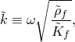


与Abaqus符号约定一致，, COMPLEX BULK MODULUS [*ACOUSTIC MEDIUM](../key/key-link.md#usb-kws-macousticmed), COMPLEX DENSITY ``` |
| --- | --- |
|  | 如果需要，任一复杂材料选项都可以与实值、频率无关的材料选项结合使用： ``` [*ACOUSTIC MEDIUM](../key/key-link.md#usb-kws-macousticmed), COMPLEX BULK MODULUS [*DENSITY](../key/key-link.md#usb-kws-mdensity) ``` 或者， ``` [*ACOUSTIC MEDIUM](../key/key-link.md#usb-kws-macousticmed), BULK MODULUS [*ACOUSTIC MEDIUM](../key/key-link.md#usb-kws-macousticmed), COMPLEX DENSITY ``` |

| **Abaqus/CAE用法：** | Abaqus/CAE中不支持一般频率依赖声学材料模型。 |
| --- | --- |

##### 从复材料阻抗和波数转换

由于

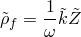

和

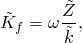


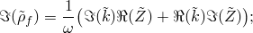


。

##### 从复阻抗和声速转换

由于


和


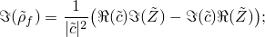


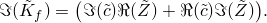

。

### 流体空化

一般来说，流体不能承受任何显著的拉伸应力，当绝对压力接近或小于零时可能会发生大体积膨胀。Abaqus/Explicit允许通过声学介质的空化压力极限来对此现象进行建模。当流体绝对压力（动态和初始静压力之和）降至此极限时，流体发生自由体积膨胀（即空化），压力不再进一步下降。如果未定义此极限，则即使在拉伸、负绝对压力条件下，也认为流体不会发生空化。

能够发生空化的声学介质的本构行为可以表示为


其中伪压力, CAVITATION LIMIT ``` |
| --- | --- |

| **Abaqus/CAE用法：** | Abaqus/CAE中不支持流体空化。 |
| --- | --- |

#### 定义波formulation

在Abaqus/Explicit中存在空化时，流体机械行为是非线性的。因此，对于具有入射波载荷和流体中可能空化的声学问题，仅提供散射波动态声压解决方案的散射波formulations可能不合适。对于这些情况，应选择求解总动态声压的总波formulations。详情参见["声学和冲击载荷，" 第34.4.6节](pt07ch34s04aus125.md)。

| **输入文件用法：** | ``` [*ACOUSTIC WAVE FORMULATION](../key/key-link.md#usb-kws-macousticwaveform), TYPE=TOTAL WAVE ``` |
| --- | --- |

| **Abaqus/CAE用法：** | 任何模块：****模型****编辑属性*****模型名称*****。切换**指定声波formulation**：**总波** |
| --- | --- |

#### 定义初始声学静压力

当绝对压力达到空化极限值时发生空化。Abaqus/Explicit允许在流体介质中定义初始线性变化的静水压力（参见["在Abaqus/Standard和Abaqus/Explicit中定义初始声学静压力，" 第34.2.1节](pt07ch34s02aus116.md#usb-prc-pinitialcond-acousticstaticpressure)）。您可以在两个位置指定压力值和声学介质节点的节点集。Abaqus/Explicit从这些数据插值以初始化指定节点集中所有节点的静压力。如果仅在一个位置指定了压力，则假定流体中的静水压力是均匀的。声学静压力仅用于确定声学单元节点的空化状态，不会对其共同湿润界面的声学或结构网格施加任何静载荷。

| **输入文件用法：** | ``` [*INITIAL CONDITIONS](../key/key-link.md#usb-kws-minitialcond), TYPE=ACOUSTIC STATIC PRESSURE ``` |
| --- | --- |

| **Abaqus/CAE用法：** | Abaqus/CAE中不支持初始声学压力。 |
| --- | --- |

### 定义稳态流场

声学有限元可用于在介质存在稳态平均流动的情况下模拟时间谐波波传播和固有频率分析。例如，空气可能以足够大的速度移动，影响波沿流动方向和逆流动方向的传播速度。这些效应在Abaqus/Standard中通过在线性扰动分析步定义期间指定声学流速来建模；您不需要改变声学材料属性。详情参见["声学、冲击和耦合声学-结构分析，" 第6.10.1节](pt03ch06s10at29.md)。

### 单元

声学材料定义只能与Abaqus中的声学单元一起使用（参见["为分析类型选择适当的单元，" 第27.1.3节](pt06ch27s01aus112.md)）。

在Abaqus/Standard中，二阶声学单元比一阶声学单元更准确。在声学介质中使用至少每波长六个节点，![](../graphics/usb_eqn00445.gif，以获得准确的结果。

### 输出

节点输出变量POR（压力幅值）可用于Abaqus中的声学介质（在Abaqus/CAE中此输出变量称为PAC）。当在Abaqus/Explicit中使用散射波formulations与入射波载荷时，输出变量POR仅表示模型的散射压力响应，不包括入射波载荷本身。当使用总波formulations时，输出变量POR表示总动态声压，包括入射和散射波的贡献以及流体空化的动态效应。对于任一formulations，输出变量POR不包括声学静压力，其仅用于评估声学介质中的空化状态。

此外，在Abaqus/Standard中，节点输出变量PPOR（压力相位）可用于声学介质。在Abaqus/Explicit中，节点输出变量PABS（绝对压力，等于POR与声学静压力之和）可用于声学介质。

#### 附加参考资料

- Allard, J. F., M. Henry, J. Tizianel, L. Kelders, and W. Lauriks, "Sound Propagation in Air-Saturated Random Packings of Beads," Journal of the Acoustical Society of America, vol. 104, no.4 2004, 1998.
- Attenborough, K. F., "Acoustical Characterisitics of Rigid Fibrous Absorbents and Granular Materials," Journal of the Acoustical Society of America, vol. 73, no.3 785, 1982.
- Craggs, A., "A Finite Element Model for Rigid Porous Absorbing Materials," Journal of Sound and Vibration, vol. 61, no.1 101, 1978.
- Craggs, A., "Coupling of Finite Element Acoustic Absorption Models," Journal of Sound and Vibration, vol. 66, no.4 605, 1979.
- Delany, M. E., and E. N. Bazley, "Acoustic Properties of Fibrous Absorbent Materials," Applied Acoustics, vol. 3 105, 1970.
- Miki, Y., "Acoustical Properties of Porous Materials - Modifications of Delany-Bazley Models," Journal of the Acoustical Society of Japan (E), vol. 11, no.1 19, 1990.
- Song, B. H., and J. S. Bolton, "A Transfer-Matrix Approach for Estimating the Characteristic Impedance and Wavenumbers of Limp and Rigid Porous Materials," Journal of the Acoustical Society of America, vol. 107, no.3 1131, 1999.
- Wilson, D. K., "Relaxation-Matched Modeling of Propagation through Porous Media, Including Fractal Pore Structure," Journal of the Acoustical Society of America, vol. 94, no.2 1136, 1993.
