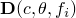
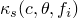
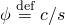
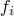

# 26.4.1 扩散率

**产品：** Abaqus/Standard  Abaqus/CAE

##### **参考资料**

- ["质量扩散分析，" 第6.9.1节](pt03ch06s09at28.md)
- ["材料库：概述，" 第21.1.1节](pt05ch21s01abo18.md)
- [*DIFFUSIVITY](../key/key-link.md#usb-kws-mdiffusivity)
- [*KAPPA](../key/key-link.md#usb-kws-mkappa)
- ["定义质量扩散，" Abaqus/CAE用户指南第12.12.2节](../usi/usi-link.md#usi-prp-other-massdiffusion)

### 概述

扩散率：
- 定义一种材料通过另一种材料的扩散或移动，如氢通过金属的扩散；
- 必须始终为质量扩散分析定义；
- 必须与["溶解度，" 第26.4.2节](pt05ch26s04abm60.md)结合定义；
- 可以定义为浓度、温度和/或预定义场变量的函数；
- 可以与"Soret效应"因子结合使用，以引入由温度梯度引起的质量扩散；
- 可以与压力应力因子结合使用，以引入由等效压力应力（静水压力）梯度引起的质量扩散；以及
- 当包含浓度依赖时，可以产生非线性质量扩散分析（Soret效应因子和压力应力因子也是如此）。

### 定义扩散率

扩散率是扩散材料的浓度通量，

其中



是扩散率；


是溶解度（参见["溶解度，" 第26.4.2节](pt05ch26s04abm60.md)）；



是Soret效应因子，由于温度梯度提供扩散（见下文）；


是压力应力因子，由于等效压力应力梯度提供扩散（见下文）；



是归一化浓度；

*c*

是扩散材料的浓度；


是温度；


是绝对零温度（见下文）；


是等效压力应力；以及



是任何预定义场变量。

| **输入文件用法：** | ``` [*DIFFUSIVITY](../key/key-link.md#usb-kws-mdiffusivity), LAW=GENERAL (default) ``` |
| --- | --- |

| **Abaqus/CAE用法：** | 属性模块：材料编辑器：****其他****质量扩散****扩散率****：** 定律：通用** |
| --- | --- |

#### Fick定律

Fick定律的扩展形式可用作一般化学势的替代：


| **输入文件用法：** | ``` [*DIFFUSIVITY](../key/key-link.md#usb-kws-mdiffusivity), LAW=FICK ``` |
| --- | --- |

| **Abaqus/CAE用法：** | 属性模块：材料编辑器：****其他****质量扩散****扩散率****：** 定律：Fick** |
| --- | --- |

### 扩散率的方向依赖性

可以定义各向同性、正交各向异性或完全各向异性扩散率。对于非各向同性扩散率，必须指定材料方向的局部方向（参见["方向，" 第2.2.5节](pt01ch02s02aus15.md)）。

#### 各向同性扩散率

对于各向同性扩散率，在每个浓度、温度和场变量值下只需要一个扩散率值。

| **输入文件用法：** | ``` [*DIFFUSIVITY](../key/key-link.md#usb-kws-mdiffusivity), TYPE=ISO ``` |
| --- | --- |

| **Abaqus/CAE用法：** | 属性模块：材料编辑器：****其他****质量扩散****扩散率****：** 类型：各向同性** |
| --- | --- |

#### 正交各向异性扩散率

对于正交各向异性扩散率，在每个浓度、温度和场变量值下需要三个扩散率值（, TYPE=ORTHO ``` |
| --- | --- |

| **Abaqus/CAE用法：** | 属性模块：材料编辑器：****其他****质量扩散****扩散率****：** 类型：正交各向异性** |
| --- | --- |

#### 各向异性扩散率

对于完全各向异性扩散率，在每个浓度、温度和场变量值下需要六个扩散率值（, TYPE=ANISO ``` |
| --- | --- |

| **Abaqus/CAE用法：** | 属性模块：材料编辑器：****其他****质量扩散****扩散率****：** 类型：各向异性** |
| --- | --- |

### 温度驱动的质量扩散

Soret效应因子，）。

| **输入文件用法：** | 使用以下两个选项指定一般温度驱动的质量扩散： |
| --- | --- |
|  | ``` [*DIFFUSIVITY](../key/key-link.md#usb-kws-mdiffusivity), LAW=GENERAL [*KAPPA](../key/key-link.md#usb-kws-mkappa), TYPE=TEMP ``` 使用以下选项指定由Fick定律控制的温度驱动扩散： ``` [*DIFFUSIVITY](../key/key-link.md#usb-kws-mdiffusivity), LAW=FICK ``` |

| **Abaqus/CAE用法：** | 使用以下选项指定一般温度驱动的质量扩散： |
| --- | --- |
|  | 属性模块：材料编辑器：****其他****质量扩散****扩散率****：** 定律：通用**：****子选项****Soret效应**** 使用以下选项指定由Fick定律控制的温度驱动扩散：属性模块：材料编辑器：****其他****质量扩散****扩散率****：** 定律：Fick** |

### 压力应力驱动的质量扩散

压力应力因子，, LAW=GENERAL [*KAPPA](../key/key-link.md#usb-kws-mkappa), TYPE=PRESS ``` |

| **Abaqus/CAE用法：** | 属性模块：材料编辑器：****其他****质量扩散****扩散率****：** 定律：通用**：****子选项****压力效应**** |
| --- | --- |

### 由温度和压力应力共同驱动的质量扩散

同时指定, LAW=GENERAL [*KAPPA](../key/key-link.md#usb-kws-mkappa), TYPE=TEMP [*KAPPA](../key/key-link.md#usb-kws-mkappa), TYPE=PRESS ``` 使用以下两个选项指定由Fick定律扩展形式驱动的扩散： ``` [*DIFFUSIVITY](../key/key-link.md#usb-kws-mdiffusivity), LAW=FICK [*KAPPA](../key/key-link.md#usb-kws-mkappa), TYPE=PRESS ``` |

| **Abaqus/CAE用法：** | 使用以下选项指定由温度和压力应力梯度驱动的一般扩散： |
| --- | --- |
|  | 属性模块：材料编辑器：****其他****质量扩散****扩散率****：** 定律：通用**：****子选项****Soret效应****和****子选项****压力效应**** 使用以下选项指定由Fick定律扩展形式驱动的扩散：属性模块：材料编辑器：****其他****质量扩散****扩散率****：** 定律：Fick**：****子选项****压力效应**** |

### 指定绝对零的值

您可以将绝对零的值指定为物理常数。

| **输入文件用法：** | ``` [*PHYSICAL CONSTANTS](../key/key-link.md#usb-kws-mphysicalconsts), ABSOLUTE ZERO= ``` |
| --- | --- |

| **Abaqus/CAE用法：** | 任何模块：****模型****编辑属性*****模型名称*****：** 绝对零温度** |
| --- | --- |

### 单元

质量扩散定律只能与热传递/质量扩散单元库中包含的二维、三维和轴对称固体单元一起使用。
