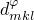
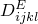
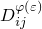
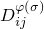
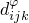
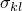
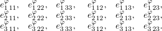

# 26.5.2 压电行为

**产品：** Abaqus/Standard  Abaqus/CAE

##### **参考资料**

- ["压电分析，" 第6.7.2节](pt03ch06s07at21.md)
- ["材料库：概述，" 第21.1.1节](pt05ch21s01abo18.md)
- [*DIELECTRIC](../key/key-link.md#usb-kws-mdielectric)
- [*PIEZOELECTRIC](../key/key-link.md#usb-kws-mpiezoelect)
- ["定义介电材料属性，" Abaqus/CAE用户指南第12.11.2节](../usi/usi-link.md#usi-prp-electrical-dielectric)
- ["定义压电属性，" Abaqus/CAE用户指南第12.11.3节](../usi/usi-link.md#usi-prp-electrical-piezoelectric)

### 概述

压电材料具有以下特性：
- 电场会导致材料应变，而应力会导致电势梯度；
- 提供机械场和电场之间的线性关系；以及
- 用于压电单元，单元节点同时具有位移和电势自由度。

### 定义压电材料

压电材料响应电势梯度而产生应变，同时应力在材料中产生电势梯度。电势梯度与应变之间的这种耦合就是材料的压电特性。材料还具有介电特性，以便当材料具有电势梯度时存在电荷。压电材料行为在["压电分析，" Abaqus理论指南第2.10.1节](../stm/stm-link.md#stm-anl-piezoelectric)中讨论。

材料的机械性能必须通过线性弹性建模（["线性弹性行为，" 第22.2.1节](pt05ch22s02abm02.md)）。机械行为可以通过


基于压电应力系数矩阵来定义，或者通过


基于压电应变系数矩阵来定义。电行为由


定义，其中


是机械应力张量；


是应变张量；


是电"位移"向量；



是材料在零电势梯度（短路条件）下定义的弹性刚度矩阵；


是材料的压电应力系数矩阵，定义在全约束材料中由电势梯度引起的应力（也可以解释为在零电势梯度下由施加的应变引起的电位移）；


是材料的压电应变系数矩阵，定义在无约束材料中由电势梯度引起的应变（本节后面给出了另一种解释）；


是电势；



是材料的介电特性，定义在全约束材料中电位移与电势梯度之间的关系；以及


是电势梯度向量，。

因此，材料的电学和机电耦合行为由其介电特性及其压电应力系数矩阵或其压电应变系数矩阵定义。这些特性作为材料定义的一部分进行定义（["材料数据定义，" 第21.1.2节](pt05ch21s01aus109.md)）。

### 本构方程的替代形式

本节介绍了压电本构方程的替代形式。这些方程形式涉及的abra材料特性不能直接用作Abaqus/Standard的输入。但是，它们通过简单的关系与Abaqus/Standard输入相关联，这些关系在["压电分析，" Abaqus理论指南第2.10.1节](../stm/stm-link.md#stm-anl-piezoelectric)中给出。本节的目的是在Abaqus/Standard术语和压电领域常用的输入之间建立联系。机械行为也可以通过


基于压电系数矩阵和刚度矩阵来定义，该刚度矩阵定义了在零电位移（开路条件）下的机械特性。同样，电行为也可以通过


基于无约束材料的介电矩阵来定义，或者通过


定义，其中


是材料在零电位移下定义的弹性刚度矩阵；



是前面使用的材料的压电应变系数矩阵，基于方程，也可以解释为在零电势梯度下由应力引起的电位移；


是材料的压电系数矩阵，可以解释为定义无约束材料中由电位移引起的应变，或者在零电位移下由应力引起的电势梯度；以及


是材料的介电特性，定义无约束材料中电位移与电势梯度之间的关系。

这些是压电文献中常见的有用关系。在["压电分析，" Abaqus理论指南第2.10.1节](../stm/stm-link.md#stm-anl-piezoelectric)中，特性、和用作为Abaqus/Standard输入的特性、和来表示。

### 指定介电材料属性

介电矩阵可以是各向同性、正交各向异性或完全各向异性。对于非各向同性介电材料，必须指定材料方向的局部方向（["方向，" 第2.2.5节](pt01ch02s02aus15.md)）。介电矩阵的条目（在Abaqus中称为"介电常数"）在文献中更常称为材料的介电常数。

#### 各向同性介电特性

介电矩阵可以是完全各向同性的，因此


您需要为介电常数指定单个值。必须针对约束材料确定。各向同性行为是默认值。

| **输入文件用法：** | ``` [*DIELECTRIC](../key/key-link.md#usb-kws-mdielectric), TYPE=ISO ``` |
| --- | --- |

| **Abaqus/CAE用法：** | 属性模块：材料编辑器：****电气/磁性****介电（电介电常数）****：** 类型：各向同性** |
| --- | --- |

#### 正交各向异性介电特性

对于正交各向异性行为，必须在介电矩阵中指定三个值（, TYPE=ORTHO ``` |
| --- | --- |

| **Abaqus/CAE用法：** | 属性模块：材料编辑器：****电气/磁性****介电（电介电常数）****：** 类型：正交各向异性** |
| --- | --- |

#### 各向异性介电特性

对于完全各向异性行为，必须在介电矩阵中指定六个值（。

| **输入文件用法：** | ``` [*DIELECTRIC](../key/key-link.md#usb-kws-mdielectric), TYPE=ANISO ``` |
| --- | --- |

| **Abaqus/CAE用法：** | 属性模块：材料编辑器：****电气/磁性****介电（电介电常数）****：** 类型：各向异性** |
| --- | --- |

### 指定压电材料属性

压电材料属性可以通过给出应力系数（这是默认值）或通过给出应变系数来定义。无论哪种情况，都必须按以下顺序给出18个分量（对于应变系数，用*d*替换*e*）：



这些系数上的第一个索引指的是电位移分量（有时称为电通量），而最后一对索引指的是机械应力或应变分量。

因此，引起1方向电位移的压电分量首先给出，然后是引起2方向电位移的分量，最后是引起3方向电位移的分量。（某些参考文献以不同的顺序列出这些耦合项。）

| **输入文件用法：** | 使用以下选项给出应力系数： |
| --- | --- |
|  | ``` [*PIEZOELECTRIC](../key/key-link.md#usb-kws-mpiezoelect), TYPE=S ``` 使用以下选项给出应变系数： ``` [*PIEZOELECTRIC](../key/key-link.md#usb-kws-mpiezoelect), TYPE=E ``` |

| **Abaqus/CAE用法：** | 属性模块：材料编辑器：****电气/磁性****压电****：** 类型：应力**或**应变** |
| --- | --- |

#### 将双索引符号转换为三索引符号

行业提供的压电数据通常使用双索引符号。通过注意Abaqus中（二阶）张量与向量符号之间对应关系的约定，可以轻松地将双索引符号转换为Abaqus/Standard所需的三索引符号：张量的11、22、33、12、13和23分量分别对应于相应向量的1、2、3、4、5和6分量。

### 能量平衡考虑

Abaqus在总能量平衡方程中不考虑压电效应，这在某些情况下可能导致模型总能量明显不平衡。例如，如果压电桁架在一端固定，并在其两端之间施加电势差，则会因压电效应而变形。随后，如果桁架保持在此变形构型中并移除电势差，则由于约束将产生应变能。这会导致模型总能量等效增加。

### 单元

压电耦合仅在压电单元中激活（具有位移自由度和电势自由度9的单元）。参见["为分析类型选择适当的单元，" 第27.1.3节](pt06ch27s01aus112.md)。
