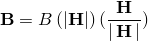
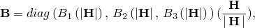
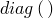
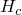
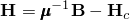
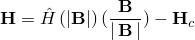
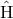

# 26.5.3 磁导率

**产品：** Abaqus/Standard  Abaqus/CAE

##### **参考资料**

- ["材料库：概述，" 第21.1.1节](pt05ch21s01abo18.md)
- [*MAGNETIC PERMEABILITY](../key/key-link.md#usb-kws-mmagpermeability)
- [*NONLINEAR BH](../key/key-link.md#usb-kws-mnonlinearbh)
- [*PERMANENT MAGNETIZATION](../key/key-link.md#usb-kws-mpermanentmagnetization)
- ["定义磁导率，" Abaqus/CAE用户指南第12.11.4节](../usi/usi-link.md#usi-prp-electrical-magneticpermeability)

### 概述

材料的磁导率：
- 必须为["涡流分析，" 第6.7.5节](pt03ch06s07at24.md)和["静磁分析，" 第6.7.6节](pt03ch06s07at25.md)定义；
- 可以直接指定用于线性磁行为，或通过一个或多个B-H曲线指定用于非线性磁行为；
- 可以是各向同性、正交各向异性或（对于线性行为）完全各向异性；
- 可以指定为温度和/或场变量的函数；
- 可以在时间谐波涡流过程中指定为频率的函数；以及
- 可以与永久磁化结合使用。

### 线性磁行为

线性磁行为通过直接指定磁导率来定义。

### 磁导率的方向依赖性

可以定义各向同性、正交各向异性或完全各向异性磁导率。对于非各向同性磁导率，必须指定材料方向的局部方向（["方向，" 第2.2.5节](pt01ch02s02aus15.md)）。

#### 各向同性磁导率

对于各向同性磁导率，在每个温度和场变量值下只需要一个磁导率值。各向同性磁导率是默认值。

| **输入文件用法：** | ``` [*MAGNETIC PERMEABILITY](../key/key-link.md#usb-kws-mmagpermeability), TYPE=ISOTROPIC ``` |
| --- | --- |

| **Abaqus/CAE用法：** | 属性模块：材料编辑器：****电气/磁性****磁导率****：** 类型：各向同性** |
| --- | --- |

#### 正交各向异性磁导率

对于正交各向异性磁导率，在每个温度和场变量值下需要三个磁导率值（。

| **输入文件用法：** | ``` [*MAGNETIC PERMEABILITY](../key/key-link.md#usb-kws-mmagpermeability), TYPE=ORTHOTROPIC ``` |
| --- | --- |

| **Abaqus/CAE用法：** | 属性模块：材料编辑器：****电气/磁性****磁导率****：** 类型：正交各向异性** |
| --- | --- |

#### 各向异性磁导率

对于完全各向异性磁导率，在每个温度和场变量值下需要六个值（。

| **输入文件用法：** | ``` [*MAGNETIC PERMEABILITY](../key/key-link.md#usb-kws-mmagpermeability), TYPE=ANISOTROPIC ``` |
| --- | --- |

| **Abaqus/CAE用法：** | 属性模块：材料编辑器：****电气/磁性****磁导率****：** 类型：各向异性** |
| --- | --- |

#### 频率依赖磁导率

磁导率可以在时间谐波涡流分析中定义为频率的函数。

| **输入文件用法：** | ``` [*MAGNETIC PERMEABILITY](../key/key-link.md#usb-kws-mmagpermeability), FREQUENCY ``` |
| --- | --- |

| **Abaqus/CAE用法：** | 属性模块：材料编辑器：****电气/磁性****磁导率****：** 切换**使用频率依赖数据** |
| --- | --- |

### 非线性磁行为

非线性磁行为的特征在于磁导率取决于磁场强度。Abaqus中的非线性磁性材料模型适用于理想软磁材料，没有任何磁滞效应（参见[图26.5.3-1](pt05ch26s05abm63.md#cmagpermeability-hardsoft)），其特征在于B-H空间中单调增加的响应，其中B和H分别指磁通密度向量和磁场向量的强度。非线性磁行为通过直接指定一个或多个B-H曲线来定义，这些曲线以H的函数形式提供B，可选地以一个或多个方向上的温度和/或预定义场变量为函数。非线性磁行为可以是各向同性、正交各向异性或横向各向同性（这是更一般的正交各向异性行为的特例）。如果非线性磁行为不是各向同性，则需要多个B-H曲线来定义。

### 非线性磁行为的方向依赖性

可以定义各向同性、正交各向异性或横向各向异性非线性磁行为。对于非各向同性非线性磁行为，必须指定材料方向的局部方向（["方向，" 第2.2.5节](pt01ch02s02aus15.md)）。

#### 各向同性非线性磁行为

对于各向同性非线性磁响应，在每个温度和场变量值下只需要一条B-H曲线。各向同性磁导率是默认值。Abaqus假定非线性磁行为由以下公式控制



| **输入文件用法：** | 您通过B-H曲线定义： |
| --- | --- |
|  | ``` [*MAGNETIC PERMEABILITY](../key/key-link.md#usb-kws-mmagpermeability), NONLINEAR, TYPE=ISOTROPIC [*NONLINEAR BH](../key/key-link.md#usb-kws-mnonlinearbh), DIR=*direction* ``` 任何方向（即全局方向1、2或3中的非线性行为）的B-H曲线都足以满足要求，因为假定非线性磁行为在所有方向上都相同。 |

| **Abaqus/CAE用法：** | 属性模块：材料编辑器：****电气/磁性****磁导率****：** 切换**使用非线性B-H曲线指定**：**类型：各向同性** |
| --- | --- |

#### 正交各向异性非线性磁行为

对于正交各向异性非线性磁响应，在每个温度和场变量值下需要三条B-H曲线（每个局部方向1、2和3各一条曲线）。Abaqus假定局部材料方向中的非线性磁行为由以下公式控制



其中指的是对角矩阵。

横向各向异性非线性磁行为是正交各向异性行为的一种特殊情况，其中任意两个方向的行为相同，与第三个方向的行为不同。

| **输入文件用法：** | 您通过三条独立的B-H曲线（方向1、2和3各一条）分别定义和： |
| --- | --- |
|  | ``` [*MAGNETIC PERMEABILITY](../key/key-link.md#usb-kws-mmagpermeability), NONLINEAR, TYPE=ORTHOTROPIC [*NONLINEAR BH](../key/key-link.md#usb-kws-mnonlinearbh), DIR=1 … [*NONLINEAR BH](../key/key-link.md#usb-kws-mnonlinearbh), DIR=2 … [*NONLINEAR BH](../key/key-link.md#usb-kws-mnonlinearbh), DIR=3 … ``` |

| **Abaqus/CAE用法：** | 属性模块：材料编辑器：****电气/磁性****磁导率****：** 切换**使用非线性B-H曲线指定**：**类型：正交各向异性** |
| --- | --- |

### 永久磁化

铁磁材料可以通过放置在磁场中来磁化，磁场通常通过在要被磁化的材料周围缠绕线圈系统中施加电流来产生。这些材料可分为软磁材料和硬磁材料（参见[图26.5.3-1](pt05ch26s05abm63.md#cmagpermeability-hardsoft)）。软磁材料在施加的电流移除后会失去其磁化强度（参见["非线性磁行为](pt05ch26s05abm63.md#usb-cmagpermeabiltiy-nonlinear)"）。硬磁材料在施加的电流移除后会永久保持其磁化强度。永久磁铁中剩余的磁化强度称为剩磁，用[图26.5.3-2](pt05ch26s05abm63.md#cmagpermeability-hard)中的表示。可以通过在相反方向施加电流来消除这种磁化强度；完全消除磁化强度所需的反向磁场强度称为矫顽力，用[图26.5.3-2](pt05ch26s05abm63.md#cmagpermeability-hard)中的表示。

**图26.5.3-1** 硬磁材料和软磁材料的响应。


**图26.5.3-2** 永久磁铁中的剩磁和矫顽力。


Abaqus中的永久磁化适用于磁铁在剩磁点附近工作时的硬磁材料。这种行为捕获了[图26.5.3-2](pt05ch26s05abm63.md#cmagpermeability-hard)中磁滞回线较深的下降线所示的剩磁点附近的磁化或退磁响应。底层磁导率可以是线性的或非线性的。无论哪种情况，永久磁化都通过其矫顽力来定义，使得



适用于线性各向同性、正交各向异性或各向异性磁行为，以及



适用于非线性各向同性-响应。

| **输入文件用法：** | 使用底层线性磁导率指定永久磁化： |
| --- | --- |
|  | ``` [*MAGNETIC PERMEABILITY](../key/key-link.md#usb-kws-mmagpermeability) [*PERMANENT MAGNETIZATION](../key/key-link.md#usb-kws-mpermanentmagnetization) *全局系统中磁化的方向* *矫顽力的大小* ``` 使用底层非线性磁导率指定永久磁化（磁滞曲线左上部分的非线性响应）： ``` [*MAGNETIC PERMEABILITY](../key/key-link.md#usb-kws-mmagpermeability), NONLINEAR [*NONLINEAR BH](../key/key-link.md#usb-kws-mnonlinearbh) *输入* - *通过将响应向右移动*  [*PERMANENT MAGNETIZATION](../key/key-link.md#usb-kws-mpermanentmagnetization) *全局系统中磁化的方向* *矫顽力的大小* ``` |

| **Abaqus/CAE用法：** | Abaqus/CAE不支持永久磁化。 |
| --- | --- |

### 单元

磁性材料行为仅在电磁单元中激活（参见["为分析类型选择适当的单元，" 第27.1.3节](pt06ch27s01aus112.md)。
