# 26.6.2 渗透率

**产品：** Abaqus/Standard  Abaqus/CFD  Abaqus/CAE

##### **参考资料**

- ["孔隙流体流动属性，" 第26.6.1节](pt05ch26s06abo24.md)
- ["材料库：概述，" 第21.1.1节](pt05ch21s01abo18.md)
- [*PERMEABILITY](../key/key-link.md#usb-kws-mpermeabil)
- ["在"定义流体充满的多孔材料"中定义渗透率，" Abaqus/CAE用户指南第12.12.3节](../usi/usi-link.md#usi-prp-other-porefluid-permeability-over)

### 概述

渗透率是单位面积上特定润湿液体通过多孔介质的体积流速与有效流体压力梯度之间的关系。可以在Abaqus/Standard和Abaqus/CFD中指定。

Abaqus/Standard中的渗透率：
- 必须为有效应力/润湿液体扩散分析指定润湿液体（参见["耦合孔隙流体扩散与应力分析，" 第6.8.1节](pt03ch06s08at26.md)）；
- 通常由Forchheimer定律定义，该定律考虑了渗透率随流体流速的变化；以及
- 可以是各向同性、正交各向异性或完全各向异性，并且可以给出为孔隙比、饱和度、温度和场变量的函数。

Abaqus/CFD中的渗透率：
- 必须为多孔介质流动指定（参见["不可压缩流体动力学分析，" 第6.6.2节](pt03ch06s06aus48.md)）；以及
- 可以是各向同性的，仅指定为孔隙率的函数，或者可以通过Carman-Kozeny渗透率-孔隙率关系指定。

### Abaqus/Standard中的渗透率

渗透率是为孔隙流体流动定义的。

#### Forchheimer定律

根据Forchheimer定律，高流速会降低有效渗透率，从而"堵塞"孔隙流体流动。当流体流速降低时，Forchheimer定律近似于著名的Darcy定律。因此，通过忽略Forchheimer定律中与速度相关的项，可以在Abaqus/Standard中直接使用Darcy定律。

Forchheimer定律写为


其中

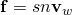

是润湿液体通过多孔介质单位面积的体积流速（润湿液体的有效速度）；


是流体饱和度（对于完全饱和介质为，对于完全干燥介质为）；

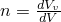

是多孔介质的孔隙率；

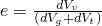

是孔隙比；


是介质中润湿流体的体积；


是介质中的空隙体积；


是介质中固体材料颗粒的体积；

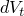

是介质中捕获的润湿液体的体积；


是介质的总体积；


是流体速度；

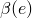

是"速度系数"，可能依赖于材料的孔隙比；


是渗透率对润湿液体饱和度的依赖性，使得在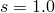时；


是流体密度；

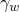

是润湿液体的比重；

*g*

是重力加速度的大小；

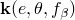

是完全饱和介质的渗透率，可以是孔隙比（*e*，在土壤固结问题中常见）、温度（）和/或场变量（）的函数；


是润湿液体孔隙压力；


是位置；以及


是重力加速度。

#### 渗透率定义

不同作者对渗透率的定义可能不同；因此，应注意确保指定的输入数据与Abaqus/Standard中使用的定义一致。

Abaqus/Standard中渗透率定义为


因此Forchheimer定律也可以写为


完全饱和渗透率通常通过低流体速度条件下的实验获得。可以定义为孔隙比*e*（在土壤固结问题中常见）和/或温度的函数。孔隙比可以从孔隙率*n*使用关系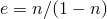推导。根据要建模的是各向同性、正交各向异性还是完全各向异性渗透率，可能需要多达六个变量来定义完全饱和渗透率（如下所述）。

##### 渗透率的替代定义

一些作者将Abaqus/Standard中使用的渗透率定义（单位为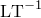）称为多孔介质的"水力传导率"，并将渗透率定义为

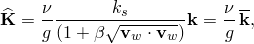

其中是润湿液体的运动粘度（液体动力粘度与其质量密度的比值），*g*是重力加速度的大小，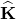的维度为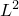（或Darcy）。如果渗透率以此形式给出，则必须进行转换，以便在Abaqus/Standard中使用适当的值。

#### 指定渗透率

Abaqus/Standard中的渗透率可以是各向同性、正交各向异性或完全各向异性。对于非各向同性渗透率，必须使用局部方向（参见["方向，" 第2.2.5节](pt01ch02s02aus15.md)）来指定材料方向。

##### 各向同性渗透率

对于Abaqus/Standard中的各向同性渗透率，在每个孔隙比值下定义一个完全饱和渗透率值。

| **输入文件用法：** | ``` [*PERMEABILITY](../key/key-link.md#usb-kws-mpermeabil), TYPE=ISOTROPIC ``` |
| --- | --- |

| **Abaqus/CAE用法：** | 属性模块：材料编辑器：****其他****孔隙流体****渗透率****：** 类型：各向同性** |
| --- | --- |

##### 正交各向异性渗透率

对于Abaqus/Standard中的正交各向异性渗透率，在每个孔隙比值下定义三个完全饱和渗透率值（。

| **输入文件用法：** | ``` [*PERMEABILITY](../key/key-link.md#usb-kws-mpermeabil), TYPE=ORTHOTROPIC ``` |
| --- | --- |

| **Abaqus/CAE用法：** | 属性模块：材料编辑器：****其他****孔隙流体****渗透率****：** 类型：正交各向异性** |
| --- | --- |

##### 各向异性渗透率

对于Abaqus/Standard中的完全各向异性渗透率，在每个孔隙比值下定义六个完全饱和渗透率值（。

| **输入文件用法：** | ``` [*PERMEABILITY](../key/key-link.md#usb-kws-mpermeabil), TYPE=ANISOTROPIC ``` |
| --- | --- |

| **Abaqus/CAE用法：** | 属性模块：材料编辑器：****其他****孔隙流体****渗透率****：** 类型：各向异性** |
| --- | --- |

#### 速度系数

Abaqus/Standard默认假定，即使用Darcy定律。如果需要Forchheimer定律（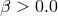），则必须以表格形式定义。

| **输入文件用法：** | ``` [*PERMEABILITY](../key/key-link.md#usb-kws-mpermeabil), TYPE=VELOCITY ``` |
| --- | --- |
|  | 这必须是同一材料的[*PERMEABILITY](../key/key-link.md#usb-kws-mpermeabil)选项的重复使用，因为还必须定义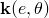。 |

| **Abaqus/CAE用法：** | 属性模块：材料编辑器：****其他****孔隙流体****渗透率****：** ****子选项****速度依赖性**** |
| --- | --- |

#### 饱和度依赖性

在Abaqus/Standard中，您可以通过指定来定义渗透率对饱和度*s*的依赖性。Abaqus/Standard默认假定对于，；对于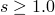，。的表格定义必须指定对于，。

| **输入文件用法：** | ``` [*PERMEABILITY](../key/key-link.md#usb-kws-mpermeabil), TYPE=SATURATION ``` |
| --- | --- |
|  | 这必须是同一材料的[*PERMEABILITY](../key/key-link.md#usb-kws-mpermeabil)选项的重复使用，因为还必须定义。 |

| **Abaqus/CAE用法：** | 属性模块：材料编辑器：****其他****孔隙流体****渗透率****：** ****子选项****饱和度依赖性**** |
| --- | --- |

#### 润湿液体的比重

在Abaqus/Standard中，即使分析不考虑润湿液体的重量（即计算超孔隙流体压力），也必须正确指定流体的比重。

| **输入文件用法：** | ``` [*PERMEABILITY](../key/key-link.md#usb-kws-mpermeabil), TYPE=*type*, SPECIFIC= ``` |
| --- | --- |
|  | SPECIFIC参数必须与给定介质的完全饱和[*PERMEABILITY](../key/key-link.md#usb-kws-mpermeabil)选项结合定义。 |

| **Abaqus/CAE用法：** | 属性模块：材料编辑器：****其他****孔隙流体****渗透率****：** 润湿液体比重：**  |
| --- | --- |

### Abaqus/CFD中的渗透率

对于流体饱和多孔介质中的流动，最简单的动量方程可以写为


其中右边第一项是Darcy拖曳力，第二项是惯性拖曳力（也称为形态拖曳力或Forchheimer拖曳力）。在上述方程中


是压力的固有平均值（仅对流体相取平均）；


是外部或表观速度向量，其中平均值是在同时包含固体（基体）和流体相的代表体积上取的；


是流体密度；


是流体粘度；


是多孔介质的渗透率（单位为[L2](../popups/usb-int-iconventions-unitsym.md)）；以及


是无量纲惯性或形态拖曳系数，通常是孔隙率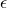的函数。

惯性拖曳系数通常是孔隙率的函数。在Abaqus/CFD中使用Ergun关系，由下式给出


其中常数默认设置为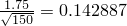。

指定渗透率作为孔隙率函数的常用模型是Carman-Kozeny关系，由下式给出


其中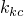表示Carman-Kozeny常数（依赖于几何形状的参数），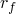表示多孔颗粒/纤维的平均半径。

#### 指定渗透率

Abaqus/CFD中的渗透率可以是各向同性的（仅依赖于孔隙率）或使用Carman-Kozeny关系指定。

##### 各向同性渗透率

对于各向同性渗透率，在每个孔隙率值下定义一个完全饱和渗透率值。

| **输入文件用法：** | ``` [*PERMEABILITY](../key/key-link.md#usb-kws-mpermeabil), TYPE=ISOTROPIC ``` |
| --- | --- |

| **Abaqus/CAE用法：** | 属性模块：材料编辑器：****其他****孔隙流体****渗透率****：** 类型：各向同性（CFD）** |
| --- | --- |

##### Carman-Kozeny模型

对于Carman-Kozeny关系，您可以通过指定（Carman-Kozeny常数）和（平均孔隙颗粒/纤维半径）来定义渗透率。

| **输入文件用法：** | ``` [*PERMEABILITY](../key/key-link.md#usb-kws-mpermeabil), TYPE=CARMAN KOZENY ``` |
| --- | --- |

| **Abaqus/CAE用法：** | 属性模块：材料编辑器：****其他****孔隙流体****渗透率****：** 类型：Carman-Kozeny** |
| --- | --- |

#### 惯性拖曳系数

惯性拖曳系数表达式中常数的值可以设置为任何用户指定的值。默认情况下，的值为0.142887。

| **输入文件用法：** | ``` [*PERMEABILITY](../key/key-link.md#usb-kws-mpermeabil), TYPE=*type*, INERTIAL DRAG COEFFICIENT= ``` |
| --- | --- |

| **Abaqus/CAE用法：** | 属性模块：材料编辑器：****其他****孔隙流体****渗透率****：** 惯性拖曳系数：**  |
| --- | --- |

### 单元

在Abaqus/Standard中，渗透率仅可用于允许孔隙压力的单元（参见["为分析类型选择适当的单元，" 第27.1.3节](pt06ch27s01aus112.md)）。在Abaqus/CFD中，渗透率可用于任何流体单元。
