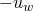
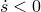
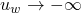
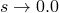
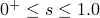
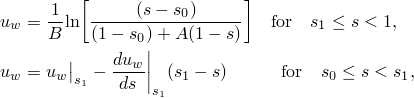
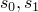
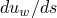

# 26.6.4 吸附

**产品：** Abaqus/Standard  Abaqus/CAE

##### **参考资料**

- ["孔隙流体流动属性，" 第26.6.1节](pt05ch26s06abo24.md)
- ["材料库：概述，" 第21.1.1节](pt05ch21s01abo18.md)
- [*SORPTION](../key/key-link.md#usb-kws-msorption)
- ["在"定义流体充满的多孔材料"中定义吸附，" Abaqus/CAE用户指南第12.12.3节](../usi/usi-link.md#usi-prp-other-porefluid-sorption)

### 概述

吸附：
- 定义多孔材料在部分饱和流动条件下的吸收/解吸行为；以及
- 用于耦合润湿液体流动和多孔介质应力分析（["耦合孔隙流体扩散与应力分析，" 第6.8.1节](pt03ch06s08at26.md)）。

### 吸附

当总孔隙液体压力变为负值时，多孔介质变得部分饱和（参见["多孔介质的有效应力原理，" Abaqus理论指南第2.8.1节](../stm/stm-link.md#stm-anl-poreffstress)）。的负值表示介质中的毛细效应。对于，已知饱和度在一定范围内，该范围取决于毛细压力的值（参见["多孔介质中润湿液体相的连续性声明，" Abaqus理论指南第2.8.4节](../stm/stm-link.md#stm-anl-porcontstate)）。这些极限的典型形式如图26.6.4-1所示。我们将这些极限写为，其中是发生吸收的极限（因此），而是发生解吸的极限（因此）。吸收和解吸之间的转换以及相反过程沿"扫描"曲线发生（见下文）。这些曲线由图26.6.4-1中所示的单一直线近似。

**图26.6.4-1** 典型的吸收和解吸行为。


当在多孔介质流动分析中包含部分饱和时，应分别定义吸收行为、解吸行为和扫描行为（介于吸收和解吸之间）。以下讨论每种行为。如果完全未定义吸附，Abaqus/Standard假定对于的所有值均为完全饱和流动（）。

由吸附定义产生强非对称的部分饱和流动耦合方程。因此，如果请求部分饱和分析（即定义了吸附），Abaqus/Standard自动使用其非对称矩阵存储和求解方案（参见["定义分析，" 第6.1.2节](pt03ch06s01abo05.md)）。

### 定义吸收和解吸

通过将孔隙液体压力（负"毛细张力"）指定为饱和度的函数来定义吸收和解吸行为。在大多数物理情况下，润湿液体不能被驱动至零饱和度；要达到零饱和度，数据必须将定义为。吸收和解吸数据可以表格形式或分析形式定义。

#### 表格形式

默认情况下，通过将指定为*s*的表格函数来定义吸收和解吸行为，其中。

| **输入文件用法：** | 使用以下选项： |
| --- | --- |
|  | ``` [*SORPTION](../key/key-link.md#usb-kws-msorption), TYPE=ABSORPTION, LAW=TABULAR [*SORPTION](../key/key-link.md#usb-kws-msorption), TYPE=EXSORPTION, LAW=TABULAR ``` 如果[*SORPTION](../key/key-link.md#usb-kws-msorption)选项仅使用一次，则所定义的行为被视为吸收和解吸的行为。 |

| **Abaqus/CAE用法：** | 属性模块：材料编辑器：****其他****孔隙流体****吸附**** **吸收**：**定律：表格****解吸**：切换**包含解吸**：**定律：表格** |
| --- | --- |

#### 分析形式

吸收和解吸行为可以通过以下分析形式定义：



其中是正的材料常数，是用来定义感兴趣饱和度值下限的参数（参见图26.6.4-2）。

**图26.6.4-2** 吸收和解吸行为的对数形式。


| **输入文件用法：** | 使用以下选项： |
| --- | --- |
|  | ``` [*SORPTION](../key/key-link.md#usb-kws-msorption), TYPE=ABSORPTION, LAW=LOG [*SORPTION](../key/link.md#usb-kws-msorption), TYPE=EXSORPTION, LAW=LOG ``` 如果[*SORPTION](../key/key-link.md#usb-kws-msorption)选项仅使用一次，则所定义的行为被视为吸收和解吸的行为。 |

| **Abaqus/CAE用法：** | 属性模块：材料编辑器：****其他****孔隙流体****吸附******吸收**：**定律：对数****解吸**：切换**包含解吸**：**定律：对数** |
| --- | --- |

### 定义吸收和解吸之间的行为

吸收和解吸之间的行为由用户指定的恒定斜率的扫描线定义。该斜率应大于吸收或解吸行为任何段的斜率。

如果定义了吸收和解吸行为而没有扫描线，则扫描线的斜率取为吸收和解吸行为定义中给出的最大值的1.05倍。

| **输入文件用法：** | ``` [*SORPTION](../key/key-link.md#usb-kws-msorption), TYPE=SCANNING ``` |
| --- | --- |
|  | 这必须是同一材料的[*SORPTION](../key/key-link.md#usb-kws-msorption)选项的重复使用。 |

| **Abaqus/CAE用法：** | 属性模块：材料编辑器：****其他****孔隙流体****吸附****：** 解吸**：切换**包含解吸**和**包含扫描**：**斜率**  |
| --- | --- |

### 单元

吸附只能用于允许孔隙压力的单元（参见["为分析类型选择适当的单元，" 第27.1.3节](pt06ch27s01aus112.md)。
