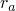
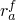
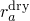
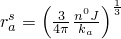
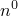

# 26.6.5 膨胀凝胶

**产品：** Abaqus/Standard  Abaqus/CAE

##### **参考资料**

- ["孔隙流体流动属性，" 第26.6.1节](pt05ch26s06abo24.md)
- ["材料库：概述，" 第21.1.1节](pt05ch21s01abo18.md)
- [*GEL](../key/key-link.md#usb-kws-mgel)
- ["在"定义流体充满的多孔材料"中定义膨胀凝胶，" Abaqus/CAE用户指南第12.12.3节](../usi/usi-link.md#usi-prp-other-porefluid-gel)

### 概述

膨胀凝胶模型：
- 允许对在部分饱和多孔介质中膨胀并捕获润湿液体的凝胶颗粒生长进行建模；
- 旨在用于湿气吸收问题，通常涉及聚合物材料，如尿布分析；以及
- 可用于耦合孔隙液体流动和多孔介质应力分析（参见["耦合孔隙流体扩散与应力分析，" 第6.8.1节](pt03ch06s08at26.md)）。

### 膨胀凝胶模型

简单的膨胀凝胶模型基于将凝胶理想化为具有相同半径的独立球形颗粒体积。膨胀演化（在["多孔介质中的本构行为，" Abaqus理论指南第2.8.3节](../stm/stm-link.md#stm-anl-porconstbehav)中详细讨论）假定由下式给出


其中，如果任何尖括号中项的数学结果不为正，则将该项的值设置为零，并且



是完全膨胀半径；


是凝胶颗粒的松弛时间；

*s*

是周围介质的饱和度；



是凝胶颗粒完全干燥时的半径；


是凝胶颗粒在必须接触之前可以达到的最大半径；



是当体积完全被凝胶占据时的有效凝胶半径；



是材料的初始孔隙率；

*J*

是材料的体积变化；以及


是单位体积内凝胶颗粒的数量。

凝胶生长定义中的第二项包含了一个假设，即凝胶仅当周围介质的饱和度*s*超过凝胶的有效饱和度时才会膨胀。生长方程中的第三项在暴露于自由流体的凝胶颗粒表面受到堆积密度和凝胶颗粒半径组合限制时降低膨胀速率。

膨胀凝胶模型通过指定变量来定义。

| **输入文件用法：** | ``` [*GEL](../key/key-link.md#usb-kws-mgel) ``` |
| --- | --- |

| **Abaqus/CAE用法：** | 属性模块：材料编辑器：****其他****孔隙流体****凝胶**** |
| --- | --- |

### 单元

膨胀凝胶模型只能用于允许孔隙压力的单元（参见["为分析类型选择适当的单元，" 第27.1.3节](pt06ch27s01aus112.md)。
