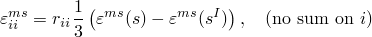

# 26.6.6 湿胀

**产品：** Abaqus/Standard  Abaqus/CAE

##### **参考资料**

- ["孔隙流体流动属性，" 第26.6.1节](pt05ch26s06abo24.md)
- ["材料库：概述，" 第21.1.1节](pt05ch21s01abo18.md)
- [*MOISTURE SWELLING](../key/key-link.md#usb-kws-mmoistureswell)
- ["在"定义流体充满的多孔材料"中定义湿胀，" Abaqus/CAE用户指南第12.12.3节](../usi/usi-link.md#usi-prp-other-porefluid-moistureswelling)

### 概述

湿胀：
- 定义多孔介质固体骨架在部分饱和流动条件下的饱和驱动体积膨胀；
- 可用于耦合润湿液体流动和多孔介质应力分析（参见["耦合孔隙流体扩散与应力分析，" 第6.8.1节](pt03ch06s08at26.md)）；以及
- 可以是各向同性或各向异性。

### 湿胀模型

湿胀模型假定多孔介质固体骨架的体积膨胀是部分饱和流动条件下润湿液体饱和度的函数。当孔隙液体压力为负时，多孔介质处于部分饱和状态（参见["多孔介质的有效应力原理，" Abaqus理论指南第2.8.1节](../stm/stm-link.md#stm-anl-poreffstress)）。

膨胀行为被认为是可逆的。膨胀应变的对数测量是相对于初始饱和度计算的，因此



其中

### 定义体积膨胀应变

将体积膨胀应变 ``` |
| --- | --- |

| **Abaqus/CAE用法：** | 属性模块：材料编辑器：****其他****孔隙流体****湿胀**** |
| --- | --- |

### 定义初始饱和度值

可以将初始饱和度值定义为初始条件。如果未给出初始饱和度值，则默认为完全饱和条件（饱和度为1.0）。对于部分饱和，初始饱和度和孔隙流体压力必须一致，即孔隙流体压力必须落在初始饱和度值的吸收和解吸值范围内（参见["渗透率，" 第26.6.2节](pt05ch26s06abm64.md)）。如果不是这种情况，Abaqus/Standard将根据需要调整饱和度值以满足此要求。

| **输入文件用法：** | ``` [*INITIAL CONDITIONS](../key/key-link.md#usb-kws-minitialcond), TYPE=SATURATION ``` |
| --- | --- |

| **Abaqus/CAE用法：** | 载荷模块：****创建预定义场**：**步骤：初始**：为**类别**选择**其他**，为**所选步骤的类型**选择**饱和度** |
| --- | --- |

### 定义各向异性膨胀

可以通过定义比率）。

| **输入文件用法：** | 使用以下两个选项： |
| --- | --- |
|  | ``` [*MOISTURE SWELLING](../key/key-link.md#usb-kws-mmoistureswell) [*RATIOS](../key/key-link.md#usb-kws-mswellratios) ``` [*RATIOS](../key/key-link.md#usb-kws-mswellratios)选项应紧跟在[*MOISTURE SWELLING](../key/key-link.md#usb-kws-mmoistureswell)选项之后。 |

| **Abaqus/CAE用法：** | 属性模块：材料编辑器：****其他****孔隙流体****湿胀****：** ****子选项****比率**** |
| --- | --- |

### 单元

湿胀模型只能用于允许孔隙压力的单元（参见["为分析类型选择适当的单元，" 第27.1.3节](pt06ch27s01aus112.md)。
