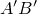
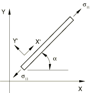
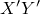

# 26.7.1 用户定义的机械材料行为

**产品：** Abaqus/Standard  Abaqus/Explicit  Abaqus/CAE

##### **参考资料**

- ["UMAT，" Abaqus用户子程序参考指南第1.1.41节](../sub/sub-link.md#sub-rtn-uumat)
- ["VUMAT，" Abaqus用户子程序参考指南第1.2.20节](../sub/sub-link.md#sub-rtn-uexpmat)
- [*USER MATERIAL](../key/key-link.md#usb-kws-musermaterial)
- [*DEPVAR](../key/key-link.md#usb-kws-mdepvar)
- ["指定解相关状态变量，" Abaqus/CAE用户指南第12.8.2节](../usi/usi-link.md#usi-prp-general-depvar)
- ["定义用户材料的常数，" Abaqus/CAE用户指南第12.8.4节](../usi/usi-link.md#usi-prp-general-usermaterial)

### 概述

Abaqus中用户定义的机械材料行为：
- 通过一个接口提供，任何机械本构模型都可以添加到库中；
- 需要在本构模型（或模型库）中编程，使用用户子程序[`UMAT`](../sub/sub-link.md#sub-xsl-umat)（Abaqus/Standard）或[`VUMAT`](../sub/sub-link.md#sub-xsl-vumat)（Abaqus/Explicit）；以及
- 需要相当大的努力和专业知识：该功能非常通用和强大，但其使用不是常规练习。

### 应力分量和应变增量

子程序接口使用Cauchy应力分量（"真实"应力）实现。对于土壤问题，"应力"应解释为有效应力。应变增量由位移增量梯度的对称部分定义（相当于速度梯度对称部分的时间积分）。

用户子程序[`UMAT`](../sub/sub-link.md#sub-xsl-umat)中应力和应变分量的方向取决于局部方向的使用（["方向，" 第2.2.5节](pt01ch02s02aus15.md)）。

在用户子程序[`VUMAT`](../sub/sub-link.md#sub-xsl-vumat)中，所有应变度量都相对于增量中点构型计算。所有张量都在随材料点旋转的共旋坐标系中定义。为了说明应力方面的含义，考虑图26.7.1-1所示的杆件，它从原始构型拉伸并旋转到新位置。这个变形可以分为两个阶段：首先拉伸杆件，如图26.7.1-2所示，然后通过施加刚体旋转来旋转杆件，如图26.7.1-3所示。

**图26.7.1-1** 拉伸并旋转的杆件。


**图26.7.1-2** 杆件的拉伸。


**图26.7.1-3** 杆件的刚体旋转。



杆件在拉伸后的应力为，该应力在刚体旋转过程中不会改变。因刚体旋转而旋转的坐标系是共旋坐标系。因此，应力张量和状态变量是使用应变张量直接在用户子程序[`VUMAT`](../sub/sub-link.md#sub-xsl-vumat)中计算和更新的，因为所有这些量都在共旋坐标系中；这些量不需要像用户子程序[`UMAT`](../sub/sub-link.md#sub-xsl-umat)中有时需要的那样由用户子程序旋转。

率形式本构定律预测的弹性响应取决于所使用的客观应力率。例如，[`VUMAT`](../sub/sub-link.md#sub-xsl-vumat)中使用Green-Naghdi应力率。然而，内置材料模型使用的应力率可能不同。例如，Abaqus/Explicit中与实体（连续体）单元一起使用的大多数材料模型采用Jaumann应力率。只有当材料点的有限旋转伴随有限剪切时，公式的这种差异才会导致结果的显著差异。关于Abaqus中使用的客观应力率的讨论，请参见["应力率，" Abaqus理论指南第1.5.3节](../stm/stm-link.md#stm-int-stressrates)。

### 材料常数

用户子程序[`UMAT`](../sub/sub-link.md#sub-xsl-umat)或[`VUMAT`](../sub/sub-link.md#sub-xsl-vumat)所需的任何材料常数都必须作为用户定义材料行为定义的一部分指定。同一个材料定义中包含的任何其他机械材料行为（热膨胀和Abaqus/Explicit中的密度除外）都将被忽略；用户定义的材料行为要求所有机械材料行为计算都在子程序[`UMAT`](../sub/sub-link.md#sub-xsl-umat)或[`VUMAT`](../sub/sub-link.md#sub-xsl-vumat)中编程。在Abaqus/Explicit中使用用户定义材料行为时需要密度（["密度，" 第21.2.1节](pt05ch21s02abm01.md)）。

| **输入文件用法：** | 在Abaqus/Standard中使用以下选项指定用户定义的材料行为： |
| --- | --- |
|  | ``` [*USER MATERIAL](../key/key-link.md#usb-kws-musermaterial), TYPE=MECHANICAL, CONSTANTS=*number_of_constants* ``` 在Abaqus/Explicit中使用以下两个选项指定用户定义的材料行为： ``` [*USER MATERIAL](../key/key-link.md#usb-kws-musermaterial), CONSTANTS=*number_of_constants* [*DENSITY](../key/key-link.md#usb-kws-mdensity) ``` 在任一情况下，都必须指定正在输入的材料常数数量。 |

| **Abaqus/CAE用法：** | 在Abaqus/Standard中使用以下选项指定用户定义的材料行为： |
| --- | --- |
|  | 属性模块：材料编辑器：****通用****用户材料****：** 用户材料类型：机械** 在Abaqus/Explicit中使用以下两个选项指定用户定义的材料行为：属性模块：材料编辑器：****通用****用户材料****：** 用户材料类型：机械********通用****密度**** |

### Abaqus/Standard中的非对称方程求解器

如果用户材料的Jacobian矩阵不是对称的，则应调用Abaqus/Standard中的非对称方程求解功能（参见["定义分析，" 第6.1.2节](pt03ch06s01abo05.md)）。

| **输入文件用法：** | ``` [*USER MATERIAL](../key/key-link.md#usb-kws-musermaterial), TYPE=MECHANICAL, CONSTANTS=*number_of_constants*, UNSYMM ``` |
| --- | --- |

| **Abaqus/CAE用法：** | 属性模块：材料编辑器：****通用****用户材料****：** 用户材料类型：机械**，切换**使用非对称材料刚度矩阵** |
| --- | --- |

### Abaqus/Standard中的混合公式

如果将混合单元与用户子程序[`UMAT`](../sub/sub-link.md#sub-xsl-umat)一起使用，默认情况下Abaqus/Standard将用从Lagrange乘数导出的压力应力替换从用户子程序返回的应力张量计算的压力应力，并适当修改Jacobian（["混合不可压缩实体单元公式，" Abaqus理论指南第3.2.3节](../stm/stm-link.md#stm-elm-hybridincompress)）。这种方法适用于使用增量公式的材料模型（例如，金属塑性），但与常用于超弹性材料的总体公式不一致。在后一种情况下，默认公式可能导致收敛问题。例如，当几乎不可压缩的非线性弹性用户材料承受大变形时，可能会观察到这种收敛问题。Abaqus/Standard提供了一种更合适的替代总体公式。总体公式与Abaqus用于超弹性材料的原生几乎不可压缩公式一致（["超弹性材料行为，" Abaqus理论指南第4.6.1节](../stm/stm-link.md#stm-mat-hyperelastic)），在这种情况下比默认（增量）公式效果更好。

Abaqus/Standard还提供了一种完全不可压缩的公式，用于与混合单元一起定义完全不可压缩的用户材料响应。完全不可压缩公式与Abaqus用于不可压缩超弹性材料的原生公式一致。对于总体混合公式，假定材料的偏响应和体积响应是解耦的，体积响应可以从应变能势函数导出。Abaqus中所有原生超弹性材料都使用此假设。对于不可压缩混合公式，假定偏应力可以从应变能势函数导出。

总体混合公式对几乎不可压缩的超弹性响应有用。材料的体积响应假定用替代变量来定义，而不是体积变化。替代变量在用户子程序[`UMAT`](../sub/sub-link.md#sub-xsl-umat)内部可用。更多详细信息在["UMAT，" Abaqus用户子程序参考指南第1.1.41节](../sub/sub-link.md#sub-rtn-uumat)中讨论。

完全不可压缩公式要求您仅在[`UMAT`](../sub/sub-link.md#sub-xsl-umat)内部定义应力张量的偏部分和材料的Jacobian矩阵。Abaqus/Standard根据Lagrange乘数自动计算压力应力。

| **输入文件用法：** | 使用以下选项调用总体混合公式： |
| --- | --- |
|  | ``` [*USER MATERIAL](../key/key-link.md#usb-kws-musermaterial), TYPE=MECHANICAL, CONSTANTS=*number_of_constants*, HYBRID FORMULATION=TOTAL ``` 使用以下选项调用增量混合公式（默认）： ``` [*USER MATERIAL](../key/key-link.md#usb-kws-musermaterial), TYPE=MECHANICAL, CONSTANTS=*number_of_constants*, HYBRID FORMULATION=INCREMENTAL ``` 使用以下选项调用不可压缩混合公式： ``` [*USER MATERIAL](../key/key-link.md#usb-kws-musermaterial), TYPE=MECHANICAL, CONSTANTS=*number_of_constants*, HYBRID FORMULATION=INCOMPRESSIBLE ``` |

| **Abaqus/CAE用法：** | Abaqus/CAE不支持混合公式的指定。 |
| --- | --- |

### 材料状态

许多机械本构模型需要存储解相关状态变量（塑性应变、"背应力"、饱和度等，用于率本构形式或以积分形式编写的理论的历史数据）。您应在相关材料定义中为这些变量分配存储空间（参见["用户子程序：概述，" 第18.1.1节中的"分配空间"](pt04ch18s01aus104.md#usb-anl-usubrout-allocatespace)）。与用户定义材料关联的状态变量数量没有限制。

用户材料子程序在每个增量的开始时获取材料状态，如下所述。它们必须返回新应力和新内部状态变量的值。与[`UMAT`](../sub/sub-link.md#sub-xsl-umat)和[`VUMAT`](../sub/sub-link.md#sub-xsl-vumat)关联的状态变量可以使用输出标识符SDV和SDV*n*输出到输出数据库文件（.odb）和结果文件（.fil）（参见["Abaqus/Standard输出变量标识符，" 第4.2.1节](pt02ch04s02abv01.md)和["Abaqus/Explicit输出变量标识符，" 第4.2.2节](pt02ch04s02xbv01.md)）。

#### Abaqus/Standard中的材料状态

用户子程序[`UMAT`](../sub/sub-link.md#sub-xsl-umat)在每个增量的每次迭代中为每个材料点调用。它获取增量开始时的材料状态（应力、解相关状态变量、温度和任何预定义场变量）以及温度、预定义状态变量、应变和时间的增量。

除了将应力和解相关状态变量更新到增量结束时的值外，子程序[`UMAT`](../sub/sub-link.md#sub-xsl-umat)还必须为机械本构模型提供材料Jacobian矩阵。如果本构模型以率形式存在并在子程序中数值积分，则该矩阵也将取决于所使用的积分方案。对于任何非平凡的本构模型，这些都将是具有挑战性的任务。例如，Jacobian矩阵定义的准确性通常是解决方案收敛率的主要决定因素，因此将对计算效率产生强烈影响。

如果在频域中指定材料的粘弹性行为，用户子程序[`UMAT`](../sub/sub-link.md#sub-xsl-umat)还必须在材料Jacobian矩阵中提供阻尼（损耗模量）贡献，除了刚度（存储模量）贡献外。

#### Abaqus/Explicit中的材料状态

用户子程序[`VUMAT`](../sub/sub-link.md#sub-xsl-vumat)在每个增量时为材料点块调用。当调用子程序时，它获取增量开始时的状态（应力、解相关状态变量）。它还获取增量开始和结束时的拉伸和旋转。[`VUMAT`](../sub/sub-link.md#sub-xsl-vumat)用户材料接口在每次调用时将一组材料点传递给子程序，这允许材料子程序的矢量化。

温度在增量开始和结束时提供给用户子程序[`VUMAT`](../sub/sub-link.md#sub-xsl-vumat)。温度仅作为信息传入，不能修改，即使在完全耦合的热-应力分析中也是如此。但是，如果在Abaqus/Explicit的完全耦合热-应力分析中定义了非弹性热分数以及比热和电导率，则会自动计算由于非弹性能量耗散产生的热通量。如果用户子程序[`VUMAT`](../sub/sub-link.md#sub-xsl-vumat)用于在显式动力学过程中定义绝热材料行为（塑性功转换为热），则必须为材料指定非弹性热分数和比热，并且必须将温度存储为用户定义的状态变量并进行积分。通常，温度通过指定初始条件来提供（["Abaqus/Standard和Abaqus/Explicit中的初始条件，" 第34.2.1节](pt07ch34s02aus116.md)），并在整个分析过程中保持恒定。

#### 使用状态变量从网格中删除单元

在Abaqus分析过程中，可以通过用户子程序[`VUMAT`](../sub/sub-link.md#sub-xsl-vumat)或[`UMAT`](../sub/sub-link.md#sub-xsl-umat)控制网格中的单元删除。已删除的单元无法承载应力，因此对模型刚度没有贡献。您可以指定控制单元删除标志的状态变量编号。例如，指定状态变量编号为4表示第四个状态变量是用户子程序中的删除标志。删除状态变量应设置为1或0。值为1表示材料点处于活动状态，而值为0表示Abaqus应通过将应力设置为零来从模型中删除材料点。在Abaqus/Explicit中，传递给用户子程序[`VUMAT`](../sub/sub-link.md#sub-xsl-vumat)的材料点块的结构在分析过程中保持不变；已删除的材料点不会从块中移除。Abaqus/Explicit将为所有已删除的材料点传递零应力和零应变增量。一旦材料点被标记为已删除，就无法重新激活。只有当单元中的所有材料点都被删除后，单元才会从网格中删除。可以通过请求变量STATUS的输出来确定单元的状态。如果单元处于活动状态，则此变量等于1；如果单元被删除，则等于0。

| **输入文件用法：** | ``` [*DEPVAR](../key/key-link.md#usb-kws-mdepvar), DELETE=*variable number* ``` |
| --- | --- |

| **Abaqus/CAE用法：** | 属性模块：材料编辑器：****通用****Depvar****：** 控制单元删除的变量编号：** *variable number* |
| --- | --- |

### 沙漏控制和横向剪切刚度

通常，Abaqus/Standard中减缩积分单元的默认沙漏控制刚度和壳、管及梁单元的横向剪切刚度是基于与材料相关的弹性定义的（["截面控制，" 第27.1.4节](pt06ch27s01aus113.md)；["壳截面行为，" 第29.6.4节](pt06ch29s06alm18.md)；以及["选择梁单元，" 第29.3.3节](pt06ch29s03alm08.md)）。这些刚度基于材料初始剪切模量的典型值，例如，该值可以作为材料定义中包含的弹性材料行为的一部分给出（["线性弹性行为，" 第22.2.1节](pt05ch22s02abm02.md)）。但是，在使用用户子程序[`UMAT`](../sub/sub-link.md#sub-xsl-umat)或[`VUMAT`](../sub/sub-link.md#sub-xsl-vumat)定义的材料的输入预处理阶段，剪切模量不可用。因此，当使用[`UMAT`](../sub/sub-link.md#sub-xsl-umat)定义具有沙漏模式的单元的材料行为时，必须提供沙漏刚度参数（参见["截面控制"中的"抑制沙漏模式的方法"，第27.1.4节](pt06ch27s01aus113.md#usb-elm-esection-hourglass)）；当使用[`UMAT`](../sub/sub-link.md#sub-xsl-umat)或[`VUMAT`](../sub/sub-link.md#sub-xsl-vumat)定义具有横向剪切柔性的梁和壳的材料行为时，必须指定横向剪切刚度（参见["选择梁单元，" 第29.3.3节](pt06ch29s03alm08.md)或["壳截面行为，" 第29.6.4节](pt06ch29s06alm18.md)）。

### [`UMAT`](../sub/sub-link.md#sub-xsl-umat)与其他子程序的联合使用

在Abaqus/Standard中还有各种实用子程序可与子程序[`UMAT`](../sub/sub-link.md#sub-xsl-umat)一起使用。这些实用子程序在["在Abaqus/Standard分析中获取应力不变量、主应力/应变值和方向以及旋转张量，" Abaqus用户子程序参考指南第2.1.11节](../sub/sub-link.md#sub-utl-utensor)中讨论。

用户子程序[`UMATHT`](../sub/sub-link.md#sub-xsl-umatht)可以与[`UMAT`](../sub/sub-link.md#sub-xsl-umat)结合使用来定义材料的本构热行为。在材料定义中分配的可解相关变量在[`UMAT`](../sub/sub-link.md#sub-xsl-umat)和[`UMATHT`](../sub/sub-link.md#sub-xsl-umatht)中都可以访问。此外，用户子程序[`FRIC`](../sub/sub-link.md#sub-xsl-fric)、[`GAPCON`](../sub/sub-link.md#sub-xsl-gapcon)和[`GAPELECTR`](../sub/sub-link.md#sub-xsl-gapelectr)可用于定义表面之间的机械、热和电相互作用。

### 材料选项

当材料的机械行为由用户子程序[`UMAT`](../sub/sub-link.md#sub-xsl-umat)或[`VUMAT`](../sub/sub-link.md#sub-xsl-vumat)定义时，许多材料行为可用于材料定义中。这些行为包括密度、热膨胀、渗透率和传热特性。热膨胀也可以作为[`UMAT`](../sub/sub-link.md#sub-xsl-umat)或[`VUMAT`](../sub/sub-link.md#sub-xsl-vumat)中实现的本构模型的组成部分。

[`UMAT`](../sub/sub-link.md#sub-xsl-umat)中可用的温度始终是单元积分点处的插值温度场。当然，如果在[`UMAT`](../sub/sub-link.md#sub-xsl-umat)中实现热膨胀行为，则根据积分点温度定义。当在Abaqus/Standard中温度场在单元内的插值方式与位移场不同时，在[`UMAT`](../sub/sub-link.md#sub-xsl-umat)中实现热膨胀行为可能导致与内置热膨胀行为的差异。这种情况通常出现在耦合温度-位移单元中。例如，对于一阶耦合温度-位移单元，内置热膨胀行为在整个单元上使用恒定温度场（参见["完全耦合热-应力分析，" 第6.5.3节](pt03ch06s05at19.md)），而[`UMAT`](../sub/sub-link.md#sub-xsl-umat)中的行为将根据线性温度场定义。

对于由用户子程序[`UMAT`](../sub/sub-link.md#sub-xsl-umat)或[`VUMAT`](../sub/sub-link.md#sub-xsl-vumat)定义的材料，可以单独包含质量比例阻尼（参见["材料阻尼，" 第26.1.1节](pt05ch26s01abm51.md)），但刚度比例阻尼必须在用户子程序中通过Jacobian（Abaqus/Standard仅限）和应力定义来定义。如果用户材料用于直接稳态动力学过程，则不能指定刚度比例阻尼。

### 单元

用户子程序[`UMAT`](../sub/sub-link.md#sub-xsl-umat)和[`VUMAT`](../sub/sub-link.md#sub-xsl-vumat)可用于Abaqus中所有包含机械行为（具有位移自由度的单元）的单元。
