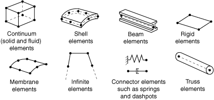
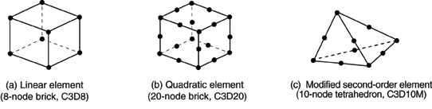

# 27.1.1 单元库：概述

Abaqus具有广泛的单元库，为解决许多不同问题提供了强大的工具集。

### 表征单元

单元的行为由五个方面表征：
- 族
- 自由度（与单元族直接相关）
- 节点数
- 公式
- 积分

Abaqus中的每个单元都有唯一的名称，如T2D2、S4R、C3D8I或C3D8R。单元名称标识单元的五个方面。有关定义单元的详细信息，请参见["单元定义，" 第2.2.1节](pt01ch02s02aus11.md)。

#### 族

[图27.1.1-1](pt06ch27s01abo25.md#egeneral-families)显示了应力分析中最常用的单元族；此外，连续体（流体）单元用于流体分析。不同单元族之间的主要区别之一是每个族假设的几何类型。

**图27.1.1-1** 常用单元族。

单元名称的首字母或前几个字母表示该单元所属的族。例如，S4R是壳单元，CINPE4是无限单元，C3D8I是连续体单元。

#### 自由度

自由度是分析期间计算的基本变量。对于应力/位移模拟，自由度是平动，对于壳、管和梁单元，还有每个节点的转动。对于热传递模拟，自由度是每个节点的温度；对于耦合热-应力分析，除了每个节点的位移自由度外，还存在温度自由度。因此，热传递分析和耦合热-应力分析需要使用与应力分析不同的单元，因为自由度不相同。关于Abaqus中各种单元和分析类型可用自由度的摘要，请参见["惯例，" 第1.2.2节](pt01ch01s02aus02.md)。

#### 节点数和插值阶数

位移或其他自由度在单元的节点处计算。在单元中的任何其他点，位移通过从节点位移插值获得。通常，插值阶数由单元中使用的节点数决定。
- 仅在角点处有节点的单元，如[图27.1.1-2](pt06ch27s01abo25.md#egeneral-line-quad)(a)所示的8节点砖单元，在每个方向上使用线性插值，通常称为线性单元或一阶单元。
- 在Abaqus/Standard中，具有边中节点的单元，如[图27.1.1-2](pt06ch27s01abo25.md#egeneral-line-quad)(b)所示的20节点砖单元，使用二次插值，通常称为二次单元或二阶单元。
- 具有边中节点的修正三角形或四面体单元，如[图27.1.1-2](pt06ch27s01abo25.md#egeneral-line-quad)(c)所示的10节点四面体单元，使用修正的二阶插值，通常称为修正或修正二阶单元。

**图27.1.1-2** 线性砖单元、二次砖单元和修正四面体单元。

通常，单元中的节点数在其名称中清楚地标识。8节点砖单元称为C3D8，4节点壳单元称为S4R。

梁单元族使用略有不同的约定：插值阶数在名称中标识。因此，一阶三维梁单元称为B31，而二阶三维梁单元称为B32。轴对称壳和薄膜单元使用类似的约定。

#### 公式

单元的公式是指用于定义单元行为的数学理论。在Lagrangian或材料描述中，单元随材料变形。在Eulerian或空间描述中，当材料流过它们时，单元固定在空间中。Eulerian方法通常用于流体力学模拟。Abaqus/Standard使用Eulerian单元对流热传递进行建模。Abaqus/Explicit还提供多材料Eulerian单元，用于应力/位移分析。Abaqus/Explicit中的自适应网格划分结合了纯Lagrangian和Eulerian分析的特性，允许单元的运动独立于材料（参见["ALE自适应网格划分：概述，" 第12.2.1节](pt04ch12s02abo14.md)）。Abaqus中所有其他应力/位移单元基于Lagrangian公式。在Abaqus/Explicit中，Eulerian单元可以通过一般接触与Lagrangian单元相互作用（参见["Eulerian分析，" 第14.1.1节](pt04ch14s01aus90.md)）。

为了适应不同类型的行为，Abaqus中的一些单元族包含具有几种不同公式的单元。例如，常规壳单元族有三个类别：一个适用于通用壳分析，另一个适用于薄壳，还有一个适用于厚壳。此外，Abaqus还提供连续体壳单元，它们具有与连续体单元相似的节点连接，但公式化以用穿过壳厚度的少至一个单元来模拟壳行为。

一些Abaqus/Standard单元族既有标准公式也有一些替代公式。具有替代公式的单元通过单元名称末尾的额外字符标识。例如，连续体、梁和桁架单元族包含具有混合公式的成员（用于处理不可压缩或不可延伸行为）；这些单元通过名称末尾的字母H标识（C3D8H或B31H）。

Abaqus/Standard对低阶单元使用集中质量公式；Abaqus/Explicit对所有单元使用集中质量公式。因此，二次质量惯性矩可能偏离理论值，特别是对于粗网格。

Abaqus/CFD使用混合单元来规避不可压缩流动中众所周知的div稳定性问题。Abaqus/CFD还允许根据程序设置添加自由度，如可选能量方程和湍流模型。

#### 积分

Abaqus使用数值技术对每个单元体积上的各种量进行积分，从而在材料行为中允许完全通用性。对于大多数单元使用高斯积分，Abaqus在每个单元的每个积分点评估材料响应。Abaqus中的一些连续体单元可以使用完全积分或减缩积分，这种选择对给定问题的单元精度可能有显著影响。

Abaqus使用单元名称末尾的字母R来标记减缩积分单元。例如，CAX4R是4节点、减缩积分、轴对称实体单元。

壳、管和梁单元属性可以定义为通用截面行为；或者可以数值积分单元的每个横截面，以便在需要时准确跟踪与非线性材料行为相关的非线性响应。此外，可以为壳以及Abaqus/Standard中的三维砖指定复合分层截面，每个材料层通过截面。

### 组合单元

单元库旨在为所有几何形状提供完整的建模能力。因此，任何单元组合都可以用来构成模型；多点约束（["广义多点约束，" 第35.2.2节"](pt08ch35s02aus130.md)）有时有助于应用必要的运动关系来形成模型（例如，用实体单元和壳单元对壳表面的一部分进行建模，或使用梁单元作为壳加强件）。

### 热传递和热应力分析

在热传递分析之后进行热应力分析的情况下，Abaqus/Standard中提供了相应的热传递和应力单元。更多详细信息，请参见["顺序耦合热-应力分析，" 第16.1.2节"](pt04ch16s01at39.md)。

### 单元库可用信息

Abaqus中的完整单元库被细分为多个较小的库。每个库作为本指南中的单独章节呈现。在每个这些章节中，在适用的情况下提供以下主题的信息：
- 惯例；
- 单元类型；
- 自由度；
- 所需的节点坐标；
- 单元属性定义；
- 单元面；
- 单元输出；
- 载荷（一般载荷、分布载荷、基础、分布热通量、薄膜条件、辐射类型、分布流、分布阻抗、电通量、分布电流密度和分布浓度通量）；
- 与单元关联的节点；
- 单元上的节点排序和面排序；和
- 输出的积分点编号。

对于在Abaqus/Standard和Abaqus/Explicit中都可用的单元库，仅在Abaqus/Standard中可用的单个单元或载荷类型标有(S)；类似地，仅在Abaqus/Explicit中可用的单个单元或载荷类型标有(E)。在Abaqus/Aqua中可用的单元或载荷类型标有(A)。

讨论了单元可用的大多数单元输出变量。根据所使用的材料模型或分析程序，可能会提供其他变量。一些单元具有不适用于同类型其他单元的解变量；这些变量被明确指定。
