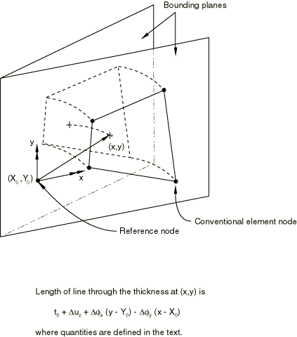
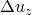
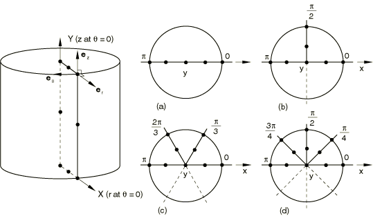

# 27.1.2 选择单元的维度

**产品：** Abaqus/Standard  Abaqus/Explicit  Abaqus/CFD  Abaqus/CAE

##### **参考资料**

- ["单元库：概述，" 第27.1.1节](pt06ch27s01abo25.md)
- ["零件建模空间，" Abaqus/CAE用户指南第11.4.1节](../usi/usi-link.md#usi-prt-conc-dimensionality)
- ["分配Abaqus单元类型，" Abaqus/CAE用户指南第17.5节](../usi/usi-link.md#usi-mgn-conc-attributes)

### 概述

Abaqus单元库包含以下内容，用于建模各种空间维度：
- 一维单元；
- 二维单元；
- 三维单元；
- 圆柱单元；
- 轴对称单元；和
- 具有非线性非对称变形的轴对称单元。

### 一维（link）单元

一维热传递、耦合热/电和声学单元仅在Abaqus/Standard中可用。此外，结构link（桁架）单元在Abaqus/Standard和Abaqus/Explicit中都可用。这些单元可用于二维或三维空间，以沿单元长度传递载荷或通量。

### 二维单元

Abaqus提供了几种不同类型的二维单元。对于结构应用，这些单元包括平面应力单元和平面应变单元。Abaqus/Standard还为结构应用提供广义平面应变单元。

#### 平面应力单元

当物体或域的厚度相对于其横向（面内）尺寸较小时，可以使用平面应力单元。应力仅为平面坐标的函数，面外正应力和剪切应力为零。

平面应力单元必须在*X*–*Y*平面中定义，所有载荷和变形也限制在此平面内。此建模方法通常适用于薄的扁平体。对于各向异性材料，*Z*轴必须是主材料方向。

#### 平面应变单元

当可以假定加载物体或域中的应变仅为平面坐标的函数，且面外正应变和剪切应变均为零时，可以使用平面应变单元。

平面应变单元必须在*X*–*Y*平面中定义，所有载荷和变形也限制在此平面内。此建模方法通常用于相对于其横向尺寸非常厚的物体，如轴、混凝土大坝或墙壁。平面应变理论也可能适用于沿*Z*轴的典型地下隧道切片。对于各向异性材料，*Z*轴必须是主材料方向。

由于平面应变理论假定厚度方向应变为零，各向同性热膨胀可能在厚度方向引起较大应力。

#### 广义平面应变单元

广义平面应变单元用于在Abaqus/Standard中建模结构相对于一个材料方向（模型的"轴向"方向）具有恒定曲率（因此解变量没有梯度）的情况。因此，公式涉及位于两个平面之间的模型，这两个平面可以相对移动，从而引起模型轴向方向的应变，该应变随平面中的位置线性变化，变化由曲率变化引起。在初始构型中，边界平面可以平行或成角度，后一种情况允许对模型在轴向方向的初始曲率进行建模。概念如图27.1.2-1所示。广义平面应变单元通常用于对长结构的一段进行建模，该结构可以自由轴向膨胀或承受轴向载荷。

**图27.1.2-1** 广义平面应变模型。

每个广义平面应变单元具有三个、四个、六个或八个常规节点，在每个节点处存储*x*和*y*坐标、位移等。这些节点决定单元在两个边界平面中的位置和运动。每个单元还有一个参考节点，通常是模型中所有广义平面应变单元的同一节点。广义平面应变单元的参考节点不应用作模型中任何单元的常规节点。参考节点有三个自由度3、4和5：（。第一个自由度（

其中

*t*

是纤维的当前长度，

是通过参考节点的纤维的初始长度（作为单元截面定义的一部分给出），

是参考节点处的位移（存储为参考节点处的自由度3），

是边界平面之间角度分量的总值（：这些值的变化是参考节点自由度4和5），以及

是边界平面中参考节点的坐标。

轴向应变立即根据此轴向纤维长度定义。模型横截面中的应变分量按照通常的方式根据单元常规节点的位移计算。由于假定解与轴向位置无关，因此没有横截面剪切应变。

### 三维单元

三维单元在全局*X*、*Y*、*Z*空间中定义。当几何形状和/或施加的载荷对于任何其他具有较少空间维度的单元类型来说太复杂时，使用这些单元。

### 圆柱单元

圆柱单元是在全局*X*、*Y*、*Z*空间中定义的三维单元。这些单元用于对承受一般非轴对称载荷的圆形或轴对称几何形状的物体进行建模。圆柱单元仅在Abaqus/Standard中可用。

圆柱单元在相对较大角度的预期解几乎是轴对称的情况下很有用。在这种情况下，非常粗的圆柱单元网格通常就足够了。轮胎的足迹和稳态滚动分析是圆柱单元相对于常规连续体单元具有明显优势的很好的例子（参见["轮胎的稳态滚动分析，" Abaqus示例问题指南第3.1.2节](../exa/exa-link.md#exa-veh-rollingtire)）。但是，如果预期解具有显著的非轴对称分量，则需要更细的圆柱单元网格，使用常规连续体单元可能更经济。

### 轴对称单元

轴对称单元用于对轴对称载荷条件下的旋转体进行建模。旋转体是通过绕轴（对称轴）旋转平面横截面生成的，可以用柱面极坐标*r*、*z*和来描述。[图27.1.2-2](pt06ch27s01aus111.md#edimension-axi-solid)显示了在

Abaqus不会自动对位于轴对称模型对称轴上的节点施加边界条件。如果需要，您应该直接施加它们。位于*z*轴上节点的径向边界条件适用于大多数问题，因为如果没有这些条件，节点可能会跨越对称轴位移，违反兼容性原则。但是，在某些分析（如穿透计算）中，沿对称轴的节点应该可以自由移动；在这些情况下应省略边界条件。

如果载荷和材料属性与显示轴对称体的单元。节点*i*、*j*、*k*和*l*实际上是节点"圆"，与单元关联的材料体积是旋转体的体积，如图所示。规定节点载荷或反力的值是环上的总值；即沿圆周积分的值。

#### 常规轴对称单元

用于结构应用的常规轴对称单元仅允许径向和轴向载荷，并具有各向同性或正交各向异性材料属性，。

#### 带扭转的广义轴对称应力/位移单元

带扭转的轴对称实体单元仅在Abaqus/Standard中可用，用于分析轴对称但可绕其对称轴扭转的结构。此单元族与上述轴对称单元类似，只是它允许圆周载荷分量（与显示由两个单元组成的轴对称模型。该图还显示了节点100处的局部圆柱坐标系。

**图27.1.2-3** 带扭转的轴对称实体中的参考和变形横截面。

带扭转的轴对称单元中节点的运动由径向位移、轴向位移和关于*z*轴的扭转（弧度）描述，每个分量在圆周方向恒定，因此变形几何保持轴对称。[图27.1.2-3](pt06ch27s01aus111.md#edimension-axi-solid-twist)(b)显示了图27.1.2-3(a)中所示参考模型的变形几何和节点100在位移位置处的局部圆柱坐标系，扭转角度为中讨论。

带扭转的广义轴对称单元不能用于轮廓积分计算和动态分析。弹性基础仅施加于自由度）对带扭转的轴对称单元进行刚性约束。

如果变形以扭转为主，则不应使用这些单元的稳定化，因为稳定化仅适用于面内变形。

### 具有非线性非对称变形的轴对称单元

这些单元用于最初是轴对称但经历非线性非对称变形的结构的线性或非线性分析。它们仅在Abaqus/Standard中可用。

这些单元在*r*–*z*平面中使用标准等参插值，结合关于展示与各种Fourier模式关联的节点平面。

**图27.1.2-4** 具有非线性非对称变形的二阶轴对称单元的节点平面以及(a)1、(b)2、(c)3或(d)4个Fourier模式。

