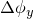
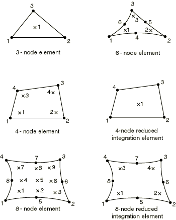

# 28.1.3 二维实体单元库


**产品：** Abaqus/Standard  Abaqus/Explicit  Abaqus/CAE  

##### **参考资料**

- ["实体（连续体）单元，" 第28.1.1节](pt06ch28s01alm01.md)
- [*SOLID SECTION](../key/key-link.md#usb-kws-msolidsection)

### 概述

本节提供Abaqus/Standard和Abaqus/Explicit中可用的二维实体单元的参考。

### 单元类型

#### 平面应变单元

| CPE3 | 3节点线性 |
| --- | --- |
|  |

| CPE3H(S) | 3节点线性，恒压混合 |
| --- | --- |
|  |

| CPE4(S) | 4节点双线性 |
| --- | --- |
|  |

| CPE4H(S) | 4节点双线性，恒压混合 |
| --- | --- |
|  |

| CPE4I(S) | 4节点双线性，不兼容模式 |
| --- | --- |
|  |

| CPE4IH(S) | 4节点双线性，不兼容模式，线性压力混合 |
| --- | --- |
|  |

| CPE4R | 4节点双线性，带沙漏控制的减缩积分 |
| --- | --- |
|  |

| CPE4RH(S) | 4节点双线性，带沙漏控制的减缩积分，恒压混合 |
| --- | --- |
|  |

| CPE6(S) | 6节点二次 |
| --- | --- |
|  |

| CPE6H(S) | 6节点二次，线性压力混合 |
| --- | --- |
|  |

| CPE6M | 6节点修正，带沙漏控制 |
| --- | --- |
|  |

| CPE6MH(S) | 6节点修正，带沙漏控制，线性压力混合 |
| --- | --- |
|  |

| CPE8(S) | 8节点双二次 |
| --- | --- |
|  |

| CPE8H(S) | 8节点双二次，线性压力混合 |
| --- | --- |
|  |

| CPE8R(S) | 8节点双二次，减缩积分 |
| --- | --- |
|  |

| CPE8RH(S) | 8节点双二次，减缩积分，线性压力混合 |
| --- | --- |
|  |

##### 活动自由度

1, 2

##### 额外解变量

恒压混合单元有一个与压力相关的额外变量，线性压力混合单元有三个与压力相关的额外变量。

单元类型CPE4I和CPE4IH有五个与不兼容模式相关的额外变量。

单元类型CPE6M和CPE6MH有两个额外的位移变量。

#### 平面应力单元

| CPS3 | 3节点线性 |
| --- | --- |
|  |

| CPS4(S) | 4节点双线性 |
| --- | --- |
|  |

| CPS4I(S) | 4节点双线性，不兼容模式 |
| --- | --- |
|  |

| CPS4R | 4节点双线性，带沙漏控制的减缩积分 |
| --- | --- |
|  |

| CPS6(S) | 6节点二次 |
| --- | --- |
|  |

| CPS6M | 6节点修正，带沙漏控制 |
| --- | --- |
|  |

| CPS8(S) | 8节点双二次 |
| --- | --- |
|  |

| CPS8R(S) | 8节点双二次，减缩积分 |
| --- | --- |
|  |

##### 活动自由度

1, 2

##### 额外解变量

单元类型CPS4I有四个与不兼容模式相关的额外变量。

单元类型CPS6M有两个额外的位移变量。

#### 广义平面应变单元

| CPEG3(S) | 3节点线性三角形 |
| --- | --- |
|  |

| CPEG3H(S) | 3节点线性三角形，恒压混合 |
| --- | --- |
|  |

| CPEG4(S) | 4节点双线性四边形 |
| --- | --- |
|  |

| CPEG4H(S) | 4节点双线性四边形，恒压混合 |
| --- | --- |
|  |

| CPEG4I(S) | 4节点双线性四边形，不兼容模式 |
| --- | --- |
|  |

| CPEG4IH(S) | 4节点双线性四边形，不兼容模式，线性压力混合 |
| --- | --- |
|  |

| CPEG4R(S) | 4节点双线性四边形，带沙漏控制的减缩积分 |
| --- | --- |
|  |

| CPEG4RH(S) | 4节点双线性四边形，带沙漏控制的减缩积分，恒压混合 |
| --- | --- |
|  |

| CPEG6(S) | 6节点二次三角形 |
| --- | --- |
|  |

| CPEG6H(S) | 6节点二次三角形，线性压力混合 |
| --- | --- |
|  |

| CPEG6M(S) | 6节点修正，带沙漏控制 |
| --- | --- |
|  |

| CPEG6MH(S) | 6节点修正，带沙漏控制，线性压力混合 |
| --- | --- |
|  |

| CPEG8(S) | 8节点双二次四边形 |
| --- | --- |
|  |

| CPEG8H(S) | 8节点双二次四边形，线性压力混合 |
| --- | --- |
|  |

| CPEG8R(S) | 8节点双二次四边形，减缩积分 |
| --- | --- |
|  |

| CPEG8RH(S) | 8节点双二次四边形，减缩积分，线性压力混合 |
| --- | --- |
|  |

##### 活动自由度

除参考节点外的所有节点：1, 2

参考节点：3, 4, 5

##### 额外解变量

恒压混合单元有一个与压力相关的额外变量，线性压力混合单元有三个与压力相关的额外变量。

单元类型CPEG4I和CPEG4IH有五个与不兼容模式相关的额外变量。

单元类型CPEG6M和CPEG6MH有两个额外的位移变量。

#### 耦合温度-位移平面应变单元

| CPE3T | 3节点线性位移和温度 |
| --- | --- |
|  |

| CPE4T(S) | 4节点双线性位移和温度 |
| --- | --- |
|  |

| CPE4HT(S) | 4节点双线性位移和温度，恒压混合 |
| --- | --- |
|  |

| CPE4RT | 4节点双线性位移和温度，带沙漏控制的减缩积分 |
| --- | --- |
|  |

| CPE4RHT(S) | 4节点双线性位移和温度，带沙漏控制的减缩积分，恒压混合 |
| --- | --- |
|  |

| CPE6MT | 6节点修正位移和温度，带沙漏控制 |
| --- | --- |
|  |

| CPE6MHT(S) | 6节点修正位移和温度，带沙漏控制，恒压混合 |
| --- | --- |
|  |

| CPE8T(S) | 8节点双二次位移，双线性温度 |
| --- | --- |
|  |

| CPE8HT(S) | 8节点双二次位移，双线性温度，线性压力混合 |
| --- | --- |
|  |

| CPE8RT(S) | 8节点双二次位移，双线性温度，减缩积分 |
| --- | --- |
|  |

| CPE8RHT(S) | 8节点双二次位移，双线性温度，减缩积分，线性压力混合 |
| --- | --- |
|  |

##### 活动自由度

角节点：1, 2, 11

Abaqus/Standard中二阶单元的边中节点：1, 2

Abaqus/Standard中修正位移和温度单元的边中节点：1, 2, 11

##### 额外解变量

恒压混合单元有一个与压力相关的额外变量，线性压力混合单元有三个与压力相关的额外变量。

单元类型CPE6MT和CPE6MHT有两个额外的位移变量和一个额外的温度变量。

#### 耦合温度-位移平面应力单元

| CPS3T | 3节点线性位移和温度 |
| --- | --- |
|  |

| CPS4T(S) | 4节点双线性位移和温度 |
| --- | --- |
|  |

| CPS4RT | 4节点双线性位移和温度，带沙漏控制的减缩积分 |
| --- | --- |
|  |

| CPS6MT | 6节点修正位移和温度，带沙漏控制 |
| --- | --- |
|  |

| CPS8T(S) | 8节点双二次位移，双线性温度 |
| --- | --- |
|  |

| CPS8RT(S) | 8节点双二次位移，双线性温度，减缩积分 |
| --- | --- |
|  |

##### 活动自由度

角节点：1, 2, 11

Abaqus/Standard中二阶单元的边中节点：1, 2

Abaqus/Standard中修正位移和温度单元的边中节点：1, 2, 11

##### 额外解变量

单元类型CPS6MT有两个额外的位移变量和一个额外的温度变量。

#### 耦合温度-位移广义平面应变单元

| CPEG3T(S) | 3节点线性位移和温度 |
| --- | --- |
|  |

| CPEG3HT(S) | 3节点线性位移和温度，恒压混合 |
| --- | --- |
|  |

| CPEG4T(S) | 4节点双线性位移和温度 |
| --- | --- |
|  |

| CPEG4HT(S) | 4节点双线性位移和温度，恒压混合 |
| --- | --- |
|  |

| CPEG4RT(S) | 4节点双线性位移和温度，带沙漏控制的减缩积分 |
| --- | --- |
|  |

| CPEG4RHT(S) | 4节点双线性位移和温度，带沙漏控制的减缩积分，恒压混合 |
| --- | --- |
|  |

| CPEG6MT(S) | 6节点修正位移和温度，带沙漏控制 |
| --- | --- |
|  |

| CPEG6MHT(S) | 6节点修正位移和温度，带沙漏控制，恒压混合 |
| --- | --- |
|  |

| CPEG8T(S) | 8节点双二次位移，双线性温度 |
| --- | --- |
|  |

| CPEG8HT(S) | 8节点双二次位移，双线性温度，线性压力混合 |
| --- | --- |
|  |

| CPEG8RHT(S) | 8节点双二次位移，双线性温度，减缩积分，线性压力混合 |
| --- | --- |
|  |

##### 活动自由度

角节点：1, 2, 11

二阶单元的边中节点：1, 2

修正位移和温度单元的边中节点：1, 2, 11

参考节点：3, 4, 5

##### 额外解变量

恒压混合单元有一个与压力相关的额外变量，线性压力混合单元有三个与压力相关的额外变量。

单元类型CPEG6MT和CPEG6MHT有两个额外的位移变量和一个额外的温度变量。

#### 扩散热传递或质量扩散单元

| DC2D3(S) | 3节点线性 |
| --- | --- |
|  |

| DC2D4(S) | 4节点线性 |
| --- | --- |
|  |

| DC2D6(S) | 6节点二次 |
| --- | --- |
|  |

| DC2D8(S) | 8节点双二次 |
| --- | --- |
|  |

##### 活动自由度

11

##### 额外解变量

无。

#### 强制对流/扩散单元

| DCC2D4(S) | 4节点 |
| --- | --- |
|  |

| DCC2D4D(S) | 带弥散控制的4节点 |
| --- | --- |
|  |

##### 活动自由度

11

##### 额外解变量

无。

#### 耦合热电单元

| DC2D3E(S) | 3节点线性 |
| --- | --- |
|  |

| DC2D4E(S) | 4节点线性 |
| --- | --- |
|  |

| DC2D6E(S) | 6节点二次 |
| --- | --- |
|  |

| DC2D8E(S) | 8节点双二次 |
| --- | --- |
|  |

##### 活动自由度

9, 11

##### 额外解变量

无。

#### 孔隙压力平面应变单元

| CPE4P(S) | 4节点双线性位移和孔隙压力 |
| --- | --- |
|  |

| CPE4PH(S) | 4节点双线性位移和孔隙压力，恒压应力混合 |
| --- | --- |
|  |

| CPE4RP(S) | 4节点双线性位移和孔隙压力，带沙漏控制的减缩积分 |
| --- | --- |
|  |

| CPE4RPH(S) | 4节点双线性位移和孔隙压力，带沙漏控制的减缩积分，恒压混合 |
| --- | --- |
|  |

| CPE6MP(S) | 6节点修正位移和孔隙压力，带沙漏控制 |
| --- | --- |
|  |

| CPE6MPH(S) | 6节点修正位移和孔隙压力，带沙漏控制，线性压力混合 |
| --- | --- |
|  |

| CPE8P(S) | 8节点双二次位移，双线性孔隙压力 |
| --- | --- |
|  |

| CPE8PH(S) | 8节点双二次位移，双线性孔隙压力，线性压力应力混合 |
| --- | --- |
|  |

| CPE8RP(S) | 8节点双二次位移，双线性孔隙压力，减缩积分 |
| --- | --- |
|  |

| CPE8RPH(S) | 8节点双二次位移，双线性孔隙压力，减缩积分，线性压力应力混合 |
| --- | --- |
|  |

##### 活动自由度

角节点：1, 2, 8

所有单元的边中节点：1, 2；CPE6MP和CPE6MPH在边中节点也有自由度8

##### 额外解变量

恒压混合单元有一个与有效压力应力相关的额外变量，线性压力混合单元有三个与有效压力应力相关的额外变量，以允许完全不可压缩材料建模。

单元类型CPE6MP和CPE6MPH有两个额外的位移变量和一个额外的孔隙压力变量。

#### 声学单元

| AC2D3 | 3节点线性 |
| --- | --- |
|  |

| AC2D4(S) | 4节点双线性 |
| --- | --- |
|  |

| AC2D4R(E) | 4节点双线性，带沙漏控制的减缩积分 |
| --- | --- |
|  |

| AC2D6(S) | 6节点二次 |
| --- | --- |
|  |

| AC2D8(S) | 8节点双二次 |
| --- | --- |
|  |

##### 活动自由度

8

##### 额外解变量

无。

#### 压电平面应变单元

| CPE3E(S) | 3节点线性 |
| --- | --- |
|  |

| CPE4E(S) | 4节点双线性 |
| --- | --- |
|  |

| CPE6E(S) | 6节点二次 |
| --- | --- |
|  |

| CPE8E(S) | 8节点双二次 |
| --- | --- |
|  |

| CPE8RE(S) | 8节点双二次，减缩积分 |
| --- | --- |
|  |

##### 活动自由度

1, 2, 9

##### 额外解变量

无。

#### 压电平面应力单元

| CPS3E(S) | 3节点线性 |
| --- | --- |
|  |

| CPS4E(S) | 4节点双线性 |
| --- | --- |
|  |

| CPS6E(S) | 6节点二次 |
| --- | --- |
|  |

| CPS8E(S) | 8节点双二次 |
| --- | --- |
|  |

| CPS8RE(S) | 8节点双二次，减缩积分 |
| --- | --- |
|  |

##### 活动自由度

1, 2, 9

##### 额外解变量

无。

#### 电磁单元

| EMC2D3(S) | 3节点零阶 |
| --- | --- |
|  |

| EMC2D4(S) | 4节点零阶 |
| --- | --- |
|  |

##### 活动自由度

磁场矢势（更多信息，参见["涡流分析中的边界条件，" 第6.7.5节"](pt03ch06s07at24.md#usb-anl-aeddycurrent-bc)，和["静磁分析中的边界条件，" 第6.7.6节"](pt03ch06s07at25.md#usb-anl-amagnetostatic-bc)）。

##### 额外解变量

无。

### 所需节点坐标

*X*、*Y*

### 单元属性定义

对于除广义平面应变单元外的所有单元，您必须提供单元厚度；默认假定为单位厚度。

对于广义平面应变单元，您必须提供三个值：通过参考节点的轴向材料纤维的初始长度，的初始值（弧度），以及的初始值（弧度）。如果您不提供这些值，Abaqus假定默认值为一个单位作为初始长度，和为零。此外，您必须为广义平面应变单元定义参考点。

| **输入文件用法：** | 使用以下选项定义除广义平面应变单元外所有单元的单元属性： |
| --- | --- |
|  | ``` [*SOLID SECTION](../key/key-link.md#usb-kws-msolidsection) ``` 使用以下选项定义广义平面应变单元的单元属性： ``` [*SOLID SECTION](../key/key-link.md#usb-kws-msolidsection), REF NODE=*node number or node set name* ``` |

| **Abaqus/CAE用法：** | 属性模块：**创建截面**：选择**实体**作为截面**类别**，选择**均匀**、**广义平面应变**或**电磁、实体**作为截面**类型** |
| --- | --- |
|  | 广义平面应变截面必须分配给具有与其关联的参考点的零件区域。要定义参考点：零件模块：****工具****参考点****：选择参考点 |

### 基于单元的载荷

### 分布载荷

分布载荷可用于所有具有位移自由度的单元。如["分布载荷，" 第34.4.3节"](pt07ch34s04aus122.md)中所述进行指定。

**载荷ID（*DLOAD）：**  BX**Abaqus/CAE载荷/相互作用：**  **体积力****单位：**  [FL3](../popups/usb-int-iconventions-unitsym.md)**描述：**  全局*X*方向的体积力。

**载荷ID（*DLOAD）：**  BY**Abaqus/CAE载荷/相互作用：**  **体积力****单位：**  [FL3](../popups/usb-int-iconventions-unitsym.md)**描述：**  全局*Y*方向的体积力。

**载荷ID（*DLOAD）：**  BXNU**Abaqus/CAE载荷/相互作用：**  **体积力****单位：**  [FL3](../popups/usb-int-iconventions-unitsym.md)**描述：**  全局*X*方向的非均匀体积力，在Abaqus/Standard中通过用户子程序[`DLOAD`](../sub/sub-link.md#sub-xsl-dload)提供幅值，在Abaqus/Explicit中通过[`VDLOAD`](../sub/sub-link.md#sub-xsl-vdload)提供幅值。

**载荷ID（*DLOAD）：**  BYNU**Abaqus/CAE载荷/相互作用：**  **体积力****单位：**  [FL3](../popups/usb-int-iconventions-unitsym.md)**描述：**  全局*Y*方向的非均匀体积力，在Abaqus/Standard中通过用户子程序[`DLOAD`](../sub/sub-link.md#sub-xsl-dload)提供幅值，在Abaqus/Explicit中通过[`VDLOAD`](../sub/sub-link.md#sub-xsl-vdload)提供幅值。

**载荷ID（*DLOAD）：**  CENT(S)**Abaqus/CAE载荷/相互作用：**  不支持**单位：**  [FL4(ML3T2)](../popups/usb-int-iconventions-unitsym.md)**描述：**  离心载荷（幅值输入为，其中是单位体积质量密度，是角速度）。不适用于孔隙压力单元。

**载荷ID（*DLOAD）：**  CENTRIF(S)**Abaqus/CAE载荷/相互作用：**  **旋转体积力****单位：**  [T2](../popups/usb-int-iconventions-unitsym.md)**描述：**  离心载荷（幅值输入为，其中是角速度）。

**载荷ID（*DLOAD）：**  CORIO(S)**Abaqus/CAE载荷/相互作用：**  **科里奥利力****单位：**  [FL4T (ML3T1)](../popups/usb-int-iconventions-unitsym.md)**描述：**  科里奥利力（幅值输入为，其中是单位体积质量密度，是角速度）。不适用于孔隙压力单元。

**载荷ID（*DLOAD）：**  GRAV**Abaqus/CAE载荷/相互作用：**  **重力****单位：**  [LT2](../popups/usb-int-iconventions-unitsym.md)**描述：**  指定方向的重力加载（幅值输入为加速度）。

**载荷ID（*DLOAD）：**  HP*n*(S)**Abaqus/CAE载荷/相互作用：**  不支持**单位：**  [FL2](../popups/usb-int-iconventions-unitsym.md)**描述：**  面*n*上的静水压力，在全局*Y*中线性。

**载荷ID（*DLOAD)：**  P*n***Abaqus/CAE载荷/相互作用：**  **压力****单位：**  [FL2](../popups/usb-int-iconventions-unitsym.md)**描述：**  面*n*上的压力。

**载荷ID（*DLOAD）：**  P*n*NU**Abaqus/CAE载荷/相互作用：**  不支持**单位：**  [FL2](../popups/usb-int-iconventions-unitsym.md)**描述：**  面*n*上的非均匀压力，在Abaqus/Standard中通过用户子程序[`DLOAD`](../sub/sub-link.md#sub-xsl-dload)提供幅值，在Abaqus/Explicit中通过[`VDLOAD`](../sub/sub-link.md#sub-xsl-vdload)提供幅值。

**载荷ID（*DLOAD）：**  ROTA(S)**Abaqus/CAE载荷/相互作用：**  **旋转体积力****单位：**  [T2](../popups/usb-int-iconventions-unitsym.md)**描述：**  旋转加速度载荷（幅值输入为，其中是旋转加速度）。

**载荷ID（*DLOAD)：**  SBF(E)**Abaqus/CAE载荷/相互作用：**  不支持**单位：**  [FL5T2](../popups/usb-int-iconventions-unitsym.md)**描述：**  全局*X*和*Y*方向的滞止体积力。

**载荷ID（*DLOAD)：**  SP*n*(E)**Abaqus/CAE载荷/相互作用：**  不支持**单位：**  [FL4T2](../popups/usb-int-iconventions-unitsym.md)**描述：**  面*n*上的滞止压力。

**载荷ID（*DLOAD)：**  TRSHR*n***Abaqus/CAE载荷/相互作用：**  **表面牵引****单位：**  [FL2](../popups/usb-int-iconventions-unitsym.md)**描述：**  面*n*上的剪切牵引。

**载荷ID（*DLOAD)：**  TRSHR*n*NU(S)**Abaqus/CAE载荷/相互作用：**  不支持**单位：**  [FL2](../popups/usb-int-iconventions-unitsym.md)**描述：**  面*n*上的非均匀剪切牵引，通过用户子程序[`UTRACLOAD`](../sub/sub-link.md#sub-xsl-utracload)提供幅值和方向。

**载荷ID（*DLOAD)：**  TRVEC*n***Abaqus/CAE载荷/相互作用：**  **表面牵引****单位：**  [FL2](../popups/usb-int-iconventions-unitsym.md)**描述：**  面*n*上的一般牵引。

**载荷ID（*DLOAD)：**  TRVEC*n*NU(S)**Abaqus/CAE载荷/相互作用：**  不支持**单位：**  [FL2](../popups/usb-int-iconventions-unitsym.md)**描述：**  面*n*上的非均匀一般牵引，通过用户子程序[`UTRACLOAD`](../sub/sub-link.md#sub-xsl-utracload)提供幅值和方向。

**载荷ID（*DLOAD)：**  VBF(E)**Abaqus/CAE载荷/相互作用：**  不支持**单位：**  [FL4T](../popups/usb-int-iconventions-unitsym.md)**描述：**  全局*X*和*Y*方向的粘性体积力。

**载荷ID（*DLOAD)：**  VP*n*(E)**Abaqus/CAE载荷/相互作用：**  不支持**单位：**  [FL3T](../popups/usb-int-iconventions-unitsym.md)**描述：**  面*n*上的粘性压力，施加与面法向速度成比例且反对运动的压力。

### 基础

基础可用于具有位移自由度的Abaqus/Standard单元。如["单元基础，" 第2.2.2节"](pt01ch02s02aus12.md)中所述进行指定。

**载荷ID（*FOUNDATION）：**  F*n*(S)**Abaqus/CAE载荷/相互作用：**  **弹性基础****单位：**  [FL3](../popups/usb-int-iconventions-unitsym.md)**描述：**  面*n*上的弹性基础。

### 分布热通量

分布热通量可用于所有具有温度自由度的单元。如["热载荷，" 第34.4.4节"](pt07ch34s04aus123.md)中所述进行指定。

**载荷ID（*DFLUX)：**  BF**Abaqus/CAE载荷/相互作用：**  **体积热通量****单位：**  [JL3T1](../popups/usb-int-iconventions-unitsym.md)**描述：**  单位体积热体积通量。

**载荷ID（*DFLUX)：**  BFNU(S)**Abaqus/CAE载荷/相互作用：**  **体积热通量****单位：**  [JL3T1](../popups/usb-int-iconventions-unitsym.md)**描述：**  单位体积非均匀热体积通量，通过用户子程序[`DFLUX`](../sub/sub-link.md#sub-xsl-dflux)提供幅值。

**载荷ID（*DFLUX)：**  S*n***Abaqus/CAE载荷/相互作用：**  **表面热通量****单位：**  [JL2T1](../popups/usb-int-iconventions-unitsym.md)**描述：**  单位面积热表面通量，流入面*n*。

**载荷ID（*DFLUX)：**  S*n*NU(S)**Abaqus/CAE载荷/相互作用：**  不支持**单位：**  [JL2T1](../popups/usb-int-iconventions-unitsym.md)**描述：**  单位面积非均匀热表面通量，流入面*n*，通过用户子程序[`DFLUX`](../sub/sub-link.md#sub-xsl-dflux)提供幅值。

### 薄膜条件

薄膜条件可用于所有具有温度自由度的单元。如["热载荷，" 第34.4.4节"](pt07ch34s04aus123.md)中所述进行指定。

**载荷ID（*FILM)：**  F*n***Abaqus/CAE载荷/相互作用：**  **表面薄膜条件****单位：**  [JL2T11](../popups/usb-int-iconventions-unitsym.md)**描述：**  面*n*上提供的膜系数和热沉温度（的单位）。

**载荷ID（*FILM)：**  F*n*NU(S)**Abaqus/CAE载荷/相互作用：**  不支持**单位：**  [JL2T11](../popups/usb-int-iconventions-unitsym.md)**描述：**  面*n*上提供的非均匀膜系数和热沉温度（的单位），通过用户子程序[`FILM`](../sub/sub-link.md#sub-xsl-film)提供幅值。

### 辐射类型

辐射条件可用于所有具有温度自由度的单元。如["热载荷，" 第34.4.4节"](pt07ch34s04aus123.md)中所述进行指定。

**载荷ID（*RADIATE)：**  R*n***Abaqus/CAE载荷/相互作用：**  **表面辐射****单位：**  [无量纲](../popups/usb-int-iconventions-unitsym.md)**描述：**  面*n*上提供的发射率和热沉温度（的单位）。

### 分布流动

分布流动可用于所有具有孔隙压力自由度的单元。如["孔隙流体流动，" 第34.4.7节"](pt07ch34s04aus126.md)中所述进行指定。

**载荷ID（*FLOW)：**  Q*n*(S)**Abaqus/CAE载荷/相互作用：**  不支持**单位：**  [F1L3T1](../popups/usb-int-iconventions-unitsym.md)**描述：**  面*n*上提供的渗流系数和参考汇孔隙压力（[FL2](../popups/usb-int-iconventions-unitsym.md)单位）。

**载荷ID（*FLOW)：**  Q*n*D(S)**Abaqus/CAE载荷/相互作用：**  不支持**单位：**  [F1L3T1](../popups/usb-int-iconventions-unitsym.md)**描述：**  面*n*上提供的仅排水的渗流系数。

**载荷ID（*FLOW)：**  Q*n*NU(S)**Abaqus/CAE载荷/相互作用：**  不支持**单位：**  [F1L3T1](../popups/usb-int-iconventions-unitsym.md)**描述：**  面*n*上提供的非均匀渗流系数和参考汇孔隙压力（[FL2](../popups/usb-int-iconventions-unitsym.md)单位），通过用户子程序[`FLOW`](../sub/sub-link.md#sub-xsl-flow)提供幅值。

**载荷ID（*DFLOW)：**  S*n*(S)**Abaqus/CAE载荷/相互作用：**  **表面孔隙流体****单位：**  [LT1](../popups/usb-int-iconventions-unitsym.md)**描述：**  面*n*上规定的孔隙流体有效速度（从面流出）。

**载荷ID（*DFLOW)：**  S*n*NU(S)**Abaqus/CAE载荷/相互作用：**  不支持**单位：**  [LT1](../popups/usb-int-iconventions-unitsym.md)**描述：**  面*n*上规定的非均匀孔隙流体有效速度（从面流出），通过用户子程序[`DFLOW`](../sub/sub-link.md#sub-xsl-dflow)提供幅值。

### 分布阻抗

分布阻抗可用于所有具有声压自由度的单元。如["声学和冲击载荷，" 第34.4.6节"](pt07ch34s04aus125.md)中所述进行指定。

**载荷ID（*IMPEDANCE)：**  I*n***Abaqus/CAE载荷/相互作用：**  不支持**单位：**  [无](../popups/usb-int-iconventions-unitsym.md)**描述：**  定义面*n*上阻抗的阻抗属性名称。

### 电通量

电通量可用于压电单元。如["压电分析，" 第6.7.2节"](pt03ch06s07at21.md)中所述进行指定。

**载荷ID（*DECHARGE)：**  EBF(S)**Abaqus/CAE载荷/相互作用：**  **体积电荷****单位：**  [CL3](../popups/usb-int-iconventions-unitsym.md)**描述：**  单位体积电荷通量。

**载荷ID（*DECHARGE)：**  ES*n*(S)**Abaqus/CAE载荷/相互作用：**  **表面电荷****单位：**  [CL2](../popups/usb-int-iconventions-unitsym.md)**描述：**  面*n*上规定的表面电荷。

### 分布电流密度

分布电流密度可用于耦合热电单元、耦合热电结构单元和电磁单元。如["耦合热电分析，" 第6.7.3节"](pt03ch06s07at22.md)；["完全耦合热电结构分析，" 第6.7.4节"](pt03ch06s07at23.md)；和["涡流分析，" 第6.7.5节"](pt03ch06s07at24.md)中所述进行指定。

**载荷ID（*DECURRENT)：**  CBF(S)**Abaqus/CAE载荷/相互作用：**  **体积电流****单位：**  [CL3T1](../popups/usb-int-iconventions-unitsym.md)**描述：**  体积电流源密度。

**载荷ID（*DECURRENT)：**  CS*n*(S)**Abaqus/CAE载荷/相互作用：**  **表面电流****单位：**  [CL2T1](../popups/usb-int-iconventions-unitsym.md)**描述：**  面*n*上的电流密度。

**载荷ID（*DECURRENT)：**  CJ(S)**Abaqus/CAE载荷/相互作用：**  **体积电流密度****单位：**  [CL2T1](../popups/usb-int-iconventions-unitsym.md)**描述：**  涡流分析中的体积电流密度矢量。

### 分布浓度通量

分布浓度通量可用于质量扩散单元。如["质量扩散分析，" 第6.9.1节"](pt03ch06s09at28.md)中所述进行指定。

**载荷ID（*DFLUX)：**  BF(S)**Abaqus/CAE载荷/相互作用：**  **体积浓度通量****单位：**  [PT1](../popups/usb-int-iconventions-unitsym.md)**描述：**  单位体积浓度体积通量。

**载荷ID（*DFLUX)：**  BFNU(S)**Abaqus/CAE载荷/相互作用：**  **体积浓度通量****单位：**  [PT1](../popups/usb-int-iconventions-unitsym.md)**描述：**  单位体积非均匀浓度体积通量，通过用户子程序[`DFLUX`](../sub/sub-link.md#sub-xsl-dflux)提供幅值。

**载荷ID（*DFLUX)：**  S*n*(S)**Abaqus/CAE载荷/相互作用：**  **表面浓度通量****单位：**  [PLT1](../popups/usb-int-iconventions-unitsym.md)**描述：**  单位面积浓度表面通量，流入面*n*。

**载荷ID（*DFLUX)：**  S*n*NU(S)**Abaqus/CAE载荷/相互作用：**  **表面浓度通量****单位：**  [PLT1](../popups/usb-int-iconventions-unitsym.md)**描述：**  单位面积非均匀浓度表面通量，流入面*n*，通过用户子程序[`DFLUX`](../sub/sub-link.md#sub-xsl-dflux)提供幅值。

### 基于表面的载荷

### 分布载荷

基于表面的分布载荷可用于所有具有位移自由度的单元。如["分布载荷，" 第34.4.3节"](pt07ch34s04aus122.md)中所述进行指定。

**载荷ID（*DSLOAD)：**  HP(S)**Abaqus/CAE载荷/相互作用：**  **压力****单位：**  [FL2](../popups/usb-int-iconventions-unitsym.md)**描述：**  单元表面上的静水压力，在全局*Y*中线性。

**载荷ID（*DSLOAD)：**  P**Abaqus/CAE载荷/相互作用：**  **压力****单位：**  [FL2](../popups/usb-int-iconventions-unitsym.md)**描述：**  单元表面上的压力。

**载荷ID（*DSLOAD)：**  PNU**Abaqus/CAE载荷/相互作用：**  **压力****单位：**  [FL2](../popups/usb-int-iconventions-unitsym.md)**描述：**  单元表面上的非均匀压力，在Abaqus/Standard中通过用户子程序[`DLOAD`](../sub/sub-link.md#sub-xsl-dload)提供幅值，在Abaqus/Explicit中通过[`VDLOAD`](../sub/sub-link.md#sub-xsl-vdload)提供幅值。

**载荷ID（*DSLOAD)：**  SP(E)**Abaqus/CAE载荷/相互作用：**  **压力****单位：**  [FL4T2](../popups/usb-int-iconventions-unitsym.md)**描述：**  单元表面上的滞止压力。

**载荷ID（*DSLOAD)：**  TRSHR**Abaqus/CAE载荷/相互作用：**  **表面牵引****单位：**  [FL2](../popups/usb-int-iconventions-unitsym.md)**描述：**  单元表面上的剪切牵引。

**载荷ID（*DSLOAD)：**  TRSHRNU(S)**Abaqus/CAE载荷/相互作用：**  **表面牵引****单位：**  [FL2](../popups/usb-int-iconventions-unitsym.md)**描述：**  单元表面上的非均匀剪切牵引，通过用户子程序[`UTRACLOAD`](../sub/sub-link.md#sub-xsl-utracload)提供幅值和方向。

**载荷ID（*DSLOAD)：**  TRVEC**Abaqus/CAE载荷/相互作用：**  **表面牵引****单位：**  [FL2](../popups/usb-int-iconventions-unitsym.md)**描述：**  单元表面上的一般牵引。

**载荷ID（*DSLOAD)：**  TRVECNU(S)**Abaqus/CAE载荷/相互作用：**  **表面牵引****单位：**  [FL2](../popups/usb-int-iconventions-unitsym.md)**描述：**  单元表面上的非均匀一般牵引，通过用户子程序[`UTRACLOAD`](../sub/sub-link.md#sub-xsl-utracload)提供幅值和方向。

**载荷ID（*DSLOAD)：**  VP(E)**Abaqus/CAE载荷/相互作用：**  **压力****单位：**  [FL3T](../popups/usb-int-iconventions-unitsym.md)**描述：**  单元表面上的粘性压力。粘性压力与单元表面法向速度成比例且反对运动。

### 分布热通量

基于表面的热通量可用于所有具有温度自由度的单元。如["热载荷，" 第34.4.4节"](pt07ch34s04aus123.md)中所述进行指定。

**载荷ID（*DSFLUX)：**  S**Abaqus/CAE载荷/相互作用：**  **表面热通量****单位：**  [JL2T1](../popups/usb-int-iconventions-unitsym.md)**描述：**  单位面积热表面通量，流入单元表面。

**载荷ID（*DSFLUX)：**  SNU(S)**Abaqus/CAE载荷/相互作用：**  **表面热通量****单位：**  [JL2T1](../popups/usb-int-iconventions-unitsym.md)**描述：**  在单元表面上施加的单位面积非均匀热表面通量，通过用户子程序[`DFLUX`](../sub/sub-link.md#sub-xsl-dflux)提供幅值。

### 薄膜条件

基于表面的薄膜条件可用于所有具有温度自由度的单元。如["热载荷，" 第34.4.4节"](pt07ch34s04aus123.md)中所述进行指定。

**载荷ID（*SFILM)：**  F**Abaqus/CAE载荷/相互作用：**  **表面薄膜条件****单位：**  [JL2T11](../popups/usb-int-iconventions-unitsym.md)**描述：**  单元表面上提供的膜系数和热沉温度（的单位）。

**载荷ID（*SFILM)：**  FNU(S)**Abaqus/CAE载荷/相互作用：**  **表面薄膜条件****单位：**  [JL2T11](../popups/usb-int-iconventions-unitsym.md)**描述：**  单元表面上提供的非均匀膜系数和热沉温度（的单位），通过用户子程序[`FILM`](../sub/sub-link.md#sub-xsl-film)提供幅值。

### 辐射类型

基于表面的辐射条件可用于所有具有温度自由度的单元。如["热载荷，" 第34.4.4节"](pt07ch34s04aus123.md)中所述进行指定。

**载荷ID（*SRADIATE)：**  R**Abaqus/CAE载荷/相互作用：**  **表面辐射****单位：**  [无量纲](../popups/usb-int-iconventions-unitsym.md)**描述：**  单元表面上提供的发射率和热沉温度（的单位）。

### 分布流动

基于表面的流动可用于所有具有孔隙压力自由度的单元。如["孔隙流体流动，" 第34.4.7节"](pt07ch34s04aus126.md)中所述进行指定。

**载荷ID（*SFLOW)：**  Q(S)**Abaqus/CAE载荷/相互作用：**  不支持**单位：**  [F1L3T1](../popups/usb-int-iconventions-unitsym.md)**描述：**  单元表面上提供的渗流系数和参考汇孔隙压力（[FL2](../popups/usb-int-iconventions-unitsym.md)单位）。

**载荷ID（*SFLOW)：**  QD(S)**Abaqus/CAE载荷/相互作用：**  不支持**单位：**  [F1L3T1](../popups/usb-int-iconventions-unitsym.md)**描述：**  单元表面上提供的仅排水的渗流系数。

**载荷ID（*SFLOW)：**  QNU(S)**Abaqus/CAE载荷/相互作用：**  不支持**单位：**  [F1L3T1](../popups/usb-int-iconventions-unitsym.md)**描述：**  单元表面上提供的非均匀渗流系数和参考汇孔隙压力（[FL2](../popups/usb-int-iconventions-unitsym.md)单位），通过用户子程序[`FLOW`](../sub/sub-link.md#sub-xsl-flow)提供幅值。

**载荷ID（*DSFLOW)：**  S(S)**Abaqus/CAE载荷/相互作用：**  **表面孔隙流体****单位：**  [LT1](../popups/usb-int-iconventions-unitsym.md)**描述：**  从单元表面流出的规定孔隙流体有效速度。

**载荷ID（*DSFLOW)：**  SNU(S)**Abaqus/CAE载荷/相互作用：**  **表面孔隙流体****单位：**  [LT1](../popups/usb-int-iconventions-unitsym.md)**描述：**  从单元表面流出的非均匀规定孔隙流体有效速度，通过用户子程序[`DFLOW`](../sub/sub-link.md#sub-xsl-dflow)提供幅值。

### 分布阻抗

基于表面的阻抗可用于所有具有声压自由度的单元。如["声学和冲击载荷，" 第34.4.6节"](pt07ch34s04aus125.md)中所述进行指定。

### 入射波载荷

基于表面的入射波载荷可用于所有具有位移自由度或声压自由度的单元。如["声学和冲击载荷，" 第34.4.6节"](pt07ch34s04aus125.md)中所述进行指定。如果入射波场包括从网格边界外平面的反射，可以包括此效应。

### 电通量

基于表面的电通量可用于压电单元。如["压电分析，" 第6.7.2节"](pt03ch06s07at21.md)中所述进行指定。

**载荷ID（*DSECHARGE)：**  ES(S)**Abaqus/CAE载荷/相互作用：**  **表面电荷****单位：**  [CL2](../popups/usb-int-iconventions-unitsym.md)**描述：**  单元表面上规定的表面电荷。

### 分布电流密度

基于表面的电流密度可用于耦合热电单元、耦合热电结构单元和电磁单元。如["耦合热电分析，" 第6.7.3节"](pt03ch06s07at22.md)；["完全耦合热电结构分析，" 第6.7.4节"](pt03ch06s07at23.md)；和["涡流分析，" 第6.7.5节"](pt03ch06s07at24.md)中所述进行指定。

**载荷ID（*DSECURRENT)：**  CS(S)**Abaqus/CAE载荷/相互作用：**  **表面电流****单位：**  [CL2T1](../popups/usb-int-iconventions-unitsym.md)**描述：**  施加在单元表面上的电流密度。

**载荷ID（*DSECURRENT)：**  CK(S)**Abaqus/CAE载荷/相互作用：**  **表面电流密度****单位：**  [CL1T1](../popups/usb-int-iconventions-unitsym.md)**描述：**  涡流分析中的表面电流密度矢量。

### 单元输出

对于大多数单元，输出在全局方向，除非通过截面定义（["方向，" 第2.2.5节"](pt01ch02s02aus15.md)）将局部坐标系分配给单元，在大位移分析中局部坐标系随运动旋转。详情参见["状态存储，" Abaqus理论指南第1.5.4节"](stm/stm-link.md#stm-int-statestorage)。

#### 应力、应变和其他张量分量

应力和其他张量（包括应变张量）可用于具有位移自由度的单元。所有张量具有相同的分量。例如，应力分量如下：

| S11 | ，直接应力。 |
| --- | --- |

| S22 | ，直接应力。 |
| --- | --- |

| S33 | ，直接应力（不适用于平面应力单元）。 |
| --- | --- |

| S12 | ，剪切应力。 |
| --- | --- |

#### 热通量分量

可用于具有温度自由度的单元。

| HFL1 | *X*方向的热通量。 |
| --- | --- |

| HFL2 | *Y*方向的热通量。 |
| --- | --- |

#### 孔隙流体速度分量

可用于具有孔隙压力自由度的单元。

| FLVEL1 | *X*方向的孔隙流体有效速度。 |
| --- | --- |

| FLVEL2 | *Y*方向的孔隙流体有效速度。 |
| --- | --- |

#### 质量浓度通量分量

可用于具有归一化浓度自由度的单元。

| MFL1 | *X*方向的浓度通量。 |
| --- | --- |

| MFL2 | *Y*方向的浓度通量。 |
| --- | --- |

#### 电势梯度

可用于具有电势自由度的单元。

| EPG1 | *X*方向的电势梯度。 |
| --- | --- |

| EPG2 | *Y*方向的电势梯度。 |
| --- | --- |

#### 电通量分量

可用于压电单元。

| EFLX1 | *X*方向的电通量。 |
| --- | --- |

| EFLX2 | *Y*方向的电通量。 |
| --- | --- |

#### 电流密度分量

可用于耦合热电单元。

| ECD1 | *X*方向的电流密度。 |
| --- | --- |

| ECD2 | *Y*方向的电流密度。 |
| --- | --- |

#### 电场分量

可用于涡流分析中的电磁单元。

| EME1 | *X*方向的电场。 |
| --- | --- |

| EME2 | *Y*方向的电场。 |
| --- | --- |

#### 磁通密度分量

可用于电磁单元。

| EMB3 | *Z*方向的磁通密度。 |
| --- | --- |

#### 磁场分量

可用于电磁单元。

| EMH3 | *Z*方向的磁场。 |
| --- | --- |

#### 涡流分析中的涡流密度分量

可用于涡流分析中的电磁单元。

| EMCD1 | *X*方向的涡流密度。 |
| --- | --- |

| EMCD2 | *Y*方向的涡流密度。 |
| --- | --- |

#### 涡流或静磁分析中的应用体积电流密度分量

可用于涡流或静磁分析中的电磁单元。

| EMCDA1 | *X*方向的应用体积电流密度。 |
| --- | --- |

| EMCDA2 | *Y*方向的应用体积电流密度。 |
| --- | --- |

### 单元上的节点排序和面编号


对于广义平面应变单元，每个单元关联的参考节点（存储广义平面应变自由度的节点）未显示。对于任何给定连接区域中的所有单元，参考节点应该相同，以便该区域的边界平面相同。不同区域可以有不同的参考节点。当增量生成单元时，参考节点的编号不会递增（参见["通过增量生成从现有单元创建单元"中的"单元定义，" 第2.2.1节"](pt01ch02s02aus11.md#usb-int-ielement-create-elgen)）。

##### 三角形单元面

| 面1 | 1 -- 2面 |
| --- | --- |
| 面2 | 2 -- 3面 |
| 面3 | 3 -- 1面 |

##### 四边形单元面

| 面1 | 1 -- 2面 |
| --- | --- |
| 面2 | 2 -- 3面 |
| 面3 | 3 -- 4面 |
| 面4 | 4 -- 1面 |

### 用于输出的积分点编号



对于热传递应用，三角形单元使用不同的积分方案，如["三角形、四面体和棱柱单元，" Abaqus理论指南第3.2.6节"](stm/stm-link.md#stm-elm-tritetwedge)中所述。


