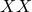

# 28.1.5 圆柱实体单元库


**产品：** Abaqus/Standard  Abaqus/CAE  

##### **参考资料**

- ["实体（连续体）单元，" 第28.1.1节](pt06ch28s01alm01.md)
- [*SOLID SECTION](../key/key-link.md#usb-kws-msolidsection)

### 概述

本节提供Abaqus/Standard中可用的圆柱实体单元的参考。

### 单元类型

| CCL9 | 9节点圆柱棱柱，径向平面中线性插值，圆周方向三角函数插值 |
| --- | --- |
|  |

| CCL9H | 9节点圆柱棱柱，径向平面中线性插值，圆周方向三角函数插值，平面中恒压混合，圆周方向线性压力混合 |
| --- | --- |
|  |

| CCL12 | 12节点圆柱砖块，径向平面中线性插值，圆周方向三角函数插值 |
| --- | --- |
|  |

| CCL12H | 12节点圆柱砖块，径向平面中线性插值，圆周方向三角函数插值，平面中恒压混合，圆周方向线性压力混合 |
| --- | --- |
|  |

| CCL18 | 18节点圆柱棱柱，径向平面中二次插值，圆周方向三角函数插值 |
| --- | --- |
|  |

| CCL18H | 18节点圆柱棱柱，径向平面中二次插值，圆周方向三角函数插值，平面中线性压力混合，圆周方向线性压力混合 |
| --- | --- |
|  |

| CCL24 | 24节点圆柱砖块，径向平面中二次插值，圆周方向三角函数插值 |
| --- | --- |
|  |

| CCL24H | 24节点圆柱砖块，径向平面中二次插值，圆周方向三角函数插值，平面中线性压力混合，圆周方向线性压力混合 |
| --- | --- |
|  |

| CCL24R | 24节点圆柱砖块，减缩积分，径向平面中二次插值，圆周方向三角函数插值 |
| --- | --- |
|  |

| CCL24RH | 24节点圆柱砖块，减缩积分，径向平面中二次插值，圆周方向三角函数插值，平面中线性压力混合，圆周方向线性压力混合 |
| --- | --- |
|  |

##### 活动自由度

1, 2, 3

##### 额外解变量

平面中恒压混合的混合单元有两个与压力相关的额外变量，线性压力混合单元有六个与压力相关的额外变量。

### 所需节点坐标

 *X*、*Y*、*Z*

### 单元属性定义

| **输入文件用法：** | ``` [*SOLID SECTION](../key/key-link.md#usb-kws-msolidsection) ``` |
| --- | --- |

| **Abaqus/CAE用法：** | 属性模块：**创建截面**：选择**实体**作为截面**类别**，选择**均匀**作为截面**类型** |
| --- | --- |

### 基于单元的载荷

### 分布载荷

分布载荷可用于所有具有位移自由度的单元。如["分布载荷，" 第34.4.3节"](pt07ch34s04aus122.md)中所述进行指定。

**载荷ID（*DLOAD)：**  P*n***Abaqus/CAE载荷/相互作用：**  **压力****单位：**  [FL2](../popups/usb-int-iconventions-unitsym.md)**描述：**  面*n*上的压力。

**载荷ID（*DLOAD)：**  P*n*NU**Abaqus/CAE载荷/相互作用：**  不支持**单位：**  [FL2](../popups/usb-int-iconventions-unitsym.md)**描述：**  面*n*上的非均匀压力，通过用户子程序[`DLOAD`](../sub/sub-link.md#sub-xsl-dload)提供幅值。

### 单元输出

默认节点输出在全球笛卡尔坐标系统中提供。应力、应变和其他材料点输出量默认在固定局部圆柱坐标系中输出，其中方向1是径向方向，方向2是轴向方向，方向3是圆周方向。默认系统从单元的参考构型计算。可以定义替代局部系统（参见["方向，" 第2.2.5节"](pt01ch02s02aus15.md)）。在这种情况下，应力、应变和其他材料点量的输出在定向系统中进行。

#### 应力、应变和其他张量分量

应力和其他张量（包括应变张量）可用于具有位移自由度的单元。所有张量具有相同的分量。例如，应力分量如下：

| S11 | ，径向直接应力。 |
| --- | --- |

| S22 | ，轴向直接应力。 |
| --- | --- |

| S33 | ，周向直接应力。 |
| --- | --- |

| S12 | ，剪切应力。 |
| --- | --- |

| S13 | ，剪切应力。 |
| --- | --- |

| S23 | ，剪切应力。 |
| --- | --- |

### 单元上的节点排序和面编号


对于圆柱实体单元，节点沿圆周方向排序，而不是像常规砖块单元中那样沿面排序。每个圆柱单元有三个平行的侧面，编号为1、2和3（分别对应于节点1-2-5-6、2-3-6-7和3-1-7-6的面），两个垂直于圆周方向的平面编号为4和5（分别对应于节点1-2-3和4-5-6的面）。单元的面编号与节点排序一起定义。

##### 棱柱单元面

| 面1 | 节点1、2、5、6形成的侧面 |
| --- | --- |
| 面2 | 节点2、3、6、7形成的侧面 |
| 面3 | 节点3、1、7、6形成的侧面 |
| 面4 | 节点1、2、3形成的底面 |
| 面5 | 节点4、5、6形成的顶面 |

##### 砖块单元面

| 面1 | 节点1、2、5、6形成的侧面 |
| --- | --- |
| 面2 | 节点2、3、6、7形成的侧面 |
| 面3 | 节点3、1、7、6形成的侧面 |
| 面4 | 节点1、2、3形成的底面 |
| 面5 | 节点4、5、6形成的顶面 |

