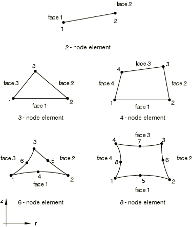

# 28.1.6 轴对称实体单元库


**产品：** Abaqus/Standard  Abaqus/Explicit  Abaqus/CAE  

##### **参考资料**

- ["实体（连续体）单元，" 第28.1.1节](pt06ch28s01alm01.md)
- [*SOLID SECTION](../key/key-link.md#usb-kws-msolidsection)

### 概述

本节提供Abaqus/Standard和Abaqus/Explicit中可用的轴对称实体单元的参考。

### 约定

坐标1是，坐标2是。在处，*r*方向对应全局*x*方向，*z*方向对应全局*y*方向。当数据必须以全局方向给出时，这很重要。坐标1必须大于或等于零。

自由度1是，自由度2是。带扭转的广义轴对称单元具有额外的自由度5，对应扭转角度（弧度）。

Abaqus不会自动对位于对称轴上的节点施加任何边界条件。如果需要，您必须对这些节点施加径向或对称边界条件。

在某些情况下，在Abaqus/Standard中，对于非线性问题，可能有必要对位于对称轴上的节点施加径向边界条件以获得收敛。因此，对于非线性问题，推荐对对称轴上的节点施加径向边界条件。

点载荷和力矩、集中（节点）通量、电流和渗流应给出为沿圆周积分的值（即环上的总值）。

### 单元类型

#### 无扭转的应力/位移单元

| CAX3 | 3节点线性 |
| --- | --- |
|  |

| CAX3H(S) | 3节点线性，恒压混合 |
| --- | --- |
|  |

| CAX4(S) | 4节点双线性 |
| --- | --- |
|  |

| CAX4H(S) | 4节点双线性，恒压混合 |
| --- | --- |
|  |

| CAX4I(S) | 4节点双线性，不兼容模式 |
| --- | --- |
|  |

| CAX4IH(S) | 4节点双线性，不兼容模式，线性压力混合 |
| --- | --- |
|  |

| CAX4R | 4节点双线性，带沙漏控制的减缩积分 |
| --- | --- |
|  |

| CAX4RH(S) | 4节点双线性，带沙漏控制的减缩积分，恒压混合 |
| --- | --- |
|  |

| CAX6(S) | 6节点二次 |
| --- | --- |
|  |

| CAX6H(S) | 6节点二次，线性压力混合 |
| --- | --- |
|  |

| CAX6M | 6节点修正，带沙漏控制 |
| --- | --- |
|  |

| CAX6MH(S) | 6节点修正，带沙漏控制，线性压力混合 |
| --- | --- |
|  |

| CAX8(S) | 8节点双二次 |
| --- | --- |
|  |

| CAX8H(S) | 8节点双二次，线性压力混合 |
| --- | --- |
|  |

| CAX8R(S) | 8节点双二次，减缩积分 |
| --- | --- |
|  |

| CAX8RH(S) | 8节点双二次，减缩积分，线性压力混合 |
| --- | --- |
|  |

##### 活动自由度

1, 2

##### 额外解变量

恒压混合单元有一个与压力相关的额外变量，线性压力混合单元有三个与压力相关的额外变量。

CAX4I和CAX4IH有五个与不兼容模式相关的额外变量。

CAX6M和CAX6MH有两个额外的位移变量。

#### 带扭转的广义轴对称应力/位移单元

| CGAX4(S) | 4节点双线性 |
| --- | --- |
|  |

| CGAX4H(S) | 4节点双线性，恒压混合 |
| --- | --- |
|  |

| CGAX6(S) | 6节点二次 |
| --- | --- |
|  |

| CGAX6H(S) | 6节点二次，线性压力混合 |
| --- | --- |
|  |

| CGAX8(S) | 8节点双二次 |
| --- | --- |
|  |

| CGAX8H(S) | 8节点双二次，线性压力混合 |
| --- | --- |
|  |

##### 活动自由度

除参考节点外的所有节点：1, 2

参考节点：3, 4, 5

##### 额外解变量

恒压混合单元有一个与压力相关的额外变量，线性压力混合单元有三个与压力相关的额外变量。

#### 耦合温度-位移单元

| CAX3T | 3节点线性位移和温度 |
| --- | --- |
|  |

| CAX4T(S) | 4节点双线性位移和温度 |
| --- | --- |
|  |

| CAX4HT(S) | 4节点双线性位移和温度，恒压混合 |
| --- | --- |
|  |

| CAX4RT | 4节点双线性位移和温度，带沙漏控制的减缩积分 |
| --- | --- |
|  |

| CAX4RHT(S) | 4节点双线性位移和温度，带沙漏控制的减缩积分，恒压混合 |
| --- | --- |
|  |

| CAX6MT | 6节点修正位移和温度，带沙漏控制 |
| --- | --- |
|  |

| CAX6MHT(S) | 6节点修正位移和温度，带沙漏控制，恒压混合 |
| --- | --- |
|  |

| CAX8T(S) | 8节点双二次位移，双线性温度 |
| --- | --- |
|  |

| CAX8HT(S) | 8节点双二次位移，双线性温度，线性压力混合 |
| --- | --- |
|  |

| CAX8RT(S) | 8节点双二次位移，双线性温度，减缩积分 |
| --- | --- |
|  |

| CAX8RHT(S) | 8节点双二次位移，双线性温度，减缩积分，线性压力混合 |
| --- | --- |
|  |

##### 活动自由度

角节点：1, 2, 11

Abaqus/Standard中二阶单元的边中节点：1, 2

Abaqus/Standard中修正位移和温度单元的边中节点：1, 2, 11

##### 额外解变量

恒压混合单元有一个与压力相关的额外变量，线性压力混合单元有三个与压力相关的额外变量。

CAX6MT和CAX6MHT有两个额外的位移变量和一个额外的温度变量。

#### 带扭转的广义轴对称耦合温度-位移单元

| CGAX4T(S) | 4节点双线性位移和温度 |
| --- | --- |
|  |

| CGAX4HT(S) | 4节点双线性位移和温度，恒压混合 |
| --- | --- |
|  |

| CGAX6T(S) | 6节点二次位移和温度 |
| --- | --- |
|  |

| CGAX6HT(S) | 6节点二次位移和温度，线性压力混合 |
| --- | --- |
|  |

| CGAX8T(S) | 8节点双二次位移，双线性温度 |
| --- | --- |
|  |

| CGAX8HT(S) | 8节点双二次位移，双线性温度，线性压力混合 |
| --- | --- |
|  |

##### 活动自由度

角节点：1, 2, 11

二阶单元的边中节点：1, 2

修正位移和温度单元的边中节点：1, 2, 11

参考节点：3, 4, 5

##### 额外解变量

恒压混合单元有一个与压力相关的额外变量，线性压力混合单元有三个与压力相关的额外变量。

CGAX6MT和CGAX6MHT有两个额外的位移变量和一个额外的温度变量。

#### 扩散热传递或质量扩散单元

| DCAX3(S) | 3节点线性 |
| --- | --- |
|  |

| DCAX4(S) | 4节点线性 |
| --- | --- |
|  |

| DCAX6(S) | 6节点二次 |
| --- | --- |
|  |

| DCAX8(S) | 8节点双二次 |
| --- | --- |
|  |

##### 活动自由度

11

##### 额外解变量

无。

#### 强制对流热传递单元

| DCCAX4(S) | 4节点 |
| --- | --- |
|  |

| DCCAX4D(S) | 4节点带弥散控制 |
| --- | --- |
|  |

##### 活动自由度

11

##### 额外解变量

无。

#### 耦合热电单元

| DCAX3E(S) | 3节点线性 |
| --- | --- |
|  |

| DCAX4E(S) | 4节点线性 |
| --- | --- |
|  |

| DCAX6E(S) | 6节点二次 |
| --- | --- |
|  |

| DCAX8E(S) | 8节点双二次 |
| --- | --- |
|  |

##### 活动自由度

9, 11

##### 额外解变量

无。

#### 孔隙压力单元

| CAX4P(S) | 4节点双线性位移和孔隙压力 |
| --- | --- |
|  |

| CAX4PH(S) | 4节点双线性位移和孔隙压力，恒压混合 |
| --- | --- |
|  |

| CAX4RP(S) | 4节点双线性位移和孔隙压力，带沙漏控制的减缩积分 |
| --- | --- |
|  |

| CAX4RPH(S) | 4节点双线性位移和孔隙压力，带沙漏控制的减缩积分，恒压混合 |
| --- | --- |
|  |

| CAX6MP(S) | 6节点修正位移和孔隙压力，带沙漏控制 |
| --- | --- |
|  |

| CAX6MPH(S) | 6节点修正位移和孔隙压力，带沙漏控制，线性压力混合 |
| --- | --- |
|  |

| CAX8P(S) | 8节点双二次位移，双线性孔隙压力 |
| --- | --- |
|  |

| CAX8PH(S) | 8节点双二次位移，双线性孔隙压力，线性压力混合 |
| --- | --- |
|  |

| CAX8RP(S) | 8节点双二次位移，双线性孔隙压力，减缩积分 |
| --- | --- |
|  |

| CAX8RPH(S) | 8节点双二次位移，双线性孔隙压力，减缩积分，线性压力混合 |
| --- | --- |
|  |

##### 活动自由度

角节点：1, 2, 8

边中节点：1, 2（CAX6MP和CAX6MPH在边中节点也有自由度8）

##### 额外解变量

恒压混合单元有一个与有效压力应力相关的额外变量，线性压力混合单元有三个与有效压力应力相关的额外变量。

CAX6MP和CAX6MPH有两个额外的位移变量和一个额外的孔隙压力变量。

#### 声学单元

| ACAX3 | 3节点线性 |
| --- | --- |
|  |

| ACAX4(S) | 4节点双线性 |
| --- | --- |
|  |

| ACAX4R(E) | 4节点双线性，带沙漏控制的减缩积分 |
| --- | --- |
|  |

| ACAX6(S) | 6节点二次 |
| --- | --- |
|  |

| ACAX8(S) | 8节点双二次 |
| --- | --- |
|  |

##### 活动自由度

8

##### 额外解变量

无。

#### 压电单元

| CAX3E(S) | 3节点线性 |
| --- | --- |
|  |

| CAX4E(S) | 4节点双线性 |
| --- | --- |
|  |

| CAX6E(S) | 6节点二次 |
| --- | --- |
|  |

| CAX8E(S) | 8节点双二次 |
| --- | --- |
|  |

| CAX8RE(S) | 8节点双二次，减缩积分 |
| --- | --- |
|  |

##### 活动自由度

1, 2, 9

##### 额外解变量

无。

### 所需节点坐标

*r*, *z*

### 单元属性定义

您必须提供单元的厚度；默认假定为单位厚度。

| **输入文件用法：** | ``` [*SOLID SECTION](../key/key-link.md#usb-kws-msolidsection) ``` |
| --- | --- |

| **Abaqus/CAE用法：** | 属性模块：**创建截面**：选择**实体**作为截面**类别**，选择**均匀**作为截面**类型** |
| --- | --- |

### 基于单元的载荷

### 分布载荷

分布载荷可用于所有具有位移自由度的单元。如["分布载荷，" 第34.4.3节"](pt07ch34s04aus122.md)中所述进行指定。

**载荷ID（*DLOAD)：**  BR**Abaqus/CAE载荷/相互作用：**  **体积力****单位：**  [FL3](../popups/usb-int-iconventions-unitsym.md)**描述：**  *r*方向的体积力（径向）。

**载荷ID（*DLOAD)：**  BZ**Abaqus/CAE载荷/相互作用：**  **体积力****单位：**  [FL3](../popups/usb-int-iconventions-unitsym.md)**描述：**  *z*方向的体积力（轴向）。

**载荷ID（*DLOAD)：**  BRNU**Abaqus/CAE载荷/相互作用：**  **体积力****单位：**  [FL3](../popups/usb-int-iconventions-unitsym.md)**描述：**  *r*方向的非均匀体积力（径向），通过用户子程序[`DLOAD`](../sub/sub-link.md#sub-xsl-dload)提供幅值。

**载荷ID（*DLOAD)：**  BZNU**Abaqus/CAE载荷/相互作用：**  **体积力****单位：**  [FL3](../popups/usb-int-iconventions-unitsym.md)**描述：**  *z*方向的非均匀体积力（轴向），通过用户子程序[`DLOAD`](../sub/sub-link.md#sub-xsl-dload)提供幅值。

**载荷ID（*DLOAD)：**  P*n***Abaqus/CAE载荷/相互作用：**  **压力****单位：**  [FL2](../popups/usb-int-iconventions-unitsym.md)**描述：**  面*n*上的压力。

**载荷ID（*DLOAD)：**  P*n*NU**Abaqus/CAE载荷/相互作用：**  不支持**单位：**  [FL2](../popups/usb-int-iconventions-unitsym.md)**描述：**  面*n*上的非均匀压力，通过用户子程序[`DLOAD`](../sub/sub-link.md#sub-xsl-dload)提供幅值。

### 基础

基础可用于Abaqus/Standard中具有位移自由度的单元。如["单元基础，" 第2.2.2节"](pt01ch02s02aus12.md)中所述进行指定。

**载荷ID（*FOUNDATION)：**  F*n*(S)**Abaqus/CAE载荷/相互作用：**  **弹性基础****单位：**  [FL3](../popups/usb-int-iconventions-unitsym.md)**描述：**  面*n*上的弹性基础。

### 分布热通量

分布热通量可用于所有具有温度自由度的单元。如["热载荷，" 第34.4.4节"](pt07ch34s04aus123.md)中所述进行指定。

**载荷ID（*DFLUX)：**  BF**Abaqus/CAE载荷/相互作用：**  **体积热通量****单位：**  [JL3T1](../popups/usb-int-iconventions-unitsym.md)**描述：**  单位体积热体积通量。

**载荷ID（*DFLUX)：**  BFNU(S)**Abaqus/CAE载荷/相互作用：**  **体积热通量****单位：**  [JL3T1](../popups/usb-int-iconventions-unitsym.md)**描述：**  单位体积非均匀热体积通量，通过用户子程序[`DFLUX`](../sub/sub-link.md#sub-xsl-dflux)提供幅值。

**载荷ID（*DFLUX)：**  S*n***Abaqus/CAE载荷/相互作用：**  **表面热通量****单位：**  [JL2T1](../popups/usb-int-iconventions-unitsym.md)**描述：**  单位面积热表面通量，流入面*n*。

**载荷ID（*DFLUX)：**  S*n*NU(S)**Abaqus/CAE载荷/相互作用：**  不支持**单位：**  [JL2T1](../popups/usb-int-iconventions-unitsym.md)**描述：**  单位面积非均匀热表面通量，流入面*n*，通过用户子程序[`DFLUX`](../sub/sub-link.md#sub-xsl-dflux)提供幅值。

### 薄膜条件

薄膜条件可用于所有具有温度自由度的单元。如["热载荷，" 第34.4.4节"](pt07ch34s04aus123.md)中所述进行指定。

**载荷ID（*FILM)：**  F*n***Abaqus/CAE载荷/相互作用：**  **表面薄膜条件****单位：**  [JL2T11](../popups/usb-int-iconventions-unitsym.md)**描述：**  面*n*上提供的膜系数和热沉温度（的单位）。

**载荷ID（*FILM)：**  F*n*NU(S)**Abaqus/CAE载荷/相互作用：**  不支持**单位：**  [JL2T11](../popups/usb-int-iconventions-unitsym.md)**描述：**  面*n*上提供的非均匀膜系数和热沉温度（的单位），通过用户子程序[`FILM`](../sub/sub-link.md#sub-xsl-film)提供幅值。

### 辐射类型

辐射条件可用于所有具有温度自由度的单元。如["热载荷，" 第34.4.4节"](pt07ch34s04aus123.md)中所述进行指定。

**载荷ID（*RADIATE)：**  R*n***Abaqus/CAE载荷/相互作用：**  **表面辐射****单位：**  [无量纲](../popups/usb-int-iconventions-unitsym.md)**描述：**  面*n*上提供的发射率和热沉温度（的单位）。

### 分布流动

分布流动可用于所有具有孔隙压力自由度的单元。如["孔隙流体流动，" 第34.4.7节"](pt07ch34s04aus126.md)中所述进行指定。

**载荷ID（*FLOW)：**  Q*n*(S)**Abaqus/CAE载荷/相互作用：**  不支持**单位：**  [F1L3T1](../popups/usb-int-iconventions-unitsym.md)**描述：**  面*n*上提供的渗流系数和参考汇孔隙压力（[FL2](../popups/usb-int-iconventions-unitsym.md)单位）。

**载荷ID（*FLOW)：**  Q*n*D(S)**Abaqus/CAE载荷/相互作用：**  不支持**单位：**  [F1L3T1](../popups/usb-int-iconventions-unitsym.md)**描述：**  面*n*上提供的仅排水的渗流系数。

**载荷ID（*FLOW)：**  Q*n*NU(S)**Abaqus/CAE载荷/相互作用：**  不支持**单位：**  [F1L3T1](../popups/usb-int-iconventions-unitsym.md)**描述：**  面*n*上提供的非均匀渗流系数和参考汇孔隙压力（[FL2](../popups/usb-int-iconventions-unitsym.md)单位），通过用户子程序[`FLOW`](../sub/sub-link.md#sub-xsl-flow)提供幅值。

**载荷ID（*DFLOW)：**  S*n*(S)**Abaqus/CAE载荷/相互作用：**  **表面孔隙流体****单位：**  [LT1](../popups/usb-int-iconventions-unitsym.md)**描述：**  面*n*上规定的孔隙流体有效速度（从面流出）。

**载荷ID（*DFLOW)：**  S*n*NU(S)**Abaqus/CAE载荷/相互作用：**  不支持**单位：**  [LT1](../popups/usb-int-iconventions-unitsym.md)**描述：**  面*n*上规定的非均匀孔隙流体有效速度（从面流出），通过用户子程序[`DFLOW`](../sub/sub-link.md#sub-xsl-dflow)提供幅值。

### 分布阻抗

分布阻抗可用于所有具有声压自由度的单元。如["声学和冲击载荷，" 第34.4.6节"](pt07ch34s04aus125.md)中所述进行指定。

**载荷ID（*IMPEDANCE)：**  I*n***Abaqus/CAE载荷/相互作用：**  不支持**单位：**  [无](../popups/usb-int-iconventions-unitsym.md)**描述：**  定义面*n*上阻抗的阻抗属性名称。

### 电通量

电通量可用于压电单元。如["压电分析，" 第6.7.2节"](pt03ch06s07at21.md)中所述进行指定。

**载荷ID（*DECHARGE)：**  EBF(S)**Abaqus/CAE载荷/相互作用：**  **体积电荷****单位：**  [CL3](../popups/usb-int-iconventions-unitsym.md)**描述：**  单位体积电荷通量。

**载荷ID（*DECHARGE)：**  ES*n*(S)**Abaqus/CAE载荷/相互作用：**  **表面电荷****单位：**  [CL2](../popups/usb-int-iconventions-unitsym.md)**描述：**  面*n*上规定的表面电荷。

### 分布电流密度

分布电流密度可用于耦合热电单元、耦合热电结构单元和电磁单元。如["耦合热电分析，" 第6.7.3节"](pt03ch06s07at22.md)；["完全耦合热电结构分析，" 第6.7.4节"](pt03ch06s07at23.md)；和["涡流分析，" 第6.7.5节"](pt03ch06s07at24.md)中所述进行指定。

**载荷ID（*DECURRENT)：**  CBF(S)**Abaqus/CAE载荷/相互作用：**  **体积电流****单位：**  [CL3T1](../popups/usb-int-iconventions-unitsym.md)**描述：**  体积电流源密度。

**载荷ID（*DECURRENT)：**  CS*n*(S)**Abaqus/CAE载荷/相互作用：**  **表面电流****单位：**  [CL2T1](../popups/usb-int-iconventions-unitsym.md)**描述：**  面*n*上的电流密度。

### 基于表面的载荷

### 分布载荷

基于表面的分布载荷可用于所有具有位移自由度的单元。如["分布载荷，" 第34.4.3节"](pt07ch34s04aus122.md)中所述进行指定。

**载荷ID（*DSLOAD)：**  P**Abaqus/CAE载荷/相互作用：**  **压力****单位：**  [FL2](../popups/usb-int-iconventions-unitsym.md)**描述：**  单元表面上的压力。

**载荷ID（*DSLOAD)：**  PNU**Abaqus/CAE载荷/相互作用：**  **压力****单位：**  [FL2](../popups/usb-int-iconventions-unitsym.md)**描述：**  单元表面上的非均匀压力，通过用户子程序[`DLOAD`](../sub/sub-link.md#sub-xsl-dload)提供幅值。

### 分布热通量

基于表面的热通量可用于所有具有温度自由度的单元。如["热载荷，" 第34.4.4节"](pt07ch34s04aus123.md)中所述进行指定。

**载荷ID（*DSFLUX)：**  S**Abaqus/CAE载荷/相互作用：**  **表面热通量****单位：**  [JL2T1](../popups/usb-int-iconventions-unitsym.md)**描述：**  单位面积热表面通量，流入单元表面。

**载荷ID（*DSFLUX)：**  SNU(S)**Abaqus/CAE载荷/相互作用：**  **表面热通量****单位：**  [JL2T1](../popups/usb-int-iconventions-unitsym.md)**描述：**  在单元表面上施加的单位面积非均匀热表面通量，通过用户子程序[`DFLUX`](../sub/sub-link.md#sub-xsl-dflux)提供幅值。

### 薄膜条件

基于表面的薄膜条件可用于所有具有温度自由度的单元。如["热载荷，" 第34.4.4节"](pt07ch34s04aus123.md)中所述进行指定。

**载荷ID（*SFILM)：**  F**Abaqus/CAE载荷/相互作用：**  **表面薄膜条件****单位：**  [JL2T11](../popups/usb-int-iconventions-unitsym.md)**描述：**  单元表面上提供的膜系数和热沉温度（的单位）。

**载荷ID（*SFILM)：**  FNU(S)**Abaqus/CAE载荷/相互作用：**  **表面薄膜条件****单位：**  [JL2T11](../popups/usb-int-iconventions-unitsym.md)**描述：**  单元表面上提供的非均匀膜系数和热沉温度（的单位），通过用户子程序[`FILM`](../sub/sub-link.md#sub-xsl-film)提供幅值。

### 辐射类型

基于表面的辐射条件可用于所有具有温度自由度的单元。如["热载荷，" 第34.4.4节"](pt07ch34s04aus123.md)中所述进行指定。

**载荷ID（*SRADIATE)：**  R**Abaqus/CAE载荷/相互作用：**  **表面辐射****单位：**  [无量纲](../popups/usb-int-iconventions-unitsym.md)**描述：**  单元表面上提供的发射率和热沉温度（的单位）。

### 分布流动

基于表面的流动可用于所有具有孔隙压力自由度的单元。如["孔隙流体流动，" 第34.4.7节"](pt07ch34s04aus126.md)中所述进行指定。

**载荷ID（*SFLOW)：**  Q(S)**Abaqus/CAE载荷/相互作用：**  不支持**单位：**  [F1L3T1](../popups/usb-int-iconventions-unitsym.md)**描述：**  单元表面上提供的渗流系数和参考汇孔隙压力（[FL2](../popups/usb-int-iconventions-unitsym.md)单位）。

**载荷ID（*SFLOW)：**  QD(S)**Abaqus/CAE载荷/相互作用：**  不支持**单位：**  [F1L3T1](../popups/usb-int-iconventions-unitsym.md)**描述：**  单元表面上提供的仅排水的渗流系数。

**载荷ID（*SFLOW)：**  QNU(S)**Abaqus/CAE载荷/相互作用：**  不支持**单位：**  [F1L3T1](../popups/usb-int-iconventions-unitsym.md)**描述：**  单元表面上提供的非均匀渗流系数和参考汇孔隙压力（[FL2](../popups/usb-int-iconventions-unitsym.md)单位），通过用户子程序[`FLOW`](../sub/sub-link.md#sub-xsl-flow)提供幅值。

**载荷ID（*DSFLOW)：**  S(S)**Abaqus/CAE载荷/相互作用：**  **表面孔隙流体****单位：**  [LT1](../popups/usb-int-iconventions-unitsym.md)**描述：**  从单元表面流出的规定孔隙流体有效速度。

**载荷ID（*DSFLOW)：**  SNU(S)**Abaqus/CAE载荷/相互作用：**  **表面孔隙流体****单位：**  [LT1](../popups/usb-int-iconventions-unitsym.md)**描述：**  从单元表面流出的非均匀规定孔隙流体有效速度，通过用户子程序[`DFLOW`](../sub/sub-link.md#sub-xsl-dflow)提供幅值。

### 分布阻抗

基于表面的阻抗可用于所有具有声压自由度的单元。如["声学和冲击载荷，" 第34.4.6节"](pt07ch34s04aus125.md)中所述进行指定。

### 入射波载荷

基于表面的入射波载荷可用于所有具有位移自由度或声压自由度的单元。如["声学和冲击载荷，" 第34.4.6节"](pt07ch34s04aus125.md)中所述进行指定。

### 电通量

基于表面的电通量可用于压电单元。如["压电分析，" 第6.7.2节"](pt03ch06s07at21.md)中所述进行指定。

**载荷ID（*DSECHARGE)：**  ES(S)**Abaqus/CAE载荷/相互作用：**  **表面电荷****单位：**  [CL2](../popups/usb-int-iconventions-unitsym.md)**描述：**  单元表面上规定的表面电荷。

### 分布电流密度

基于表面的电流密度可用于耦合热电单元、耦合热电结构单元和电磁单元。如["耦合热电分析，" 第6.7.3节"](pt03ch06s07at22.md)；["完全耦合热电结构分析，" 第6.7.4节"](pt03ch06s07at23.md)；和["涡流分析，" 第6.7.5节"](pt03ch06s07at24.md)中所述进行指定。

**载荷ID（*DSECURRENT)：**  CS(S)**Abaqus/CAE载荷/相互作用：**  **表面电流****单位：**  [CL2T1](../popups/usb-int-iconventions-unitsym.md)**描述：**  施加在单元表面上的电流密度。

### 单元输出

对于大多数单元，输出在全局方向，除非通过截面定义（["方向，" 第2.2.5节"](pt01ch02s02aus15.md)）将局部坐标系分配给单元，在大位移分析中局部坐标系随运动旋转。详情参见["状态存储，" Abaqus理论指南第1.5.4节"](stm/stm-link.md#stm-int-statestorage)。

#### 应力、应变和其他张量分量

应力和其他张量（包括应变张量）可用于具有位移自由度的单元。所有张量具有相同的分量。例如，应力分量如下：

| S11 | ，直接应力（*r*方向）。 |
| --- | --- |

| S22 | ，直接应力（*z*方向）。 |
| --- | --- |

| S33 | ，直接应力（周向）。 |
| --- | --- |

| S12 | ，剪切应力。 |
| --- | --- |

#### 热通量分量

可用于具有温度自由度的单元。

| HFL1 | *r*方向的热通量。 |
| --- | --- |

| HFL2 | *z*方向的热通量。 |
| --- | --- |

#### 孔隙流体速度分量

可用于具有孔隙压力自由度的单元。

| FLVEL1 | *r*方向的孔隙流体有效速度。 |
| --- | --- |

| FLVEL2 | *z*方向的孔隙流体有效速度。 |
| --- | --- |

#### 电势梯度

可用于具有电势自由度的单元。

| EPG1 | *r*方向的电势梯度。 |
| --- | --- |

| EPG2 | *z*方向的电势梯度。 |
| --- | --- |

#### 电通量分量

可用于压电单元。

| EFLX1 | *r*方向的电通量。 |
| --- | --- |

| EFLX2 | *z*方向的电通量。 |
| --- | --- |

#### 电流密度分量

可用于耦合热电单元。

| ECD1 | *r*方向的电流密度。 |
| --- | --- |

| ECD2 | *z*方向的电流密度。 |
| --- | --- |

### 单元上的节点排序和面编号



##### 三角形单元面

| 面1 | 1 -- 2面 |
| --- | --- |
| 面2 | 2 -- 3面 |
| 面3 | 3 -- 1面 |

##### 四边形单元面

| 面1 | 1 -- 2面 |
| --- | --- |
| 面2 | 2 -- 3面 |
| 面3 | 3 -- 4面 |
| 面4 | 4 -- 1面 |

### 用于输出的积分点编号


对于热传递应用，使用不同的积分方案，如["三角形、四面体和棱柱单元，" Abaqus理论指南第3.2.6节"](stm/stm-link.md#stm-elm-tritetwedge)中所述。

