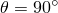
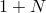
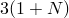

# 28.1.7 具有非线性非对称变形的轴对称实体单元


**产品：** Abaqus/Standard  

##### **参考资料**

- ["选择单元的维度，" 第27.1.2节](pt06ch27s01aus111.md)
- ["实体（连续体）单元，" 第28.1.1节](pt06ch28s01alm01.md)
- [*SOLID SECTION](../key/key-link.md#usb-kws-msolidsection)

### 概述

本节提供Abaqus/Standard中可用的轴对称实体单元的参考。这些单元旨在用于空心体（如管道和压力容器）的分析。它们也可用于建模实体，但在零半径处可能出现虚假应力，特别是施加横向剪切载荷时。

### 约定

坐标1是*r*，坐标2是*z*。参考["选择单元的维度，" 第27.1.2节](pt06ch27s01aus111.md)中的图，*r*方向在平面中对应全局*X*方向，在平面中对应负全局*Z*方向，*z*方向对应全局*Y*方向。坐标1必须大于或等于零。

自由度1是，自由度2是。自由度是内部变量：您无法控制它。

### 单元类型

#### 应力/位移单元

| CAXA4*N* | 双线性，每个*r*–*z*平面4节点Fourier四边形 |
| --- | --- |
|  |

| CAXA4H*N* | 双线性，每个*r*–*z*平面4节点Fourier四边形，恒Fourier压力混合 |
| --- | --- |
|  |

| CAXA4R*N* | 双线性，每个*r*–*z*平面4节点Fourier四边形，*r*–*z*平面减缩积分带沙漏控制 |
| --- | --- |
|  |

| CAXA4RH*N* | 双线性，每个*r*–*z*平面4节点Fourier四边形，*r*–*z*平面减缩积分，恒Fourier压力混合 |
| --- | --- |
|  |

| CAXA8*N* | 双二次，每个*r*–*z*平面8节点Fourier四边形 |
| --- | --- |
|  |

| CAXA8H*N* | 双二次，每个–*z*平面8节点Fourier四边形，线性Fourier压力混合 |
| --- | --- |
|  |

| CAXA8R*N* | 双二次，每个*r*–*z*平面8节点Fourier四边形，*r*–*z*平面减缩积分 |
| --- | --- |
|  |

| CAXA8RH*N* | 双二次，每个*r*–*z*平面8节点Fourier四边形，*r*–*z*平面减缩积分，线性Fourier压力混合 |
| --- | --- |
|  |

##### 活动自由度

1, 2

##### 额外解变量

双线性单元有4*N*个，双二次单元有8*N*个与相关的额外变量。

单元类型CAXA4H*N*和CAXA4RH*N*有个与压力应力相关的额外变量。

单元类型CAXA8H*N*和CAXA8RH*N*有个与压力应力相关的额外变量。

#### 孔隙压力单元

| CAXA8P*N* | 双二次，每个*r*–*z*平面8节点Fourier四边形，双线性Fourier孔隙压力 |
| --- | --- |
|  |

| CAXA8RP*N* | 双二次，每个*r*–*z*平面8节点Fourier四边形，双线性Fourier孔隙压力，*r*–*z*平面减缩积分 |
| --- | --- |
|  |

##### 活动自由度

角节点：1, 2, 8

边中节点：1, 2

##### 额外解变量

8*N*个与相关的额外变量。

### 所需节点坐标

*r*, *z*

### 单元属性定义

您必须提供单元的厚度；默认假定为单位厚度。

| **输入文件用法：** | ``` [*SOLID SECTION](../key/key-link.md#usb-kws-msolidsection) ``` |
| --- | --- |

| **Abaqus/CAE用法：** | 属性模块：**创建截面**：选择**实体**作为截面**类别**，选择**均匀**作为截面**类型** |
| --- | --- |

### 基于单元的载荷

### 分布载荷

分布载荷可用于所有具有位移自由度的单元。如["分布载荷，" 第34.4.3节"](pt07ch34s04aus122.md)中所述进行指定。

**载荷ID（*DLOAD)：**  P*n***Abaqus/CAE载荷/相互作用：**  **压力****单位：**  [FL2](../popups/usb-int-iconventions-unitsym.md)**描述：**  面*n*上的压力。

### 分布热通量

分布热通量可用于所有具有温度自由度的单元。如["热载荷，" 第34.4.4节"](pt07ch34s04aus123.md)中所述进行指定。

**载荷ID（*DFLUX)：**  BF**Abaqus/CAE载荷/相互作用：**  **体积热通量****单位：**  [JL3T1](../popups/usb-int-iconventions-unitsym.md)**描述：**  单位体积热体积通量。

**载荷ID（*DFLUX)：**  BFNU(S)**Abaqus/CAE载荷/相互作用：**  **体积热通量****单位：**  [JL3T1](../popups/usb-int-iconventions-unitsym.md)**描述：**  单位体积非均匀热体积通量，通过用户子程序[`DFLUX`](../sub/sub-link.md#sub-xsl-dflux)提供幅值。

**载荷ID（*DFLUX)：**  S*n***Abaqus/CAE载荷/相互作用：**  **表面热通量****单位：**  [JL2T1](../popups/usb-int-iconventions-unitsym.md)**描述：**  单位面积热表面通量，流入面*n*。

**载荷ID（*DFLUX)：**  S*n*NU(S)**Abaqus/CAE载荷/相互作用：**  不支持**单位：**  [JL2T1](../popups/usb-int-iconventions-unitsym.md)**描述：**  单位面积非均匀热表面通量，流入面*n*，通过用户子程序[`DFLUX`](../sub/sub-link.md#sub-xsl-dflux)提供幅值。

### 薄膜条件

薄膜条件可用于所有具有温度自由度的单元。如["热载荷，" 第34.4.4节"](pt07ch34s04aus123.md)中所述进行指定。

**载荷ID（*FILM)：**  F*n***Abaqus/CAE载荷/相互作用：**  **表面薄膜条件****单位：**  [JL2T11](../popups/usb-int-iconventions-unitsym.md)**描述：**  面*n*上提供的膜系数和热沉温度（的单位）。

**载荷ID（*FILM)：**  F*n*NU(S)**Abaqus/CAE载荷/相互作用：**  不支持**单位：**  [JL2T11](../popups/usb-int-iconventions-unitsym.md)**描述：**  面*n*上提供的非均匀膜系数和热沉温度（的单位），通过用户子程序[`FILM`](../sub/sub-link.md#sub-xsl-film)提供幅值。

### 辐射类型

辐射条件可用于所有具有温度自由度的单元。如["热载荷，" 第34.4.4节"](pt07ch34s04aus123.md)中所述进行指定。

**载荷ID（*RADIATE)：**  R*n***Abaqus/CAE载荷/相互作用：**  **表面辐射****单位：**  [无量纲](../popups/usb-int-iconventions-unitsym.md)**描述：**  面*n*上提供的发射率和热沉温度（的单位）。

### 分布流动

分布流动可用于所有具有孔隙压力自由度的单元。如["孔隙流体流动，" 第34.4.7节"](pt07ch34s04aus126.md)中所述进行指定。

**载荷ID（*FLOW)：**  Q*n*(S)**Abaqus/CAE载荷/相互作用：**  不支持**单位：**  [F1L3T1](../popups/usb-int-iconventions-unitsym.md)**描述：**  面*n*上提供的渗流系数和参考汇孔隙压力（[FL2](../popups/usb-int-iconventions-unitsym.md)单位）。

**载荷ID（*FLOW)：**  Q*n*D(S)**Abaqus/CAE载荷/相互作用：**  不支持**单位：**  [F1L3T1](../popups/usb-int-iconventions-unitsym.md)**描述：**  面*n*上提供的仅排水的渗流系数。

**载荷ID（*FLOW)：**  Q*n*NU(S)**Abaqus/CAE载荷/相互作用：**  不支持**单位：**  [F1L3T1](../popups/usb-int-iconventions-unitsym.md)**描述：**  面*n*上提供的非均匀渗流系数和参考汇孔隙压力（[FL2](../popups/usb-int-iconventions-unitsym.md)单位），通过用户子程序[`FLOW`](../sub/sub-link.md#sub-xsl-flow)提供幅值。

**载荷ID（*DFLOW)：**  S*n*(S)**Abaqus/CAE载荷/相互作用：**  **表面孔隙流体****单位：**  [LT1](../popups/usb-int-iconventions-unitsym.md)**描述：**  面*n*上规定的孔隙流体有效速度（从面流出）。

**载荷ID（*DFLOW)：**  S*n*NU(S)**Abaqus/CAE载荷/相互作用：**  不支持**单位：**  [LT1](../popups/usb-int-iconventions-unitsym.md)**描述：**  面*n*上规定的非均匀孔隙流体有效速度（从面流出），通过用户子程序[`DFLOW`](../sub/sub-link.md#sub-xsl-dflow)提供幅值。

### 基于表面的载荷

### 分布载荷

基于表面的分布载荷可用于所有具有位移自由度的单元。如["分布载荷，" 第34.4.3节"](pt07ch34s04aus122.md)中所述进行指定。

**载荷ID（*DSLOAD)：**  P**Abaqus/CAE载荷/相互作用：**  **压力****单位：**  [FL2](../popups/usb-int-iconventions-unitsym.md)**描述：**  单元表面上的压力。

### 分布热通量

基于表面的热通量可用于所有具有温度自由度的单元。如["热载荷，" 第34.4.4节"](pt07ch34s04aus123.md)中所述进行指定。

**载荷ID（*DSFLUX)：**  S**Abaqus/CAE载荷/相互作用：**  **表面热通量****单位：**  [JL2T1](../popups/usb-int-iconventions-unitsym.md)**描述：**  单位面积热表面通量，流入单元表面。

**载荷ID（*DSFLUX)：**  SNU(S)**Abaqus/CAE载荷/相互作用：**  **表面热通量****单位：**  [JL2T1](../popups/usb-int-iconventions-unitsym.md)**描述：**  在单元表面上施加的单位面积非均匀热表面通量，通过用户子程序[`DFLUX`](../sub/sub-link.md#sub-xsl-dflux)提供幅值。

### 薄膜条件

基于表面的薄膜条件可用于所有具有温度自由度的单元。如["热载荷，" 第34.4.4节"](pt07ch34s04aus123.md)中所述进行指定。

**载荷ID（*SFILM)：**  F**Abaqus/CAE载荷/相互作用：**  **表面薄膜条件****单位：**  [JL2T11](../popups/usb-int-iconventions-unitsym.md)**描述：**  单元表面上提供的膜系数和热沉温度（的单位）。

**载荷ID（*SFILM)：**  FNU(S)**Abaqus/CAE载荷/相互作用：**  **表面薄膜条件****单位：**  [JL2T11](../popups/usb-int-iconventions-unitsym.md)**描述：**  单元表面上提供的非均匀膜系数和热沉温度（的单位），通过用户子程序[`FILM`](../sub/sub-link.md#sub-xsl-film)提供幅值。

### 辐射类型

基于表面的辐射条件可用于所有具有温度自由度的单元。如["热载荷，" 第34.4.4节"](pt07ch34s04aus123.md)中所述进行指定。

**载荷ID（*SRADIATE)：**  R**Abaqus/CAE载荷/相互作用：**  **表面辐射****单位：**  [无量纲](../popups/usb-int-iconventions-unitsym.md)**描述：**  单元表面上提供的发射率和热沉温度（的单位）。

### 分布流动

基于表面的流动可用于所有具有孔隙压力自由度的单元。如["孔隙流体流动，" 第34.4.7节"](pt07ch34s04aus126.md)中所述进行指定。

**载荷ID（*SFLOW)：**  Q(S)**Abaqus/CAE载荷/相互作用：**  不支持**单位：**  [F1L3T1](../popups/usb-int-iconventions-unitsym.md)**描述：**  单元表面上提供的渗流系数和参考汇孔隙压力（[FL2](../popups/usb-int-iconventions-unitsym.md)单位）。

**载荷ID（*SFLOW)：**  QD(S)**Abaqus/CAE载荷/相互作用：**  不支持**单位：**  [F1L3T1](../popups/usb-int-iconventions-unitsym.md)**描述：**  单元表面上提供的仅排水的渗流系数。

**载荷ID（*SFLOW)：**  QNU(S)**Abaqus/CAE载荷/相互作用：**  不支持**单位：**  [F1L3T1](../popups/usb-int-iconventions-unitsym.md)**描述：**  单元表面上提供的非均匀渗流系数和参考汇孔隙压力（[FL2](../popups/usb-int-iconventions-unitsym.md)单位），通过用户子程序[`FLOW`](../sub/sub-link.md#sub-xsl-flow)提供幅值。

**载荷ID（*DSFLOW)：**  S(S)**Abaqus/CAE载荷/相互作用：**  **表面孔隙流体****单位：**  [LT1](../popups/usb-int-iconventions-unitsym.md)**描述：**  从单元表面流出的规定孔隙流体有效速度。

**载荷ID（*DSFLOW)：**  SNU(S)**Abaqus/CAE载荷/相互作用：**  **表面孔隙流体****单位：**  [LT1](../popups/usb-int-iconventions-unitsym.md)**描述：**  从单元表面流出的非均匀规定孔隙流体有效速度，通过用户子程序[`DFLOW`](../sub/sub-link.md#sub-xsl-dflow)提供幅值。

### 单元输出

对于大多数单元，输出在全局方向，除非通过截面定义（["方向，" 第2.2.5节"](pt01ch02s02aus15.md)）将局部坐标系分配给单元，在大位移分析中局部坐标系随运动旋转。详情参见["状态存储，" Abaqus理论指南第1.5.4节"](stm/stm-link.md#stm-int-statestorage)。

#### 应力、应变和其他张量分量

应力和其他张量（包括应变张量）可用于具有位移自由度的单元。所有张量具有相同的分量。例如，应力分量如下：

| S11 | ，直接应力（*r*方向）。 |
| --- | --- |

| S22 | ，直接应力（*z*方向）。 |
| --- | --- |

| S33 | ，直接应力（周向）。 |
| --- | --- |

| S12 | ，剪切应力。 |
| --- | --- |

#### 热通量分量

可用于具有温度自由度的单元。

| HFL1 | *r*方向的热通量。 |
| --- | --- |

| HFL2 | *z*方向的热通量。 |
| --- | --- |

#### 孔隙流体速度分量

可用于具有孔隙压力自由度的单元。

| FLVEL1 | *r*方向的孔隙流体有效速度。 |
| --- | --- |

| FLVEL2 | *z*方向的孔隙流体有效速度。 |
| --- | --- |

### 单元上的节点排序和面编号


对于每个*r*–*z*平面，节点排序遵循常规轴对称单元的约定。每个Fourier模式有两组*r*–*z*平面节点，每组平面中的节点数取决于单元类型和Fourier模式数*N*。

##### 四边形单元面

| 面1 | 1 -- 2面 |
| --- | --- |
| 面2 | 2 -- 3面 |
| 面3 | 3 -- 4面 |
| 面4 | 4 -- 1面 |

