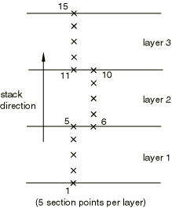

# 28.1.1 实体（连续体）单元


**产品：** Abaqus/Standard  Abaqus/Explicit  Abaqus/CAE  

##### **参考资料**

- ["选择单元的维度，" 第27.1.2节](pt06ch27s01aus111.md)
- ["一维实体（link）单元库，" 第28.1.2节](pt06ch28s01ael01.md)
- ["二维实体单元库，" 第28.1.3节](pt06ch28s01ael02.md)
- ["三维实体单元库，" 第28.1.4节](pt06ch28s01ael03.md)
- ["圆柱实体单元库，" 第28.1.5节](pt06ch28s01ael04.md)
- ["轴对称实体单元库，" 第28.1.6节](pt06ch28s01ael05.md)
- ["具有非线性非对称变形的轴对称实体单元，" 第28.1.7节](pt06ch28s01ael06.md)
- [*SOLID SECTION](../key/key-link.md#usb-kws-msolidsection)
- [*HOURGLASS STIFFNESS](../key/key-link.md#usb-kws-mhourglasstiff)
- ["创建均匀实体截面，" Abaqus/CAE用户指南第12.13.1节](../usi/usi-link.md#usi-prp-section-solid)
- ["创建复合实体截面，" Abaqus/CAE用户指南第12.13.4节](../usi/usi-link.md#usi-prp-section-compsolid)
- ["创建电磁实体截面，" Abaqus/CAE用户指南第12.13.5节](../usi/usi-link.md#usi-prp-section-electromagsolid)
- ["分配材料方向"中的"分配材料方向或钢筋参考方向，" Abaqus/CAE用户指南第12.15.4节](../usi/usi-link.md#usi-prp-assign-matorient)
- [Abaqus/CAE用户指南第23章"复合铺层"](../usi/usi-link.md#usi-adv-layups)

### 概述

实体（连续体）单元：
- 是Abaqus的标准体积单元；
- 不包括梁、壳、薄膜和桁架等结构单元；间隙单元等专用单元；或连接器单元（如连接器、弹簧和阻尼器）；
- 可以由单一均质材料组成，或者在Abaqus/Standard中，可以包含多层不同材料用于层合复合固体的分析；以及
- 如果没有变形，则更准确，特别是对于四边形和六面体。三角形和四面体单元对变形不太敏感。

### 典型应用

Abaqus中的实体（或连续体）单元可用于线性分析和涉及接触、塑性和大变形的复杂非线性分析。它们可用于应力、热传递、声学、耦合热应力、耦合孔隙流体-应力、压电、静磁、电磁和耦合热电分析（参见["为分析类型选择适当的单元，" 第27.1.3节](pt06ch27s01aus112.md)）。

### 选择适当的单元

Abaqus/Standard和Abaqus/Explicit中可用的实体单元库存在一些差异。

**Abaqus/Standard实体单元库**

Abaqus/Standard实体单元库包括一阶（线性）插值单元和二阶（二次）插值单元，适用于一维、二维或三维。三角形和四边形可用于二维；四面体、三角棱柱和六面体（"砖块"）在三维中提供。还提供修正二阶三角形和四面体单元。

曲（抛物线）边缘可用于二次单元，但不推荐用于孔隙压力或耦合温度-位移单元。圆柱单元用于边缘最初为圆形的结构。

此外，在Abaqus/Standard中还提供减缩积分、混合和不兼容模式单元。

基于磁场矢势的边缘插值的电磁单元在二维和三维中都有提供。

**Abaqus/Explicit实体单元库**

Abaqus/Explicit实体单元库包括一阶（线性）插值单元和修正二阶插值单元，适用于二维或三维。三角形和四边形一阶单元在二维中可用；四面体、三角棱柱和六面体（"砖块"）一阶单元在三维中可用。修正二阶单元仅限于三角形和四面体。Abaqus/Explicit中的声学单元仅限于一阶（线性）插值。对于不兼容模式单元，仅三维单元可用。

各种二维模型（平面应力、平面应变、轴对称）在Abaqus/Standard和Abaqus/Explicit中都可用。详情参见["选择单元的维度，" 第27.1.2节](pt06ch27s01aus111.md)。

鉴于可用单元类型的广泛性，为特定应用选择正确的单元非常重要。通过考虑特定单元特性来选择特定分析的单元可以简化：是一阶还是二阶；完全积分还是减缩积分；六面体/四边形还是四面体/三角形；或者是正常、混合或不兼容模式公式。通过仔细考虑这些方面，可以为给定分析选择最佳单元。

#### 在一阶和二阶单元之间选择

在一阶平面应变、广义平面应变、轴对称四边形、六面体实体单元和圆柱单元中，应变算子在整个单元中提供恒定的体积应变。当材料响应近似不可压缩时，这种恒定应变可以防止网格"锁定"（参见["实体等参四边形和六面体，" Abaqus理论指南第3.2.4节](../stm/stm-link.md#stm-elm-solidisoquadhex)，更详细的讨论）。

对于不涉及严重单元变形的"平滑"问题，二阶单元在Abaqus/Standard中比一阶单元提供更高的精度。它们能更有效地捕获应力集中，更适合建模几何特征：可以用更少的单元建模曲面。最后，二阶单元在弯曲主导问题中非常有效。

在应力分析问题中，应尽可能避免使用一阶三角形和四面体单元；这些单元过于刚硬，且随网格细化收敛缓慢，这对于一阶四面体单元尤其是个问题。如果需要它们，可能需要非常细的网格才能获得足够精度的结果。

#### 在完全积分和减缩积分单元之间选择

减缩积分使用较低阶的积分来形成单元刚度。质量矩阵和分布载荷使用完全积分。减缩积分减少了运行时间，尤其是在三维中。例如，单元类型C3D20有27个积分点，而C3D20R只有8个；因此，对于C3D20，单元组装成本大约是C3D20R的3.5倍。

在Abaqus/Standard中，您可以为四边形和六面体（砖块）单元选择完全积分或减缩积分。在Abaqus/Explicit中，您可以为六面体（砖块）单元选择完全积分或减缩积分。在Abaqus/Explicit中，四边形单元仅提供减缩积分一阶单元；具有减缩积分的单元也称为均匀应变或质心应变单元，带有沙漏控制。

Abaqus/Standard中的二阶减缩积分单元通常比相应的完全积分单元获得更准确的结果。然而，对于一阶单元，完全积分与减缩积分所达到的精度在很大程度上取决于问题的性质。

##### 沙漏

沙漏可能是应力/位移分析中一阶减缩积分单元（CPS4R、CAX4R、C3D8R等）的问题。由于这些单元只有一个积分点，它们可能会以某种方式变形，使得在积分点计算的应变都为零，这反过来又会导致网格不受控制的变形。Abaqus中的一阶减缩积分单元包含沙漏控制，但应使用相当细的网格。还可以通过将点载荷和边界条件分布在多个相邻节点上来最小化沙漏。

在Abaqus/Standard中，除了27节点C3D27R和C3D27RH单元外，二阶减缩积分单元没有同样的困难，在解预期平滑的所有情况下都推荐使用。当所有27个节点都存在时，C3D27R和C3D27RH单元有三个未约束的传播沙漏模式。除非通过边界条件充分约束，否则不应将这些单元与所有27个节点一起使用。当预期大应变或非常高的应变梯度时，推荐使用一阶单元。

##### 剪切和体积锁定

Abaqus/Standard和Abaqus/Explicit中的完全积分单元不会产生沙漏，但可能会遭受"锁定"行为：剪切锁定和体积锁定。剪切锁定发生在承受弯曲的一阶完全积分单元（CPS4、CPE4、C3D8等）中。单元的数值公式产生了实际上不存在的剪切应变——即所谓的寄生剪切。因此，这些单元在弯曲中过于刚硬，特别是当单元长度与壁厚相当或更大时。参见["弯曲问题线性分析的连续体和壳单元性能，" Abaqus基准指南第2.3.5节](../bmk/bmk-link.md#bmk-elm-linbending)，了解实体单元弯曲行为的进一步讨论。

当材料行为是（近似）不可压缩时，完全积分单元会发生体积锁定。虚假的压力应力在积分点发展，导致单元对于应该不引起体积变化的变形表现得过于刚硬。如果材料近似不可压缩（塑性应变不可压缩的弹塑性材料），二阶完全积分单元在塑性应变达到弹性应变数量级时开始出现体积锁定。然而，一阶完全积分四边形和六面体使用选择性减缩积分（体积项的减缩积分）。因此，这些单元不会与近似不可压缩材料锁定。减缩积分二阶单元仅在发生显著应变后才接近不可压缩材料时出现体积锁定。在这种情况下，体积锁定通常伴随着看起来像沙漏的模式。通常可以通过在大塑性应变区域细化网格来避免此问题。

如果怀疑存在体积锁定，请检查积分点处的压力应力（打印输出）。如果压力值显示棋盘格模式，从一个积分点到下一个积分点显著变化，则正在发生体积锁定。在Abaqus/CAE的可视化模块中选择被子风格等值线图将显示效果。

#### 指定非默认截面控制

您可以为减缩积分一阶单元（4节点四边形和8节点砖块，一个积分点）指定非默认沙漏控制公式或比例因子。有关截面控制的更多信息，参见["截面控制，" 第27.1.4节](pt06ch27s01aus113.md)。

在Abaqus/Explicit中，截面控制也可用于为8节点砖块单元指定非默认运动学公式、单元公式的精度阶数，以及4节点四边形或8节点砖块单元的变形控制。截面控制也与Abaqus/Explicit中的耦合温度-位移单元一起使用，以更改机械响应分析的默认值。

在Abaqus/Standard中，您可以为减缩积分一阶单元（4节点四边形和8节点砖块，一个积分点）以及修正四面体和三角形单元指定基于默认总刚度方法的非默认沙漏刚度因子。

对于非默认增强沙漏控制公式，没有沙漏刚度因子或比例因子。有关沙漏控制的更多信息，参见["截面控制，" 第27.1.4节](pt06ch27s01aus113.md)。

| **输入文件用法：** | 使用以下两个选项将截面控制定义与单元截面定义相关联： |
| --- | --- |
|  | ``` [*SECTION CONTROLS](../key/key-link.md#usb-kws-msectioncontrols), NAME=*name* [*SOLID SECTION](../key/key-link.md#usb-kws-msolidsection), CONTROLS=*name* ``` 在Abaqus/Standard中使用以下两个选项为总刚度方法指定非默认沙漏刚度因子： ``` [*SOLID SECTION](../key/key-link.md#usb-kws-msolidsection) [*HOURGLASS STIFFNESS](../key/key-link.md#usb-kws-mhourglasstiff) ``` |

| **Abaqus/CAE用法：** | 网格模块：**单元类型**：**单元控制****单元类型**：**沙漏刚度**：**指定** |
| --- | --- |

#### 在砖块/四边形和四面体/三角形之间选择

三角形和四面体单元在几何上用途广泛，用于许多自动网格划分算法。用三角形或四面体网格划分复杂形状非常方便，Abaqus中的二阶和修正三角形和四面体单元（CPE6、CPE6M、C3D10、C3D10M等）适用于一般用途。然而，良好的六面体网格通常以更低的成本提供同等精度的解。四边形和六面体比三角形和四面体具有更好的收敛速率，并且规则网格中对网格方向的敏感性不是问题。然而，三角形和四面体对初始单元形状不太敏感，而一阶四边形和六面体如果形状接近矩形则表现更好。当它们最初变形时，单元的准确性会大大降低（参见["弯曲问题线性分析的连续体和壳单元性能，" Abaqus基准指南第2.3.5节](../bmk/bmk-link.md#bmk-elm-linbending)）。

一阶三角形和四面体通常过于刚硬，需要非常细的网格才能获得准确的结果。如前所述，Abaqus/Standard中的完全积分一阶三角形和四面体在不可压缩问题中也表现出体积锁定。通常，除了作为非关键区域的填充单元外，不应使用这些单元。因此，在感兴趣的区域尝试使用形状良好的单元。

##### 四面体和棱柱单元

对于应力/位移分析，一阶四面体单元C3D4是常应力四面体，应尽可能避免使用；该单元随网格细化收敛缓慢。此单元仅在非常细的网格中提供准确的结果。因此，C3D4仅推荐用于在C3D8或C3D8R单元网格中填充低应力梯度区域，当几何形状阻止在整个模型中使用C3D8或C3D8R单元时。对于四面体单元网格，应使用二阶或修正四面体单元C3D10或C3D10M。

类似地，棱柱单元C3D6的线性版本通常只应在必要时用于完成网格，即使如此，该单元应远离任何需要准确结果的区域。此单元仅在非常细的网格中提供准确的结果。

#### 修正三角形和四面体单元

提供了一族修正的6节点三角形和10节点四面体单元，与一阶三角形和四面体单元相比提供改进的性能，偶尔也比常规二阶三角形和四面体单元提供更好的性能。在Abaqus/Explicit中，这些修正的三角形和四面体单元是唯一可用的6节点三角形和10节点四面体单元。常规二阶三角形和四面体单元在Abaqus/Standard中通常是优选的；但是，当接近不可压缩性时（如大量塑性变形问题中），常规二阶三角形和四面体单元可能出现"体积锁定"。如["Abaqus/Standard中与接触建模相关的常见困难"中的"具有二阶面和节点-表面公式的三维表面"第39.1.2节](pt09ch39s01aus184.md#usb-cni-acontacttrouble-3dsurf)所述，常规二阶四面体单元不能作为具有"硬"接触关系强制执行的节点-表面接触公式的从属表面。这限制通常不重要，因为通常推荐使用表面-表面接触公式和惩罚接触强制。

修正三角形和四面体单元在接触中表现良好，表现出最小的剪切和体积锁定，并且在有限变形期间是稳健的（参见["Hertz接触问题，" Abaqus基准指南第1.1.11节](../bmk/bmk-link.md#bmk-anl-hertzcontact)，和["圆柱坯料的镦粗：耦合温度-位移和绝热分析，" Abaqus示例问题指南第1.3.16节](../exa/exa-link.md#exa-sta-cylbillet)）。这些单元在动态分析中使用集中矩阵公式。修正三角形单元为平面和轴对称分析提供，修正四面体为三维分析提供。此外，在Abaqus/Standard中还为不可压缩和近似不可压缩本构模型提供了这些单元的混合版本。

当选择总刚度方法时，修正四面体和三角形单元（C3D10M、CPS6M、CAX6M等）使用与其内部自由度相关的沙漏控制。这些单元中的沙漏模式通常不会传播；因此，沙漏刚度通常不像一阶单元那样显著。

对于大多数Abaqus/Standard分析模型，可以使用与常规二阶三角形和四面体单元相同的网格密度来修正单元，以获得类似的精度。关于比较结果，参见以下内容：
- ["悬臂梁的几何非线性分析，" Abaqus基准指南第2.1.2节](../bmk/bmk-link.md#bmk-elm-nlgeocantilever)
- ["弯曲问题线性分析的连续体和壳单元性能，" Abaqus基准指南第2.3.5节](../bmk/bmk-link.md#bmk-elm-linbending)
- ["LE1：平面应力单元——椭圆膜，" Abaqus基准指南第4.2.1节](../bmk/bmk-link.md#bmk-nfm-le1)
- ["LE10：压力作用下的厚板，" Abaqus基准指南第4.2.10节](../bmk/bmk-link.md#bmk-nfm-le10)
- ["FV32：锥形膜，" Abaqus基准指南第4.4.7节](../bmk/bmk-link.md#bmk-nfm-fv32)
- ["FV52：简支"实体"方形板，" Abaqus基准指南第4.4.10节](../bmk/bmk-link.md#bmk-nfm-fv52)

然而，在涉及有限变形的薄弯曲情况（参见["加压橡胶圆盘，" Abaqus基准指南第1.1.7节](../bmk/bmk-link.md#bmk-anl-rubberdisk)）和需要准确捕获高弯曲模式的频率分析中（参见["FV41：自由圆柱：轴对称振动，" Abaqus基准指南第4.4.8节](../bmk/bmk-link.md#bmk-nfm-fv41)），修正三角形和四面体单元的网格必须更细化（至少细化一倍半），以达到与常规二阶单元相当的精度。

如果使用增强沙漏控制，在存在大孔隙压力场的耦合孔隙流体扩散和应力分析中，修正单元可能不足以使用。

修正单元在计算上比低阶四边形和六面体更昂贵，有时需要更细化的网格以达到相同的精度水平。然而，在Abaqus/Explicit中，它们作为低阶三角形和四面体的有吸引力的替代方案提供，以利用自动三角形和四面体网格生成器。

##### 与其他单元的兼容性

修正三角形和四面体单元与Abaqus/Standard中的常规二阶实体单元不兼容。因此，不应在网格中与这些单元连接。

##### 表面应力输出

在高应力梯度区域，从积分点外推到节点的应力对于修正单元不如对于类似二阶三角形和四面体单元准确。在需要更准确表面应力的情况下，可以用比底层材料 stiffness显著更低的膜单元覆盖表面。这些膜单元中的应力将更准确地反映表面应力，可用于输出目的。

##### 完全约束的位移

在Abaqus/Standard中，如果修正单元所有节点上的所有位移自由度都受到边界条件约束，则对单元内部的节点应用类似的边界条件。如果随后向此单元施加分布载荷，您定义的节点的报告反力将不会总和施加的载荷，因为一些施加的载荷被未报告反力的内部节点承担。

#### 在常规单元和混合单元之间选择

混合单元主要用于不可压缩和近似不可压缩材料行为；这些单元仅在Abaqus/Standard中可用。当材料响应不可压缩时，问题的解不能用位移历史来表示，因为可以添加纯静水压力而不改变位移。

##### 近似不可压缩材料行为

当体积模量远大于剪切模量时（例如，在泊松比大于0.48的线性弹性材料中），接近不可压缩行为发生在接近不可压缩极限的行为时：非常小的位移变化产生非常大的压力变化。因此，纯基于位移的解太敏感，在数值上无用（例如，计算机舍入可能导致方法失败）。

通过将压力应力作为独立插值的基本解变量处理，从位移解通过本构理论和兼容性条件耦合，从系统中消除了这种奇异行为。压力应力的独立插值是混合单元的基础。混合单元比对应的非混合单元有更多的内部变量，费用略高。参见["混合不可压缩实体单元公式，" Abaqus理论指南第3.2.3节](../stm/stm-link.md#stm-elm-hybridincompress)，了解更多详情。

##### 完全不可压缩材料行为

如果材料完全不可压缩，必须使用混合单元（平面应力情况除外，因为可以通过调整厚度来满足不可压缩约束）。如果材料近似不可压缩且超弹性，仍然推荐使用混合单元。对于近似不可压缩的弹塑性材料和可压缩材料，混合单元的优势不足，因此不应使用。

对于Mises和Hill塑性，塑性变形是完全不可压缩的；因此，当塑性变形开始主导响应时，总变形率变得不可压缩。Abaqus/Standard中的所有四边形和砖块单元可以处理这种率不可压缩条件，除了没有混合公式的完全积分四边形和砖块单元：CPE8、CPEG8、CAX8、CGAX8和C3D20。当材料变得更加不可压缩时，这些单元将"锁定"（变得过度约束）。

##### 混合单元中的弹性应变

混合单元对静水压力使用独立插值，弹性体积应变从压力计算。因此，弹性应变与应力完全一致，但仅在单元平均意义上与总应变一致，即使不存在非弹性应变也是如此。对于各向同性材料，这种行为仅在二阶完全积分混合单元中明显。在这些单元中，静水压力（因此体积应变）在整个单元中线性变化，而总应变可能表现出二次变化。

对于各向异性材料，这种行为也发生在一阶完全积分混合单元中。在这种材料中，体积和偏斜行为之间通常存在强烈的耦合：体积应变将产生偏斜应力，反之，偏斜应变将产生静水压力。因此，在完全积分一阶混合单元中强制执行的恒定静水压力通常不会产生恒定的弹性应变；而总体积应变对于这些单元总是恒定的，如前所述。因此，不建议将混合单元与各向异性材料一起使用，除非材料近似不可压缩，这通常意味着偏斜和体积行为之间的耦合相对较弱。

##### 将混合单元与表现出体积塑性的材料模型一起使用

如果材料模型表现出体积塑性，例如（封顶）Drucker-Prager模型，如果使用二阶混合单元，可能会出现收敛缓慢或收敛问题。在这种情况下，通常可以使用常规（非混合）二阶单元获得良好的结果。

##### 确定对混合单元的需求

对于近似不可压缩材料，显示或多或少均匀但非物理变形模式的位移形状图是网格锁定的指示。如前所述，在这种情况下，应将完全积分单元更改为减缩积分单元。如果已经在使用减缩积分单元，则应增加网格密度。如果问题持续存在，可以使用混合单元。

##### 混合三角形和四面体单元

以下混合三角形、二维和轴对称单元应仅用于网格细化或填充四边形单元网格的区域：CPE3H、CPEG3H、CAX3H和CGAX3H。混合三维四面体单元C3D4H和棱柱单元C3D6H应仅用于网格细化或填充砖块类型单元网格的区域。由于每个C3D6H单元在完全不可压缩问题中引入了一个约束方程，因此仅包含这些单元的网格将受到过度约束。具有不同材料属性的C3D4H单元相邻区域应绑扎而不是共享节点，以允许压力和体积场的间断跳跃。

此外，二阶三维混合单元C3D10H、C3D10MH、C3D15H和C3D15VH比对应的非混合单元昂贵得多。

#### 多用途、改进表面应力可视化的四面体

C3D10I四面体开发用于在粗网格中改进弯曲结果，同时避免金属塑性中的压力锁定以及准不可压缩和不可压缩橡胶弹性。这些单元仅在Abaqus/Standard中可用。一旦材料表现出接近不可压缩极限的行为（即有效泊松比高于0.45），给定单元的内部压力自由度自动激活。C3D10I单元的这一独特特性使其特别适用于金属塑性建模，因为它仅在材料的不可压缩区域激活压力自由度。一旦内部自由度被激活，C3D10I单元比混合或非混合单元具有更多的内部变量，因此更昂贵。此单元还使用独特的11点积分方案，在粗网格中提供卓越的应力可视化方案，因为它避免了从积分点到节点的应力分量外推的误差。

#### 不兼容模式单元

不兼容模式单元（CPS4I、CPE4I、CAX4I、CPEG4I和C3D8I以及相应的混合单元）是经过不兼容模式增强的一阶单元，用于改善其弯曲行为；所有这些单元在Abaqus/Standard中都可用，而C3D8I是唯一在Abaqus/Explicit中可用的单元。

除了标准位移自由度外，单元内部还添加了不兼容变形模式。这些模式的主要作用是消除导致常规一阶位移单元在弯曲中过于刚硬的寄生剪切应力。此外，这些模式消除了弯曲中泊松效应引起的虚假刚化（这在常规位移单元中表现为垂直于弯曲方向的应力线性变化）。在非混合单元中——除了平面应力单元CPS4I——添加了额外的不兼容模式以防止单元在近似不可压缩材料行为时锁定。对于完全不可压缩材料行为，必须使用相应的混合单元。

由于不兼容模式添加了内部自由度（CPS4I为4个；CPE4I、CAX4I和CPEG4I为5个；C3D8I为13个），这些单元比常规一阶位移单元稍昂贵；然而，它们比二阶单元更经济。不兼容模式单元使用完全积分，因此没有沙漏模式。

不兼容模式单元在["具有不兼容模式的连续体单元，" Abaqus理论指南第3.2.5节](../stm/stm-link.md#stm-elm-incompatible)中有更详细的讨论。

##### 形状考虑

如果单元具有近似矩形形状，不兼容模式单元在许多情况下几乎与二阶单元一样出色。如果单元具有平行四边形形状，性能会大大降低。梯形不兼容模式单元的性能并不比常规完全积分一阶插值单元好多少；参见["弯曲问题线性分析的连续体和壳单元性能，" Abaqus基准指南第2.3.5节](../bmk/bmk-link.md#bmk-elm-linbending)，其中说明了与变形单元相关的精度损失。

##### 在大应变应用中使用不兼容模式单元

在涉及大压缩应变的应用中应谨慎使用不兼容模式单元。收敛可能有时会很慢，并且在超弹性应用中可能会累积不准确。因此，在承受复杂变形历史后卸载的超弹性单元中，有时可能会出现错误的残余应力。

##### 将不兼容模式单元与常规单元一起使用

不兼容模式单元可以与常规实体单元一起用于同一网格中。通常，不兼容模式单元应用于必须准确建模弯曲响应的区域，并且应为矩形形状以提供最高的准确性。虽然这些单元在这种情况下通常提供准确的响应，但通常最好使用结构单元（壳或梁）来建模结构部件。

#### 变节点单元

变节点单元（如C3D27和C3D15V）允许在任何单元面上引入面中节点（对于三角棱柱C3D15V，仅限在任何矩形面上）。选择由单元定义中指定的节点做出。这些单元仅在Abaqus/Standard中可用，可在任何三维模型中相当通用地使用。C3D27单元族经常用作裂纹线周围的单元环。

#### 圆柱单元

圆柱单元（CCL9、CCL9H、CCL12、CCL12H、CCL18、CCL18H、CCL24、CCL24H和CCL24RH）仅在Abaqus/Standard中可用，用于精确建模具有圆形几何形状的结构区域，例如轮胎。这些单元利用三角函数沿圆周方向插值位移，并在单元的径向或横截面平面中使用常规等参插值。所有单元在圆周方向使用三个节点，范围从0到180度。提供横截面平面中一阶和二阶插值的单元。

单元的几何形状通过在全球笛卡尔系统中指定节点坐标来定义。默认节点输出也在全球笛卡尔系统中提供。应力、应变和其他材料点输出量的输出默认在固定局部圆柱坐标系中进行，其中方向1是径向方向，方向2是轴向方向，方向3是圆周方向。默认系统从单元的参考构型计算。可以定义替代局部系统（参见["方向，" 第2.2.5节](pt01ch02s02aus15.md)）。在这种情况下，应力、应变和其他材料点量的输出在定向系统中进行。

圆柱单元可以与常规单元一起用于同一网格中。特别地，常规实体单元可以直接连接到圆柱单元横截面平面上的节点。例如，C3D8单元的任何面可以与CCL12单元的横截面面（面1和面2；参见["圆柱实体单元库，" 第28.1.5节](pt06ch28s01ael04.md)，了解单元面的描述）共享节点。常规单元也可以通过基于表面的绑扎约束连接到圆柱单元的圆形边缘（["网格绑扎约束，" 第35.3.1节"](pt08ch35s03aus132.md)），前提是圆柱单元不跨越大段。然而，这种用法可能在绑定表面附近产生虚假的解振荡，当需要该区域的准确解时应该避免。

兼容膜单元（["膜单元，" 第29.1.1节"](pt06ch29s01alm05.md)）和带钢筋的表面单元（["表面单元，" 第32.7.1节"](pt06ch32s07alm52.md)）可用于圆柱实体单元。

所有横截面平面中一阶插值的单元对偏斜项使用完全积分，对体积项使用减缩积分，因此没有沙漏模式，不会与近似不可压缩材料锁定。横截面平面中一阶和二阶插值的混合单元对静水压力使用独立插值。

#### 单元使用建议总结

以下建议适用于Abaqus/Standard和Abaqus/Explicit：
- 使所有单元尽可能"形状良好"以提高收敛性和准确性。
- 如果使用自动四面体网格生成器，请使用二阶单元C3D10（在Abaqus/Standard中）或C3D10M（在Abaqus/Explicit中）。在大塑性变形分析中使用修正四面体单元C3D10M。
- 如果可能，在三维分析中使用六面体单元，因为它们以最低成本提供最佳结果。

Abaqus/Standard用户还应考虑以下建议：
- 对于线性和"平滑"非线性问题，如果可能，请使用减缩积分二阶单元。
- 在应力集中附近使用二阶完全积分单元来捕获这些区域的严重梯度。但是，在材料响应接近不可压缩的有限应变区域中避免这些单元。
- 对于涉及大变形的问题，请使用一阶四边形或六面体单元或修正三角形和四面体单元。如果网格变形严重，请使用减缩积分一阶单元。
- 如果问题涉及弯曲和大变形，请使用细网格的一阶减缩积分单元。
- 如果材料完全不可压缩（使用平面应力单元时除外），必须使用混合单元。对于近似不可压缩材料，在某些情况下也应使用混合单元。
- 在弯曲主导的问题中，不兼容模式单元可以提供非常准确的结果。

### 命名约定

实体单元的命名约定取决于单元维度。

#### 一维、二维、三维和轴对称单元

Abaqus中的一维、二维、三维和轴对称实体单元命名如下：


例如，CAX4R是轴对称连续体应力/位移、4节点、减缩积分单元；CPS8RE是8节点、减缩积分、平面应力压电单元。此命名约定的例外是Abaqus/Explicit中的C3D6和C3D6T，它们是6节点线性三角棱柱减缩积分单元。

孔隙压力单元略微违反此命名约定：混合单元在字母P后面有字母H。例如，CPE8PH是8节点、混合、平面应变、孔隙压力单元。

#### 具有非线性非对称变形的轴对称单元

Abaqus/Standard中具有非线性非对称变形的轴对称实体单元命名如下：


例如，CAXA4RH1是具有一个Fourier模式的4节点、减缩积分、混合、轴对称单元，具有非线性非对称变形（参见["选择单元的维度，" 第27.1.2节](pt06ch27s01aus111.md)）。

#### 圆柱单元

Abaqus/Standard中的圆柱单元命名如下：


例如，CCL24RH是24节点、混合、减缩积分圆柱单元。

### 定义单元的截面属性

实体截面定义用于定义实体单元的截面属性。

在Abaqus/Standard中，实体单元可以由单一均质材料组成，也可以包含多层不同材料用于层合复合固体的分析。在Abaqus/Explicit中，实体单元只能由单一均质材料组成。

#### 定义均匀实体单元

您必须将材料定义（["材料数据定义，" 第21.1.2节"](pt05ch21s01aus109.md)）与实体截面定义相关联。在Abaqus/Standard分析中，使用一个或多个分布（["分布定义，" 第2.8.1节"](pt01ch02s08aus26.md)）定义的空间变化材料行为可以分配给实体截面定义。此外，您必须将截面定义与模型的区域相关联。

在Abaqus/Standard中，如果分配给实体截面定义的任何材料行为（通过材料定义）使用分布定义，则空间变化的材料属性应用于与实体截面关联的所有单元。默认材料行为（如分布所定义）应用于任何未明确包含在关联分布中的单元。

| **输入文件用法：** | ``` [*SOLID SECTION](../key/key-link.md#usb-kws-msolidsection), MATERIAL=*name*, ELSET=*name* ``` |
| --- | --- |
|  | 其中ELSET参数指一组实体单元。 |

| **Abaqus/CAE用法：** | 属性模块：**创建截面**：选择**实体**作为截面**类别**，选择**均匀**或**电磁、实体**作为截面**类型**：**材料：***name*****分配****截面****：选择区域 |
| --- | --- |

##### 分配方向定义

您可以将材料方向定义与实体单元相关联（参见["方向，" 第2.2.5节"](pt01ch02s02aus15.md)）。可以使用分布（["分布定义，" 第2.8.1节"](pt01ch02s08aus26.md)）定义的空间变化局部坐标系可以分配给实体截面定义。

如果分配给实体截面定义的方向定义使用分布，则空间变化的局部坐标系应用于与实体截面关联的所有单元。默认局部坐标系（如分布所定义）应用于任何未明确包含在关联分布中的单元。

| **输入文件用法：** | ``` [*SOLID SECTION](../key/key-link.md#usb-kws-msolidsection), ORIENTATION=*name* ``` |
| --- | --- |

| **Abaqus/CAE用法：** | 属性模块：****分配****材料方向**** |
| --- | --- |

##### 定义几何属性（如需要）

对于某些单元类型，需要额外的几何属性，例如一维单元的横截面积或二维平面单元的厚度。特定单元类型所需的属性在实体单元库中定义。这些属性作为实体截面定义的一部分给出。

#### 在Abaqus/Standard中定义复合实体单元

复合固体的使用仅限于仅具有位移自由度的三维砖块单元（它们不可用于耦合温度-位移单元、压电单元、孔隙压力单元和连续圆柱单元）。复合实体单元主要用于建模方便。它们通常不会比复合壳单元提供更准确的解。

每层的厚度、通过每层数值积分所需的截面点数（如下所述）、材料名称和与每层关联的方向作为复合实体截面定义的一部分指定。在Abaqus/Standard中，可以使用分布（["分布定义，" 第2.8.1节"](pt01ch02s08aus26.md)在层上指定空间变化的方向角。

材料层可以堆叠在三个等参坐标中的任何一个中，平行于等参主单元的相对面，如图28.1.1-1所示。层内任意给定截面点处的积分点数取决于单元类型。图28.1.1-1显示了一个完全积分单元的积分点。

**图28.1.1-1** 堆叠方向以及单元面的关联和在层平面中单元积分点输出变量的位置。


单元面由定义单元时指定节点的顺序定义。

单元矩阵通过数值积分获得。在层的平面中使用高斯积分，在堆叠方向中使用辛普森规则。如果通过层使用一个截面点，它将位于层厚度的中间。层平面中截面点的位置与积分点的位置一致。通过每层厚度的积分所需的截面点数作为实体截面定义的一部分指定；此数字必须是奇数。对于完全积分二阶复合单元，积分点如图28.1.1-1所示，复合实体单元中任意积分点相关的截面点编号如图28.1.1-2所示。

**图28.1.1-2** 三层复合单元中截面点的编号。



每层的厚度在单元内从积分点到积分点可能不是恒定的，因为堆叠方向上的单元尺寸可能不同。因此，通过在实体截面定义中指定堆叠方向上厚度与单元长度的比值来间接定义厚度，如图28.1.1-3所示。使用为所有层定义的比值，实际厚度将在每个积分点确定，使得它们的和等于堆叠方向上的单元长度。层的厚度比不需要反映实际单元或模型尺寸。

**图28.1.1-3**（a）真实空间和（b）等参空间中的层。


除非您的模型相对简单，否则随着层数的增加以及将不同的截面分配给不同的区域，您会发现使用复合实体截面定义模型越来越困难。在添加新层、移除或重新定位现有层后重新定义截面也可能很麻烦。要管理典型复合模型中的大量层，您可能需要使用Abaqus/CAE中的复合铺层功能。有关更多信息，参见[Abaqus/CAE用户指南第23章"复合铺层"](../usi/usi-link.md#usi-adv-layups)。

对于后处理，复合实体单元出现在输出数据库（`.odb`）文件中，单元类型后附加C1、C2或C3，分别表示方向1、2或3的堆叠方向。

| **输入文件用法：** | ``` [*SOLID SECTION](../key/key-link.md#usb-kws-msolidsection), COMPOSITE, STACK DIRECTION=1, 2, or 3, ELSET=*name* *thickness, number of integration points, material name, orientation name* ``` |
| --- | --- |

| **Abaqus/CAE用法：** | Abaqus/CAE使用复合铺层或复合实体截面来定义复合固体的层。 |
| --- | --- |
|  | 对于复合铺层使用以下选项：属性模块：**创建复合铺层**：选择**实体**作为**单元类型**：指定堆叠方向、区域、厚度、积分点数、材料和方向对于复合实体截面使用以下选项：属性模块：**创建截面**：选择**实体**作为截面**类别**，选择**复合**作为截面**类型********分配****材料方向****：选择区域：**使用默认方向或其他方法**：**堆叠方向**：**单元方向1**、**单元方向2**、**单元方向3**或**从方向********分配****截面****：选择区域 |

##### 复合实体单元的输出位置

当请求单元变量的输出时，您可以指定输出变量在层的平面中的位置。例如，您可以请求每层质心处的值。此外，通过提供"截面点"列表来指定通过层厚度的输出点数。输出的默认截面点是第一个和最后一个截面点，分别对应底面和顶面（参见图28.1.1-2）。有关更多信息，参见["输出到数据和结果文件"中的"单元输出"，第4.1.2节"](pt02ch04s01aus39.md#usb-out-oprintfile-elementoutput)，和["输出到输出数据库"中的"单元输出"，第4.1.3节"](pt02ch04s01aus40.md#usb-out-odboutput-elementoutput)。

### 在Abaqus/Standard中使用实体单元建模厚复合层

虽然层合复合固体通常使用壳单元建模，但以下情况需要具有每层一个或多个砖块单元的三维砖块单元：横向剪切效应占主导时；法向应力不能忽略时；以及需要精确的层间应力时，例如在复杂加载或几何形状的局部区域附近。

壳单元比实体单元性能稍好的情况之一是沿厚度建模横向剪切应力。实体单元中的横向剪切应力通常在结构自由表面处不为零，并且在层界面处通常不连续。即使在截面厚度方向使用多个单元进行离散化，这种缺陷也可能存在。由于Abaqus基于线弹性理论计算厚壳单元中的横向剪切应力，因此这种应力通常由厚壳单元比实体单元估算得更好（参见["圆柱弯曲中的复合壳，" Abaqus基准指南第1.1.3节](../bmk/bmk-link.md#bmk-anl-compositeshells)）。

### 在连续体单元上定义压力载荷

连续体单元上压力载荷的约定是，正压力指向单元内部；也就是说，它推动单元。在大应变分析中，对于在边缘承受压力载荷的平面应力单元需要特别考虑；此问题在["分布载荷，" 第34.4.3节"](pt07ch34s04aus122.md)中讨论。

### 在刚体中使用实体单元

所有实体单元都可以包含在刚体定义中。当实体单元分配给刚体时，它们不再可变形，其运动由刚体参考节点的运动控制（参见["刚体定义，" 第2.4.1节"](pt01ch02s04aus22.md)）。

作为刚体一部分的实体单元的截面属性必须定义，以正确计算刚体质量和转动惯量。所有相关材料属性将被忽略，除了密度。分配给刚体的实体单元不可使用单元输出。

### Abaqus/Standard中某些单元类型的自动转换

如果单元类型C3D20和C3D15具有作为节点-表面接触对中从属表面一部分的面，它们会自动转换为相应的变节点单元类型C3D27和C3D15V（参见["在Abaqus/Standard中调整接触控制，" 第36.3.6节"](pt09ch36s03aus150.md)）。

### Abaqus/Standard中各种单元类型的特殊考虑

在Abaqus/Standard中，应力/位移、耦合温度-位移和热传递单元的背景下，应承认以下考虑。

#### 应力/位移单元中温度和场变量的插值

用于计算热应力的积分点处的温度值取决于使用一阶还是二阶单元。在（兼容）线性单元中，积分点使用平均温度，使得热应变在整个单元中恒定；对于具有不兼容模式的单元，温度线性插值。在具有完全积分的高阶单元中使用近似线性变化的温度分布。高阶减缩积分单元不会产生特殊问题，因为温度是线性插值的。给定应力/位移单元中的场变量使用与插值温度相同的方案进行插值。

#### 耦合温度-位移单元中的插值

耦合温度-位移单元对几何形状和位移使用线性或抛物线插值。温度线性插值，但某些规则可能适用于积分点处的温度和场变量评估，如下所述。

对位移和温度使用线性插值的单元在所有节点处都有温度。由于期望热应变与总应变具有相同的插值以避免虚假的静水应力，因此热应变在整个单元中被视为恒定。对于内部能量存储、热传导和塑性耗散（耦合贡献）项，一阶单元使用单独的积分方案。内部能量存储项在节点处积分，得到集中内部能量矩阵，从而提高潜热效应的准确性。在完全积分单元中，热传导和塑性耗散项都在积分点积分。虽然塑性耗散项在每个积分点积分，但机械变形在积分点产生的热量应用于最近的节点。积分点的温度假定为其最近节点的颜色，以与整个公式中温度处理一致。在减缩积分单元中，塑性耗散项在质心处获得，机械变形产生的热量作为加权平均值应用于每个节点。减缩积分单元质心处的温度是节点温度的加权平均值，以与整个公式中温度处理一致。

对位移使用抛物线插值和对温度使用线性插值的单元在所有节点处都有位移自由度，但温度自由度仅存在于角节点。温度线性插值，使得热应变与总应变具有相同的插值。中间节点处的温度仅为输出目的从角节点线性插值计算。与线性耦合单元相反，支配方程中的所有项都使用常规高斯方案积分。对于这些单元，刚度矩阵可以使用完全积分（每个参数方向3个高斯点）或减缩积分（每个参数方向2个高斯点）生成。、比热和电导矩阵始终使用与刚度矩阵相同的积分方案；但是，由于温度的插值阶数较低，这意味着对于热传递矩阵，我们始终使用完全积分方案，即使刚度积分是减缩的。减缩积分使用较低阶积分形成单元刚度：质量矩阵和分布载荷仍然精确积分。减缩积分通常提供更准确的结果（假设单元不变形），并显著减少运行时间，尤其是在三维中。对于二次位移单元，在除预期非常尖锐的应变梯度（如有限应变金属成形应用）外的所有情况下，都推荐使用减缩积分。这些单元被认为是此类中最具成本效益的单元。

积分点处场变量的值取决于使用一阶还是二阶耦合温度-位移单元。在线性单元中，积分点使用平均场变量。在具有完全积分的高阶单元中使用近似线性变化的场变量分布。高阶减缩积分单元不会产生特殊问题，因为场变量是线性插值的。

修正三角形和四面体单元对位移和温度使用特殊的一致插值方案。位移和温度自由度在所有用户定义节点处处于活动状态。

#### 扩散热传递单元中的积分

在所有一阶单元（2节点link、3节点三角形、4节点四边形、4节点四面体、6节点三角棱柱和8节点砖块）中，内部能量存储项（与比热和潜热存储相关）在节点处积分。此积分方案给出对角内部能量矩阵，并提高了潜热效应的准确性。这些单元中的传导贡献和二阶单元中的所有贡献使用常规高斯方案。二阶单元更适合没有潜热效应的平滑问题。

一维单元不能用于质量扩散分析。

#### 强制对流热传递单元

这些单元仅提供线性插值。它们使用"迎风"（Petrov-Galerkin）方法为对流主导问题提供准确解（参见["对流/扩散，" Abaqus理论指南第2.11.3节](../stm/stm-link.md#stm-anl-convectelems)）。因此，内部能量（与比热存储相关）不在节点处积分，这会产生一致内部能量矩阵，如果沿平行于流动方向的边界存在强温度梯度，可能会导致振荡温度。

#### 电磁单元

这些单元仅提供线性边缘插值。用户定义的节点定义单元的几何形状，但不直接参与电磁的插值，或者对于静磁分析，是磁场插值。但是，温度和预定义场变量在用户定义节点处定义，并外推到积分点以评估依赖于温度和预定义场变量的材料特性。

### 在Abaqus/Explicit分析中使用单元类型C3D6和C3D6T

当在Abaqus/Explicit分析中使用单元类型C3D6和C3D6T时，它们在输出数据库（`.odb`）文件中显示为C3D6R和C3D6RT。在数据（`.dat`）文件中，C3D6称为C3D6R。您不能将C3D6R或C3D6RT指定为输入的单元类型。


