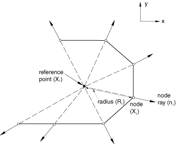
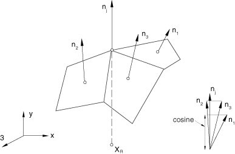

# 28.3.1 无限单元


**产品：** Abaqus/Standard  Abaqus/Explicit  Abaqus/CAE  

##### **参考资料**

- ["无限单元库，" 第28.3.2节](pt06ch28s03ael08.md)
- [*SOLID SECTION](../key/key-link.md#usb-kws-msolidsection)
- ["创建声学无限截面，" Abaqus/CAE用户指南第12.13.17节](../usi/usi-link.md#usi-prp-section-acoustic-infinite)

### 概述

无限单元：
- 用于定义在无界域中的边界值问题，或与周围介质相比感兴趣区域较小的问题；
- 通常与有限单元一起使用；
- 只能具有线性行为；
- 在静态实体连续体分析中提供刚度；以及
- 在动态分析中为有限元模型提供"安静"边界。

实体截面定义用于定义无限单元的截面属性。

### 典型应用

分析人员有时面临定义在无界域中的边界值问题，或与周围介质相比感兴趣区域较小的问题。无限单元旨在与一阶和二阶平面、轴对称和三维有限单元一起用于这种情况。标准有限单元应用于建模感兴趣区域，而无限单元建模远场区域。

### 选择适当的单元

平面应力、平面应变、三维和轴对称无限单元可用。在Abaqus/Standard中还提供减缩积分单元。

单元类型CIN3D18R适用于与Abaqus/Standard中的三维变节点数实体单元C3D15V、C3D27和C3D27R一起使用。

在Abaqus中声学无限单元也可用。

### 命名约定

Abaqus中的无限单元命名如下：


例如，CINAX4是一个4节点、轴对称无限单元。

### 定义单元的截面属性

您使用实体截面定义来定义截面属性。您必须将这些属性与模型的区域相关联。

| **输入文件用法：** | ``` [*SOLID SECTION](../key/key-link.md#usb-kws-msolidsection), ELSET=*name* ``` |
| --- | --- |
|  | 其中ELSET参数指一组无限单元。 |

| **Abaqus/CAE用法：** | 仅在Abaqus/CAE中支持声学无限截面。 |
| --- | --- |
|  | 属性模块：**创建截面**：选择**其他**作为截面**类别**，选择**声学无限**作为截面**类型****分配****截面****：选择区域 |

#### 为平面应变和平面应力单元定义厚度

您将平面应变和平面应力单元的厚度定义为截面定义的一部分。如果不指定厚度，则假定为单位厚度。

| **输入文件用法：** | ``` [*SOLID SECTION](../key/key-link.md#usb-kws-msolidsection) *thickness* ``` |
| --- | --- |

| **Abaqus/CAE用法：** | 在Abaqus/CAE中不支持结构无限截面。 |
| --- | --- |

#### 为声学无限单元定义参考点和厚度

对于声学无限单元，您指定厚度和参考点。厚度在三维和轴对称单元中被忽略。您可以按截面定义上的参考节点（见下文）来规定参考点，或者直接在厚度值后面的数据行上给出其坐标。如果两种方法都使用，则前者优先。如果您根本没有定义参考点，则会发出错误消息。

参考点位置用于确定声学无限单元每个节点处的"半径"和"节点射线"，如图28.3.1-1所示。

**图28.3.1-1** 声学无限单元的参考点和节点射线。



每个节点射线是从参考点到节点方向上的单位矢量。这些半径和射线用于声学无限单元的公式。参考点的放置不是特别关键，只要它位于无限单元包围的有限区域中心附近。如果声学无限单元放置在球体表面上，则参考点的最佳位置是球体中心。

其截面属性使用特定实体截面定义定义的声学无限单元不应与使用不同实体截面定义关联的声学无限单元有任何公共节点。这是为了确保每个声学无限单元节点有唯一的参考点（因此有唯一的"半径"和"节点射线"）。

节点射线用于计算无限单元界面每个节点处的"余弦"值。"余弦"等于单位节点射线与围绕该节点的所有声学无限单元面的单位法线的最小点积（参见图28.3.1-2）。对于"余弦"的负值会发出错误消息。所有声学无限单元节点的"半径"和"余弦"作为节点（模型）数据打印到数据（`.dat`）文件中。这些量如何在公式中使用的详细信息，参见["声学无限单元，" Abaqus理论指南第3.3.2节](../stm/stm-link.md#stm-elm-acousticinfinite)。

**图28.3.1-2** 定义声学无限单元的余弦。



| **输入文件用法：** | ``` [*SOLID SECTION](../key/key-link.md#usb-kws-msolidsection), REF NODE=*node number or node set name* *thickness* ``` |
| --- | --- |

| **Abaqus/CAE用法：** | 属性模块：**创建截面**：选择**其他**作为截面**类别**，选择**声学无限**作为截面**类型**：**平面应力/应变厚度**：*thickness* |
| --- | --- |
|  | 声学无限截面必须分配给具有关联参考点的零件区域。要定义参考点：零件模块或属性模块：****工具****参考点****：选择参考点 |

#### 定义声学无限单元的插值阶数

对于声学无限单元，声学场在无限方向上的变化由一组10个九阶多项式的成员给出的函数给出（更多详细信息，参见["声学无限单元，" Abaqus理论指南第3.3.2节](../stm/stm-link.md#stm-elm-acousticinfinite)）。该组的成员被构造成对应于球的Legendre模式；也就是说，如果无限单元放置在球体上，并且切向细化足够，则*i*阶声学无限单元将吸收与（）阶Legendre模式相关的波。在某些Abaqus/Explicit应用中，使用这组多项式的所有10个成员来解析无限方向上声学场的变化可能涉及显著的计算成本。在这种情况下，您可能只希望包含该组的前几个成员，尽管您应该注意由于使用减少的多项式集合而可能导致精度下降（即声学无限单元的反射增加）的可能性。在Abaqus/Explicit中，您可以指定要使用的九阶多项式的数量*N*。默认情况下，将使用该组的全部10个成员；在Abaqus/Standard中始终使用全部10个。指定小于10的值将导致使用前*N*个成员来建模无限方向上声学场的变化。

