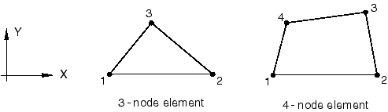
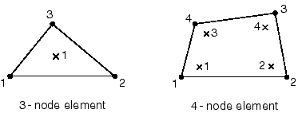

# 28.4.2 翘曲单元库


**产品：** Abaqus/Standard  

##### **参考资料**

- ["网格化梁横截面，" 第10.6.1节](pt04ch10s06at35.md)
- [*SOLID SECTION](../key/key-link.md#usb-kws-msolidsection)

### 概述

本节提供Abaqus/Standard中可用的翘曲单元的参考。

### 单元类型

| WARP2D3 | 3节点线性二维翘曲单元 |
| --- | --- |
|  |

| WARP2D4 | 4节点双线性二维翘曲单元 |
| --- | --- |
|  |

##### 活动自由度

3，表示场外翘曲函数

##### 额外解变量

无。

### 所需节点坐标

*X*、*Y*

### 单元属性定义

| **输入文件用法：** | ``` [*SOLID SECTION](../key/key-link.md#usb-kws-msolidsection) ``` |
| --- | --- |

### 基于单元的载荷

这些单元类型没有载荷。

### 单元输出

这些单元类型没有输出可用。二维翘曲单元用于使用网格化横截面计算梁的场外翘曲函数。可以在Abaqus/CAE的可视化模块中查看此翘曲函数。翘曲函数的导数用于计算由于扭转在积分点处产生的剪切应变和应力。

### 单元上的节点排序



### 用于输出的积分点编号




