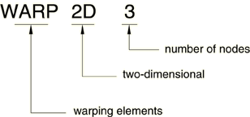

# 28.4.1 翘曲单元


**产品：** Abaqus/Standard  

##### **参考资料**

- ["网格化梁横截面，" 第10.6.1节](pt04ch10s06at35.md)
- [*SOLID SECTION](../key/key-link.md#usb-kws-msolidsection)

### 概述

翘曲单元：
- 用于建模任意形状的梁横截面轮廓，用于Timoshenko梁；
- 与["网格化梁横截面，" 第10.6.1节"](pt04ch10s06at35.md)中所述的梁截面生成过程一起使用；以及
- 仅建模线性弹性行为。

### 典型应用

翘曲单元是专用单元，用于离散化梁横截面的二维模型。这个二维横截面模型在Abaqus/Standard中用于计算翘曲函数的场外分量，以及后续在Abaqus/Standard或Abaqus/Explicit中进行梁分析所需的相关截面刚度和质量特性。应用包括任何整体行为像梁一样的结构，但横截面是非标准的或包含多种材料。例如，用于进行鞭状分析的船舶横截面、翼形转子叶片或机翼的梁模型、层合工字梁等。

### 选择适当的单元

为了网格化任意形状的实体梁横截面，Abaqus/Standard提供两种单元：3节点线性三角形WARP2D3和4节点双线性四边形WARP2D4。横截面网格中相邻单元必须共享公共节点；不允许使用多点约束进行网格细化。

### 命名约定

翘曲单元命名如下：



例如，WARP2D4是二维中的4节点翘曲单元。

### 定义单元的截面属性

您使用实体截面定义来定义截面属性。您必须将这些属性与模型的区域相关联。不需要额外的数据。

| **输入文件用法：** | ``` [*SOLID SECTION](../key/key-link.md#usb-kws-msolidsection), ELSET=*name* ``` |
| --- | --- |
|  | 其中ELSET参数指一组翘曲单元。 |

#### 为一组翘曲单元分配材料定义

您必须将线性弹性材料定义与每个翘曲单元截面定义相关联。可选择，您可以将材料方向定义与截面相关联（参见["方向，" 第2.2.5节"](pt01ch02s02aus15.md)）。

对于翘曲单元，只有各向同性线性弹性（["线性弹性行为"中的"定义各向同性弹性"，第22.2.1节"](pt05ch22s02abm02.md#usb-mat-clinearelastic-isotropic)）或翘曲单元的正交各向异性线性弹性（["线性弹性行为"中的"为翘曲单元定义正交各向异性弹性"，第22.2.1节"](pt05ch22s02abm02.md#usb-mat-clinearelastic-orthowarp)）是有效的材料模型。

| **输入文件用法：** | ``` [*SOLID SECTION](../key/key-link.md#usb-kws-msolidsection), ELSET=*name*, MATERIAL=*name*, ORIENTATION=*name* ``` |
| --- | --- |


