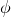

# 29.1.4 轴对称膜单元库


**产品：** Abaqus/Standard  Abaqus/CAE  

##### **参考资料**

- ["膜单元，" 第29.1.1节](pt06ch29s01alm05.md)
- [*MEMBRANE SECTION](../key/key-link.md#usb-kws-mmembranesection)
- [*NODAL THICKNESS](../key/key-link.md#usb-kws-mnodalthickness)

### 概述

本节提供Abaqus/Standard中可用的轴对称膜单元的参考。

### 约定

坐标1是*r*，坐标2是*z*。在处，*r*方向对应全局*X*方向，*z*方向对应全局*Y*方向。当需要全局方向的数据时，这很重要。坐标1应该大于或等于零。

自由度1是，自由度2是。带扭转的广义轴对称单元具有额外的自由度5，对应扭转角度（弧度）。

Abaqus/Standard不会自动对位于对称轴上的节点施加任何边界条件。如果需要，您必须对这些节点施加径向或对称边界条件。

点载荷和力矩应给出为沿圆周积分的值；即环上的总值。

### 单元类型

#### 常规轴对称膜

| MAX1 | 2节点线性，无扭转 |
| --- | --- |
|  |

| MAX2 | 3节点二次，无扭转 |
| --- | --- |
|  |

##### 活动自由度

1, 2

##### 额外解变量

无。

#### 广义轴对称膜

| MGAX1 | 2节点线性，带扭转 |
| --- | --- |
|  |

| MGAX2 | 3节点二次，带扭转 |
| --- | --- |
|  |

##### 活动自由度

 1, 2, 5

##### 额外解变量

无。

### 所需节点坐标

*R*、*Z*

### 单元属性定义

| **输入文件用法：** | ``` [*MEMBRANE SECTION](../key/key-link.md#usb-kws-mmembranesection) ``` |
| --- | --- |
|  | 此外，对于变厚度膜使用以下选项： ``` [*NODAL THICKNESS](../key/key-link.md#usb-kws-mnodalthickness) ``` |

| **Abaqus/CAE用法：** | 属性模块：**创建截面**：选择**壳**作为截面**类别**，选择**膜**作为截面**类型** |
| --- | --- |
|  | 您不能在Abaqus/CAE中定义变厚度膜。 |

### 基于单元的载荷

### 分布载荷

分布载荷如["分布载荷，" 第34.4.3节"](pt07ch34s04aus122.md)中所述进行指定。

**载荷ID（*DLOAD)：**  BR**Abaqus/CAE载荷/相互作用：**  **体积力****单位：**  [FL3](../popups/usb-int-iconventions-unitsym.md)**描述：**  径向（1或*r*）方向的体积力。

**载荷ID（*DLOAD)：**  BZ**Abaqus/CAE载荷/相互作用：**  **体积力****单位：**  [FL3](../popups/usb-int-iconventions-unitsym.md)**描述：**  轴向（2或*z*）方向的体积力。

**载荷ID（*DLOAD)：**  BRNU**Abaqus/CAE载荷/相互作用：**  **体积力****单位：**  [FL3](../popups/usb-int-iconventions-unitsym.md)**描述：**  径向方向的非均匀体积力，通过用户子程序[`DLOAD`](../sub/sub-link.md#sub-xsl-dload)提供幅值。

**载荷ID（*DLOAD)：**  BZNU**Abaqus/CAE载荷/相互作用：**  **体积力****单位：**  [FL3](../popups/usb-int-iconventions-unitsym.md)**描述：**  轴向方向的非均匀体积力，通过用户子程序[`DLOAD`](../sub/sub-link.md#sub-xsl-dload)提供幅值。

**载荷ID（*DLOAD)：**  CENT**Abaqus/CAE载荷/相互作用：**  不支持**单位：**  [FL4 (ML3T2)](../popups/usb-int-iconventions-unitsym.md)**描述：**  离心载荷（幅值输入为，其中是单位体积质量密度，是角速度）。由于仅允许轴对称变形，旋转轴必须是*z*轴。

**载荷ID（*DLOAD)：**  CENTRIF**Abaqus/CAE载荷/相互作用：**  **旋转体积力****单位：**  [T2](../popups/usb-int-iconventions-unitsym.md)**描述：**  离心载荷（幅值输入为，其中是角速度）。由于仅允许轴对称变形，旋转轴必须是*z*轴。

**载荷ID（*DLOAD)：**  CORIO**Abaqus/CAE载荷/相互作用：**  **科里奥利力****单位：**  [FL4T (ML3T1)](../popups/usb-int-iconventions-unitsym.md)**描述：**  科里奥利力（幅值输入为，其中是单位体积质量密度，是角速度）。不适用于轴对称膜单元。

**载荷ID（*DLOAD)：**  GRAV**Abaqus/CAE载荷/相互作用：**  **重力****单位：**  [LT2](../popups/usb-int-iconventions-unitsym.md)**描述：**  指定方向的重力加载（幅值输入为加速度）。

**载荷ID（*DLOAD)：**  HP**Abaqus/CAE载荷/相互作用：**  **压力****单位：**  [FL2](../popups/usb-int-iconventions-unitsym.md)**描述：**  施加到单元参考表面并在全局*Z*中线性的静水压力。压力在正单元法向方向为正。

**载荷ID（*DLOAD)：**  P**Abaqus/CAE载荷/相互作用：**  **压力****单位：**  [FL2](../popups/usb-int-iconventions-unitsym.md)**描述：**  施加到单元参考表面的压力。压力在正单元法向方向为正。

**载荷ID（*DLOAD)：**  PNU**Abaqus/CAE载荷/相互作用：**  **压力****单位：**  [FL2](../popups/usb-int-iconventions-unitsym.md)**描述：**  施加到单元参考表面的非均匀压力，通过用户子程序[`DLOAD`](../sub/sub-link.md#sub-xsl-dload)提供幅值。压力在正单元法向方向为正。

**载荷ID（*DLOAD)：**  ROTA**Abaqus/CAE载荷/相互作用：**  **旋转体积力****单位：**  [T2](../popups/usb-int-iconventions-unitsym.md)**描述：**  旋转加速度载荷（幅值输入为，其中是旋转加速度）。

### 基于表面的载荷

### 分布载荷

基于表面的分布载荷如["分布载荷，" 第34.4.3节"](pt07ch34s04aus122.md)中所述进行指定。

**载荷ID（*DSLOAD)：**  P**Abaqus/CAE载荷/相互作用：**  **压力****单位：**  [FL2](../popups/usb-int-iconventions-unitsym.md)**描述：**  单元表面上的压力。

**载荷ID（*DSLOAD)：**  PNU**Abaqus/CAE载荷/相互作用：**  **压力****单位：**  [FL2](../popups/usb-int-iconventions-unitsym.md)**描述：**  非均匀压力，通过用户子程序[`DLOAD`](../sub/sub-link.md#sub-xsl-dload)提供幅值。

### 单元输出

#### 应力分量

应力可用于具有位移自由度的膜单元。

| S11 | *r*方向的正应力。 |
| --- | --- |

| S22 | *z*方向的正应力。 |
| --- | --- |

| S33 | 周向正应力。 |
| --- | --- |

| S12 | *r*-*z*平面的剪切应力。 |
| --- | --- |

#### 应变分量

应变可用于具有位移自由度的膜单元。

| E11 | *r*方向的正应变。 |
| --- | --- |

| E22 | *z*方向的正应变。 |
| --- | --- |

| E33 | 周向正应变。 |
| --- | --- |

| E12 | *r*-*z*平面的剪切应变。 |
| --- | --- |

### 单元上的节点排序和面编号


##### 单元面

| 面1 | 1 -- 2面 |
| --- | --- |

