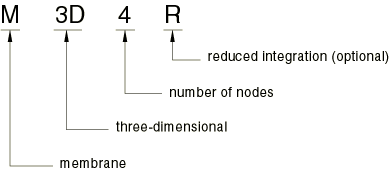
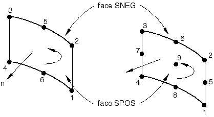

# 29.1.1 膜单元


**产品：** Abaqus/Standard  Abaqus/Explicit  Abaqus/CAE  

##### **参考资料**

- ["通用膜单元库，" 第29.1.2节](pt06ch29s01ael10.md)
- ["圆柱膜单元库，" 第29.1.3节](pt06ch29s01ael11.md)
- ["轴对称膜单元库，" 第29.1.4节](pt06ch29s01ael12.md)
- [*MEMBRANE SECTION](../key/key-link.md#usb-kws-mmembranesection)
- [*NODAL THICKNESS](../key/key-link.md#usb-kws-mnodalthickness)
- [*DISTRIBUTION](../key/key-link.md#usb-kws-mdistribution)
- [*HOURGLASS STIFFNESS](../key/key-link.md#usb-kws-mhourglasstiff)
- ["创建膜截面，" Abaqus/CAE用户指南第12.13.8节](../usi/usi-link.md#usi-prp-section-membrane)

### 概述

膜单元：
- 是仅传递平面内力的表面单元（无力矩）；以及
- 没有弯曲刚度。

### 典型应用

膜单元用于表示空间中提供单元平面内强度的薄表面，但没有弯曲刚度；例如，形成气球的薄橡胶片。此外，它们通常用于表示实体结构中的薄加劲部件，例如连续体中的加固层。（如果加固层由弦组成，应使用钢筋。参见["将钢筋定义为单元属性，" 第2.2.4节"](pt01ch02s02aus14.md)。）

### 选择适当的单元

除Abaqus/Standard和Abaqus/Exclusive中都有的通用膜单元外，圆柱膜单元和轴对称膜单元仅在Abaqus/Standard中可用。

#### 通用膜单元

通用膜单元应用于三维模型，其中结构的变形可以在三个维度上演化。

#### 圆柱膜单元

圆柱膜单元在Abaqus/Standard中可用于精确建模具有圆形几何形状的结构区域，例如轮胎。这些单元利用三角函数沿圆周方向插值位移，并在径向或横截面平面中使用常规等参插值。它们在圆周方向使用三个节点，可以跨越0到180度。提供横截面平面中一阶和二阶插值的单元。

单元的几何形状通过在全球笛卡尔系统中指定节点坐标来定义。默认节点输出也在全球笛卡尔系统中提供。应力、应变和其他材料点量的输出在随平均材料旋转的共旋系统中进行。

圆柱单元可以与常规单元一起用于同一网格。特别地，常规膜单元可以直接连接到圆柱单元横截面边缘上的节点。例如，M3D4单元的任何边缘可以与MCL6单元的横截面边缘共享节点。

兼容的圆柱实体单元（["圆柱实体单元库，" 第28.1.5节"](pt06ch28s01ael04.md)）和带钢筋的表面单元（["表面单元，" 第32.7.1节"](pt06ch32s07alm52.md)）可用于圆柱膜单元。

#### 轴对称膜单元

在Abaqus/Standard中可用的轴对称膜单元分为两类：不允许绕对称轴扭转的单元和允许扭转的单元。这些单元分别称为常规轴对称膜单元和广义轴对称膜单元。

广义轴对称膜单元（带扭转的轴对称膜单元）允许圆周载荷分量或材料各向异性，这可能引起绕对称轴的扭转。圆周载荷分量和材料各向异性均与圆周坐标无关。由于载荷或材料不依赖于圆周坐标，变形是轴对称的。

广义轴对称膜单元不能用于动态或特征频率提取过程。

### 命名约定

膜单元的命名约定取决于单元维度。

#### 通用膜单元

Abaqus中的通用膜单元命名如下：



例如，M3D4R是带减缩积分的三维4节点膜单元。

#### 圆柱膜单元

Abaqus/Standard中的圆柱膜单元命名如下：


例如，MCL6是带圆周插值的6节点圆柱膜单元。

#### 轴对称膜单元

Abaqus/Standard中的轴对称膜单元命名如下：


例如，MAX2是常规轴对称二次插值膜单元。

### 单元法向定义

膜的"顶"表面是沿正法向方向（如下定义）的表面，称为用于接触定义的SPOS面。"底"表面沿法向的负方向，称为用于接触定义的SNEG面。

#### 通用膜单元

对于通用膜单元，正法向方向由绕单元节点的正向定义，按照元素定义中指定的顺序。参见图29.1.1-1。

**图29.1.1-1** 通用膜的正法向。


#### 圆柱膜单元

对于圆柱膜单元，正法向方向由绕单元节点的正向定义，按照元素定义中指定的顺序。参见图29.1.1-2。

**图29.1.1-2** 圆柱膜的正法向。



#### 轴对称膜单元

对于轴对称膜单元，正法向方向由绕单元节点的正向定义，按照元素定义中指定的顺序。参见图29.1.1-3。

**图29.1.1-3** 轴对称膜的正法向。


### 定义膜截面属性

膜截面定义用于定义膜单元的截面属性。

#### 定义均匀膜截面

您必须将材料定义与膜截面定义相关联。您还必须将截面定义与模型区域相关联。

| **输入文件用法：** | ``` [*MEMBRANE SECTION](../key/key-link.md#usb-kws-mmembranesection), MATERIAL=*name*, ELSET=*name* ``` |
| --- | --- |

| **Abaqus/CAE用法：** | 属性模块：**创建截面**：选择**膜**作为截面**类别**，选择**均匀**作为截面**类型**：**材料：***name********分配****截面****：选择区域 |
| --- | --- |

##### 定义厚度

您必须提供单元的厚度；默认假定为单位厚度。

| **输入文件用法：** | ``` [*MEMBRANE SECTION](../key/key-link.md#usb-kws-mmembranesection), MATERIAL=*name*, ELSET=*name* *thickness* ``` |
| --- | --- |

| **Abaqus/CAE用法：** | 属性模块：**创建截面**：选择**膜**作为截面**类别**，选择**均匀**作为截面**类型**：**厚度：***thickness* |
| --- | --- |

##### 定义节点厚度

您可以使用*NODAL THICKNESS*选项在每个节点处定义膜的厚度。节点厚度值在每个分析步骤开始时读取。如果在分析过程中指定了新的节点厚度，新值将在下一个增量步开始时生效。

| **输入文件用法：** | ``` [*NODAL THICKNESS](../key/key-link.md#usb-kws-mnodalthickness) ``` |
| --- | --- |

##### 分配方向定义

您可以将材料方向定义与膜单元相关联（参见["方向，" 第2.2.5节"](pt01ch02s02aus15.md)）。材料方向定义用于定义材料主方向或钢筋方向。

| **输入文件用法：** | ``` [*MEMBRANE SECTION](../key/key-link.md#usb-kws-mmembranesection), MATERIAL=*name*, ELSET=*name*, ORIENTATION=*name* ``` |
| --- | --- |

| **Abaqus/CAE用法：** | 属性模块：****分配****材料方向**** |
| --- | --- |

#### 定义复合膜截面

复合膜截面用于定义多层不同材料的截面。

每层的厚度、材料名称和方向作为复合膜截面定义的一部分指定。每层的属性在截面定义的数据行上定义。

| **输入文件用法：** | ``` [*MEMBRANE SECTION](../key/key-link.md#usb-kws-mmembranesection), COMPOSITE, ELSET=*name* *thickness*, *material name*, *orientation name* ``` |
| --- | --- |

| **Abaqus/CAE用法：** | 属性模块：**创建截面**：选择**膜**作为截面**类别**，选择**复合**作为截面**类型**：**层数：***number of layers********分配****截面****：选择区域 |
| --- | --- |

### 在膜单元上定义压力载荷

膜单元上的压力载荷约定是，正压力指向单元（即推动单元）。负压力从单元拉出。

### 在刚体中使用膜单元

所有膜单元都可以包含在刚体定义中。当膜单元分配给刚体时，它们不再可变形，其运动由刚体参考节点的运动控制（参见["刚体定义，" 第2.4.1节"](pt01ch02s04aus22.md)）。

作为刚体一部分的膜单元的截面属性必须定义，以正确计算刚体质量和转动惯量。所有相关材料属性将被忽略，除了密度。分配给刚体的膜单元不可使用单元输出。

