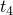
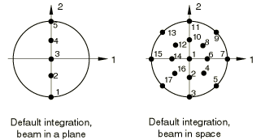
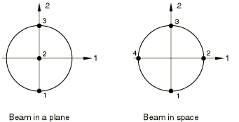
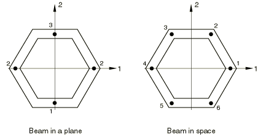
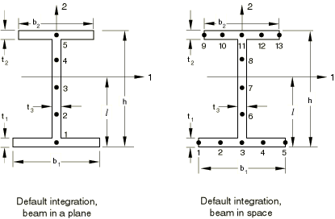
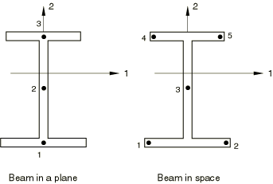
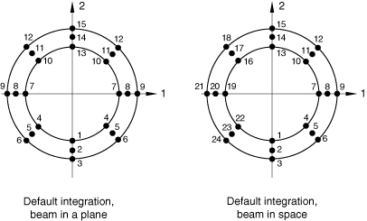
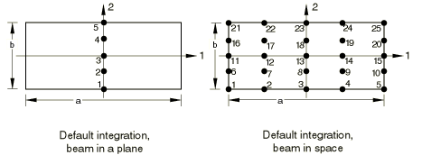
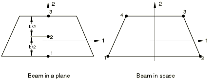

# 29.3.9 梁截面库


**产品：** Abaqus/Standard  Abaqus/Explicit  Abaqus/CAE  

##### **参考**

- ["梁建模：概述，" 第 29.3.1 节](pt06ch29s03abo26.md)
- ["选择梁截面，" 第 29.3.2 节](pt06ch29s03alm07.md)
- ["框架单元，" 第 29.4.1 节](pt06ch29s04alm13.md)
- ["定义截面型材，" Abaqus/CAE 用户指南第 12.2.2 节](../usi/usi-link.md#usi-prp-prop-profile)

### 概述

本节介绍 Abaqus/Standard 和 Abaqus/Explicit 中可用于梁单元的标准梁截面。标准梁截面的一部分可用于 Abaqus/Standard 中的框架单元。通用（非标准）梁截面可以按照["选择梁截面，" 第 29.3.2 节](pt06ch29s03alm07.md)中所述进行定义。

### 任意、薄壁、开和闭口截面


提供任意截面类型是为了允许对简单的任意、薄壁、开和闭口截面进行建模。通过在梁的薄壁截面中定义一系列点来指定截面；然后这些点通过直线段连接，每个直线段沿截面轴线进行数值积分，以便截面可以与非线性材料行为一起使用。每个构成任意截面的段都关联一个独立的厚度。

在使用开口截面梁单元时（仅在 Abaqus/Standard 中可用），会考虑翘曲效应。

| **输入文件用法：** | 使用以下任一选项： |
| --- | --- |
|  | ``` [*BEAM SECTION](../key/key-link.md#usb-kws-mbeamsection), SECTION=ARBITRARY [*BEAM GENERAL SECTION](../key/key-link.md#usb-kws-mbeamgensect), SECTION=ARBITRARY ``` |

| **Abaqus/CAE 用法：** | Property 模块：**Create Profile**：**Arbitrary** |
| --- | --- |

#### 限制

- 任意截面只能用于空间梁（三维模型）。
- 任意截面不应用于定义带分支的闭口截面、多连通闭口截面或断开区域的开口截面。
- 对于任意截面的每个单独段，关于连接段端点的线没有弯曲刚度。因此，任意截面不能仅由一个段组成。

#### 几何输入数据

首先，给出段数、点 *A* 和 *B* 的局部坐标以及连接这两个顶点的段的厚度。然后，给出点 *C* 的局部坐标以及点 *B* 和 *C* 之间段的厚度，接着是点 *D* 的局部坐标以及点 *C* 和 *D* 之间段的厚度，依此类推。任意截面可以包含任意数量的段。截面定义点的所有坐标都在截面的局部 1-2 轴系中给出。

局部 1-2 轴系的原点是梁节点，用于定义截面的该节点位置是任意的：它不一定是质心。

##### 定义闭口截面

通过使起点和终点重合来定义闭口截面。只有单细胞闭口截面可以精确建模。Abaqus 中无法使用带翅片（连接到单元的单个分支）的闭口截面进行建模。

##### 定义具有不连续分支的任意截面

如果任意截面包含不连续截面（分支），则应使用零厚度段从分支的终点返回到后续截面的起点。此零厚度段应始终与非零厚度段重合。关于使用此方法定义的工字截面示例，请参见["梁的屈曲分析，" Abaqus 基准指南第 1.2.1 节](../bmk/bmk-link.md#bmk-anl-beambuckle)。

#### 默认积分

对构成截面的每个段使用三点 Simpson 积分方案。对于更精确的积分，请在截面的每个直线部分指定几个段。

#### 如果使用在分析过程中积分的梁截面，则默认应力输出点

截面的顶点。

#### 在分析过程中积分的梁截面的特定点处的温度和场变量输入

给出截面每个顶点的值（图中点 *A*、*B*、*C*、*D*）。

### 箱形截面

| **输入文件用法：** | 使用以下任一选项： |
| --- | --- |
|  | ``` [*BEAM SECTION](../key/key-link.md#usb-kws-mbeamsection), SECTION=BOX [*BEAM GENERAL SECTION](../key/key-link.md#usb-kws-mbeamgensect), SECTION=BOX [*FRAME SECTION](../key/key-link.md#usb-kws-mframesection), SECTION=BOX ``` |

| **Abaqus/CAE 用法：** | Property 模块：**Create Profile**：**Box** |
| --- | --- |


#### 几何输入数据

*a*, *b*, , , , 

#### 默认积分（Simpson）

平面中的梁：5 个点

空间中的梁：每面墙 5 个点（总共 16 个）

#### 在分析过程中积分的梁截面的非默认积分输入

平面中的梁：给出平行于 2 轴的每面墙中的点数。此数字必须是奇数且大于或等于三。

空间中的梁：给出平行于 2 轴的每面墙中的点数，然后给出平行于 1 轴的每面墙中的点数。两个数字都必须是奇数且大于或等于三。

#### 如果使用在分析过程中积分的梁截面，则默认应力输出点

平面中的梁：底部和顶部（默认积分时分别为上方的点 1 和 5）。

空间中的梁：4 个角点（默认积分时为上方的点 1、5、9 和 13）。

#### 在分析过程中积分的梁截面的特定点处的温度和场变量输入

给出下方所示每个点的值。


#### 框架截面的温度输入

假定整个单元截面温度恒定；因此，每个节点只需要一个温度值。

### 圆形截面

| **输入文件用法：** | 使用以下任一选项： |
| --- | --- |
|  | ``` [*BEAM SECTION](../key/key-link.md#usb-kws-mbeamsection), SECTION=CIRC [*BEAM GENERAL SECTION](../key/key-link.md#usb-kws-mbeamgensect), SECTION=CIRC [*FRAME SECTION](../key/key-link.md#usb-kws-mframesection), SECTION=CIRC ``` |

| **Abaqus/CAE 用法：** | Property 模块：**Create Profile**：**Circular** |
| --- | --- |



#### 几何输入数据

半径

#### 默认积分

平面中的梁：5 个点

空间中的梁：径向 3 个点，周向 8 个点（总共 17 个；梯形法则）。积分点 1 位于梁中心，仅用于输出目的。它对单元的刚度没有贡献；因此，与该点相关的积分点体积（IVOL）为零。

#### 在分析过程中积分的梁截面的非默认积分输入

平面中的梁：最多允许 9 个点。

空间中的梁：给出径向方向的奇数个点，然后给出周向方向的偶数个点。

#### 如果使用在分析过程中积分的梁截面，则默认应力输出点

平面中的梁：底部和顶部（默认积分时分别为上方的点 1 和 5）。

空间中的梁：在与 1 轴和 2 轴的交点处（默认积分时为上方的点 3、7、11 和 15）。

#### 在分析过程中积分的梁截面的特定点处的温度和场变量输入

给出下方所示每个点的值。



#### 框架截面的温度输入

假定整个单元截面温度恒定；因此，每个节点只需要一个温度值。

### 六边形截面

| **输入文件用法：** | 使用以下任一选项： |
| --- | --- |
|  | ``` [*BEAM SECTION](../key/key-link.md#usb-kws-mbeamsection), SECTION=HEX [*BEAM GENERAL SECTION](../key/key-link.md#usb-kws-mbeamgensect), SECTION=HEX ``` |

| **Abaqus/CAE 用法：** | Property 模块：**Create Profile**：**Hexagonal** |
| --- | --- |


#### 几何输入数据

*d*（外接半径），*t*（壁厚）

#### 默认积分（Simpson）

平面中的梁：5 个点

空间中的梁：每个壁段 3 个点（总共 12 个）

#### 在分析过程中积分的梁截面的非默认积分输入

平面中的梁：沿截面壁给出点数，沿第二个梁截面轴方向移动。此数字必须是奇数且大于或等于三。

空间中的梁：给出每个壁段中的点数。此数字必须是奇数且大于或等于三。

#### 如果使用在分析过程中积分的梁截面，则默认应力输出点

平面中的梁：底部和顶部（默认积分时分别为上方的点 1 和 5）。

空间中的梁：顶点（默认积分时为上方的点 1、3、5、7、9 和 11）。

#### 在分析过程中积分的梁截面的特定点处的温度和场变量输入

给出下方所示每个点的值。



### 工字截面

| **输入文件用法：** | 使用以下任一选项： |
| --- | --- |
|  | ``` [*BEAM SECTION](../key/key-link.md#usb-kws-mbeamsection), SECTION=I [*BEAM GENERAL SECTION](../key/key-link.md#usb-kws-mbeamgensect), SECTION=I [*FRAME SECTION](../key/key-link.md#usb-kws-mframesection), SECTION=I ``` |

| **Abaqus/CAE 用法：** | Property 模块：**Create Profile**：**I** |
| --- | --- |



#### 几何输入数据

*l*, *h*, , , , , 

通过允许您指定 *l*，局部横截面轴的原点可以位于对称线（局部 2 轴）上的任何位置。在上图中，*l* 的负值意味着局部横截面轴的原点位于下翼缘下边缘以下，这可能在将梁加劲肋约束到壳体时需要。

##### 定义 T 截面

| **输入文件用法：** | 将  和  或  和  设置为零以建模 T 截面。 |
| --- | --- |

| **Abaqus/CAE 用法：** | Property 模块：**Create Profile**：**T** |
| --- | --- |

#### 默认积分（Simpson）

平面中的梁：5 个点（每个翼缘一个，腹板中三个）

空间中的梁：腹板 5 个点，每个翼缘 5 个点（总共 13 个）

#### 在分析过程中积分的梁截面的非默认积分输入

平面中的梁：给出沿第二个梁截面轴方向的点数。此数字必须是奇数且大于或等于三。

空间中的梁：首先给出下翼缘中的点数，然后在腹板中，最后在上翼缘中。这些数字在每个非消失截面中都必须是不小于三的奇数。

#### 如果使用在分析过程中积分的梁截面，则默认应力输出点

平面中的梁：翼缘（默认积分时分别为上方的点 1 和 5）。

空间中的梁：翼缘末端（默认积分时为上方的点 1、5、9 和 13）。

#### 在分析过程中积分的梁截面的特定点处的温度和场变量输入

给出下方所示每个点的值。



对于空间中的梁，温度首先基于点 1 和 2 的温度以及点 4 和 5 的温度分别在线性地穿过翼缘进行插值。然后通过腹板以抛物线方式进行插值。

#### 框架截面的温度输入

假定整个单元截面温度恒定；因此，每个节点只需要一个温度值。

### 角截面

| **输入文件用法：** | 使用以下任一选项： |
| --- | --- |
|  | ``` [*BEAM SECTION](../key/key-link.md#usb-kws-mbeamsection), SECTION=L [*BEAM GENERAL SECTION](../key/key-link.md#usb-kws-mbeamgensect), SECTION=L ``` |

| **Abaqus/CAE 用法：** | Property 模块：**Create Profile**：**L** |
| --- | --- |


#### 几何输入数据

*a*, *b*, , 

#### 默认积分（Simpson）

平面中的梁：5 个点

空间中的梁：每个翼缘 5 个点（总共 9 个）

#### 在分析过程中积分的梁截面的非默认积分输入

平面中的梁：给出沿第二个梁截面轴方向的点数。此数字必须是奇数且大于或等于三。

空间中的梁：给出沿第一个梁截面轴方向的点数，然后给出沿第二个梁截面轴方向的点数。这些数字都必须是不小于三的奇数。

#### 如果使用在分析过程中积分的梁截面，则默认应力输出点

平面中的梁：底部和顶部（默认积分时分别为上方的点 1 和 5）。

空间中的梁：沿正局部 1 轴的翼缘末端；截面角点；沿正局部 2 轴的翼缘末端（默认积分时为上方的点 1、5 和 9）。

#### 在分析过程中积分的梁截面的特定点处的温度和场变量输入

给出下方所示每个点的值。


### 管道截面（薄壁）

管道横截面可以与梁、管道或框架单元关联。

| **输入文件用法：** | 使用以下任一选项： |
| --- | --- |
|  | ``` [*BEAM SECTION](../key/key-link.md#usb-kws-mbeamsection), SECTION=PIPE [*BEAM GENERAL SECTION](../key/key-link.md#usb-kws-mbeamgensect), SECTION=PIPE [*FRAME SECTION](../key/key-link.md#usb-kws-mframesection), SECTION=PIPE ``` |

| **Abaqus/CAE 用法：** | Property 模块：**Create Profile**：**Pipe**：**Thin walled** |
| --- | --- |


#### 几何输入数据

*r*（外半径），*t*（壁厚）

#### 默认积分

平面中的梁：5 个点（Simpson 法则）

空间中的梁：8 个点（梯形法则）

#### 在分析过程中积分的梁截面的非默认积分输入

平面中的梁：给出一个奇数个点。此数字必须大于或等于五。

空间中的梁：给出一个偶数个点。此数字必须大于或等于八。

#### 如果使用在分析过程中积分的梁截面，则默认应力输出点

平面中的梁：底部和顶部（默认积分时分别为上方的点 1 和 5）。

空间中的梁：在与 1 轴和 2 轴的交点处（默认积分时为上方的点 1、3、5 和 7）。

#### 在分析过程中积分的梁截面的特定点处的温度和场变量输入

给出下方所示每个点的值。


#### 框架截面的温度输入

假定整个单元截面温度恒定；因此，每个节点只需要一个温度值。

### 管道截面（厚壁）

厚壁管道横截面可以与梁或管道单元关联。

| **输入文件用法：** | 使用以下选项： |
| --- | --- |
|  | ``` [*BEAM SECTION](../key/key-link.md#usb-kws-mbeamsection), SECTION=THICK PIPE ``` |

| **Abaqus/CAE 用法：** | Property 模块：**Create Profile**：**Pipe**：**Thick walled** |
| --- | --- |



#### 几何输入数据

*r*（外半径），*t*（壁厚）

#### 默认积分

平面中的梁：径向 3 个点（Simpson 法则），周向 5 个点（梯形法则）

空间中的梁：径向 3 个点（Simpson 法则），周向 8 个点（梯形法则）

#### 在分析过程中积分的梁截面的非默认积分输入

平面中的梁：给出径向方向的奇数个点，然后在周向方向给出奇数个点（大于或等于 5）。

空间中的梁：给出径向方向的奇数个点，然后在周向方向给出偶数个点（大于或等于 8）。

#### 如果使用在分析过程中积分的梁截面，则默认应力输出点

平面中的梁：管道中面底部和顶部（默认积分时分别为上方的点 2 和 14）。

空间中的梁：在管道中面与 1 轴和 2 轴的交点处（默认积分时为上方的点 2、8、14 和 20）。

#### 在分析过程中积分的梁截面的特定点处的温度和场变量输入

给出下方所示每个点的值。


### 矩形截面

| **输入文件用法：** | 使用以下任一选项： |
| --- | --- |
|  | ``` [*BEAM SECTION](../key/key-link.md#usb-kws-mbeamsection), SECTION=RECT [*BEAM GENERAL SECTION](../key/key-link.md#usb-kws-mbeamgensect), SECTION=RECT [*FRAME SECTION](../key/key-link.md#usb-kws-mframesection), SECTION=RECT ``` |

| **Abaqus/CAE 用法：** | Property 模块：**Create Profile**：**Rectangular** |
| --- | --- |



#### 几何输入数据

*a*, *b*

#### 默认积分（Simpson）

平面中的梁：5 个点

空间中的梁：5 × 5（总共 25 个）

#### 在分析过程中积分的梁截面的非默认积分输入

平面中的梁：给出沿第二个梁截面轴方向的点数。此数字必须是奇数且大于或等于五。

空间中的梁：给出沿第一个梁截面轴方向的点数，然后给出沿第二个梁截面轴方向的点数。这些数字都必须是不小于五的奇数。

#### 如果使用在分析过程中积分的梁截面，则默认应力输出点

平面中的梁：底部和顶部（默认积分时分别为上方的点 1 和 5）。

空间中的梁：角点（默认积分时为上方的点 1、5、21 和 25）。

#### 在分析过程中积分的梁截面的特定点处的温度和场变量输入

给出下方所示每个点的值。


#### 框架截面的温度输入

假定整个单元截面温度恒定；因此，每个节点只需要一个温度值。

### 梯形截面

| **输入文件用法：** | 使用以下任一选项： |
| --- | --- |
|  | ``` [*BEAM SECTION](../key/key-link.md#usb-kws-mbeamsection), SECTION=TRAPEZOID [*BEAM GENERAL SECTION](../key/key-link.md#usb-kws-mbeamgensect), SECTION=TRAPEZOID ``` |

| **Abaqus/CAE 用法：** | Property 模块：**Create Profile**：**Trapezoidal** |
| --- | --- |


#### 几何输入数据

*a*, *b*, *c*, *d*

通过允许您指定 *d*，局部横截面轴的原点可以位于对称线（局部 2 轴）上的任何位置。在上图中，*d* 的负值意味着局部横截面轴的原点位于截面下边缘以下。这可能在将梁加劲肋约束到壳体时需要。

#### 默认积分（Simpson）

平面中的梁：5 个点

空间中的梁：5 × 5（总共 25 个）

#### 在分析过程中积分的梁截面的非默认积分输入

平面中的梁：给出沿第二个梁截面轴方向的点数。此数字必须是奇数且大于或等于五。

空间中的梁：给出沿第一个梁截面轴方向的点数，然后给出沿第二个梁截面轴方向的点数。这些数字都必须是不小于五的奇数。

#### 如果使用在分析过程中积分的梁截面，则默认应力输出点

平面中的梁：底部和顶部（默认积分时分别为上方的点 1 和 5）。

空间中的梁：角点（默认积分时为上方的点 1、5、21 和 25）。

#### 在分析过程中积分的梁截面的特定点处的温度和场变量输入

给出下方所示每个点的值。




