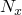
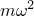
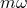
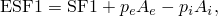

# 29.3.8 梁单元库


**产品：** Abaqus/Standard  Abaqus/Explicit  Abaqus/CAE  

##### **参考**

- ["梁建模：概述，" 第 29.3.1 节](pt06ch29s03abo26.md)
- ["选择梁单元，" 第 29.3.3 节](pt06ch29s03alm08.md)
- [*BEAM GENERAL SECTION](../key/key-link.md#usb-kws-mbeamgensect)
- [*BEAM SECTION](../key/key-link.md#usb-kws-mbeamsection)

### 概述

本节提供 Abaqus/Standard 和 Abaqus/Explicit 中可用梁单元的参考。

### 单元类型

#### 平面中的梁

| B21 | 2 节点线性梁 |
| --- | --- |
|  |

| B21H(S) | 2 节点线性梁，混合公式 |
| --- | --- |
|  |

| B22 | 3 节点二次梁 |
| --- | --- |
|  |

| B22H(S) | 3 节点二次梁，混合公式 |
| --- | --- |
|  |

| B23(S) | 2 节点三次梁 |
| --- | --- |
|  |

| B23H(S) | 2 节点三次梁，混合公式 |
| --- | --- |
|  |

| PIPE21 | 2 节点线性管道 |
| --- | --- |
|  |

| PIPE21H(S) | 2 节点线性管道，混合公式 |
| --- | --- |
|  |

| PIPE22(S) | 3 节点二次管道 |
| --- | --- |
|  |

| PIPE22H(S) | 3 节点二次管道，混合公式 |
| --- | --- |
|  |

##### 激活的自由度

1, 2, 6

##### 附加解变量

所有三次梁单元都有两个与轴向应变相关的附加变量。

线性薄壁管道单元有 1 个附加变量，二次薄壁管道单元有 2 个与环向应变相关的附加变量。线性厚壁管道单元有 2 个附加变量，二次厚壁管道单元有 4 个与环向和径向应变分量相关的附加变量。

混合梁和管道单元有与轴向力和横向剪切力相关的附加变量。线性单元有 2 个，二次单元有 4 个，三次单元有 3 个附加变量。

#### 空间梁

| B31 | 2 节点线性梁 |
| --- | --- |
|  |

| B31H(S) | 2 节点线性梁，混合公式 |
| --- | --- |
|  |

| B32 | 3 节点二次梁 |
| --- | --- |
|  |

| B32H(S) | 3 节点二次梁，混合公式 |
| --- | --- |
|  |

| B33(S) | 2 节点三次梁 |
| --- | --- |
|  |

| B33H(S) | 2 节点三次梁，混合公式 |
| --- | --- |
|  |

| PIPE31 | 2 节点线性管道 |
| --- | --- |
|  |

| PIPE31H(S) | 2 节点线性管道，混合公式 |
| --- | --- |
|  |

| PIPE32(S) | 3 节点二次管道 |
| --- | --- |
|  |

| PIPE32H(S) | 3 节点二次管道，混合公式 |
| --- | --- |
|  |

##### 激活的自由度

1, 2, 3, 4, 5, 6

##### 附加解变量

所有三次梁单元都有两个与轴向应变相关的附加变量。

线性薄壁管道单元有 1 个附加变量，二次薄壁管道单元有 2 个与环向应变相关的附加变量。线性厚壁管道单元有 2 个附加变量，二次厚壁管道单元有 4 个与环向和径向应变分量相关的附加变量。

混合梁和管道单元在线性和二次单元中有与轴向力和横向剪切力相关的附加变量，在三次单元中仅与轴向力相关。线性和三次单元有 3 个，二次单元有 6 个附加变量。

#### 空间开口截面梁

| B31OS(S) | 2 节点线性梁 |
| --- | --- |
|  |

| B31OSH(S) | 2 节点线性梁，混合公式 |
| --- | --- |
|  |

| B32OS(S) | 3 节点二次梁 |
| --- | --- |
|  |

| B32OSH(S) | 3 节点二次梁，混合公式 |
| --- | --- |
|  |

##### 激活的自由度

1, 2, 3, 4, 5, 6, 7

##### 附加解变量

B31OSH 单元类型有 3 个附加变量，B32OSH 单元类型有 6 个与轴向力和横向剪切力相关的附加变量。

### 需要的节点坐标

平面中的梁：*X*, *Y*，还有（可选）, ，法线的方向余弦。

空间中的梁：*X*, *Y*, *Z*，还有（可选）, , ，第二个局部横截面轴的方向余弦。

### 单元属性定义

对于 PIPE 单元，使用管道截面类型指定薄壁管道公式，或使用厚管道截面类型指定厚壁管道公式。PIPE 单元不能使用其他截面类型。

对于开口截面单元，只能使用任意、I、L 和线性广义截面类型。

按照["方向，" 第 2.2.5 节](pt01ch02s02aus15.md)定义的方向不能与梁单元一起使用来定义局部材料方向。空间梁单元截面轴的局部方向在["梁单元截面方向，" 第 29.3.4 节](pt06ch29s03alm09.md)中讨论。

| **输入文件用法：** | 使用以下任一选项： |
| --- | --- |
|  | ``` [*BEAM SECTION](../key/key-link.md#usb-kws-mbeamsection) [*BEAM GENERAL SECTION](../key/key-link.md#usb-kws-mbeamgensect) ``` |

| **Abaqus/CAE 用法：** | Property 模块：**Create Section**：选择 **Beam** 作为 section **Category**，选择 **Beam** 作为 section **Type** |
| --- | --- |

### 基于单元的加载

### 分布载荷

分布载荷如["分布载荷，" 第 34.4.3 节](pt07ch34s04aus122.md)中所述进行指定。

**载荷 ID (*DLOAD)：**  CENT(S)**Abaqus/CAE 载荷/相互作用：**  不支持**单位：**  [FL2 (ML1T2)](../popups/usb-int-iconventions-unitsym.md)**描述：**  离心力（幅度输入为 ，其中 *m* 是单位长度质量， 是角速度）。

**载荷 ID (*DLOAD)：**  CENTRIF(S)**Abaqus/CAE 载荷/相互作用：**  **旋转体力****单位：**  [T2](../popups/usb-int-iconventions-unitsym.md)**描述：**  离心载荷（幅度输入为 ，其中  是角速度）。

**载荷 ID (*DLOAD)：**  CORIO(S)**Abaqus/CAE 载荷/相互作用：**  **科里奥利力****单位：**  [FL2T (ML1T1)](../popups/usb-int-iconventions-unitsym.md)**描述：**  科里奥利力（幅度输入为 ，其中 *m* 是单位长度质量， 是角速度）。直接稳态动力学分析中不考虑科里奥利加载的载荷刚度。

**载荷 ID (*DLOAD)：**  GRAV**Abaqus/CAE 载荷/相互作用：**  **重力****单位：**  [LT2](../popups/usb-int-iconventions-unitsym.md)**描述：**  指定方向的重力加载（幅度输入为加速度）。

**载荷 ID (*DLOAD)：**  PX**Abaqus/CAE 载荷/相互作用：**  **线载荷****单位：**  [FL1](../popups/usb-int-iconventions-unitsym.md)**描述：**  全局 *X* 方向单位长度的力。

**载荷 ID (*DLOAD)：**  PY**Abaqus/CAE 载荷/相互作用：**  **线载荷****单位：**  [FL1](../popups/usb-int-iconventions-unitsym.md)**描述：**  全局 *Y* 方向单位长度的力。

**载荷 ID (*DLOAD)：**  PZ**Abaqus/CAE 载荷/相互作用：**  **线载荷****单位：**  [FL1](../popups/usb-int-iconventions-unitsym.md)**描述：**  全局 *Z* 方向单位长度的力（仅适用于空间中的梁）。

**载荷 ID (*DLOAD)：**  PXNU**Abaqus/CAE 载荷/相互作用：**  **线载荷****单位：**  [FL1](../popups/usb-int-iconventions-unitsym.md)**描述：**  全局 *X* 方向的非均匀单位长度力，幅度通过 Abaqus/Standard 中的用户子程序 [`DLOAD`](../sub/sub-link.md#sub-xsl-dload) 和 Abaqus/Explicit 中的 [`VDLOAD`](../sub/sub-link.md#sub-xsl-vdload) 提供。

**载荷 ID (*DLOAD)：**  PYNU**Abaqus/CAE 载荷/相互作用：**  **线载荷****单位：**  [FL1](../popups/usb-int-iconventions-unitsym.md)**描述：**  全局 *Y* 方向的非均匀单位长度力，幅度通过 Abaqus/Standard 中的用户子程序 [`DLOAD`](../sub/sub-link.md#sub-xsl-dload) 和 Abaqus/Explicit 中的 [`VDLOAD`](../sub/sub-link.md#sub-xsl-vdload) 提供。

**载荷 ID (*DLOAD)：**  PZNU**Abaqus/CAE 载荷/相互作用：**  **线载荷****单位：**  [FL1](../popups/usb-int-iconventions-unitsym.md)**描述：**  全局 *Z* 方向的非均匀单位长度力，幅度通过 Abaqus/Standard 中的用户子程序 [`DLOAD`](../sub/sub-link.md#sub-xsl-dload) 和 Abaqus/Explicit 中的 [`VDLOAD`](../sub/sub-link.md#sub-xsl-vdload) 提供。（仅适用于空间中的梁。）

**载荷 ID (*DLOAD)：**  P1**Abaqus/CAE 载荷/相互作用：**  **线载荷****单位：**  [FL1](../popups/usb-int-iconventions-unitsym.md)**描述：**  梁局部 1 方向单位长度的力（仅适用于空间中的梁）。

**载荷 ID (*DLOAD)：**  P2**Abaqus/CAE 载荷/相互作用：**  **线载荷****单位：**  [FL1](../popups/usb-int-iconventions-unitsym.md)**描述：**  梁局部 2 方向单位长度的力。

**载荷 ID (*DLOAD)：**  P1NU**Abaqus/CAE 载荷/相互作用：**  **线载荷****单位：**  [FL1](../popups/usb-int-iconventions-unitsym.md)**描述：**  梁局部 1 方向的非均匀单位长度力，幅度通过 Abaqus/Standard 中的用户子程序 [`DLOAD`](../sub/sub-link.md#sub-xsl-dload) 和 Abaqus/Explicit 中的 [`VDLOAD`](../sub/sub-link.md#sub-xsl-vdload) 提供。（仅适用于空间中的梁。）

**载荷 ID (*DLOAD)：**  P2NU**Abaqus/CAE 载荷/相互作用：**  **线载荷****单位：**  [FL1](../popups/usb-int-iconventions-unitsym.md)**描述：**  梁局部 2 方向的非均匀单位长度力，幅度通过 Abaqus/Standard 中的用户子程序 [`DLOAD`](../sub/sub-link.md#sub-xsl-dload) 和 Abaqus/Explicit 中的 [`VDLOAD`](../sub/sub-link.md#sub-xsl-vdload) 提供。

**载荷 ID (*DLOAD)：**  ROTA(S)**Abaqus/CAE 载荷/相互作用：**  **旋转体力****单位：**  [T2](../popups/usb-int-iconventions-unitsym.md)**描述：**  旋转加速度载荷（幅度输入为 ，其中  是旋转加速度）。

**载荷 ID (*DLOAD)：**  ROTDYNF(S)**Abaqus/CAE 载荷/相互作用：**  不支持**单位：**  [T1](../popups/usb-int-iconventions-unitsym.md)**描述：**  转子动力学载荷（幅度输入为 ，其中  是角速度）。

#### 

以下载荷类型仅适用于 PIPE 单元：

**载荷 ID (*DLOAD)：**  HPI**Abaqus/CAE 载荷/相互作用：**  **管道压力****单位：**  [FL2](../popups/usb-int-iconventions-unitsym.md)**描述：**  静水内压（闭口条件），随全局 *Z* 坐标线性变化。

**载荷 ID (*DLOAD)：**  HPE**Abaqus/CAE 载荷/相互作用：**  **管道压力****单位：**  [FL2](../popups/usb-int-iconventions-unitsym.md)**描述：**  静水外压（闭口条件），随全局 *Z* 坐标线性变化。

**载荷 ID (*DLOAD)：**  PI**Abaqus/CAE 载荷/相互作用：**  **管道压力****单位：**  [FL2](../popups/usb-int-iconventions-unitsym.md)**描述：**  均匀内压（闭口条件）。

**载荷 ID (*DLOAD)：**  PE**Abaqus/CAE 载荷/相互作用：**  **管道压力****单位：**  [FL2](../popups/usb-int-iconventions-unitsym.md)**描述：**  均匀外压（闭口条件）。

**载荷 ID (*DLOAD)：**  PENU**Abaqus/CAE 载荷/相互作用：**  **管道压力****单位：**  [FL2](../popups/usb-int-iconventions-unitsym.md)**描述：**  非均匀外压（闭口条件），幅度通过用户子程序 [`DLOAD`](../sub/sub-link.md#sub-xsl-dload) 提供。

**载荷 ID (*DLOAD)：**  PINU**Abaqus/CAE 载荷/相互作用：**  **管道压力****单位：**  [FL2](../popups/usb-int-iconventions-unitsym.md)**描述：**  非均匀内压（闭口条件），幅度通过用户子程序 [`DLOAD`](../sub/sub-link.md#sub-xsl-dload) 提供。

### Abaqus/Aqua 载荷

Abaqus/Aqua 载荷如["Abaqus/Aqua 分析，" 第 6.11.1 节](pt03ch06s11at30.md)中所述进行指定。它们不适用于开口截面梁，也不适用于定义为因浸入流体而产生额外惯性的梁（见["梁截面行为，" 第 29.3.5 节中的"浸入流体产生的额外惯性"](pt06ch29s03alm10.md#usb-elm-ebeamsectionbehavior-fluidinertia)）。

**载荷 ID (*CLOAD/ *DLOAD)：**  FDD**Abaqus/CAE 载荷/相互作用：**  不支持**单位：**  [FL1](../popups/usb-int-iconventions-unitsym.md)**描述：**  横向流体阻力载荷。

**载荷 ID (*CLOAD/ *DLOAD)：**  FD1**Abaqus/CAE 载荷/相互作用：**  不支持**单位：**  [F](../popups/usb-int-iconventions-unitsym.md)**描述：**  梁第一端（节点 1）上的流体阻力。

**载荷 ID (*CLOAD/ *DLOAD)：**  FD2**Abaqus/CAE 载荷/相互作用：**  不支持**单位：**  [F](../popups/usb-int-iconventions-unitsym.md)**描述：**  梁第二端（节点 2 或节点 3）上的流体阻力。

**载荷 ID (*CLOAD/ *DLOAD)：**  FDT**Abaqus/CAE 载荷/相互作用：**  不支持**单位：**  [FL1](../popups/usb-int-iconventions-unitsym.md)**描述：**  切向流体阻力载荷。

**载荷 ID (*CLOAD/ *DLOAD)：**  FI**Abaqus/CAE 载荷/相互作用：**  不支持**单位：**  [FL1](../popups/usb-int-iconventions-unitsym.md)**描述：**  横向流体惯性载荷。

**载荷 ID (*CLOAD/ *DLOAD)：**  FI1**Abaqus/CAE 载荷/相互作用：**  不支持**单位：**  [F](../popups/usb-int-iconventions-unitsym.md)**描述：**  梁第一端（节点 1）上的流体惯性力。

**载荷 ID (*CLOAD/ *DLOAD)：**  FI2**Abaqus/CAE 载荷/相互作用：**  不支持**单位：**  [F](../popups/usb-int-iconventions-unitsym.md)**描述：**  梁第二端（节点 2 或节点 3）上的流体惯性力。

**载荷 ID (*CLOAD/ *DLOAD)：**  PB**Abaqus/CAE 载荷/相互作用：**  不支持**单位：**  [FL1](../popups/usb-int-iconventions-unitsym.md)**描述：**  浮力载荷（闭口条件）。

**载荷 ID (*CLOAD/ *DLOAD)：**  WDD**Abaqus/CAE 载荷/相互作用：**  不支持**单位：**  [FL1](../popups/usb-int-iconventions-unitsym.md)**描述：**  横向风力载荷。

**载荷 ID (*CLOAD/ *DLOAD)：**  WD1**Abaqus/CAE 载荷/相互作用：**  不支持**单位：**  [F](../popups/usb-int-iconventions-unitsym.md)**描述：**  梁第一端（节点 1）上的风力。

**载荷 ID (*CLOAD/ *DLOAD)：**  WD2**Abaqus/CAE 载荷/相互作用：**  不支持**单位：**  [F](../popups/usb-int-iconventions-unitsym.md)**描述：**  梁第二端（节点 2 或节点 3）上的风力。

### 基础

基础仅在 Abaqus/Standard 中可用，如["单元基础，" 第 2.2.2 节](pt01ch02s02aus12.md)中所述进行指定。

**载荷 ID (*FOUNDATION)：**  FX(S)**Abaqus/CAE 载荷/相互作用：**  不支持**单位：**  [FL2](../popups/usb-int-iconventions-unitsym.md)**描述：**  全局 *X* 方向单位长度的刚度。

**载荷 ID (*FOUNDATION)：**  FY(S)**Abaqus/CAE 载荷/相互作用：**  不支持**单位：**  [FL2](../popups/usb-int-iconventions-unitsym.md)**描述：**  全局 *Y* 方向单位长度的刚度。

**载荷 ID (*FOUNDATION)：**  FZ(S)**Abaqus/CAE 载荷/相互作用：**  不支持**单位：**  [FL2](../popups/usb-int-iconventions-unitsym.md)**描述：**  全局 *Z* 方向单位长度的刚度（仅适用于空间中的梁）。

**载荷 ID (*FOUNDATION)：**  F1(S)**Abaqus/CAE 载荷/相互作用：**  不支持**单位：**  [FL2](../popups/usb-int-iconventions-unitsym.md)**描述：**  梁局部 *1* 方向单位长度的刚度（仅适用于空间中的梁）。

**载荷 ID (*FOUNDATION)：**  F2(S)**Abaqus/CAE 载荷/相互作用：**  不支持**单位：**  [FL2](../popups/usb-int-iconventions-unitsym.md)**描述：**  梁局部 *2* 方向单位长度的刚度。

### 基于面的加载

### 分布载荷

基于面的分布载荷如["分布载荷，" 第 34.4.3 节](pt07ch34s04aus122.md)中所述进行指定。

**载荷 ID (*DSLOAD)：**  P**Abaqus/CAE 载荷/相互作用：**  **压力****单位：**  [FL1](../popups/usb-int-iconventions-unitsym.md)**描述：**  梁局部 2 方向单位长度的力。分布表面力在曲面法线的相反方向为正。

**载荷 ID (*DSLOAD)：**  PNU**Abaqus/CAE 载荷/相互作用：**  **压力****单位：**  [FL1](../popups/usb-int-iconventions-unitsym.md)**描述：**  梁局部 2 方向的非均匀单位长度力，幅度通过 Abaqus/Standard 中的用户子程序 [`DLOAD`](../sub/sub-link.md#sub-xsl-dload) 和 Abaqus/Explicit 中的 [`VDLOAD`](../sub/sub-link.md#sub-xsl-vdload) 提供。分布表面力在曲面法线的相反方向为正。

### 入射波加载

入射波加载也可用于这些单元，但有一些限制。见["声学和冲击载荷，" 第 34.4.6 节](pt07ch34s04aus125.md)。

### 单元输出

有关梁单元输出位置的说明，请参见["梁截面库，" 第 29.3.9 节](pt06ch29s03abm01.md)。

#### 应力、应变和其他张量分量

应力和其他张量（包括应变张量）可用于具有位移自由度的单元。除网格化截面外，所有张量具有相同的分量。例如，应力分量如下：

| S11 | 轴向应力。 |
| --- | --- |

| S22 | 环向应力（仅适用于管道单元）。 |
| --- | --- |

| S33 | 径向应力（仅适用于厚壁管道单元）。 |
| --- | --- |

| S12 | 由扭矩引起的剪切应力（仅适用于空间中的梁型单元）。当使用薄壁开口截面（工字截面、角截面和任意开口截面）时，此分量不可用。 |
| --- | --- |

##### 网格化截面的截面点应力和应变

| S11 | 轴向应力。 |
| --- | --- |

| S12 | 由剪力和扭矩引起的沿第二个横截面方向的剪切应力。 |
| --- | --- |

| S13 | 由剪力和扭矩引起的沿第一个横截面方向的剪切应力（仅适用于空间中的梁）。 |
| --- | --- |

#### 截面力、弯矩和横向剪切力

| SF1 | 轴向力。 |
| --- | --- |

| SF2 | 局部 2 方向的横向剪切力（B23、B23H、B33、B33H 不可用）。 |
| --- | --- |

| SF3 | 局部 1 方向的横向剪切力（仅适用于空间中的梁，B33、B33H 不可用）。 |
| --- | --- |

| SM1 | 绕局部 1 轴的弯矩。 |
| --- | --- |

| SM2 | 绕局部 2 轴的弯矩（仅适用于空间中的梁）。 |
| --- | --- |

| SM3 | 绕梁轴的扭矩（仅适用于空间中的梁）。 |
| --- | --- |

| BIMOM | 翘曲引起的双力矩（仅适用于空间开口截面梁）。 |
| --- | --- |

| ESF1 | 承受压力载荷的梁的有效轴向力（适用于除响应谱和随机响应外的所有 Abaqus/Standard 应力/位移分析类型）。 |
| --- | --- |

截面力和弯矩的定义见 ["梁单元公式，" Abaqus 理论指南第 3.5.2 节](../stm/stm-link.md#stm-elm-beamform)。

承受压力载荷的梁的有效轴向截面力定义为



其中  和  分别是外压和内压， 和  分别是载荷定义中定义的外管道面积和内管道面积。与有效轴向力相关的压力载荷（闭口条件）是外压/内压（载荷类型 PE、PI、PENU 和 PINU）；外/内静水压（载荷类型 HPE 和 HPI）；以及在 Abaqus/Aqua 环境中，浮力压力 PB，如果存在波浪，则包括动压力。

对于不承受压力载荷的梁，有效轴向力 ESF1 等于通常的轴向力 SF1。

#### 截面应变、曲率和横向剪切应变

| SE1 | 轴向应变。 |
| --- | --- |

| SE2 | 局部 2 方向的横向剪切应变（B23、B23H、B33 和 B33H 不可用）。 |
| --- | --- |

| SE3 | 局部 1 方向的横向剪切应变（仅适用于空间中的梁，B33 和 B33H 不可用）。 |
| --- | --- |

| SK1 | 绕局部 1 轴的曲率变化。 |
| --- | --- |

| SK2 | 绕局部 2 轴的曲率变化（仅适用于空间中的梁）。 |
| --- | --- |

| SK3 | 梁的扭转（仅适用于空间中的梁）。 |
| --- | --- |

| BICURV | 翘曲引起的双重曲率（仅适用于空间开口截面梁）。 |
| --- | --- |

### 单元上的节点顺序


对于空间中的梁，可以在梁单元的连通性之后（在单元定义中——见["单元定义，" 第 2.2.1 节](pt01ch02s02aus11.md)）给出一个额外的节点来定义第一个横截面轴  的大致方向。详细信息见["梁单元截面方向，" 第 29.3.4 节](pt06ch29s03alm09.md)。

### 输出积分点编号


