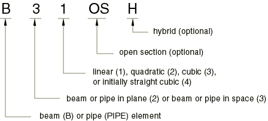
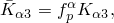
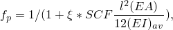
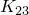
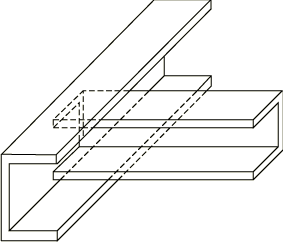

# 29.3.3 选择梁单元


**产品：** Abaqus/Standard  Abaqus/Explicit  Abaqus/CAE  

##### **参考**

- ["梁建模：概述，" 第 29.3.1 节](pt06ch29s03abo26.md)
- ["梁单元库，" 第 29.3.8 节](pt06ch29s03ael14.md)
- [*TRANSVERSE SHEAR STIFFNESS](../key/key-link.md#usb-kws-mtransshearstiff)
- ["创建梁截面，" Abaqus/CAE 用户指南第 12.13.11 节](../usi/usi-link.md#usi-prp-section-beam)

### 概述

Abaqus 提供了广泛的梁单元，包括"欧拉-伯努利"型梁和"铁摩辛科"型梁，具有实心、薄壁闭口和薄壁开口截面。

Abaqus/Standard 梁单元库包括：
- 平面和空间中的欧拉-伯努利（细长）梁；
- 平面和空间中的铁摩辛科（剪切柔性）梁；
- 线性、二次和三次插值公式；
- 翘曲（开口截面）梁；
- 管道单元；和
- 混合公式梁，通常用于显着旋转的非常刚性梁（机器人或非常灵活的结构（如海上管道）中的应用）。

Abaqus/Explicit 梁单元库包括：
- 平面和空间中的铁摩辛科（剪切柔性）梁；
- 线性插值和二次插值公式；和
- 线性管道单元。

### 命名约定

Abaqus 中的梁单元命名如下：



例如，B21H 是使用线性插值和混合公式的平面梁。

### 欧拉-伯努利（细长）梁

欧拉-伯努利梁（B23、B23H、B33 和 B33H）仅在 Abaqus/Standard 中可用。这些单元不允许横向剪切变形；最初垂直于梁轴线的平面截面保持平面（如果没有翘曲）并垂直于梁轴线。它们只应用于建模细长梁：梁的横截面尺寸应小于沿其轴线的典型距离（例如支撑点之间的距离或参与动态响应的高阶模式的波长）。对于由均匀材料制成的梁，横截面中的典型尺寸应小于典型轴向距离的约 1/15，以使横向剪切柔性可忽略。（横截面尺寸与典型轴向距离的比值称为长细比。）

这些单元不包括压力载荷的载荷刚度。

#### 插值

欧拉-伯努利梁单元使用三次插值函数，这使其对于涉及沿梁分布加载的情况相当准确。因此，它们非常适合动态振动研究，其中达朗贝尔（惯性）力提供这种分布加载。

三次梁单元编写用于小应变、大旋转分析。由于底层公式中的近似，它们可能不适合扭转稳定性问题，并且不能用于涉及非常大旋转（约 180 度）的分析；应改用二次或线性梁单元。

#### 质量公式

欧拉-伯努利梁单元使用一致性质量公式。绕梁轴扭转的转动惯量与铁摩辛科梁相同。详细信息见["铁摩辛科梁的质量和惯性，" Abaqus 理论指南第 3.5.5 节](../stm/stm-link.md#stm-elm-timbeaminertia)。为这些单元定义的任何额外惯性（见["铁摩辛科梁的梁截面行为中的添加惯性"](pt06ch29s03alm10.md#usb-elm-ebeamsectionbehavior-addinertia)）将被忽略。

### 铁摩辛科（剪切柔性）梁

铁摩辛科梁（B21、B22、B31、B31OS、B32、B32OS、PIPE21、PIPE22、PIPE31、PIPE32 及其"混合"等效单元）允许横向剪切变形。它们可用于厚（粗短）以及细长梁。对于由均匀材料制成的梁，剪切柔性梁理论可为横截面尺寸高达典型轴向距离或对响应有显著贡献的最高自然模态波长的 1/8 提供有用的结果。超过此比例后，允许仅将构件行为描述为轴向位置函数的近似值不再提供足够的精度。

Abaqus 假设铁摩辛科梁的横向剪切行为是具有固定模量的线性弹性，因此独立于梁截面应对轴向拉伸和弯曲的响应。

对于大多数梁截面，Abaqus 将计算单元公式中所需的横向剪切刚度值。您可以覆盖这些默认值，如下所述在["定义横向剪切刚度和长细比补偿因子"](pt06ch29s03alm08.md#usb-elm-ebeamelem-transshear-override)"中。在某些情况下，如果在校处理的输入阶段无法获得剪切模量的估计值，则不会计算默认剪切刚度值；例如，当材料行为由用户子程序 [`UMAT`](../sub/sub-link.md#sub-xsl-umat)、[`UHYPEL`](../sub/sub-link.md#sub-xsl-uhypel)、[`UHYPER`](../sub/sub-link.md#sub-xsl-uhyper) 或 [`VUMAT`](../sub/sub-link.md#sub-xsl-vumat) 定义时。在这种情况下，必须按照以下所述定义横向剪切刚度。

铁摩辛科梁可以承受大的轴向应变。扭矩引起的轴向应变假定为小。在组合轴向-扭转加载中，只有当轴向应变不大时，才能准确计算扭转剪切应变。

#### 横向剪切刚度定义

剪切柔性梁截面在 Abaqus 中的有效横向剪切刚度定义为



其中  是  方向的截面剪切刚度；  是一个无量纲因子，用于防止剪切刚度在细长梁单元中变得过大；  是截面的实际剪切刚度；  是横截面的局部方向。  具有力的单位。

无量纲因子  始终包含在横向剪切刚度计算中，定义为


其中 *l* 是单元长度，*A* 是横截面积，  是  方向的惯性矩，  是长细比补偿因子（默认值为 0.25），  是一阶单元值为 1.0、二阶单元值为 10^4 的常数。

对于网格化截面，上述表达式变为





您可以按照以下所述定义  或 。如果您未指定它们，则定义为


 或


其中 *G* 是弹性剪切模量或多个剪切模量，*A* 是梁截面的横截面积。计算  和  时不考虑 *G* 的温度和场变量依赖性。剪切因子 *k*（Cowper, 1966）定义为：

| 截面类型 | 剪切因子，*k* |
| --- | --- |
| 任意 | 1.0 |
| 箱形 | 0.44 |
| 圆形 | 0.89 |
| 弯头 | 0.85 |
| 广义 | 1.0 |
| 六边形 | 0.53 |
| 工字（和 T） | 0.44 |
| 角 | 1.0 |
| 网格化 | 1.0 |
| 非线性广义 | 1.0 |
| 管道 | 0.53 |
| 矩形 | 0.85 |
| 厚管道 | 0.53–0.89 |
| 梯形 | 0.822 |

当使用在分析过程中积分的梁截面定义时（见["使用在分析过程中积分的梁截面来定义截面行为，" 第 29.3.6 节](pt06ch29s03alm11.md)），*G* 根据与截面一起使用的弹性材料定义计算。当使用通用梁截面定义时（见["使用通用梁截面来定义截面行为，" 第 29.3.7 节](pt06ch29s03alm12.md)），您作为梁截面数据的一部分提供 *G*。

##### 定义横向剪切刚度和长细比补偿因子

可以为在分析过程中积分的梁截面和通用梁截面定义横向剪切刚度。对于二维梁，您可以输入单个横向剪切刚度值，即 。如果省略或给出零值，则另一个非零值将用于两者。

您也可以定义长细比补偿因子。长细比补偿因子的默认值是 0.25。如果提供了长细比补偿因子值，则还必须提供剪切刚度  的值。

对于一阶单元，您可以通过包含标签 SCF 来定义长细比补偿因子。Abaqus 然后将使用长细比补偿因子  值都将被忽略。相反，  值是根据弹性材料定义计算的。

横向剪切刚度与欧拉-伯努利梁单元无关，因为横向剪切约束被精确满足。

| **输入文件用法：** | 使用以下两个选项为在分析过程中积分的梁截面定义横向剪切刚度： |
| --- | --- |
|  | ``` [*BEAM SECTION](../key/key-link.md#usb-kws-mbeamsection) [*TRANSVERSE SHEAR STIFFNESS](../key/key-link.md#usb-kws-mtransshearstiff) ``` 使用以下两个选项为通用梁截面定义横向剪切刚度： ``` [*BEAM GENERAL SECTION](../key/key-link.md#usb-kws-mbeamgensect) [*TRANSVERSE SHEAR STIFFNESS](../key/key-link.md#usb-kws-mtransshearstiff) ``` |

| **Abaqus/CAE 用法：** | 为在分析过程中积分的梁截面定义横向剪切刚度： |
| --- | --- |
|  | Property 模块：梁截面编辑器：**Section integration: During analysis**：**Stiffness**：切换 **Specify transverse shear** 为通用梁截面定义横向剪切刚度：Property 模块：梁截面编辑器：**Section integration: Before analysis**：**Stiffness**，切换 **Specify ****transverse shear** |

#### 插值

Abaqus 提供有限轴向应变、剪切柔性梁，具有线性和二次插值。其公式在["梁单元公式，" Abaqus 理论指南第 3.5.2 节](../stm/stm-link.md#stm-elm-beamform)中描述。

单元类型 B21、B31、B31OS、PIPE21、PIPE31 及其混合等效单元使用线性插值。这些单元非常适合涉及接触的情况，例如管道在沟渠或海底的铺设，或钻柱与井眼之间的接触，以及类似问题的动态版本（冲击）。

单元类型 B22、B32、B32OS、PIPE22、PIPE32 及其混合等效单元使用二次插值。

#### 质量公式

线性铁摩辛科梁单元默认使用集中质量公式。Abaqus/Standard 中的二次铁摩辛科梁单元使用一致性质量公式，但在动态过程中使用 1/6、2/3、1/6 分布的集中质量公式。详细信息见["铁摩辛科梁的质量和惯性，" Abaqus 理论指南第 3.5.5 节](../stm/stm-link.md#stm-elm-timbeaminertia)。Abaqus/Explicit 中的二次铁摩辛科梁单元使用 1/6、2/3、1/6 分布的集中质量公式。

##### 在 Abaqus/Standard 中使用一致性质量矩阵

或者，在 Abaqus/Standard 中，您可以使用基于位移三次插值和旋转二次插值的 McCalley-Archer 一致性质量矩阵。

| **输入文件用法：** | 对于使用在分析过程中积分的梁截面的线性铁摩辛科梁单元，使用以下选项： |
| --- | --- |
|  | ``` [*BEAM SECTION](../key/key-link.md#usb-kws-mbeamsection), LUMPED=NO ``` 对于使用通用梁截面的线性铁摩辛科梁单元，使用以下选项： ``` [*BEAM GENERAL SECTION](../key/key-link.md#usb-kws-mbeamgensect), LUMPED=NO ``` |

| **Abaqus/CAE 用法：** | 对于使用在分析过程中积分的梁截面的线性铁摩辛科梁单元，使用以下选项： |
| --- | --- |
|  | Property 模块：梁截面编辑器：**Section integration: During analysis**：**Stiffness** 标签页：切换 **Use consistent mass matrix formulation** 对于使用通用梁截面的线性铁摩辛科梁单元，使用以下选项：Property 模块：梁截面编辑器：**Section integration: Before analysis**：**Stiffness** 标签页：切换 **Use consistent mass matrix formulation** |

#### 转动惯量处理和附加梁惯性

默认情况下，铁摩辛科梁使用精确的（具有位移-旋转耦合的各向异性）转动惯量。可选地，可以使用非耦合各向同性近似转动惯量。详细信息见["铁摩辛科梁的转动惯量"中的"梁截面行为，" 第 29.3.5 节](pt06ch29s03alm10.md#usb-elm-ebeamsectionbehavior-rotinertia)。

此规则的例外情况是带自动稳定的静态过程（见["静态应力分析，" 第 6.2.2 节](pt03ch06s02at01.md)），其中铁摩辛科梁的质量矩阵始终假设各向同性转动惯量来计算，而不管为梁截面定义指定的转动惯量类型如何（见["铁摩辛科梁的转动惯量"中的"梁截面行为，" 第 29.3.5 节](pt06ch29s03alm10.md#usb-elm-ebeamsectionbehavior-rotinertia)）。

在某些结构应用中，梁单元可能是对具有复杂横截面几何形状和质量分布的结构的二维近似。在这种横截面中，可能存在代表重型机械、装载在船舱中的货物、液体压载舱或沿梁长度分布的任何其他质量的惯性贡献，这些质量不属于梁的结构刚度的一部分。在这种情况下，您可以定义与梁截面属性相关的附加质量和转动惯量。可以指定单位长度的多个质量（位于梁截面原点以外的位置）和单位长度的转动惯量。也可以指定与此附加惯性相关的质量比例阻尼（alpha 或复合阻尼）。Abaqus 将使用（基于材料阻尼和附加惯性阻尼的）质量加权平均值来计算单元质量比例阻尼。详细信息见["材料阻尼，" 第 26.1.1 节](pt05ch26s01abm51.md)。

#### 浸入流体产生的附加惯性

当梁完全或部分浸没时，周围流体的效果可以建模为梁上的附加分布惯性。详细信息见["梁截面行为，" 第 29.3.5 节中的"浸入流体产生的附加惯性"](pt06ch29s03alm10.md#usb-elm-ebeamsectionbehavior-fluidinertia)。

#### 翘曲（开口截面）梁

在空间中对梁建模时，截面的翘曲在扭矩加载下可能会进一步考虑。除了圆形截面外，梁的横截面在承受扭矩时将从其原始平面变形。这种翘曲变形将修改整个截面的剪切应变分布。

如果不阻止翘曲，开口截面通常会非常容易扭转，特别是形成梁截面的壁很薄。在沿梁的某些点（例如梁嵌入其他构件中的地方，[图 29.3.3-1](pt06ch29s03alm08.md#ebeam-open-intersect)）或嵌入墙壁中时约束这种翘曲）是梁整体扭转响应的重要因素。

**图 29.3.3-1** 开口截面梁的相交。



单元类型 B31OS、B32OS（及其"混合"等效单元）在每个节点处将翘曲幅度 *w* 作为自由度；它们仅在 Abaqus/Standard 中可用。在这些单元中，Abaqus/Standard 假设截面的翘曲作为截面中位置的函数遵循某种模式（如果您指定了标准库截面或"任意"截面，Abaqus 将计算此翘曲模式）：只有翘曲幅度随梁轴线位置变化。这些单元用于分析翘曲约束起作用且不能忽略由翘曲引起的轴向应变的薄壁开口截面。可能以这种方式翘曲的开口截面示例是工字截面和任何开放任意截面。在其他梁单元类型中，翘曲被认为是无约束的，任何由翘曲引起的轴向应力都被忽略；当将这些单元类型与薄壁开口截面一起使用时，扭转行为将无法充分表示。

一般来说，只有当梁轴线通过节点连续且梁横截面在节点两侧相同时，翘曲幅度才能连续。因此，如果开口截面成员在节点处相交（例如车辆底盘的横梁与纵梁相交，[图 29.3.3-1](pt06ch29s03alm08.md#ebeam-open-intersect)），相交成员可能必须使用不同的轴向方向的单独节点，并且必须为该点处每个成员中的翘曲幅度选择适当的约束。这些约束的选择是当地建筑细节的问题。例如，如果接头被加固，翘曲可能会被阻止；因此，应该在接头处对适当成员的全约束使用边界条件完全约束自由度 7。

#### "管道"单元

Abaqus 中的管道单元假设为空心圆形截面。管道中由内压或外压加载引起的内部应力包含在这些单元中，因此在管道截面上，受拉的点将具有与受压的点不同的屈服（[图 29.3.3-2](pt06ch29s03alm08.md#ebeam-pipe-yield)），从而导致截面响应非弹性弯曲时不对称。Abaqus 中管道单元提供了两种公式。薄壁管道公式假设环向应力在截面上恒定，忽略径向应力，而厚壁管道（仅在 Abaqus/Standard 中可用）允许环向和径向应力分量在截面上变化。

**图 29.3.3-2** 薄壁 PIPE 单元中的屈服行为。


薄壁管道单元中的环向应力计算为与管道截面上的内压和外压加载平衡的平均应力。对于薄壁公式，通过厚度的一个点积分规则足以获得准确解。

对于厚壁管道，使用 Lam 方程计算在内压和/或外压加载下环向应力和径向应力的变化。每个材料点处的本构计算考虑所施加的环向和径向应力值来确定结构响应。厚壁管道使用二维积分规则来准确捕获应力在截面上变化的影响。

### "混合"梁

混合梁单元类型（B21H、B33H 等）在 Abaqus/Standard 中提供，用于通过常规有限元位移方法计算梁中轴向力和剪切力在数值上困难的情况。这种问题最常见于几何非线性分析中，当梁经历大旋转且轴向和横向剪切变形非常刚性时，例如车辆悬架系统中的连杆或弯曲的长管道或电缆。在这种情况下，节点位置的轻微差异可能导致非常大的力，反过来又会在其他方向上引起大的运动。混合单元通过使用更通用的公式来克服这一困难，其中单元中的轴向力和横向剪切力与节点位移和旋转一起作为主要变量。尽管此公式使这些单元更昂贵，但当梁的旋转较大时，它们通常收敛得更快，因此在这种情况下总体效率更高。

#### 附加参考

- Archer, J. S., "Consistent Matrix Formulations for Structural Analysis using Finite-Element Techniques," American Institute of Aeronautics and Astronautics Journal, vol. 3, pp. 1910--1918, 1965.
- Cowper, R. G., "The Shear Coefficient in Timoshenko's Beam Theory," Journal of Applied Mechanics, vol. 33, pp. 335--340, 1966.


