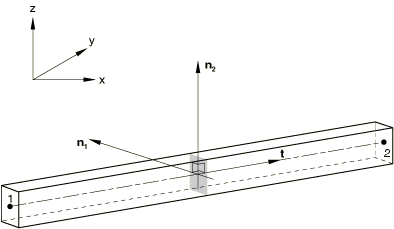
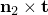
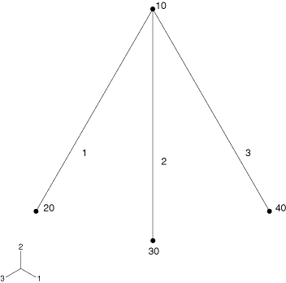

# 29.3.4 梁单元截面方向


**产品：** Abaqus/Standard  Abaqus/Explicit  Abaqus/CAE  

##### **参考**

- ["梁建模：概述，" 第 29.3.1 节](pt06ch29s03abo26.md)
- ["梁截面库，" 第 29.3.9 节](pt06ch29s03abm01.md)
- ["梁截面行为，" 第 29.3.5 节](pt06ch29s03alm10.md)
- ["分配梁方向，" Abaqus/CAE 用户指南第 12.15.3 节](../usi/usi-link.md#usi-prp-assign-orient)

### 概述

梁截面的方向：
- 以局部右手坐标系定义；和
- 可以由用户定义或由 Abaqus 计算。

### 梁横截面坐标系

梁截面的方向在 Abaqus 中以局部右手坐标系（、、）定义，其中  是单元轴线的切线，正方向为从单元第一个节点到第二个节点的方向， 和  是定义截面局部 1 和 2 方向的基础向量。 被称为第一个梁截面轴， 被称为梁的法线。此梁横截面坐标系如图 29.3.4-1 所示。

**图 29.3.4-1** 梁型单元的局部轴定义。



### 定义 n1 方向

对于平面中的梁， 方向始终为（0.0, 0.0, 1.0）；即，垂直于运动发生的平面。因此，平面梁只能绕第一个梁截面轴弯曲。

对于空间中的梁， 的大致方向必须作为梁截面定义的一部分直接定义，或通过在单元定义中指定梁轴线外的额外节点来定义（见["单元定义，" 第 2.2.1 节](pt01ch02s02aus11.md)）。此额外节点包含在单元的连通性列表中。
- 如果指定了额外节点， 的大致方向由从单元第一个节点到额外节点的向量定义。
- 如果直接为截面定义了  并且指定了额外节点，则使用额外节点计算的方向优先。
- 如果未通过上述方法定义近似方向，则默认值为（0.0, 0.0, 1.0）。

此近似的  方向可用于确定  方向（见下文）。一旦  方向被定义或计算，实际的  方向将计算为 ，可能导致与指定方向不同的方向。

| **输入文件用法：** | 使用以下选项为在分析过程中积分的梁截面直接指定  方向： |
| --- | --- |
|  | ``` [*BEAM SECTION](../key/key-link.md#usb-kws-mbeamsection) *-direction (the data line number depends on the value of the SECTION parameter) * ``` 使用以下选项为通用梁截面直接指定  方向： ``` [*BEAM GENERAL SECTION](../key/key-link.md#usb-kws-mbeamgensect) *-direction (the data line number depends on the value of the SECTION parameter) * ``` 使用以下选项指定梁轴线外的额外节点来定义  方向： ``` [*ELEMENT](../key/key-link.md#usb-kws-melement) ``` |

| **Abaqus/CAE 用法：** | Property 模块：****Assign****Beam Section Orientation****：选择区域并输入  方向 |
| --- | --- |
|  | Abaqus/CAE 中不支持指定梁轴线外的额外节点。 |

### 定义节点法线

对于空间中的梁，可以通过在每个节点定义的第四、第五和第六坐标中给出其方向余弦来定义节点法线（ 方向），或者在用户指定的法线定义中给出；详细信息见["节点处的法线定义，" 第 2.1.4 节](pt01ch02s01aus08.md)。否则，节点法线将由 Abaqus 计算，如下所述。

如果节点法线作为节点定义的一部分定义，则此法线用于连接到该节点的所有结构单元，除非为该单元定义了用户指定的法线。如果在特定单元的节点处定义了用户指定的法线，则此法线定义优先于作为节点定义一部分定义的法线。如果指定法线与垂直于单元轴线的平面所成的角度大于 20 度，则会在数据（`.dat`）文件中发出警告消息。如果作为节点定义一部分定义的法线或用户指定的法线与  之间的角度大于 90 度，则使用指定法线的反向。

| **输入文件用法：** | 使用以下选项在节点定义中指定  方向： |
| --- | --- |
|  | ``` [*NODE](../key/key-link.md#usb-kws-mnode) *node number, nodal coordinates, nodal normal coordinates* ``` 使用以下选项定义用户指定的法线： ``` [*NORMAL](../key/key-link.md#usb-kws-mnormal) ``` |

| **Abaqus/CAE 用法：** | Abaqus/CAE 中不支持定义节点法线；始终使用 Abaqus 计算的节点法线。 |
| --- | --- |

#### Abaqus 计算平均节点法线

如果节点法线未作为节点定义的一部分定义，则为所有未定义用户指定法线的壳单元和梁单元（"剩余"单元）计算节点处的单元法线方向。对于壳单元，法线方向垂直于壳中面，如["壳单元：概述，" 第 29.6.1 节](pt06ch29s06abo27.md)中所述。对于梁单元，法线方向是第二个横截面方向，如["梁单元截面方向，" 第 29.3.4 节](pt06ch29s03alm09.md)中所述。然后使用以下算法为需要定义法线的剩余单元获取平均法线（或多个平均法线）：

1. 如果节点连接到超过 30 个剩余单元，则不进行平均，并为每个单元分配其自己的法线。第一个节点法线存储为作为节点定义一部分定义的法线。每个后续法线存储为用户指定的法线。
2. 如果节点由 30 个或更少的剩余单元共享，则计算连接到该节点的所有单元的法线。Abaqus 获取这些单元中的一个，并将其与所有其他法线在 20 度以内的单元放入一个集合中。然后：
   1. 每个法线在已添加单元 20 度以内的单元也被添加到该集合中（如果尚未包含）。
   2. 重复此过程，直到集合中包含集合中每个单元的所有其他法线在 20 度以内的单元。
   3. 如果最终集合中的所有法线彼此在 20 度以内，则为集合中的所有单元计算平均法线。如果集合中任何法线与集合中甚至单个其他法线的偏差超过 20 度，则集合中的单元不进行平均，并为每个单元存储单独的法线。
   4. 重复此过程，直到连接到节点的所有单元都为其计算了法线。
   5. 第一个节点法线存储为作为节点定义一部分定义的法线。每个随后生成的节点法线存储为用户指定的法线。此算法确保节点平均方案没有单元顺序依赖性。下面包括说明此过程的简单示例。

##### 示例：梁法线平均

考虑[图 29.3.4-2](pt06ch29s03alm09.md#ebeamgeometry3elem) 中三个梁单元模型。单元 1、2 和 3 共享一个公共节点 10，未定义用户指定的法线。

**图 29.3.4-2** 节点平均算法的三单元示例。



 在第一种情况下，假设在节点 10 处，单元 2 的法线在单元 1 和 3 的 20 度以内，但单元 1 和 3 的法线彼此不在 20 度以内。在这种情况下，每个单元分配其自己的法线：一个存储为节点定义的一部分，两个存储为用户指定的法线。

 在第二种情况下，假设在节点 10 处，单元 2 的法线在单元 1 和 3 的 20 度以内，并且单元 1 和 3 的法线彼此在 20 度以内。在这种情况下，将为单元 1、2 和 3 计算单个平均法线，并存储为节点定义的一部分。

 在最后一种情况下，假设在节点 10 处，单元 2 的法线在单元 1 的 20 度以内，但单元 3 的法线不在单元 1 或 2 的 20 度以内。在这种情况下，将为单元 1 和 2 计算并存储平均法线，单元 3 的法线单独存储：一个存储为节点定义的一部分，另一个存储为用户指定的法线。

#### 适当的梁法线

为确保正确施加垂直于梁截面的载荷，重要的是要有所正确定义截面的梁法线。当使用线性梁对曲线几何建模时，适当的梁法线是在节点处平均的法线。对于这种情况，优选地定义横截面坐标系，使得梁法线位于曲率平面内并在节点处适当平均。

### 初始曲率和初始扭转

在 Abaqus/Standard 中，法线方向定义可能导致梁单元具有初始曲率或初始扭转，这将影响某些单元的行为。
- 当单元的法线不垂直于梁轴线（通过使用单元节点进行插值获得）时，梁单元是弯曲的。初始曲率可能在直接定义法线时产生（作为节点定义或用户指定的法线的一部分），也可能发生在梁在节点处相交且梁的法线如上所述进行平均时。此初始曲率的影响在三阶梁单元中被考虑。由法线定义引起的初始曲率不在二阶梁单元中考虑；但是，这些单元正确地考虑了节点位置所表示的任何初始曲率。
- 类似地，节点法线方向在不同节点处围绕梁轴线的不同方向意味着扭转。初始扭转的影响（可能由法线平均或用户定义的法线引起）在二阶梁单元中被考虑。

由于初始弯曲或初始扭转梁的行为与直梁完全不同，平均法线引起的变更可能导致某些梁单元的变形变更。您应始终检查模型，以确保平均法线引起的变更是预期的。如果连续节点处的法线方向所成的角度大于 20 度，则会在数据（`.dat`）文件中发出警告消息。此外，如果在为梁计算的节点平均曲率与未进行节点平均且无用户定义法线计算的曲率之间，平均曲率每单位长度差异超过 0.1 度，或者整个梁的近似积分曲率差异超过 5 度，则会在输入文件预处理期间发出警告消息。

在 Abaqus/Explicit 中，不考虑梁的初始曲率：所有梁单元都假定为初始直的。单元的横截面方向通过平均与其节点关联的  和  方向来计算。然后将这两个向量投影到垂直于梁单元轴线的平面上。通过在此平面内以相等且相反的角度旋转，使投影方向  和  相互正交。


