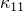
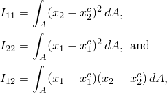
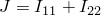
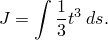
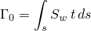
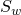
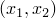
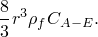
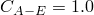
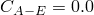

# 29.3.5 梁截面行为


**产品：** Abaqus/Standard  Abaqus/Explicit  Abaqus/CAE  

##### **参考**

- ["梁建模：概述，" 第 29.3.1 节](pt06ch29s03abo26.md)
- [*BEAM GENERAL SECTION](../key/key-link.md#usb-kws-mbeamgensect)
- [*BEAM SECTION](../key/key-link.md#usb-kws-mbeamsection)
- ["创建梁截面，" Abaqus/CAE 用户指南第 12.13.11 节](../usi/usi-link.md#usi-prp-section-beam)

### 概述

梁截面行为：
- 通过梁截面对拉伸、弯曲、剪切和扭转的响应来定义；
- 可能需要或不需要在截面上进行数值积分；和
- 可以是线性的或非线性的（由非线性材料响应引起）。

### 梁截面行为

定义梁截面对梁轴线的拉伸、弯曲、剪切和扭转的响应需要适当定义轴向力 *N*；弯矩  和 ；和扭矩 *T*，作为轴向应变 ；曲率变化  和 ；和扭转  的函数。这里下标 1 和 2 指的是梁截面中的局部正交轴。

如果使用开口截面梁类型，截面行为还必须定义翘曲*双力矩* *W*，广义应变度量包括翘曲幅度 *w* 和梁的双曲率 ，这是翘曲幅度相对于梁轴线位置的梯度：。

选择的截面定义类型决定了梁截面属性是在分析过程中重新计算还是在预处理中建立并在整个分析期间保持不变。如果使用通用梁截面定义（见["使用通用梁截面来定义截面行为，" 第 29.3.7 节](pt06ch29s03alm12.md)），横截面属性在预处理期间计算一次。或者，可以使用在分析过程中积分的梁截面定义（见["使用在分析过程中积分的梁截面来定义截面行为，" 第 29.3.6 节](pt06ch29s03alm11.md)），在这种情况下，Abaqus 将使用截面上应力的数值积分来定义分析进行时梁的响应。

由于平面梁仅在 *X*–*Y* 平面中变形，因此只有 *N* 和  以及  和  对这些单元的响应有贡献：、 和 *w* 假定为零。

在 Abaqus 中，梁截面中的弯矩始终关于梁截面的质心测量，而扭矩是相对于剪切中心测量的。不要求梁轴线（定义为连接定义梁单元的节点的线）穿过梁截面的质心。

梁单元的自由度位于梁截面中定义的局部  坐标系的原点；即，连接单元节点的单元线穿过截面局部坐标系的原点。

#### 确定是使用在分析过程中积分的梁截面还是通用梁截面

当使用在分析过程中积分的梁截面时（见["使用在分析过程中积分的梁截面来定义截面行为，" 第 29.3.6 节](pt06ch29s03alm11.md)），Abaqus 在梁变形时对截面进行数值积分，分别评估截面上每个点的材料行为。当截面非线性仅由非线性材料响应引起时，应使用这种类型的梁截面。

当使用通用梁截面时（见["使用通用梁截面来定义截面行为，" 第 29.3.7 节](pt06ch29s03alm12.md)），Abaqus 预计算梁横截面量，并在分析过程中根据预计算的值执行所有截面计算。此方法结合了梁截面和材料描述的功能（不需要材料定义）。预计算的截面属性可以通过多种方式指定，包括使用二维有限元网格定义的相当复杂的几何形状（见["网格化梁截面，" 第 10.6.1 节](pt04ch10s06at35.md)）。当梁截面响应是线性的，或者当它是非线性的且非线性不仅来自材料非线性（例如截面坍塌发生的情况）时，应使用通用梁截面。

| **输入文件用法：** | 使用以下选项定义在分析过程中积分的梁截面： |
| --- | --- |
|  | ``` [*BEAM SECTION](../key/key-link.md#usb-kws-mbeamsection) ``` 使用以下选项定义通用梁截面： ``` [*BEAM GENERAL SECTION](../key/key-link.md#usb-kws-mbeamgensect) ``` |

| **Abaqus/CAE 用法：** | 定义在分析过程中积分的梁截面： |
| --- | --- |
|  | Property 模块：**Create Section**：选择 **Beam** 作为 section **Category**，选择 **Beam** 作为 section **Type**：**Section integration: During analysis** 定义通用梁截面：Property 模块：**Create Section**：选择 **Beam** 作为 section **Category**，选择 **Beam** 作为 section **Type**：**Section integration: Before analysis** |

### 几何截面量

下面描述的截面量用于定义通用梁截面的行为。

#### 惯性矩

关于质心的惯性矩定义为



其中（）是局部  梁截面轴系中点的位置，（）是横截面积质心的位置。

网格化截面轮廓的弯曲刚度和转动惯量贡献（见["选择梁截面，" 第 29.3.2 节中的"网格化截面"](pt06ch29s03alm07.md#usb-elm-ebeamsections-meshed)）使用二维横截面模型计算。为用翘曲单元网格化的整个横截面模型定义以下积分属性：


其中（）是横截面的质心。

#### 扭转常数

扭转常数 *J* 取决于横截面的形状。圆形截面的扭转常数是极惯性矩，。

矩形和梯形库截面的扭转常数是使用 Prandtl 应力函数方法由 Abaqus 数值计算的。为此在内部创建了横截面的局部有限元模型。为横截面选择的积分点数量决定了此有限元模型的精度。为提高精度，通过选择非默认积分来指定更高阶规则。

上述规则也应用于薄壁箱形截面和任意截面，以提高模型的精度。如果构成截面的每个段的厚度变化显著，则应为箱形截面指定更多的积分点，或为任意截面在厚度变化的区域指定更小的段。

网格化截面的扭转刚度是针对用翘曲单元网格化的二维区域计算的。积分的精度取决于模型中单元的数量：


其中  表示翘曲函数相对于横截面（1, 2）轴的导数， 是横截面积剪切中心的位置。所有指标取 1、2 的值。更多详细信息，请参见["网格化梁截面，" Abaqus 理论指南第 3.5.6 节](../stm/stm-link.md#stm-elm-meshedsections)。

对于闭口薄壁截面，扭转常数从以下公式计算：


其中 *t* 是截面厚度， 是截面中线所包围的面积，*s* 是中线的长度，沿截面周长逆时针方向测量。

对于开口组合薄壁截面，



Abaqus 将检查组合截面是闭合的还是开口的，并使用适当的扭转常数。

#### 扇形矩和翘曲常数

对于开口薄壁截面，扇形矩定义为



翘曲常数定义为


其中  是截面上以剪切中心为极点的点的扇形面积。

### 铁摩辛科梁的转动惯量

一般来说，与扭转模式相关的转动惯量与弯曲模式的不同。对于不对称横截面，转动惯量在每个弯曲方向上都不同。对于梁节点不位于质心处的横截面，位移和旋转自由度之间存在耦合。

默认情况下，铁摩辛科梁使用精确的（各向异性且耦合的）转动惯量。在 Abaqus/Standard 中，各向异性转动惯量在几何非线性瞬态直接积分动态模拟期间在雅可比算子中引入不对称项。如果几何非线性动态响应中转动惯量效应显著且使用了精确转动惯量，则应使用不对称求解器以获得更好的收敛性。

可选地，可以选择近似的各向同性和非耦合转动惯量。在 Abaqus/Standard 中，这意味着仅对所有旋转自由度使用与扭转模式相关的转动惯量；由于各向异性或位移-旋转耦合，冲击问题中潜在的破坏性转动惯量效应将不会被引入。在 Abaqus/Explicit 中，这意味着对所有旋转自由度使用按选择比例缩放的弯曲惯性，缩放因子选择为使稳定单元时间增量最大化；即，稳定时间增量将不由梁的弯曲响应决定。在某些细长梁分析中，转动惯量的各向同性近似可能足够准确。

如果梁单元在 Abaqus/Explicit 中用于建模板型结构（即，如果梁关于一个截面轴的惯性矩比关于另一个轴的惯性矩大一千倍以上），精确转动惯量公式可能导致稳定时间增量急剧减小。在这种情况下，建议您使用各向同性近似，或者考虑使用壳单元对结构进行建模，这可能更适合此类分析。

有关梁横截面转动惯量的定义，请参见["铁摩辛科梁的质量和惯性，" Abaqus 理论指南第 3.5.5 节](../stm/stm-link.md#stm-elm-timbeaminertia)。

| **输入文件用法：** | 使用以下选项为在分析过程中积分的梁截面指定各向同性转动惯量： |
| --- | --- |
|  | ``` [*BEAM SECTION](../key/key-link.md#usb-kws-mbeamsection), ROTARY INERTIA=ISOTROPIC ``` 使用以下选项为通用梁截面指定各向同性转动惯量： ``` [*BEAM GENERAL SECTION](../key/key-link.md#usb-kws-mbeamgensect), ROTARY INERTIA=ISOTROPIC ``` |

| **Abaqus/CAE 用法：** | Abaqus/CAE 中不支持梁截面的各向同性转动惯量。始终使用默认的精确转动惯量。 |
| --- | --- |

### 为铁摩辛科梁的梁截面行为添加惯性

可以为铁摩辛科梁（包括 PIPE 单元）定义附加质量和转动惯量属性。在横截面内沿梁单位长度定义的此附加惯性贡献于梁的惯性响应，但不贡献于结构刚度。如果使用各向同性转动惯量，则不能为截面定义附加梁惯性。

要指定附加梁惯性，您需要定义质量（单位长度），质量中心位于局部（1, 2）梁横截面轴系中的点  处。要包括转动惯量（单位长度），您还可以定义横截面局部（1, 2）系中的角度 （以度为单位），该角度定位转动惯量坐标系  的第一轴相对于梁横截面轴系中局部 1 方向的位置。如图 29.3.5-1 所示。

**图 29.3.5-1** 具有附加惯性的梁单元。


相对于转动惯量坐标系  的转动惯量分量定义为


其中 *A* 是面积， 是质量密度，*X* 和 *Y* 是从附加质量贡献中心  测量的局部转动惯量系统坐标。

可以根据需要指定尽可能多的点质量和转动惯量贡献来定义附加惯性。可以通过为质量比例 Rayleigh 阻尼系数  或复合阻尼系数  分配值来指定与附加惯性相关的质量比例阻尼。Abaqus 将使用（基于材料阻尼和附加惯性阻尼的）质量加权平均值来计算单元质量比例阻尼。

| **输入文件用法：** | 将以下选项与梁截面定义结合使用以指定附加惯性属性： |
| --- | --- |
|  | ``` [*BEAM ADDED INERTIA](../key/key-link.md#usb-kws-mbeamaddedinertia), ALPHA=, COMPOSITE= *单位长度质量*, , , , , ,  ``` |

| **Abaqus/CAE 用法：** | Abaqus/CAE 中不支持附加惯性属性。 |
| --- | --- |

### 浸入流体产生的附加惯性

当梁完全或部分浸没时，周围流体的效果可以建模为梁上的附加分布惯性（见["入射膨胀波场的加载，" Abaqus 理论指南第 6.3.1 节](../stm/stm-link.md#stm-ldc-undexloads)）。默认情况下，假定梁完全浸没。或者，您可以指定每单位长度的附加惯性应减少一半，以对部分浸没的梁进行建模。

您指定流体质量密度 （单位体积）；润湿横截面质心的梁局部 *x* 和 *y* 坐标；润湿截面有效半径 *r*；以及经验阻力或流动系数  和 。完全浸没梁横截面每单位长度添加的惯性为


因为梁横截面原点可能与润湿横截面的质心不一致，附加流体惯性可能包括旋转效应。润湿横截面质心的 *x* 和 *y* 偏移的非零值将在惯性公式中产生旋转-位移耦合。附加惯量的默认模型来自绕圆柱横截面（）的无粘性流动；您可以指定一个系数 ，用于对不同横截面几何形状的流动进行建模。

浸没的梁在其自由端也经历附加的附加质量效应。如果梁单元的端节点未连接到任何其他单元，并且为此单元定义了附加流体惯性，则可以以下列形式添加附加质量：



对于 ，此附加质量对应于半球形帽的质量；默认值是 。可以更改系数  以对其他几何形状进行建模。如果梁部分浸没，端惯性会自动减少一半。但是，自由端的附加质量始终是各向同性的：轴向和横向运动承受相同的附加惯性。

添加到浸没或部分浸没梁的"虚质量"不包括在数据（`.dat`）文件中报告的总质量、质心、惯性矩和惯性积中。

| **输入文件用法：** | 将以下选项与梁截面定义结合使用以定义完全浸没的梁： |
| --- | --- |
|  | ``` [*BEAM FLUID INERTIA](../key/key-link.md#usb-kws-mbeamfluidinertia), FULL , *x*, *y*, *r*, ,  ``` 将以下选项与梁截面定义结合使用以定义部分浸没的梁： ``` [*BEAM FLUID INERTIA](../key/key-link.md#usb-kws-mbeamfluidinertia), HALF , *x*, *y*, *r*, ,  ``` |

| **Abaqus/CAE 用法：** | 定义完全浸没的梁： |
| --- | --- |
|  | Property 模块：梁截面编辑器：**Fluid Inertia**：切换 **Specify fluid inertia effects**：**Fully submerged** 定义部分浸没的梁：Property 模块：梁截面编辑器：**Fluid Inertia**：切换 **Specify fluid inertia effects**：**Half submerged** |

#### 附加参考

- Blevins, R. D., *Formulas for Natural Frequency and Mode Shape, *R. E. Krieger Publishing Co., Inc., 1987.


