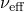

# 29.3.6 使用在分析过程中积分的梁截面来定义截面行为


**产品：** Abaqus/Standard  Abaqus/Explicit  Abaqus/CAE  

##### **参考**

- ["梁建模：概述，" 第 29.3.1 节](pt06ch29s03abo26.md)
- ["梁截面行为，" 第 29.3.5 节](pt06ch29s03alm10.md)
- [*BEAM SECTION](../key/key-link.md#usb-kws-mbeamsection)
- ["在创建梁截面时指定在分析过程中积分的梁截面的属性" Abaqus/CAE 用户指南第 12.13.11 节](../usi/usi-link.md#usi-prp-section-beam-integrateduring)

### 概述

在分析过程中积分的梁截面：
- 用于在分析过程中必须重新计算截面属性因为梁变形的情况；和
- 可以与线性或非线性材料行为相关联。

### 定义在分析过程中积分的梁截面的行为

当需要沿截面进行数值积分因为梁变形时，使用在分析过程中积分的梁截面来定义截面行为。您可以从提供的梁截面形状库中选择截面形状（见["梁截面库，" 第 29.3.9 节](pt06ch29s03abm01.md)）并定义截面的尺寸。此外，您可以指定用于积分的截面点数。默认的截面点数对于引起塑性的单调加载是足够的。如果发生反向塑性，则需要更多的截面点。

使用材料定义（["材料数据定义，" 第 21.1.2 节](pt05ch21s01aus109.md)）来定义截面的材料属性，并将这些属性与截面定义相关联。线性或非线性材料行为可以与截面定义相关联。但是，如果材料响应是线性的，则更经济的方法是使用通用梁截面（见["使用通用梁截面来定义截面行为，" 第 29.3.7 节](pt06ch29s03alm12.md)）。

必须将截面属性与模型的某个区域相关联。

| **输入文件用法：** | ``` [*BEAM SECTION](../key/key-link.md#usb-kws-mbeamsection), ELSET=*name*, SECTION=*library_section*, MATERIAL=*name* ``` |
| --- | --- |
|  | ELSET 参数用于将截面属性与一组梁单元相关联。 |

| **Abaqus/CAE 用法：** | Property 模块：**Create Profile**：**Name:** *library_section***Create Section**：选择 **Beam** 作为 section **Category**，选择 **Beam** 作为 section **Type**：**Section integration: During analysis**，**Profile name:** *library_section*，**Material name:** *name*****Assign****Section****：选择区域 |
| --- | --- |

### 定义由应变引起的横截面积变化

在剪切柔性单元中，Abaqus 通过允许您为截面指定有效泊松比来提供可能的均匀横截面积变化。此效果仅在几何非线性分析中考虑（见["定义分析，" 第 6.1.2 节](pt03ch06s01abo05.md)），并用于对承受大轴向拉伸的梁的横截面积减小或增加进行建模。

有效泊松比的值必须在 1.0 和 0.5 之间。默认情况下，截面的此有效泊松比设置为 0.0，因此忽略此效果。将有效泊松比设置为 0.5 意味着截面的整体响应是不可压缩的。如果梁由典型金属制成，其在大变形下的整体响应基本上是不可压缩的（因为它由塑性主导），则此行为是适当的。0.0 和 0.5 之间的值分别表示横截面积在无变化和不可压缩性之间按比例变化。有效泊松比的负值将导致横截面积响应拉伸轴向应变而增加。

此有效泊松比不适用于欧拉-伯努利梁单元。

| **输入文件用法：** | ``` [*BEAM SECTION](../key/key-link.md#usb-kws-mbeamsection), POISSON= ``` |
| --- | --- |

| **Abaqus/CAE 用法：** | Property 模块：**Create Section**：选择 **Beam** 作为 section **Category**，选择 **Beam** 作为 section **Type**：**Section integration: During analysis**，**Section Poisson's ratio:**  |
| --- | --- |

### 定义材料阻尼

当使用在分析过程中积分的梁截面时，可以通过材料行为定义引入阻尼。有关 Abaqus 中可用的材料阻尼类型的更多信息，请参见["材料阻尼，" 第 26.1.1 节](pt05ch26s01abm51.md)。

### 指定温度和场变量

可以在截面的特定点指定温度和场变量，或者通过定义横截面原点处的值并指定局部 1 和 2 方向的梯度来定义。温度和场变量的实际值指定为预定义场或初始条件（见["预定义场，" 第 34.6.1 节](pt07ch34s06aus128.md)，或["Abaqus/Standard 和 Abaqus/Explicit 中的初始条件，" 第 34.2.1 节](pt07ch34s02aus116.md)）。

在任何单元中，假定单元所有节点处的温度定义与为该单元选择的温度定义方法兼容。对于温度定义方法从一个单元到下一个单元变化的情况，必须对具有不同温度定义方法的单元之间的界面使用单独的节点，并应用 MPC 使节点处的位移和旋转相同。

#### 通过在原点定义值以及 1 和 2 方向的梯度

温度和场变量可以通过给出横截面原点处的值以及横截面 2 和 1 方向的梯度来定义（即，在预定义场或初始条件定义中给出  和 ）。对于平面中的梁，只需要给出  和 ；在这种情况下，1 方向的梯度被忽略。

| **输入文件用法：** | ``` [*BEAM SECTION](../key/key-link.md#usb-kws-mbeamsection), TEMPERATURE=GRADIENTS ``` |
| --- | --- |

| **Abaqus/CAE 用法：** | Property 模块：**Create Section**：选择 **Beam** 作为 section **Category**，选择 **Beam** 作为 section **Type**：**Section integration: During analysis**，**Linear by gradients** |
| --- | --- |

#### 通过在截面上的点定义值

温度和场变量可以在截面上的一组点定义，如["梁截面库，" 第 29.3.9 节](pt06ch29s03abm01.md)中每个横截面所示。

此技术不能用于任何与通用梁截面单元相邻的梁单元，因为这可能导致共享截面上的温度分布不正确。如果您无法避免此建模场景，则必须使用通过 MPC 连接的单独节点来定义相邻单元，如上所述。

| **输入文件用法：** | ``` [*BEAM SECTION](../key/key-link.md#usb-kws-mbeamsection), TEMPERATURE=VALUES ``` |
| --- | --- |

| **Abaqus/CAE 用法：** | Property 模块：**Create Section**：选择 **Beam** 作为 section **Category**，选择 **Beam** 作为 section **Type**：**Section integration: During analysis**，**Interpolated from temperature points** |
| --- | --- |

### 输出

梁截面属性（如横截面积、惯性矩等）打印在模型数据输出中。当使用在分析过程中积分的梁截面时，可以输出截面的截面力、弯矩、横向剪切力和截面应变、曲率、横向剪切应变（见["输出到数据和结果文件，" 第 4.1.2 节中的"单元输出"](pt02ch04s01aus39.md#usb-out-oprintfile-elementoutput)，和["输出到输出数据库，" 第 4.1.3 节中的"单元输出"](pt02ch04s01aus40.md#usb-out-odboutput-elementoutput)）。此外，可以在每个截面点输出应力和应变。["梁单元库，" 第 29.3.8 节](pt06ch29s03ael14.md) 列出了梁单元可用的部分单元输出量。

如果使用在分析过程中积分的梁截面，则在应力/应变输出中包含由翘曲引起的轴向应变。

可以使用单元变量 TEMP 获取截面点处的温度输出。如果在截面的特定点给出温度，则可以使用节点变量 NT*xx* 获取温度点的输出。如果温度通过定义横截面原点处的值并指定局部 1 和 2 方向的梯度来指定，则不应将节点变量 NT*xx* 用于温度点的输出。在这种情况下，应请求输出变量 NT；NT11（参考温度值）和 NT12 及 NT13（分别为局部 1 和 2 方向的温度梯度）将自动输出。

对于所有包含节点位移场输出的帧，梁法线会自动写入输出数据库。可以在 Abaqus/CAE 的 Visualization 模块中可视化法线方向。


