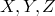
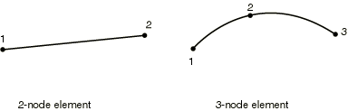
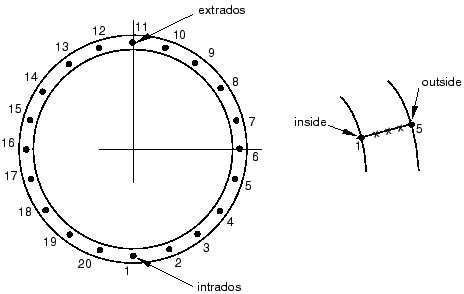

# 29.5.2 弯头单元库


**产品：** Abaqus/Standard  

##### **参考**

- ["具有变形截面的管道和管道弯头：弯头单元，" 第 29.5.1 节](pt06ch29s05alm15.md)
- [*BEAM SECTION](../key/key-link.md#usb-kws-mbeamsection)

### 概述

本节提供 Abaqus/Standard 中可用弯头单元的参考。

### 单元类型

| ELBOW31 | 空间中具有变形截面的 2 节点管道，沿管道线性插值 |
| --- | --- |
|  |

| ELBOW32 | 空间中具有变形截面的 3 节点管道，沿管道二次插值 |
| --- | --- |
|  |

| ELBOW31B | 空间中仅具有椭圆化的 2 节点管道，忽略椭圆化的轴向梯度 |
| --- | --- |
|  |

| ELBOW31C | 空间中仅具有椭圆化的 2 节点管道，忽略椭圆化的轴向梯度。该公式与 ELBOW31B 单元类型的公式相同，只是傅里叶插值中除了第一项外的所有奇数项都被忽略。 |
| --- | --- |
|  |

##### 激活的自由度

1, 2, 3, 4, 5, 6

##### 附加解变量

弯头单元有大量变量用于建模截面椭圆化和翘曲。变量数量取决于弯头单元类型、节点数和所选的傅里叶模式数。在下表中 *p* 是傅里叶模式数：

| 单元类型 | 变量数 |
| --- | --- |
| ELBOW31 | 如果 *p*=0，则为 16 |
|  | 如果 *p* 1，则为 (16*p*+8) |
| ELBOW32 | 如果 *p*=0，则为 24 |
|  | 如果  1，则为 (24*p*+12) |
| ELBOW31B | 如果 *p*=0,1，则为 13+2*p* |
|  | 如果  2，则为 11+4*p* |
| ELBOW31C | 如果 *p*=0,1,3,5，则为 13+2*p* |
|  | 如果 *p*=2,4,6，则为 15+2*p* |

### 需要的节点坐标



### 单元属性定义

| **输入文件用法：** | ``` [*BEAM SECTION](../key/key-link.md#usb-kws-mbeamsection), SECTION=ELBOW ``` |
| --- | --- |

### 基于单元的加载

### 分布载荷

分布载荷如["分布载荷，" 第 34.4.3 节](pt07ch34s04aus122.md)中所述进行指定。

**载荷 ID (*DLOAD)：**  BX**单位：**  [FL3](../popups/usb-int-iconventions-unitsym.md)**描述：**  全局 *X* 方向单位体积的体力。

**载荷 ID (*DLOAD)：**  BY**单位：**  [FL3](../popups/usb-int-iconventions-unitsym.md)**描述：**  全局 *Y* 方向单位体积的体力。

**载荷 ID (*DLOAD)：**  BZ**单位：**  [FL3](../popups/usb-int-iconventions-unitsym.md)**描述：**  全局 *Z* 方向单位体积的体力。

**载荷 ID (*DLOAD)：**  BXNU**单位：**  [FL3](../popups/usb-int-iconventions-unitsym.md)**描述：**  全局 *X 方向的非均匀体力，幅度通过用户子程序 [`DLOAD`](../sub/sub-link.md#sub-xsl-dload) 提供。

**载荷 ID (*DLOAD)：**  BYNU**单位：**  [FL3](../popups/usb-int-iconventions-unitsym.md)**描述：**  全局 *Y* 方向的非均匀体力，幅度通过用户子程序 [`DLOAD`](../sub/sub-link.md#sub-xsl-dload) 提供。

**载荷 ID (*DLOAD)：**  BZNU**单位：**  [FL3](../popups/usb-int-iconventions-unitsym.md)**描述：**  全局 *Z* 方向的非均匀体力，幅度通过用户子程序 [`DLOAD`](../sub/sub-link.md#sub-xsl-dload) 提供。

**载荷 ID (*DLOAD)：**  CENT**单位：**  [FL4(ML3T2)](../popups/usb-int-iconventions-unitsym.md)**描述：**  离心载荷（幅度输入为 ，其中  是单位体积质量密度， 是角速度）。

**载荷 ID (*DLOAD)：**  CENTRIF**单位：**  [T2](../popups/usb-int-iconventions-unitsym.md)**描述：**  离心载荷（幅度输入为 ，其中  是角速度）。

**载荷 ID (*DLOAD)：**  GRAV**单位：**  [LT2](../popups/usb-int-iconventions-unitsym.md)**描述：**  指定方向的重力加载（幅度输入为加速度）。

**载荷 ID (*DLOAD)：**  HPE**单位：**  [FL2](../popups/usb-int-iconventions-unitsym.md)**描述：**  静水外压，在全局 *Z* 中线性变化（闭口条件）。

**载荷 ID (*DLOAD)：**  HPI**单位：**  [FL2](../popups/usb-int-iconventions-unitsym.md)**描述：**  静水内压，在全局 *Z* 中线性变化（闭口条件）。

**载荷 ID (*DLOAD)：**  PE**单位：**  [FL2](../popups/usb-int-iconventions-unitsym.md)**描述：**  均匀外压（闭口条件）。

**载荷 ID (*DLOAD)：**  PI**单位：**  [FL2](../popups/usb-int-iconventions-unitsym.md)**描述：**  均匀内压（闭口条件）。

**载荷 ID (*DLOAD)：**  PENU**单位：**  [FL2](../popups/usb-int-iconventions-unitsym.md)**描述：**  非均匀外压，幅度通过用户子程序 [`DLOAD`](../sub/sub-link.md#sub-xsl-dload) 提供（闭口条件）。

**载荷 ID (*DLOAD)：**  PINU**单位：**  [FL2](../popups/usb-int-iconventions-unitsym.md)**描述：**  非均匀内压，幅度通过用户子程序 [`DLOAD`](../sub/sub-link.md#sub-xsl-dload) 提供（闭口条件）。

**载荷 ID (*DLOAD)：**  ROTA**单位：**  [T2](../popups/usb-int-iconventions-unitsym.md)**描述：**  旋转加速度载荷（幅度输入为 ，其中  是旋转加速度）。

### Abaqus/Aqua 载荷

Abaqus/Aqua 载荷如["Abaqus/Aqua 分析，" 第 6.11.1 节](pt03ch06s11at30.md)中所述进行指定。

**载荷 ID (*CLOAD/ *DLOAD)：**  FDD**单位：**  [FL1](../popups/usb-int-iconventions-unitsym.md)**描述：**  横向流体阻力载荷。

**载荷 ID (*CLOAD/ *DLOAD)：**  FD1**单位：**  [F](../popups/usb-int-iconventions-unitsym.md)**描述：**  弯头第一端（节点 1）上的流体阻力。

**载荷 ID (*CLOAD/ *DLOAD)：**  FD2**单位：**  [F](../popups/usb-int-iconventions-unitsym.md)**描述：**  弯头第二端（节点 2 或节点 3）上的流体阻力。

**载荷 ID (*CLOAD/ *DLOAD)：**  FDT**单位：**  [FL1](../popups/usb-int-iconventions-unitsym.md)**描述：**  切向流体阻力载荷。

**载荷 ID (*CLOAD/ *DLOAD)：**  FI**单位：**  [FL1](../popups/usb-int-iconventions-unitsym.md)**描述：**  横向流体惯性载荷。

**载荷 ID (*CLOAD/ *DLOAD)：**  FI1**单位：**  [F](../popups/usb-int-iconventions-unitsym.md)**描述：**  弯头第一端（节点 1）上的流体惯性力。

**载荷 ID (*CLOAD/ *DLOAD)：**  FI2**单位：**  [F](../popups/usb-int-iconventions-unitsym.md)**描述：**  弯头第二端（节点 2 或节点 3）上的流体惯性力。

**载荷 ID (*CLOAD/ *DLOAD)：**  PB**单位：**  [FL1](../popups/usb-int-iconventions-unitsym.md)**描述：**  浮力（闭口条件）。

**载荷 ID (*CLOAD/ *DLOAD)：**  WDD**单位：**  [FL1](../popups/usb-int-iconventions-unitsym.md)**描述：**  横向风力载荷。

**载荷 ID (*CLOAD/ *DLOAD)：**  WD1**单位：**  [F](../popups/usb-int-iconventions-unitsym.md)**描述：**  弯头第一端（节点 1）上的风力。

**载荷 ID (*CLOAD/ *DLOAD)：**  WD2**单位：**  [F](../popups/usb-int-iconventions-unitsym.md)**描述：**  弯头第二端（节点 2 或节点 3）上的风力。

### 单元输出

默认应力输出点在管道周围所有积分站的管道内侧表面和外侧表面上。

#### 应力、应变和其他张量分量

应力和其他张量（包括应变张量）可用于具有位移自由度的单元。所有张量具有相同的分量。例如，应力分量如下：

| S11 | 沿管道的直接应力。 |
| --- | --- |

| S22 | 管道截面周围的直接应力。 |
| --- | --- |

| S12 | 管道壁中的剪切应力。 |
| --- | --- |

#### 截面力和弯矩

| SF1 | 轴向力。 |
| --- | --- |

| SM1 | 绕局部 1 轴的弯矩。 |
| --- | --- |

| SM2 | 绕局部 2 轴的弯矩。 |
| --- | --- |

| SM3 | 绕弯头轴线的扭矩。 |
| --- | --- |

### 单元上的节点顺序



### 输出积分点编号



外弧是距定义弯头管道中心的圆环最远的管道弯头侧面；即  轴指向的管道弯头侧面。内弧是距圆环中心最近的管道弯头侧面。

上面显示了一个截面周围的中面积分点。在每个这样的点处默认有五个厚度方向积分点，点 1 在管道内侧表面，点 5 在外侧表面。

对于 ELBOW31 和 ELBOW31B，仅沿单元轴线使用一个积分站。对于 ELBOW32，沿弯头轴线使用两个积分站，第二个截面上的点号是第一个截面上点号的延续（例如，默认情况下为 21、22、…、40），位于管道周围如上所示。


