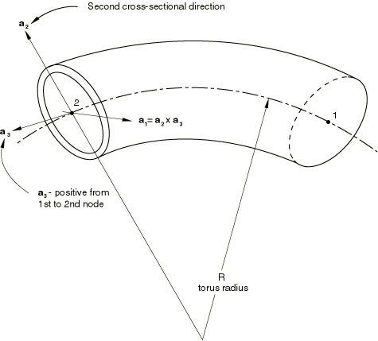
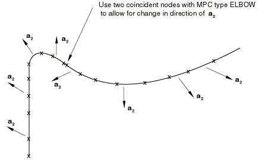
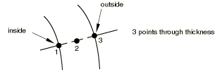
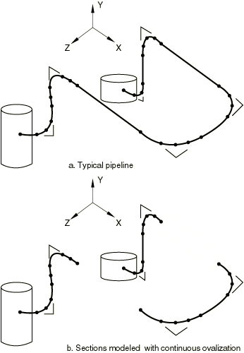

# 29.5.1 具有变形截面的管道和管道弯头：弯头单元


**产品：** Abaqus/Standard  

##### **参考**

- ["弯头单元库，" 第 29.5.2 节](pt06ch29s05ael16.md)
- [*BEAM SECTION](../key/key-link.md#usb-kws-mbeamsection)

### 概述

弯头单元：
- 用于在截面椭圆化和翘曲变形主导行为时提供初始圆形管道和管道弯头非线性响应的精确建模；
- 表现为梁，但实际上是用相当复杂的变形模式允许的壳；
- 使用平面应力理论来建模穿过管道壁的变形；和
- 无法提供应力、应变和其他本构结果的节点值。

### 典型应用

在线性弯头分析的标准方法中，响应预测基于半分析结果，用作"柔性因子"来修正用简单梁理论获得的结果。这种因子在非线性情况下不适用，必须将管道建模为壳才能准确预测响应（例如，见["线性弹性管道在面内弯曲下的参数研究，" Abaqus 例题指南第 1.1.3 节](../exa/exa-link.md#exa-sta-elbowtest)）。虽然弯头单元表现为梁，但它们实际上是壳，允许相当复杂的变形模式。在薄壁弯头中，弯头与相邻直线段的相互作用是弯头建模的一个重要方面，截面变形中容易发生的大旋转也是如此，即使管道轴线本身的小相对旋转也会导致这些效应。所有这些效应（包括内压的强化效应）都可以用这些单元建模。

弯头单元用于在截面椭圆化和翘曲变形主导行为时提供初始圆形管道和管道弯头非线性响应的精确建模。这种行为在两种情况下出现：在管道弯头中，管道的初始曲率加上管道壁的薄度导致椭圆化主导响应；在直管道截面中，过度弯曲可能导致薄壁圆形截面的屈曲坍塌（"Brazier 屈曲"）。

因为弯头单元在圆周方向使用完整的壳公式，每个单元的自由度很高。使用所有傅里叶模式（见下文）建模椭圆化和翘曲的弯头单元在计算上比梁单元昂贵得多，但它们的成本与可用于对截面建模的粗壳模型相当。

如果分析需要将管道单元连接到管道弯头，将弯头单元连接到管道单元比将壳单元连接到管道单元更容易。

### 选择合适的单元

弯头单元沿其长度使用多项式插值（线性或二次，取决于单元类型），并结合沿管道的傅里叶插值来建模截面的椭圆化和翘曲。然后使用壳理论来建模行为。

提供了两种类型的弯头单元。

#### ELBOW31 和 ELBOW32

单元类型 ELBOW31 和 ELBOW32 是最完整的弯头单元。在这些单元中，管道壁的椭圆化从一个单元到下一个单元是连续的，从而对管道弯头（弯头）和管道相邻直线段之间的相互作用等效应进行建模。

ELBOW31 和 ELBOW32 不应用于未连接直管道的分析，除非在管道的某个点约束了翘曲和椭圆化。

#### ELBOW31B 和 ELBOW31C

单元类型 ELBOW31B 和 ELBOW31C 使用公式的简化版本，其中仅考虑椭圆化（无翘曲），忽略椭圆化的轴向梯度。这些近似通常是令人满意的，实际上它们构成了线性分析中管道系统使用的标准柔性因子方法的基础。它们提供了成本低得多的能力。ELBOW31C 包括进一步近似，其中忽略沿管道傅里叶插值中的奇数项（第一项除外）。对于管道半径相对于管道轴线曲率半径较小的情况，此公式提供了稍低成本模型。

### 定义单元的截面属性

使用在分析过程中积分的梁截面定义来定义弯头单元的截面属性。给出管道外半径 *r*；管道壁厚 *t*；和弯头圆环半径，测量到管道轴线 *R*。对于直管道，将 *R* 设为零。

您必须将这些属性与一组弯头单元关联。

| **输入文件用法：** | ``` [*BEAM SECTION](../key/key-link.md#usb-kws-mbeamsection), SECTION=ELBOW, ELSET=*name* *r*, *t*, *R* ``` |
| --- | --- |

#### 定义截面方向

对于所有弯头单元，必须通过指定一个点来在空间中定位截面，该点与单元的节点一起定义  轴的平面在[图 29.5.1-1](pt06ch29s05alm15.md#eelbow-geom)中。对于弯管，此点应位于弯头外侧（弯头外侧的管道侧面称为*外弧*）。对于小于 180 度的管道弯头，此点可以设置为相邻直管道切线交点。如果管道弯头所夹角度大于或等于 180 度，则应将弯头分割成小于 180 度的段，并为每个分割定义单独的梁截面，以便用于定义  轴平面的点可以位于外弧外侧。当单元用于建模直管道时，该点可以是管道轴线外的任意点。

**图 29.5.1-1** 弯头单元几何。



当通过在管道弯头和直管道使用 ELBOW31 或 ELBOW32 单元将椭圆化建模扩展到与管道弯头相邻的直管段时，必须确保  轴的定义使得其在管道弯头和每个直管段之间的管道轴线周围的方向相同。在可能的情况下， 轴在相邻管道弯头之间也应该相同。在某些情况下，例如在不同平面中的相邻管道弯头， 轴必然不连续。在这种情况下，必须在  轴改变方向的位置引入单独节点，并调用 MPC 类型 ELBOW 以施加适当的约束来确保位移的连续性。见[图 29.5.1-2](pt06ch29s05alm15.md#eelbow-mpc-elbow)。

**图 29.5.1-2** MPC 类型 ELBOW 与 ELBOW31 或 ELBOW32 的使用。



| **输入文件用法：** | ``` [*BEAM SECTION](../key/key-link.md#usb-kws-mbeamsection), SECTION=ELBOW *first data line* *coordinates of orientation point* ``` |
| --- | --- |

#### 定义积分点和傅里叶模式数

可以为弯头截面指定积分点数和傅里叶模式数。经验表明，对于相对厚壁情况，沿管道使用 4 个傅里叶模式和 12 个积分点就足够了。对于薄壁弯头，需要沿管道使用 6 个傅里叶模式和 18 个积分点。作为一般规则，沿管道的积分点数不应少于所使用的傅里叶模式数的三倍；否则，刚度矩阵可能出现奇异。当与零傅里叶模式一起使用时，单元成为简单的管道单元，包括环向应变和应力：当泊松比设为零时，它们表现出与 Abaqus 中 PIPE 单元相似的行为（见["选择梁单元，" 第 29.3.3 节](pt06ch29s03alm08.md)）。

| **输入文件用法：** | ``` [*BEAM SECTION](../key/key-link.md#usb-kws-mbeamsection), SECTION=ELBOW *first data line* *second data line* *number of int. pts. through thickness*, *number of int. pts. around pipe*, *number of Fourier modes* ``` |
| --- | --- |

### 为一组弯头单元分配材料定义

必须将材料定义与每个弯头截面定义关联。

| **输入文件用法：** | ``` [*BEAM SECTION](../key/key-link.md#usb-kws-mbeamsection), SECTION=ELBOW, MATERIAL=*name* ``` |
| --- | --- |

### 指定温度和场变量

可以通过定义截面上特定点的值来指定温度和场变量，或者通过定义管道壁中点的值并指定穿过管道厚度的梯度来指定。

#### 通过定义截面上点的值

可以通过给出下方所示三个点的值来定义温度和场变量。



无论弯头厚度方向有多少截面点，只指定这三个点的值。这三个值应用于圆周方向的所有积分点，因此唯一允许的变化在径向方向。

| **输入文件用法：** | ``` [*BEAM SECTION](../key/key-link.md#usb-kws-mbeamsection), SECTION=ELBOW, TEMPERATURE=VALUES ``` |
| --- | --- |

#### 通过定义管道壁中点的值和穿过厚度的梯度

或者，可以通过给出管道壁中面处的值以及相对于管道壁厚度位置（当外表面比内表面热时为正）的温度梯度来定义温度和场变量。

| **输入文件用法：** | ``` [*BEAM SECTION](../key/key-link.md#usb-kws-mbeamsection), SECTION=ELBOW, TEMPERATURE=GRADIENTS ``` |
| --- | --- |

### 在大位移分析中使用弯头单元

当弯头单元在大位移分析（["通用和线性扰动过程，" 第 6.1.3 节](pt03ch06s01aus44.md)）中承受管道压力载荷（载荷类型 PI、PE、HPI 或 HPE）时，会考虑到载荷刚度的最显著贡献。

### 在弯头单元上定义运动边界条件

弯头单元节点处标准自由度（即自由度 1-6）上的运动边界条件应以常规方式处理。

此外，单元有内部存储的椭圆化和翘曲项。对于 ELBOW31B 和 ELBOW31C 单元，这不需要额外的考虑。对于 ELBOW31 或 ELBOW32 单元，您可能经常需要为这些附加自由度提供运动边界条件。例如，通常用允许椭圆化和翘曲的弯头和相邻直管道段来建模管道，但在长直管道段的中间段不允许椭圆化（见[图 29.5.1-3](pt06ch29s05alm15.md#eelbow-pipeline)）。

**图 29.5.1-3** 管道示意图。



（后者通常通过指定具有零模式的 ELBOW31 单元或 PIPE31 单元来完成，这样通常的弯曲项和与管道中压力相关的均匀径向膨胀项被包括在内；如果内压不重要，可以改用简单梁单元 B31。）在具有椭圆化和翘曲的段结束处，必须约束翘曲；如果在该点存在刚性法兰或容器，也应约束椭圆化。为此，为该节点指定 NOWARP 和/或 NOOVAL 或 NODEFORM 边界条件（["Abaqus/Standard 和 Abaqus/Explicit 中的边界条件，" 第 34.3.1 节](pt07ch34s03aus118.md)）。

NOWARP 表示不允许在该节点处翘曲，但允许椭圆化和均匀径向膨胀；NOOVAL 表示在该节点处不能有椭圆化，但允许翘曲和均匀径向膨胀；NODEFORM 表示完全不能有横截面变形——无翘曲、椭圆化或均匀径向膨胀。

通常，NOWARP 将在与直管道相邻的 ELBOW31 建模的管道弯头段末端指定，而 NOWARP 和 NOOVAL 将在刚性法兰或容器连接点指定。NODEFORM 约束所有横截面变形，包括均匀径向膨胀项：如果发生热膨胀，这将导致大应力。NODEFORM 应在固定端等处使用。

### 可视化横截面变形

当前版本的 Abaqus/Standard 没有提供直接可视化横截面椭圆化的方法。但是，实用程序 `felbow.f`（["创建数据文件以便于弯头单元结果的后处理：FELBOW，" Abaqus 例题指南第 15.1.6 节](../exa/exa-link.md#exa-pst-felbow)）创建一个数据文件，可在 Abaqus/CAE 中用于绘制所关注弯头截面圆周上积分点的当前坐标。该程序使用输出变量 COORD（["Abaqus/Standard 输出变量标识符，" 第 4.2.1 节](pt02ch04s02abv01.md)）来获取积分点的当前坐标。只有在步骤中考虑了几何非线性时，这些值才可用。您必须确保将变量 COORD 写入结果（`.fil`）文件以用于此目的。

该程序适用于在空间中任意定向的弯头单元：弯头截面的积分点被适当地投影到适合绘制截面的坐标系中。绘图输入数据被写入一个可以读入 Abaqus/CAE 的文件。可以使用 Visualization 模块中的 **XY Data Manager** 显示弯头单元变形截面的 *X–Y* 图。

除了便于可视化横截面椭圆化，该程序还允许您创建数据文件以沿一行弯头单元和围绕给定弯头单元的圆周绘制变量变化。

提供了类似的 C++ 和 Python 实用程序 `felbow.C`（["FELBOW 的 C++ 版本，" Abaqus 脚本用户指南第 10.15.6 节](../cmd/cmd-link.md#cmd-odb-intro-felbow-cpp)）和 `felbow.py`（["FELBOW 的 Abaqus 脚本接口版本，" Abaqus 脚本用户指南第 9.10.12 节](../cmd/cmd-link.md#cmd-odb-intro-felbow-pyc)），用于处理写入输出数据库（`.odb`）文件的弯头单元结果输出。执行这些程序时，它们将数据写入 ASCII 格式文件和/或输出数据库文件，该文件可在 Abaqus/CAE 中用于绘制弯头截面圆周上积分点的当前坐标。这两个程序还可用于可视化弯头截面圆周上输出的变量变化。


