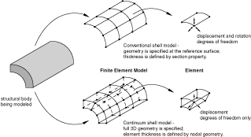
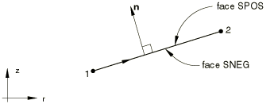
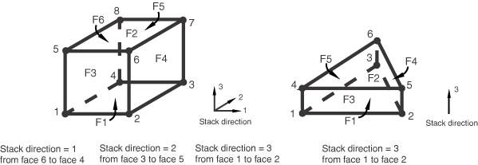
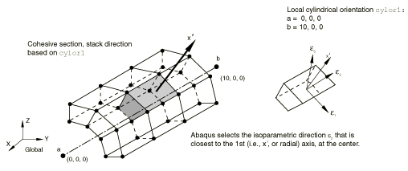

# 29.6.1 壳单元：概述


Abaqus 提供了广泛的壳建模选项。

### 概述

壳建模包括：
- 选择合适的壳单元类型（["选择壳单元，" 第 29.6.2 节](pt06ch29s06alm16.md)）；
- 定义表面的初始几何形状（["定义常规壳单元的初始几何形状，" 第 29.6.3 节](pt06ch29s06alm17.md)）；
- 确定是否需要数值积分来定义壳截面行为（["壳截面行为，" 第 29.6.4 节](pt06ch29s06alm18.md)）；和
- 定义壳截面行为（["使用在分析过程中积分的壳截面来定义截面行为，" 第 29.6.5 节](pt06ch29s06alm19.md) 或 ["使用通用壳截面来定义截面行为，" 第 29.6.6 节](pt06ch29s06alm20.md)）。

### 常规壳与连续壳

壳单元用于对一个维度（厚度）显着小于其他维度的结构进行建模。常规壳单元利用此条件通过在参考表面定义几何形状来离散化物体。在这种情况下，厚度通过截面属性定义。常规壳单元具有位移和旋转自由度。

相比之下，连续壳单元离散化整个三维物体。厚度由单元节点几何形状确定。连续壳单元仅具有位移自由度。从建模的角度来看，连续壳单元看起来像三维连续实体，但其运动学和本构行为与常规壳单元相似。

[图 29.6.1-1](pt06ch29s06abo27.md#eshell-shell-vs-scon) 说明了常规壳和连续壳单元之间的差异。

**图 29.6.1-1** 常规壳与连续壳单元。



### 约定

壳单元使用的约定在下面定义。

#### 在空间中壳表面上局部方向的定义

壳表面上用于定义各向异性材料属性以及报告应力和应变分量的默认局部方向在 ["约定，" 第 1.2.2 节](pt01ch01s02aus02.md) 中定义。您可以通过定义局部方向来定义其他方向（见["方向，" 第 2.2.5 节](pt01ch02s02aus15.md)），但 SAX1、SAX2 和 SAX2T 单元（["轴对称壳单元库，" 第 29.6.9 节](pt06ch29s06ael19.md)）不支持方向。可以为壳单元分配通过分布定义的空间变化局部坐标系（["分布定义，" 第 2.8.1 节](pt01ch02s08aus26.md)）。对于 SAXA 单元（["具有非线性非对称变形的轴对称壳单元，" 第 29.6.10 节](pt06ch29s06ael20.md)），任何各向异性材料定义必须在  和  处关于 *r*–*z* 平面对称。

在大位移（几何非线性）分析中，这些局部方向随该点表面平均旋转而旋转。它们作为当前配置中的方向输出，但在 Abaqus/Standard 中仅提供大旋转但小应变的壳单元（单元类型 STRI3、STRI65、S4R5、S8R、S8RT、S8R5、S9R5——见["选择壳单元，" 第 29.6.2 节](pt06ch29s06alm16.md)），它们作为参考配置中的方向输出。因此，在几何非线性分析中，在显示这些方向或显示 Abaqus/CAE 中的应力、应变或截面力或弯矩的主值时，应使用当前（变形）配置，但 Abaqus/Standard 中的小应变单元除外，应使用参考配置。

#### 常规壳单元的正法线定义

常规壳单元的"顶"表面是正法线方向的表面，在接触定义中称为正面（SPOS）。"底"表面是沿法线负方向的表面，在接触定义中称为负面（SNEG）。在指定参考表面从壳中面的偏移时，也使用正和负来指定顶面和底面。

正法线方向定义了压力载荷施加和通过壳厚度变化的量的输出约定。施加到壳单元的正压力载荷产生沿正法线方向作用的载荷。

##### 三维常规壳

对于空间中的壳，正法线由按元素定义中指定节点的顺序围绕节点的右手定则给出。见[图 29.6.1-2](pt06ch29s06abo27.md#eshell-normal)。

**图 29.6.1-2** 三维常规壳的正法线。


##### 轴对称常规壳

对于轴对称常规壳（包括允许非对称变形的 SAXA1*n* 和 SAXA2*n* 单元），正法线方向定义为从节点 1 到节点 2 方向逆时针旋转 90 度。见[图 29.6.1-3](pt06ch29s06abo27.md#eshell-memb-axi-normal)。

**图 29.6.1-3** 常规轴对称壳的正法线。



#### 连续壳单元的法线定义

[图 29.6.1-4](pt06ch29s06abo27.md#eshell-scon-normal) 说明了连续壳的关键几何特征。

**图 29.6.1-4** 连续壳单元的默认法线和厚度方向。


正确地定向连续壳是很重要的，因为厚度方向的行为与面内方向不同。默认情况下，单元顶面和底面，以及因此的单元法线、堆叠方向和厚度方向由节点连通性定义。对于三角形面内连续壳单元（SC6R），具有角节点 1、2 和 3 的面是底面；具有角节点 4、5 和 6 的面是顶面。对于四边形连续壳单元（SC8R），具有角节点 1、2、3 和 4 的面是底面；具有角节点 5、6、7 和 8 的面是顶面。堆叠方向和厚度方向都定义为从底面到顶面的方向。定义单元厚度方向的附加选项（包括独立于节点连通性的一个选项）在下面介绍。

连续壳上的表面可以通过指定面标识符 S1–S6 来定义，识别 ["连续壳单元库，" 第 29.6.8 节](pt06ch29s06ael18.md) 中定义的个人面。也可以使用自由表面生成。

施加到面 P1–P6 的压力载荷的定义与连续单元类似，正压力指向单元内部。

#### 定义堆叠和厚度方向

默认情况下，连续壳堆叠方向和厚度方向由节点连通性定义，如[图 29.6.1-4](pt06ch29s06abo27.md#eshell-scon-normal) 所示。或者，您可以通过选择单元的等参数方向之一或使用方向定义来定义单元堆叠方向和厚度方向。

##### 基于单元等参数方向定义堆叠和厚度方向

您可以定义单元堆叠方向沿单元的等参数方向之一（见[图 29.6.1-5](pt06ch29s06abo27.md#eshell-scon-stackdir) 中的单元堆叠方向）。8 节点六面体连续壳有三个可能的堆叠方向；6 节点面内三角形连续壳只有一个堆叠方向，即单元 3 等参数方向。默认堆叠方向是 3，提供与上一节概述相同的厚度和堆叠方向。

要获得所需的厚度方向，等参数方向的选择取决于单元连通性。对于与网格无关的规格，使用如下所述的基于方向的方法。

**图 29.6.1-5** SC6R 和 SC8R 单元的堆叠方向。



| **输入文件用法：** | 使用以下选项之一基于单元的等参数方向定义单元堆叠方向： |
| --- | --- |
|  | ``` [*SHELL SECTION](../key/key-link.md#usb-kws-mshellsection), STACK DIRECTION=*n* [*SHELL GENERAL SECTION](../key/key-link.md#usb-kws-mshellgensect), STACK DIRECTION=*n* ``` 其中 *n* = 1、2 或 3。 |

| **Abaqus/CAE 用法：** | 如果连续壳使用复合铺层定义，则使用以下选项基于单元的等参数方向定义堆叠方向： |
| --- | --- |
|  | Property 模块：**Create Composite Layup**：选择 **Continuum Shell** 作为 **Element Type**：**Stacking Direction**：**Element direction 1**、**Element direction 2** 或 **Element direction 3** 如果连续壳使用复合壳截面定义，则使用以下选项基于单元的等参数方向定义堆叠方向：****Assign****Material Orientation****：选择区域：**Use Default Orientation or Other Method**：**Stacking Direction**：**Element isoparametric direction 1**、**Element isoparametric direction 2** 或 **Element isoparametric direction 3** |

##### 基于方向定义定义堆叠和厚度方向

或者，您可以基于局部方向定义来定义单元堆叠方向。对于壳单元，方向定义定义了一个轴，局部 1 和 2 材料方向可绕该轴旋转。该轴也定义了一个近似的法线方向。单元堆叠和厚度方向定义为最接近此近似法线的单元等参数方向（见[图 29.6.1-6](pt06ch29s06abo27.md#eshell-scon-stackori)）。

**图 29.6.1-6** 说明使用圆柱坐标系定义堆叠方向的示例。



[" pinched cylinder 问题，" Abaqus 基准指南第 2.3.2 节](../bmk/bmk-link.md#bmk-elm-pinchcyl) 和 ["LE3：点载荷的半球壳，" Abaqus 基准指南第 4.2.3 节](../bmk/bmk-link.md#bmk-nfm-le3) 分别说明了使用圆柱和球面方向系统来定义独立于节点连通性的堆叠和厚度方向。

| **输入文件用法：** | 使用以下选项之一基于用户定义的方向定义单元堆叠方向： |
| --- | --- |
|  | ``` [*SHELL SECTION](../key/key-link.md#usb-kws-mshellsection), STACK DIRECTION=ORIENTATION, ORIENTATION=*name* [*SHELL GENERAL SECTION](../key/key-link.md#usb-kws-mshellgensect), STACK DIRECTION=ORIENTATION, ORIENTATION=*name* ``` |

| **Abaqus/CAE 用法：** | 如果连续壳使用复合铺层定义，则使用以下选项基于用户定义的方向定义堆叠方向： |
| --- | --- |
|  | Property 模块：**Create Composite Layup**：选择 **Continuum Shell** 作为 **Element Type**：**Stacking Direction**：**Layup orientation** 如果连续壳使用复合壳截面定义，则使用以下选项基于用户定义的方向定义堆叠方向：****Assign****Material Orientation****：选择区域：**Use Default Orientation or Other Method**：**Stacking Direction**：**Normal direction of material orientation** |

##### 验证单元堆和厚度方向

您可以通过等值线显示单元截面厚度或绘制材料轴来在 Abaqus/CAE 中直观地验证单元堆和厚度方向。通常，面内尺寸显着大于单元厚度。通过等值线显示壳截面厚度（输出变量 STH），您可以轻松验证所有单元方向正确且具有正确的厚度。如果单元方向不正确，面内尺寸之一将成为单元截面厚度，导致不连续的等值线图。

或者，您可以绘制材料轴来验证 3 轴指向所需的法线方向。如果单元方向不正确，面内轴之一（1 轴或 2 轴）将指向法线方向。

#### 通过壳厚度的截面点编号

通过壳厚度的截面点连续编号，从点 1 开始。对于在分析过程中积分的壳截面，如果使用 Simpson 法则，则截面点 1 恰好在壳的底表面上；如果使用高斯积分，则是最接近底表面的点。对于通用壳截面，截面点 1 始终在壳的底表面上。

对于均匀截面，截面点的总数由通过厚度的积分点数定义。对于在分析过程中积分的壳截面，您可以定义通过厚度的积分点数。Simpson 法则默认值为 5，高斯积分默认值为 3。对于通用壳截面，可以在三个截面点获取输出。

对于复合截面，截面点的总数由所有层的每层积分点数相加定义。对于在分析过程中积分的壳截面，您可以定义每层的积分点数。Simpson 法则默认值为 3，高斯积分默认值为 2。对于通用壳截面，每层输出的截面点数为 3。

#### 默认输出点

在 Abaqus/Standard 中，通过壳截面的默认输出点是壳截面底面和顶面上的点（使用 Simpson 法则积分时）或最接近底面和顶面的点（使用高斯积分时）。例如，如果通过单层壳使用五个积分点，则将为截面点 1（底面）和 5（顶面）提供输出。

在 Abaqus/Explicit 中，通过壳截面的所有截面点都被写入结果文件以进行单元输出请求。


