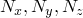
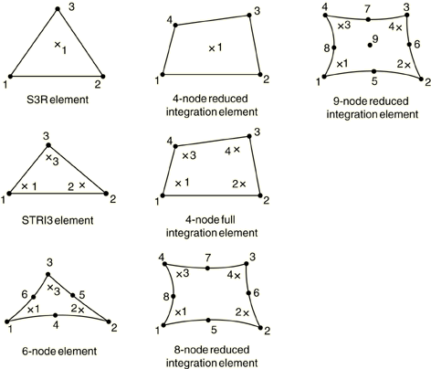
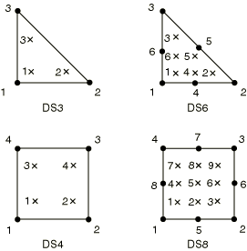

# 29.6.7 三维常规壳单元库

**产品：** Abaqus/Standard  Abaqus/Explicit  Abaqus/CAE

##### **参考**

- ["壳单元：概述，" 第 29.6.1 节](pt06ch29s06abo27.md)
- ["选择壳单元，" 第 29.6.2 节](pt06ch29s06alm16.md)
- [*NODAL THICKNESS](../key/key-link.md#usb-kws-mnodalthickness)
- [*SHELL GENERAL SECTION](../key/key-link.md#usb-kws-mshellgensect)
- [*SHELL SECTION](../key/key-link.md#usb-kws-mshellsection)

### 概述

本节提供 Abaqus/Standard 和 Abaqus/Explicit 中可用的三维壳单元的参考。

### 单元类型

#### 应力/位移单元

| STRI3(S) | 3 节点三角形薄壳 |
| --- | --- |
|  |  |

| S3 | 3 节点三角形通用壳，有限膜应变（与单元 S3R 相同） |
| --- | --- |
|  |  |

| S3R | 3 节点三角形通用壳，有限膜应变（与单元 S3 相同） |
| --- | --- |
|  |  |

| S3RS(E) | 3 节点三角形壳，小膜应变 |
| --- | --- |
|  |  |

| STRI65(S) | 6 节点三角形薄壳，每个节点使用五个自由度 |
| --- | --- |
|  |  |

| S4 | 4 节点通用壳，有限膜应变 |
| --- | --- |
|  |  |

| S4R | 4 节点通用壳，减少积分并带有沙漏控制，有限膜应变 |
| --- | --- |
|  |  |

| S4RS(E) | 4 节点，减少积分，带有沙漏控制，小膜应变壳 |
| --- | --- |
|  |  |

| S4RSW(E) | 4 节点，减少积分，带有沙漏控制，小膜应变壳，在小应变公式中考虑翘曲 |
| --- | --- |
|  |  |

| S4R5(S) | 4 节点薄壳，减少积分并带有沙漏控制，每个节点使用五个自由度 |
| --- | --- |
|  |  |

| S8R(S) | 8 节点双曲厚壳，减少积分 |
| --- | --- |
|  |  |

| S8R5(S) | 8 节点双曲薄壳，减少积分，每个节点使用五个自由度 |
| --- | --- |
|  |  |

| S9R5(S) | 9 节点双曲薄壳，减少积分，每个节点使用五个自由度 |
| --- | --- |
|  |  |

##### 激活的自由度

1、2、3、4、5、6 适用于 STRI3、S3R、S3RS、S4、S4R、S4RS、S4RSW、S8R

1、2、3 和两个面内旋转适用于 STRI65、S4R5、S8R5、S9R5 在大多数节点

1、2、3、4、5、6 适用于 STRI65、S4R5、S8R5、S9R5 在以下任何节点
- 在旋转自由度上具有边界条件的节点；
- 参与使用旋转自由度的多点约束的节点；
- 连接到梁或在使用所有节点六个自由度的壳单元（如 S4R、S8R、STRI3 等）的节点；
- 是不同单元具有不同表面法线的点（用户指定的法线定义或因为表面折叠而由 Abaqus 创建的法线定义）；或
- 承受弯矩的节点。

##### 附加解变量

单元类型 S8R5 在内部生成的体中节点处有三个位移和两个旋转变量。

#### 热传导单元

| DS3(S) | 3 节点三角形壳 |
| --- | --- |
|  |  |

| DS4(S) | 4 节点四边形壳 |
| --- | --- |
|  |  |

| DS6(S) | 6 节点三角形壳 |
| --- | --- |
|  |  |

| DS8(S) | 8 节点四边形壳 |
| --- | --- |
|  |  |

##### 激活的自由度

11、12 等（穿过厚度的温度，如["选择壳单元，" 第 29.6.2 节](pt06ch29s06alm16.md)中所述）

##### 附加解变量

无。

#### 耦合温度-位移单元

| S3T(S) | 3 节点三角形通用壳，有限膜应变，壳表面上的双线性温度（与单元 S3RT 相同） |
| --- | --- |
|  |  |

| S3RT | 3 节点三角形通用壳，有限膜应变，壳表面上的双线性温度（对于 Abaqus/Standard，它与单元 S3T 相同） |
| --- | --- |
|  |  |

| S4T(S) | 4 节点通用壳，有限膜应变，壳表面上的双线性温度 |
| --- | --- |
|  |  |

| S4RT | 4 节点通用壳，减少积分并带有沙漏控制，有限膜应变，壳表面上的双线性温度 |
| --- | --- |
|  |  |

| S8RT(S) | 8 节点厚壳，双二次位移，壳表面上的双线性温度 |
| --- | --- |
|  |  |

##### 激活的自由度

1、2、3、4、5、6 在所有节点

11、12、13 等（穿过厚度的温度，如["选择壳单元，" 第 29.6.2 节](pt06ch29s06alm16.md)中所述）在所有节点适用于 S3T、S3RT、S4T 和 S4RT；仅在角节点适用于 S8RT

##### 附加解变量

无。

### 需要的节点坐标

，以及对于 Abaqus/Standard 中具有位移自由度的壳，可选择提供 ，即节点处壳法线的方向余弦。

### 单元属性定义

| **输入文件用法：** | 对于应力/位移单元使用以下任一选项： |
| --- | --- |
|  | ``` [*SHELL SECTION](../key/key-link.md#usb-kws-mshellsection) [*SHELL GENERAL SECTION](../key/key-link.md#usb-kws-mshellgensect) ``` 对于热传导或耦合温度-位移单元使用以下选项： ``` [*SHELL SECTION](../key/key-link.md#usb-kws-mshellsection) ``` 此外，对于变厚度壳使用以下选项： ``` [*NODAL THICKNESS](../key/key-link.md#usb-kws-mnodalthickness) ``` |

| **Abaqus/CAE 用法：** | Property 模块：**Create Section**：选择 **Shell** 作为section **Category**，选择 **Homogeneous** 或 **Composite** 作为 section **Type** |
| --- | --- |

### 基于单元的加载

### 分布载荷

分布载荷适用于所有具有位移自由度的单元。如["分布载荷，" 第 34.4.3 节](pt07ch34s04aus122.md)中所述进行指定。

如果等效截面属性作为通用壳截面定义的一部分直接指定，则体力、离心载荷和科里奥利力必须以单位面积的力给出。

**载荷 ID (*DLOAD)：**  BX**Abaqus/CAE 载荷/相互作用：**  **Body force****单位：**  [FL3](../popups/usb-int-iconventions-unitsym.md)**描述：**  全局 *X* 方向的体力（以单位体积的力给出大小）。

**载荷 ID (*DLOAD)：**  BY**Abaqus/CAE 载荷/相互作用：**  **Body force****单位：**  [FL3](../popups/usb-int-iconventions-unitsym.md)**描述：**  全局 *Y* 方向的体力（以单位体积的力给出大小）。

**载荷 ID (*DLOAD)：**  BZ**Abaqus/CAE 载荷/相互作用：**  **Body force****单位：**  [FL3](../popups/usb-int-iconventions-unitsym.md)**描述：**  全局 *Z* 方向的体力（以单位体积的力给出大小）。

**载荷 ID (*DLOAD)：**  BXNU**Abaqus/CAE 载荷/相互作用：**  **Body force****单位：**  [FL3](../popups/usb-int-iconventions-unitsym.md)**描述：**  全局 *X* 方向的非均匀体力（以单位体积的力给出大小），幅度通过 Abaqus/Standard 中的用户子程序 [`DLOAD`](../sub/sub-link.md#sub-xsl-dload) 和 Abaqus/Explicit 中的 [`VDLOAD`](../sub/sub-link.md#sub-xsl-vdload) 提供。

**载荷 ID (*DLOAD)：**  BYNU**Abaqus/CAE 载荷/相互作用：**  **Body force****单位：**  [FL3](../popups/usb-int-iconventions-unitsym.md)**描述：**  全局 *Y* 方向的非均匀体力（以单位体积的力给出大小），幅度通过 Abaqus/Standard 中的用户子程序 [`DLOAD`](../sub/sub-link.md#sub-xsl-dload) 和 Abaqus/Explicit 中的 [`VDLOAD`](../sub/sub-link.md#sub-xsl-vdload) 提供。

**载荷 ID (*DLOAD)：**  BZNU**Abaqus/CAE 载荷/相互作用：**  **Body force****单位：**  [FL3](../popups/usb-int-iconventions-unitsym.md)**描述：**  全局 *Z* 方向的非均匀体力（以单位体积的力给出大小），幅度通过 Abaqus/Standard 中的用户子程序 [`DLOAD`](../sub/sub-link.md#sub-xsl-dload) 和 Abaqus/Explicit 中的 [`VDLOAD`](../sub/sub-link.md#sub-xsl-vdload) 提供。

**载荷 ID (*DLOAD)：**  CENT(S)**Abaqus/CAE 载荷/相互作用：**  不支持**单位：**  [FL4 (ML3T2)](../popups/usb-int-iconventions-unitsym.md)**描述：**  离心载荷（大小定义为 ，其中  是质量密度， 是角速度）。

**载荷 ID (*DLOAD)：**  CENTRIF(S)**Abaqus/CAE 载荷/相互作用：**  **Rotational body force****单位：**  [T2](../popups/usb-int-iconventions-unitsym.md)**描述：**  离心载荷（大小输入为 ，其中  是角速度）。

**载荷 ID (*DLOAD)：**  CORIO(S)**Abaqus/CAE 载荷/相互作用：**  **Coriolis force****单位：**  [FL4T (ML3T1)](../popups/usb-int-iconventions-unitsym.md)**描述：**  科里奥利力（大小输入 ，其中  是质量密度， 是角速度）。在直接稳态动力学分析中不考虑科里奥利加载带来的载荷刚度。

**载荷 ID (*DLOAD)：**  EDLD*n***Abaqus/CAE 载荷/相互作用：**  **Shell edge load****单位：**  [FL1](../popups/usb-int-iconventions-unitsym.md)**描述：**  边缘 *n* 上的通用牵引力。

**载荷 ID (*DLOAD)：**  EDLD*n*NU(S)**Abaqus/CAE 载荷/相互作用：**  不支持**单位：**  [FL1](../popups/usb-int-iconventions-unitsym.md)**描述：**  边缘 *n* 上的非均匀通用牵引力，大小和方向通过用户子程序 [`UTRACLOAD`](../sub/sub-link.md#sub-xsl-utracload) 提供。

**载荷 ID (*DLOAD)：**  EDMOM*n***Abaqus/CAE 载荷/相互作用：**  **Shell edge load****单位：**  [F](../popups/usb-int-iconventions-unitsym.md)**描述：**  边缘 *n* 上的弯矩。

**载荷 ID (*DLOAD)：**  EDMOM*n*NU(S)**Abaqus/CAE 载荷/相互作用：**  不支持**单位：**  [F](../popups/usb-int-iconventions-unitsym.md)**描述：**  边缘 *n* 上的非均匀弯矩，大小通过用户子程序 [`UTRACLOAD`](../sub/sub-link.md#sub-xsl-utracload) 提供。

**载荷 ID (*DLOAD)：**  EDNOR*n***Abaqus/CAE 载荷/相互作用：**  **Shell edge load****单位：**  [FL1](../popups/usb-int-iconventions-unitsym.md)**描述：**  边缘 *n* 上的法向牵引力。

**载荷 ID (*DLOAD)：**  EDNOR*n*NU(S)**Abaqus/CAE 载荷/相互作用：**  不支持**单位：**  [FL1](../popups/usb-int-iconventions-unitsym.md)**描述：**  边缘 *n* 上的非均匀法向牵引力，大小通过用户子程序 [`UTRACLOAD`](../sub/sub-link.md#sub-xsl-utracload) 提供。

**载荷 ID (*DLOAD)：**  EDSHR*n***Abaqus/CAE 载荷/相互作用：**  **Shell edge load****单位：**  [FL1](../popups/usb-int-iconventions-unitsym.md)**描述：**  边缘 *n* 上的剪切牵引力。

**载荷 ID (*DLOAD)：**  EDSHR*n*NU(S)**Abaqus/CAE 载荷/相互作用：**  不支持**单位：**  [FL1](../popups/usb-int-iconventions-unitsym.md)**描述：**  边缘 *n* 上的非均匀剪切牵引力，大小通过用户子程序 [`UTRACLOAD`](../sub/sub-link.md#sub-xsl-utracload) 提供。

**载荷 ID (*DLOAD)：**  EDTRA*n***Abaqus/CAE 载荷/相互作用：**  **Shell edge load****单位：**  [FL1](../popups/usb-int-iconventions-unitsym.md)**描述：**  边缘 *n* 上的横向牵引力。

**载荷 ID (*DLOAD)：**  EDTRA*n*NU(S)**Abaqus/CAE 载荷/相互作用：**  不支持**单位：**  [FL1](../popups/usb-int-iconventions-unitsym.md)**描述：**  边缘 *n* 上的非均匀横向牵引力，大小通过用户子程序 [`UTRACLOAD`](../sub/sub-link.md#sub-xsl-utracload) 提供。

**载荷 ID (*DLOAD)：**  GRAV**Abaqus/CAE 载荷/相互作用：**  **Gravity****单位：**  [LT2](../popups/usb-int-iconventions-unitsym.md)**描述：**  指定方向的重力加载（大小输入为加速度）。

**载荷 ID (*DLOAD)：**  HP(S)**Abaqus/CAE 载荷/相互作用：**  不支持**单位：**  [FL2](../popups/usb-int-iconventions-unitsym.md)**描述：**  作用于单元参考表面并在全局 *Z* 中线性变化的静水压力。压力在正单元法线方向为正。

**载荷 ID (*DLOAD)：**  P**Abaqus/CAE 载荷/相互作用：**  **Pressure****单位：**  [FL2](../popups/usb-int-iconventions-unitsym.md)**描述：**  作用于单元参考表面的压力。压力在正单元法线方向为正。

**载荷 ID (*DLOAD)：**  PNU**Abaqus/CAE 载荷/相互作用：**  不支持**单位：**  [FL2](../popups/usb-int-iconventions-unitsym.md)**描述：**  作用于单元参考表面的非均匀压力，大小通过 Abaqus/Standard 中的用户子程序 [`DLOAD`](../sub/sub-link.md#sub-xsl-dload) 和 Abaqus/Explicit 中的 [`VDLOAD`](../sub/sub-link.md#sub-xsl-vdload) 提供。压力在正单元法线方向为正。

**载荷 ID (*DLOAD)：**  ROTA(S)**Abaqus/CAE 载荷/相互作用：**  **Rotational body force****单位：**  [T2](../popups/usb-int-iconventions-unitsym.md)**描述：**  旋转加速度载荷（大小输入为 ，其中  是旋转加速度）。

**载荷 ID (*DLOAD)：**  ROTDYNF(S)**Abaqus/CAE 载荷/相互作用：**  不支持**单位：**  [T1](../popups/usb-int-iconventions-unitsym.md)**描述：**  转子动力学载荷（大小输入为 ，其中  是角速度）。

**载荷 ID (*DLOAD)：**  SBF(E)**Abaqus/CAE 载荷/相互作用：**  不支持**单位：**  [FL5T](../popups/usb-int-iconventions-unitsym.md)**描述：**  全局 *X*、*Y* 和 *Z* 方向的滞止体力。

**载荷 ID (*DLOAD)：**  SP(E)**Abaqus/CAE 载荷/相互作用：**  不支持**单位：**  [FL4T2](../popups/usb-int-iconventions-unitsym.md)**描述：**  作用于单元参考表面的滞止压力。

**载荷 ID (*DLOAD)：**  TRSHR**Abaqus/CAE 载荷/相互作用：**  **Surface traction****单位：**  [FL2](../popups/usb-int-iconventions-unitsym.md)**描述：**  单元参考表面上的剪切牵引力。

**载荷 ID (*DLOAD)：**  TRSHRNU(S)**Abaqus/CAE 载荷/相互作用：**  不支持**单位：**  [FL2](../popups/usb-int-iconventions-unitsym.md)**描述：**  单元参考表面上的非均匀剪切牵引力，大小和方向通过用户子程序 [`UTRACLOAD`](../sub/sub-link.md#sub-xsl-utracload) 提供。

**载荷 ID (*DLOAD)：**  TRVEC**Abaqus/CAE 载荷/相互作用：**  **Surface traction****单位：**  [FL2](../popups/usb-int-iconventions-unitsym.md)**描述：**  单元参考表面上的通用牵引力。

**载荷 ID (*DLOAD)：**  TRVECNU(S)**Abaqus/CAE 载荷/相互作用：**  不支持**单位：**  [FL2](../popups/usb-int-iconventions-unitsym.md)**描述：**  单元参考表面上的非均匀通用牵引力，大小和方向通过用户子程序 [`UTRACLOAD`](../sub/sub-link.md#sub-xsl-utracload) 提供。

**载荷 ID (*DLOAD)：**  VBF(E)**Abaqus/CAE 载荷/相互作用：**  不支持**单位：**  [FL4T](../popups/usb-int-iconventions-unitsym.md)**描述：**  全局 *X*、*Y* 和 *Z* 方向的粘性体力。

**载荷 ID (*DLOAD)：**  VP(E)**Abaqus/CAE 载荷/相互作用：**  不支持**单位：**  [FL3T](../popups/usb-int-iconventions-unitsym.md)**描述：**  粘性表面压力。粘性压力与单元面法向速度成正比，并与运动方向相反。

### 基础

基础适用于具有位移自由度的 Abaqus/Standard 单元。如["单元基础，" 第 2.2.2 节](pt01ch02s02aus12.md)中所述进行指定。

**载荷 ID (*FOUNDATION)：**  F(S)**Abaqus/CAE 载荷/相互作用：**  **Elastic foundation****单位：**  [FL3](../popups/usb-int-iconventions-unitsym.md)**描述：**  沿壳法线方向的弹性基础。

### 分布热通量

分布热通量适用于具有温度自由度的单元。如["热载荷，" 第 34.4.4 节](pt07ch34s04aus123.md)中所述进行指定。

**载荷 ID (*DFLUX)：**  BF(S)**Abaqus/CAE 载荷/相互作用：**  **Body heat flux****单位：**  [JL3 T1](../popups/usb-int-iconventions-unitsym.md)**描述：**  单位体积的体积热通量。

**载荷 ID (*DFLUX)：**  BFNU(S)**Abaqus/CAE 载荷/相互作用：**  **Body heat flux****单位：**  [JL3 T1](../popups/usb-int-iconventions-unitsym.md)**描述：**  单位体积的非均匀体积热通量，大小通过用户子程序 [`DFLUX`](../sub/sub-link.md#sub-xsl-dflux) 提供。

**载荷 ID (*DFLUX)：**  SNEG(S)**Abaqus/CAE 载荷/相互作用：**  **Surface heat flux****单位：**  [JL2 T1](../popups/usb-int-iconventions-unitsym.md)**描述：**  单位面积的表面热通量，流入单元底面。

**载荷 ID (*DFLUX)：**  SPOS(S)**Abaqus/CAE 载荷/相互作用：**  **Surface heat flux****单位：**  [JL2 T1](../popups/usb-int-iconventions-unitsym.md)**描述：**  单位面积的表面热通量，流入单元顶面。

**载荷 ID (*DFLUX)：**  SNEGNU(S)**Abaqus/CAE 载荷/相互作用：**  不支持**单位：**  [JL2 T1](../popups/usb-int-iconventions-unitsym.md)**描述：**  流入单元底面的单位面积非均匀表面热通量，大小通过用户子程序 [`DFLUX`](../sub/sub-link.md#sub-xsl-dflux) 提供。

**载荷 ID (*DFLUX)：**  SPOSNU(S)**Abaqus/CAE 载荷/相互作用：**  不支持**单位：**  [JL2 T1](../popups/usb-int-iconventions-unitsym.md)**描述：**  流入单元顶面的单位面积非均匀表面热通量，大小通过用户子程序 [`DFLUX`](../sub/sub-link.md#sub-xsl-dflux) 提供。

### 薄膜条件

薄膜条件适用于具有温度自由度的单元。如["热载荷，" 第 34.4.4 节](pt07ch34s04aus123.md)中所述进行指定。

**载荷 ID (*FILM)：**  FNEG(S)**Abaqus/CAE 载荷/相互作用：**  **Surface film condition****单位：**  [JL2 T11](../popups/usb-int-iconventions-unitsym.md)**描述：**  在单元底面上提供的薄膜系数和环境温度（单位为 ）。

**载荷 ID (*FILM)：**  FPOS(S)**Abaqus/CAE 载荷/相互作用：**  **Surface film condition****单位：**  [JL2 T11](../popups/usb-int-iconventions-unitsym.md)**描述：**  在单元顶面上提供的薄膜系数和环境温度（单位为 ）。

**载荷 ID (*FILM)：**  FNEGNU(S)**Abaqus/CAE 载荷/相互作用：**  不支持**单位：**  [JL2 T11](../popups/usb-int-iconventions-unitsym.md)**描述：**  在单元底面上提供的非均匀薄膜系数和环境温度（单位为 ），大小通过用户子程序 [`FILM`](../sub/sub-link.md#sub-xsl-film) 提供。

**载荷 ID (*FILM)：**  FPOSNU(S)**Abaqus/CAE 载荷/相互作用：**  不支持**单位：**  [JL2 T11](../popups/usb-int-iconventions-unitsym.md)**描述：**  在单元顶面上提供的非均匀薄膜系数和环境温度（单位为 ），大小通过用户子程序 [`FILM`](../sub/sub-link.md#sub-xsl-film) 提供。

### 辐射类型

辐射条件适用于具有温度自由度的单元。如["热载荷，" 第 34.4.4 节](pt07ch34s04aus123.md)中所述进行指定。

**载荷 ID (*RADIATE)：**  RNEG(S)**Abaqus/CAE 载荷/相互作用：**  **Surface radiation****单位：**  [无量纲](../popups/usb-int-iconventions-unitsym.md)**描述：**  为壳底面提供的辐射率和环境温度（单位为 ）。

**载荷 ID (*RADIATE)：**  RPOS(S)**Abaqus/CAE 载荷/相互作用：**  **Surface radiation****单位：**  [无量纲](../popups/usb-int-iconventions-unitsym.md)**描述：**  为壳顶面提供的辐射率和环境温度（单位为 ）。

### 基于表面的加载

### 分布载荷

基于表面的分布载荷适用于所有具有位移自由度的单元。如["分布载荷，" 第 34.4.3 节](pt07ch34s04aus122.md)中所述进行指定。

**载荷 ID (*DSLOAD)：**  EDLD**Abaqus/CAE 载荷/相互作用：**  **Shell edge load****单位：**  [FL1](../popups/usb-int-iconventions-unitsym.md)**描述：**  基于边缘的表面上的通用牵引力。

**载荷 ID (*DSLOAD)：**  EDLDNU(S)**Abaqus/CAE 载荷/相互作用：**  **Shell edge load****单位：**  [FL1](../popups/usb-int-iconventions-unitsym.md)**描述：**  基于边缘的表面上非均匀通用牵引力，大小和方向通过用户子程序 [`UTRACLOAD`](../sub/sub-link.md#sub-xsl-utracload) 提供。

**载荷 ID (*DSLOAD)：**  EDMOM**Abaqus/CAE 载荷/相互作用：**  **Shell edge load****单位：**  [F](../popups/usb-int-iconventions-unitsym.md)**描述：**  基于边缘的表面上的弯矩。

**载荷 ID (*DSLOAD)：**  EDMOMNU(S)**Abaqus/CAE 载荷/相互作用：**  **Shell edge load****单位：**  [F](../popups/usb-int-iconventions-unitsym.md)**描述：**  基于边缘的表面上非均匀弯矩，大小通过用户子程序 [`UTRACLOAD`](../sub/sub-link.md#sub-xsl-utracload) 提供。

**载荷 ID (*DSLOAD)：**  EDNOR**Abaqus/CAE 载荷/相互作用：**  **Shell edge load****单位：**  [FL1](../popups/usb-int-iconventions-unitsym.md)**描述：**  基于边缘的表面上的法向牵引力。

**载荷 ID (*DSLOAD)：**  EDNORNU(S)**Abaqus/CAE 载荷/相互作用：**  **Shell edge load****单号：**  [FL1](../popups/usb-int-iconventions-unitsym.md)**描述：**  基于边缘的表面上非均匀法向牵引力，大小通过用户子程序 [`UTRACLOAD`](../sub/sub-link.md#sub-xsl-utracload) 提供。

**载荷 ID (*DSLOAD)：**  EDSHR**Abaqus/CAE 载荷/相互作用：**  **Shell edge load****单位：**  [FL1](../popups/usb-int-iconventions-unitsym.md)**描述：**  基于边缘的表面上的剪切牵引力。

**载荷 ID (*DSLOAD)：**  EDSHRNU(S)**Abaqus/CAE 载荷/相互作用：**  **Shell edge load****单位：**  [FL1](../popups/usb-int-iconventions-unitsym.md)**描述：**  基于边缘的表面上非均匀剪切牵引力，大小通过用户子程序 [`UTRACLOAD`](../sub/sub-link.md#sub-xsl-utracload) 提供。

**载荷 ID (*DSLOAD)：**  EDTRA**Abaqus/CAE 载荷/相互作用：**  **Shell edge load****单位：**  [FL1](../popups/usb-int-iconventions-unitsym.md)**描述：**  基于边缘的表面上的横向牵引力。

**载荷 ID (*DSLOAD)：**  EDTRANU(S)**Abaqus/CAE 载荷/相互作用：**  **Shell edge load****单位：**  [FL1](../popups/usb-int-iconventions-unitsym.md)**描述：**  基于边缘的表面上非均匀横向牵引力，大小通过用户子程序 [`UTRACLOAD`](../sub/sub-link.md#sub-xsl-utracload) 提供。

**载荷 ID (*DSLOAD)：**  HP(S)**Abaqus/CAE 载荷/相互作用：**  **Pressure****单位：**  [FL2](../popups/usb-int-iconventions-unitsym.md)**描述：**  单元参考表面上的静水压力，在全局 *Z* 中线性变化。压力在表面法线相反方向为正。

**载荷 ID (*DSLOAD)：**  P**Abaqus/CAE 载荷/相互作用：**  **Pressure****单位：**  [FL2](../popups/usb-int-iconventions-unitsym.md)**描述：**  单元参考表面上的压力。压力在表面法线相反方向为正。

**载荷 ID (*DSLOAD)：**  PNU**Abaqus/CAE 载荷/相互作用：**  **Pressure****单位：**  [FL2](../popups/usb-int-iconventions-unitsym.md)**描述：**  单元参考表面上的非均匀压力，大小通过 Abaqus/Standard 中的用户子程序 [`DLOAD`](../sub/sub-link.md#sub-xsl-dload) 和 Abaqus/Explicit 中的 [`VDLOAD`](../sub/sub-link.md#sub-xsl-vdload) 提供。压力在表面法线相反方向为正。

**载荷 ID (*DSLOAD)：**  SP(E)**Abaqus/CAE 载荷/相互作用：**  **Pressure****单位：**  [FL4T2](../popups/usb-int-iconventions-unitsym.md)**描述：**  作用于单元参考表面的滞止压力。

**载荷 ID (*DSLOAD)：**  TRSHR**Abaqus/CAE 载荷/相互作用：**  **Surface traction****单位：**  [FL2](../popups/usb-int-iconventions-unitsym.md)**描述：**  单元参考表面上的剪切牵引力。

**载荷 ID (*DSLOAD)：**  TRSHRNU(S)**Abaqus/CAE 载荷/相互作用：**  **Surface traction****单位：**  [FL2](../popups/usb-int-iconventions-unitsym.md)**描述：**  单元参考表面上非均匀剪切牵引力，大小和方向通过用户子程序 [`UTRACLOAD`](../sub/sub-link.md#sub-xsl-utracload) 提供。

**载荷 ID (*DSLOAD)：**  TRVEC**Abaqus/CAE 载荷/相互作用：**  **Surface traction****单位：**  [FL2](../popups/usb-int-iconventions-unitsym.md)**描述：**  单元参考表面上的通用牵引力。

**载荷 ID (*DSLOAD)：**  TRVECNU(S)**Abaqus/CAE 载荷/相互作用：**  **Surface traction****单位：**  [FL2](../popups/usb-int-iconventions-unitsym.md)**描述：**  单元参考表面上非均匀通用牵引力，大小和方向通过用户子程序 [`UTRACLOAD`](../sub/sub-link.md#sub-xsl-utracload) 提供。

**载荷 ID (*DSLOAD)：**  VP(E)**Abaqus/CAE 载荷/相互作用：**  **Pressure****单位：**  [FL3T](../popups/usb-int-iconventions-unitsym.md)**描述：**  粘性表面压力。粘性压力与单元面法向速度成正比，并与运动方向相反。

### 分布热通量

基于表面的分布热通量适用于具有温度自由度的单元。如["热载荷，" 第 34.4.4 节](pt07ch34s04aus123.md)中所述进行指定。

**载荷 ID (*DSFLUX)：**  S(S)**Abaqus/CAE 载荷/相互作用：**  **Surface heat flux****单位：**  [JL2 T1](../popups/usb-int-iconventions-unitsym.md)**描述：**  单位面积流入单元表面的表面热通量。

**载荷 ID (*DSFLUX)：**  SNU(S)**Abaqus/CAE 载荷/相互作用：**  **Surface heat flux****单位：**  [JL2 T1](../popups/usb-int-iconventions-unitsym.md)**描述：**  单位面积流入单元表面的非均匀表面热通量，大小通过用户子程序 [`DFLUX`](../sub/sub-link.md#sub-xsl-dflux) 提供。

### 薄膜条件

基于表面的薄膜条件适用于具有温度自由度的单元。如["热载荷，" 第 34.4.4 节](pt07ch34s04aus123.md)中所述进行指定。

**载荷 ID (*SFILM)：**  F(S)**Abaqus/CAE 载荷/相互作用：**  **Surface film condition****单位：**  [JL2 T11](../popups/usb-int-iconventions-unitsym.md)**描述：**  在单元表面上提供的薄膜系数和环境温度（单位为 ）。

**载荷 ID (*SFILM)：**  FNU(S)**Abaqus/CAE 载荷/相互作用：**  **Surface film condition****单位：**  [JL2 T11](../popups/usb-int-iconventions-unitsym.md)**描述：**  在单元表面上提供的非均匀薄膜系数和环境温度（单位为 ），大小通过用户子程序 [`FILM`](../sub/sub-link.md#sub-xsl-film) 提供。

### 辐射类型

基于表面的辐射条件适用于具有温度自由度的单元。如["热载荷，" 第 34.4.4 节](pt07ch34s04aus123.md)中所述进行指定。

**载荷 ID (*SRADIATE)：**  R(S)**Abaqus/CAE 载荷/相互作用：**  **Surface radiation****单位：**  [无量纲](../popups/usb-int-iconventions-unitsym.md)**描述：**  为单元表面提供的辐射率和环境温度（单位为 ）。

### 入射波加载

提供基于表面的入射波载荷。如["声学、冲击和耦合声学-结构分析，" 第 6.10.1 节](pt03ch06s10at29.md)中所述进行指定。如果入射波场包括从网格边界外平面的反射，则可以包括此效果。

### 单元输出

如果未为单元分配局部坐标系，则应力/应变分量以及截面力/应变在["约定，" 第 1.2.2 节](pt01ch01s02aus02.md)中约定的表面默认方向上。如果通过截面定义（["方向，" 第 2.2.5 节](pt01ch02s02aus15.md)）为单元分配了局部坐标系，则应力/应变分量和截面力/应变在局部坐标系定义的表面方向上。

在 Abaqus/Standard 中允许有限膜应变单元的大位移问题以及 Abaqus/Explicit 中的所有问题中，参考配置中定义的局部方向通过平均材料旋转旋转到当前配置中。

#### 应力、应变和其他张量分量

应力和其他张量（包括应变张量）可用于具有位移自由度的单元。所有张量具有相同的分量。例如，应力分量如下：

| S11 | 局部  直接应力。 |
| --- | --- |

| S22 | 局部  直接应力。 |
| --- | --- |

| S12 | 局部  剪切应力。 |
| --- | --- |

#### 截面力、弯矩和横向剪切力

适用于具有位移自由度的单元。

| SF1 | 局部 1 方向单位宽度的直接膜力。 |
| --- | --- |

| SF2 | 局部 2 方向单位宽度的直接膜力。 |
| --- | --- |

| SF3 | 局部 1-2 平面单位宽度的剪切膜力。 |
| --- | --- |

| SF4 | 局部 1 方向单位宽度的横向剪切力（仅适用于 S3/S3R、S3RS、S4、S4R、S4RS、S4RSW、S8R 和 S8RT）。 |
| --- | --- |

| SF5 | 局部 2 方向单位宽度的横向剪切力（仅适用于 S3/S3R、S3RS、S4、S4R、S4RS、S4RSW、S8R 和 S8RT）。 |
| --- | --- |

| SM1 | 绕局部 2 轴单位宽度的弯曲弯矩力。 |
| --- | --- |

| SM2 | 绕局部 1 轴单位宽度的弯曲弯矩力。 |
| --- | --- |

| SM3 | 局部 1-2 平面单位宽度的扭转弯矩力。 |
| --- | --- |

给定厚度 *h* 的壳截面中，单位长度法向基方向的截面力和弯矩结果可以基于此定义为


其中  是参考表面从中面的偏移。

截面力 SF6，即  在壳厚度上的积分，仅对有限应变壳单元报告，且由于平面应力本构假设为零。有限应变壳单元写入结果文件的属性总数为 9；SF6 是第六个属性。

#### 平均截面应力

适用于具有位移自由度的单元。

| SSAVG1 | 局部 1 方向的平均膜应力。 |
| --- | --- |

| SSAVG2 | 局部 2 方向的平均膜应力。 |
| --- | --- |

| SSAVG3 | 局部 1-2 平面的平均膜应力。 |
| --- | --- |

| SSAVG4 | 局部 1 方向的平均横向剪切应力。 |
| --- | --- |

| SSAVG5 | 局部 2 方向的平均横向剪切应力。 |
| --- | --- |

平均截面应力定义为


其中 *h* 是当前截面厚度。

#### 截面应变、曲率和横向剪切应变

适用于具有位移自由度的单元。

| SE1 | 局部 1 方向直接膜应变。 |
| --- | --- |

| SE2 | 局部 2 方向直接膜应变。 |
| --- | --- |

| SE3 | 局部 1-2 平面剪切膜应变。 |
| --- | --- |

| SE4 | 局部 1 方向横向剪切应变（仅适用于 S3/S3R、S3RS、S4、S4R、S4RS、S4RSW、S8R 和 S8RT）。 |
| --- | --- |

| SE5 | 局部 2 方向横向剪切应变（仅适用于 S3/S3R、S3RS、S4、S4R、S4RS、S4RSW、S8R 和 S8RT）。 |
| --- | --- |

| SE6 | 厚度方向的应变（仅适用于 S3/S3R、S3RS、S4、S4R、S4RS 和 S4RSW）。 |
| --- | --- |

| SK1 | 绕局部 2 轴的曲率变化。 |
| --- | --- |

| SK2 | 绕局部 1 轴的曲率变化。 |
| --- | --- |

| SK3 | 局部 1-2 平面的表面扭曲。 |
| --- | --- |

局部方向在["壳单元：概述，" 第 29.6.1 节](pt06ch29s06abo27.md)中定义。

#### 壳厚度

| STH | 壳厚度，即 S3/S3R、S3RS、S4、S4R、S4RS 和 S4RSW 单元的当前截面厚度。 |
| --- | --- |

#### 横向剪切应力估计

适用于 S3/S3R、S3RS、S4、S4R、S4RS、S4RSW、S8R 和 S8RT 单元。

| TSHR13 | 横向剪切应力的 13 分量。 |
| --- | --- |

| TSHR23 | 横向剪切应力的 23 分量。 |
| --- | --- |

横向剪切应力的估计值可在截面积分点处作为输出变量 TSHR13 或 TSHR23 获取，适用于 Simpson 法则和高斯积分。对于 Simpson 法则，应在非默认截面点请求变量 TSHR13 或 TSHR23 的输出，因为默认输出在壳截面截面点 1 处，横向剪切应力在该处消失。对于 Abaqus/Explicit 中的小应变单元，横向剪切应力分布对于非复合截面假定为常量，对于复合截面假定为分段常量；因此，应相应地解释积分点处的横向剪切应力。

对于单元类型 S4，横向剪切计算在单元中心进行，并在单元上假定为常量。因此，横向剪切应变、力和应力不会在单元面积上变化。

对于数值积分壳截面（Abqus/Explicit 中的小应变壳除外），复合截面中层间剪切应力的估计（即两个复合层之间界面处的横向剪切应力）只能使用 Simpson 法则获得。使用高斯积分时，复合层界面处不存在截面积分点。

与面内应力分量 S11、S22 和 S12 不同，横向剪切应力分量 TSHR13 和 TSHR23 不是从壳截面各点的本构行为计算的。它们是通过将壳截面剪切变形相关的弹性应变能与基于横向剪切应力在截面上分段二次变化（关于一个轴弯曲的条件）相关的弹性应变能进行匹配来估计的（见["复合壳和偏离中面的横向剪切刚度，" Abaqus 理论指南第 3.6.8 节](../stm/stm-link.md#stm-elm-transshearshells)）。因此，只有当壳截面的每一层使用弹性材料模型时，才支持层间剪切应力计算。如果指定了横向剪切刚度值，则无法获得层间剪切应力输出。

#### 热通量分量

适用于具有温度自由度的单元。

| HFL1 | 局部 1 方向热通量。 |
| --- | --- |

| HFL2 | 局部 2 方向热通量。 |
| --- | --- |

| HFL3 | 局部 3 方向热通量。 |
| --- | --- |

### 单元上的节点排序


### 输出积分点编号

##### 应力/位移分析



##### 热传导分析



