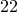
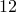
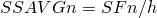
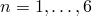
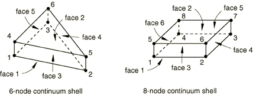
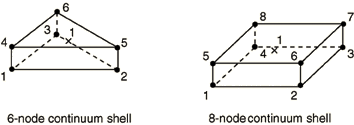

# 29.6.8 连续壳单元库


**产品：** Abaqus/Standard  Abaqus/Explicit  Abaqus/CAE  

##### **参考**

- ["壳单元：概述，" 第 29.6.1 节](pt06ch29s06abo27.md)
- ["选择壳单元，" 第 29.6.2 节](pt06ch29s06alm16.md)
- [*SHELL GENERAL SECTION](../key/key-link.md#usb-kws-mshellgensect)
- [*SHELL SECTION](../key/key-link.md#usb-kws-mshellsection)

### 概述

本节提供 Abaqus/Standard 和 Abaqus/Explicit 中可用连续壳单元的参考。

### 单元类型

#### 应力/位移单元

| SC6R | 6 节点三角形面内连续壳楔形单元，通用，有限膜应变 |
| --- | --- |
|  |

| SC8R | 8 节点六面体单元，通用，有限膜应变 |
| --- | --- |
|  |

##### 激活的自由度

1, 2, 3

##### 附加解变量

无。

#### 耦合温度-位移单元

| SC6RT | 6 节点线性位移和温度，三角形面内连续壳楔形单元，通用，有限膜应变 |
| --- | --- |
|  |

| SC8RT | 8 节点线性位移和温度，六面体单元，通用，有限膜应变 |
| --- | --- |
|  |

##### 激活的自由度

1, 2, 3, 11

##### 附加解变量

无。

### 需要的节点坐标


### 单元属性定义

| **输入文件用法：** | 使用以下任一选项： |
| --- | --- |
|  | ``` [*SHELL SECTION](../key/key-link.md#usb-kws-mshellsection) [*SHELL GENERAL SECTION](../key/key-link.md#usb-kws-mshellgensect) ``` |

| **Abaqus/CAE 用法：** | Property 模块：**Create Section**：选择 **Shell** 作为 section **Category**，选择 **Homogeneous** 或 **Composite** 作为 section **Type** |
| --- | --- |

### 基于单元的加载

### 分布载荷

分布载荷如["分布载荷，" 第 34.4.3 节](pt07ch34s04aus122.md)中所述进行指定。

**载荷 ID (*DLOAD)：**  BX**Abaqus/CAE 载荷/相互作用：**  **体力****单位：**  [FL3](../popups/usb-int-iconventions-unitsym.md)**描述：**  全局 *X* 方向的体力（以单位体积力给出）。

**载荷 ID (*DLOAD)：**  BY**Abaqus/CAE 载荷/相互作用：**  **体力****单位：**  [FL3](../popups/usb-int-iconventions-unitsym.md)**描述：**  全局 *Y* 方向的体力（以单位体积力给出）。

**载荷 ID (*DLOAD)：**  BZ**Abaqus/CAE 载荷/相互作用：**  **体力****单位：**  [FL3](../popups/usb-int-iconventions-unitsym.md)**描述：**  全局 *Z* 方向的体力（以单位体积力给出）。

**载荷 ID (*DLOAD)：**  BXNU**Abaqus/CAE 载荷/相互作用：**  **体力****单位：**  [FL3](../popups/usb-int-iconventions-unitsym.md)**描述：**  全局 *X* 方向的非均匀体力（以单位体积力给出），幅度通过 Abaqus/Standard 中的用户子程序 [`DLOAD`](../sub/sub-link.md#sub-xsl-dload) 和 Abaqus/Explicit 中的 [`VDLOAD`](../sub/sub-link.md#sub-xsl-vdload) 提供。

**载荷 ID (*DLOAD)：**  BYNU**Abaqus/CAE 载荷/相互作用：**  **体力****单位：**  [FL3](../popups/usb-int-iconventions-unitsym.md)**描述：**  全局 *Y* 方向的非均匀体力（以单位体积力给出），幅度通过 Abaqus/Standard 中的用户子程序 [`DLOAD`](../sub/sub-link.md#sub-xsl-dload) 和 Abaqus/Explicit 中的 [`VDLOAD`](../sub/sub-link.md#sub-xsl-vdload) 提供。

**载荷 ID (*DLOAD)：**  BZNU**Abaqus/CAE 载荷/相互作用：**  **体力****单位：**  [FL3](../popups/usb-int-iconventions-unitsym.md)**描述：**  全局 *Z* 方向的非均匀体力（以单位体积力给出），幅度通过 Abaqus/Standard 中的用户子程序 [`DLOAD`](../sub/sub-link.md#sub-xsl-dload) 和 Abaqus/Explicit 中的 [`VDLOAD`](../sub/sub-link.md#sub-xsl-vdload) 提供。

**载荷 ID (*DLOAD)：**  CENT(S)**Abaqus/CAE 载荷/相互作用：**  不支持**单位：**  [FL4 (ML3T2)](../popups/usb-int-iconventions-unitsym.md)**描述：**  离心载荷（幅度定义为 ，其中  是质量密度， 是角速度）。

**载荷 ID (*DLOAD)：**  CENTRIF(S)**Abaqus/CAE 载荷/相互作用：**  **旋转体力****单位：**  [T2](../popups/usb-int-iconventions-unitsym.md)**描述：**  离心载荷（幅度输入为 ，其中  是角速度）。

**载荷 ID (*DLOAD)：**  CORIO(S)**Abaqus/CAE 载荷/相互作用：**  **科里奥利力****单位：**  [FL4T (ML3T1)](../popups/usb-int-iconventions-unitsym.md)**描述：**  科里奥利力（幅度输入为 ，其中  是质量密度， 是角速度）。直接稳态动力学分析中不考虑科里奥利加载的载荷刚度。

**载荷 ID (*DLOAD)：**  GRAV**Abaqus/CAE 载荷/相互作用：**  **重力****单位：**  [LT2](../popups/usb-int-iconventions-unitsym.md)**描述：**  指定方向的重力加载（幅度输入为加速度）。

**载荷 ID (*DLOAD)：**  HP*n*(S)**Abaqus/CAE 载荷/相互作用：**  不支持**单位：**  [FL2](../popups/usb-int-iconventions-unitsym.md)**描述：**  面 *n* 上的静水压力，在全局 *Z* 中线性变化。正压力指向单元内部。

**载荷 ID (*DLOAD)：**  P*n***Abaqus/CAE 载荷/相互作用：**  **压力****单位：**  [FL2](../popups/usb-int-iconventions-unitsym.md)**描述：**  面 *n* 上的压力。正压力指向单元内部。

**载荷 ID (*DLOAD)：**  P*n*NU**Abaqus/CAE 载荷/相互作用：**  不支持**单位：**  [FL2](../popups/usb-int-iconventions-unitsym.md)**描述：**  面 *n* 上的非均匀压力，幅度通过 Abaqus/Standard 中的用户子程序 [`DLOAD`](../sub/sub-link.md#sub-xsl-dload) 和 Abaqus/Explicit 中的 [`VDLOAD`](../sub/sub-link.md#sub-xsl-vdload) 提供。正压力指向单元内部。

**载荷 ID (*DLOAD)：**  ROTA(S)**Abaqus/CAE 载荷/相互作用：**  **旋转体力****单位：**  [T2](../popups/usb-int-iconventions-unitsym.md)**描述：**  旋转加速度载荷（幅度输入为 ，其中  是旋转加速度）。

**载荷 ID (*DLOAD)：**  ROTDYNF(S)**Abaqus/CAE 载荷/相互作用：**  不支持**单位：**  [T1](../popups/usb-int-iconventions-unitsym.md)**描述：**  转子动力学载荷（幅度输入为 ，其中  是角速度）。

**载荷 ID (*DLOAD)：**  SBF(E)**Abaqus/CAE 载荷/相互作用：**  不支持**单位：**  [FL5T2](../popups/usb-int-iconventions-unitsym.md)**描述：**  全局 *X*、*Y* 和 *Z* 方向的滞止体力。

**载荷 ID (*DLOAD)：**  SP*n*(E)**Abaqus/CAE 载荷/相互作用：**  不支持**单位：**  [FL4T2](../popups/usb-int-iconventions-unitsym.md)**描述：**  面 *n* 上的滞止压力。

**载荷 ID (*DLOAD)：**  TRSHR*n***Abaqus/CAE 载荷/相互作用：**  **表面牵引****单位：**  [FL2](../popups/usb-int-iconventions-unitsym.md)**描述：**  面 *n* 上的剪切牵引。

**载荷 ID (*DLOAD)：**  TRSHR*n*NU(S)**Abaqus/CAE 载荷/相互作用：**  不支持**单位：**  [FL2](../popups/usb-int-iconventions-unitsym.md)**描述：**  面 *n* 上的非均匀剪切牵引，幅度和方向通过用户子程序 [`UTRACLOAD`](../sub/sub-link.md#sub-xsl-utracload) 提供。

**载荷 ID (*DLOAD)：**  TRVEC*n***Abaqus/CAE 载荷/相互作用：**  **表面牵引****单位：**  [FL2](../popups/usb-int-iconventions-unitsym.md)**描述：**  面 *n* 上的一般牵引。

**载荷 ID (*DLOAD)：**  TRVEC*n*NU(S)**Abaqus/CAE 载荷/相互作用：**  不支持**单位：**  [FL2](../popups/usb-int-iconventions-unitsym.md)**描述：**  面 *n* 上的非均匀一般牵引，幅度和方向通过用户子程序 [`UTRACLOAD`](../sub/sub-link.md#sub-xsl-utracload) 提供。

**载荷 ID (*DLOAD)：**  VBF(E)**Abaqus/CAE 载荷/相互作用：**  不支持**单位：**  [FL4T](../popups/usb-int-iconventions-unitsym.md)**描述：**  全局 *X*、*Y* 和 *Z* 方向的粘性体力。

**载荷 ID (*DLOAD)：**  VP*n*(E)**Abaqus/CAE 载荷/相互作用：**  不支持**单位：**  [FL3T](../popups/usb-int-iconventions-unitsym.md)**描述：**  面 *n* 上的粘性压力，施加与面法线方向速度成正比并反对运动的压力。

### 基础

基础如["单元基础，" 第 2.2.2 节](pt01ch02s02aus12.md)中所述进行指定。

**载荷 ID (*FOUNDATION)：**  F*n*(S)**Abaqus/CAE 载荷/相互作用：**  **弹性基础****单位：**  [FL3](../popups/usb-int-iconventions-unitsym.md)**描述：**  面 *n* 上的弹性基础。正压力指向单元内部。

### 分布热通量

分布热通量可用于具有温度自由度的所有单元。如["热载荷，" 第 34.4.4 节](pt07ch34s04aus123.md)中所述进行指定。

**载荷 ID (*DFLUX)：**  BF**Abaqus/CAE 载荷/相互作用：**  **体积热通量****单位：**  [JL3T1](../popups/usb-int-iconventions-unitsym.md)**描述：**  单位体积的体积热通量。

**载荷 ID (*DFLUX)：**  BFNU(S)**Abaqus/CAE 载荷/相互作用：**  **体积热通量****单位：**  [JL3T1](../popups/usb-int-iconventions-unitsym.md)**描述：**  单位体积的非均匀体积热通量，幅度通过用户子程序 [`DFLUX`](../sub/sub-link.md#sub-xsl-dflux) 提供。

**载荷 ID (*DFLUX)：**  S*n***Abaqus/CAE 载荷/相互作用：**  **表面热通量****单位：**  [JL2T1](../popups/usb-int-iconventions-unitsym.md)**描述：**  流入面 *n* 的单位面积表面热通量。

**载荷 ID (*DFLUX)：**  S*n*NU(S)**Abaqus/CAE 载荷/相互作用：**  不支持**单位：**  [JL2T1](../popups/usb-int-iconventions-unitsym.md)**描述：**  流入面 *n* 的单位面积非均匀表面热通量，幅度通过用户子程序 [`DFLUX`](../sub/sub-link.md#sub-xsl-dflux) 提供。

### 薄膜条件

薄膜条件可用于具有温度自由度的所有单元。如["热载荷，" 第 34.4.4 节](pt07ch34s04aus123.md)中所述进行指定。

**载荷 ID (*FILM)：**  F*n***Abaqus/CAE 载荷/相互作用：**  **表面薄膜条件****单位：**  [JL2T11](../popups/usb-int-iconventions-unitsym.md)**描述：**  面 *n* 上提供的薄膜系数和 sink 温度（ 的单位）。

**载荷 ID (*FILM)：**  F*n*NU(S)**Abaqus/CAE 载荷/相互作用：**  不支持**单位：**  [JL2T11](../popups/usb-int-iconventions-unitsym.md)**描述：**  面 *n* 上提供的非均匀薄膜系数和 sink 温度（ 的单位），幅度通过用户子程序 [`FILM`](../sub/sub-link.md#sub-xsl-film) 提供。

### 辐射类型

辐射条件可用于具有温度自由度的所有单元。如["热载荷，" 第 34.4.4 节](pt07ch34s04aus123.md)中所述进行指定。

**载荷 ID (*RADIATE)：**  R*n***Abaqus/CAE 载荷/相互作用：**  **表面辐射****单位：**  [无量纲](../popups/usb-int-iconventions-unitsym.md)**描述：**  面 *n* 提供的发射率和 sink 温度（ 的单位）。

### 基于面的加载

### 分布载荷

基于面的分布载荷如["分布载荷，" 第 34.4.3 节](pt07ch34s04aus122.md)中所述进行指定。

**载荷 ID (*DSLOAD)：**  HP(S)**Abaqus/CAE 载荷/相互作用：**  **压力****单位：**  [FL2](../popups/usb-int-iconventions-unitsym.md)**描述：**  施加到单元表面的静水压力，在全局 *Z* 中线性变化。压力在表面法线相反方向为正。

**载荷 ID (*DSLOAD)：**  P**Abaqus/CAE 载荷/相互作用：**  **压力****单位：**  [FL2](../popups/usb-int-iconventions-unitsym.md)**描述：**  施加到单元表面的压力。压力在表面法线相反方向为正。

**载荷 ID (*DSLOAD)：**  PNU**Abaqus/CAE 载荷/相互作用：**  **压力****单位：**  [FL2](../popups/usb-int-iconventions-unitsym.md)**描述：**  施加到单元表面的非均匀压力，幅度通过 Abaqus/Standard 中的用户子程序 [`DLOAD`](../sub/sub-link.md#sub-xsl-dload) 和 Abaqus/Explicit 中的 [`VDLOAD`](../sub/sub-link.md#sub-xsl-vdload) 提供。压力在表面法线相反方向为正。

**载荷 ID (*DSLOAD)：**  SP(E)**Abaqus/CAE 载荷/相互作用：**  **压力****单位：**  [FL4T2](../popups/usb-int-iconventions-unitsym.md)**描述：**  施加到单元参考表面的滞止压力。

**载荷 ID (*DSLOAD)：**  TRSHR**Abaqus/CAE 载荷/相互作用：**  **表面牵引****单位：**  [FL2](../popups/usb-int-iconventions-unitsym.md)**描述：**  单元参考表面上的剪切牵引。

**载荷 ID (*DSLOAD)：**  TRSHRNU(S)**Abaqus/CAE 载荷/相互作用：**  **表面牵引****单位：**  [FL2](../popups/usb-int-iconventions-unitsym.md)**描述：**  单元参考表面上的非均匀剪切牵引，幅度和方向通过用户子程序 [`UTRACLOAD`](../sub/sub-link.md#sub-xsl-utracload) 提供。

**载荷 ID (*DSLOAD)：**  TRVEC**Abaqus/CAE 载荷/相互作用：**  **表面牵引****单位：**  [FL2](../popups/usb-int-iconventions-unitsym.md)**描述：**  单元参考表面上的一般牵引。

**载荷 ID (*DSLOAD)：**  TRVECNU(S)**Abaqus/CAE 载荷/相互作用：**  **表面牵引****单位：**  [FL2](../popups/usb-int-iconventions-unitsym.md)**描述：**  单元参考表面上的非均匀一般牵引，幅度和方向通过用户子程序 [`UTRACLOAD`](../sub/sub-link.md#sub-xsl-utracload) 提供。

**载荷 ID (*DSLOAD)：**  VP(E)**Abaqus/CAE 载荷/相互作用：**  **压力****单位：**  [FL3T](../popups/usb-int-iconventions-unitsym.md)**描述：**  粘性表面压力。粘性压力与面法线方向速度成正比并反对运动。

### 分布热通量

基于面的热通量可用于具有温度自由度的所有单元。如["热载荷，" 第 34.4.4 节](pt07ch34s04aus123.md)中所述进行指定。

**载荷 ID (*DSFLUX)：**  S**Abaqus/CAE 载荷/相互作用：**  **表面热通量****单位：**  [JL2T1](../popups/usb-int-iconventions-unitsym.md)**描述：**  流入单元表面的单位面积表面热通量。

**载荷 ID (*DSFLUX)：**  SNU(S)**Abaqus/CAE 载荷/相互作用：**  **表面热通量****单位：**  [JL2T1](../popups/usb-int-iconventions-unitsym.md)**描述：**  流入单元表面的单位面积非均匀表面热通量，幅度通过用户子程序 [`DFLUX`](../sub/sub-link.md#sub-xsl-dflux) 提供。

### 薄膜条件

基于面的薄膜条件可用于具有温度自由度的所有单元。如["热载荷，" 第 34.4.4 节](pt07ch34s04aus123.md)中所述进行指定。

**载荷 ID (*SFILM)：**  F**Abaqus/CAE 载荷/相互作用：**  **表面薄膜条件****单位：**  [JL2T11](../popups/usb-int-iconventions-unitsym.md)**描述：**  单元表面上提供的薄膜系数和 sink 温度（ 的单位）。

**载荷 ID (*SFILM)：**  FNU(S)**Abaqus/CAE 载荷/相互作用：**  **表面薄膜条件****单位：**  [JL2T11](../popups/usb-int-iconventions-unitsym.md)**描述：**  单元表面上提供的非均匀薄膜系数和 sink 温度（ 的单位），幅度通过用户子程序 [`FILM`](../sub/sub-link.md#sub-xsl-film) 提供。

### 辐射类型

基于面的辐射条件可用于具有温度自由度的所有单元。如["热载荷，" 第 34.4.4 节](pt07ch34s04aus123.md)中所述进行指定。

**载荷 ID (*SRADIATE)：**  R(S)**Abaqus/CAE 载荷/相互作用：**  **表面辐射****单位：**  [无量纲](../popups/usb-int-iconventions-unitsym.md)**描述：**  单元表面上提供的发射率和 sink 温度（ 的单位）。

### 单元输出

如果未向单元分配局部坐标系，则应力/应变分量以及截面力/应变位于["约定，" 第 1.2.2 节](pt01ch01s02aus02.md)中给出的表面默认方向。如果通过截面定义（["方向，" 第 2.2.5 节](pt01ch02s02aus15.md)）向单元分配了局部坐标系，则应力/应变分量和截面力/应变位于由局部坐标系定义的表面方向。

参考配置中定义的局部方向通过平均材料旋转旋转到当前配置中。

对于复合壳，堆叠连续壳（CTSHR13 和 CTSHR23）的截面力、截面应变和横向剪切应力估计的分量报告在为其余部分定义的局部方向中（如果未使用截面方向，则为默认壳坐标系方向）。应力、应变和横向剪切应力分量（TSHR13 和 TSHR23）根据各层方向给出。

#### 应力、应变和其他张量分量

应力和其他张量（包括应变张量）可用。所有张量具有相同的分量。例如，应力分量如下：

| S11 | 局部  直接应力。 |
| --- | --- |

| S22 | 局部  直接应力。 |
| --- | --- |

| S12 | 局部  剪切应力。 |
| --- | --- |

厚度方向的应力 ，如["Abaqus/Standard 输出变量标识符，" 第 4.2.1 节](pt02ch04s02abv01.md)中所讨论，报告为零输出数据库。可以通过平均截面应力变量 SSAVG6 获取 。连续壳单元面内应力分量的输出不包括厚度方向变化引起的泊松效应。

#### 热通量分量

可用于具有温度自由度的单元。

| HFL1 | *X* 方向的热通量。 |
| --- | --- |

| HFL2 | *Y* 方向的热通量。 |
| --- | --- |

| HFL3 | *Z* 方向的热通量。 |
| --- | --- |

#### 截面力、弯矩和横向剪切力

| SF1 | 局部 1 方向单位宽度的直接膜力。 |
| --- | --- |

| SF2 | 局部 2 方向单位宽度的直接膜力。 |
| --- | --- |

| SF3 | 局部 1-2 平面单位宽度的剪切膜力。 |
| --- | --- |

| SF4 | 局部 1 方向单位宽度的横向剪切力。 |
| --- | --- |

| SF5 | 局部 2 方向单位宽度的横向剪切力。 |
| --- | --- |

| SF6 | 沿单元厚度积分的厚度应力。 |
| --- | --- |

| SM1 | 绕局部 2 轴单位宽度的弯曲力矩。 |
| --- | --- |

| SM2 | 绕局部 1 轴单位宽度的弯曲力矩。 |
| --- | --- |

| SM3 | 局部 1-2 平面单位宽度的扭曲力矩。 |
| --- | --- |

在给定厚度为 *h* 的壳截面中，单位长度法向基方向上的截面力和弯矩矩可以在此基础上定义为


其中厚度方向的应力  在厚度上恒定。连续壳单元面内截面力的输出不包括厚度方向变化引起的泊松效应。

#### 平均截面应力

| SSAVG1 | 局部 1 方向的平均膜应力。 |
| --- | --- |

| SSAVG2 | 局部 2 方向的平均膜应力。 |
| --- | --- |

| SSAVG3 | 局部 1-2 平面的平均膜应力。 |
| --- | --- |

| SSAVG4 | 局部 1 方向的平均横向剪切应力。 |
| --- | --- |

| SSAVG5 | 局部 2 方向的平均横向剪切应力。 |
| --- | --- |

| SSAVG6 | 局部 3 方向的平均厚度应力。 |
| --- | --- |

平均截面应力定义为



其中 ，*h* 是当前截面厚度。  在厚度上恒定。

#### 截面应变、曲率和横向剪切应变

| SE1 | 局部 1 方向的直接膜应变。 |
| --- | --- |

| SE2 | 局部 2 方向的直接膜应变。 |
| --- | --- |

| SE3 | 局部 1-2 平面的剪切膜应变。 |
| --- | --- |

| SE4 | 局部 1 方向的横向剪切应变。 |
| --- | --- |

| SE5 | 局部 2 方向的横向剪切应变。 |
| --- | --- |

| SE6 | 厚度方向的总应变。 |
| --- | --- |

| SK1 | 绕局部 1 轴的曲率变化。 |
| --- | --- |

| SK2 | 绕局部 2 轴的曲率变化。 |
| --- | --- |

| SK3 | 局部 1-2 平面的表面扭曲。 |
| --- | --- |

局部方向在["壳单元：概述，" 第 29.6.1 节](pt06ch29s06abo27.md)中定义。

#### 壳厚度

| STH | 截面厚度，如果考虑几何非线性则为当前截面厚度；否则为初始截面厚度。 |
| --- | --- |

#### 横向剪切应力估计

| TSHR13 | 横向剪切应力的 13 分量。 |
| --- | --- |

| TSHR23 | 横向剪切应力的 23 分量。 |
| --- | --- |

横向剪切应力的估计可在截面积分点处作为输出变量 TSHR13 或 TSHR23 获取，适用于 Simpson 法则和高斯积分。对于 Simpson 法则，应在非默认截面点请求变量 TSHR13 或 TSHR23 的输出，因为默认输出在壳截面厚度方向剪切应力为零的截面点 1 处。

对于数值积分截面，复合截面层层间剪切应力（即两个复合层界面处的横向剪切应力）的估计只能通过 Simpson 法则获得。使用高斯积分时，复合层界面处不存在截面积分点。

与面内应力分量 S11、S22 和 S12 不同，TSHR13 和 TSHR23 不是从壳截面各点的本构行为计算的。它们通过将与壳截面剪切变形相关的弹性应变能与基于横向剪切应力在截面上分段二次变化（在绕一个轴弯曲的条件下）相关的应变能进行匹配来估计（见["复合壳和从中面偏移的横向剪切刚度，" Abaqus 理论指南第 3.6.8 节](../stm/stm-link.md#stm-elm-transshearshells)）。因此，层间剪切应力计算仅在壳截面每层使用弹性材料模型时支持。如果您指定了横向剪切刚度值，则层间剪切应力输出不可用。TSHR13 和 TSHR23 仅对厚度方向只有一个单元的截面有效。对于厚度方向堆叠两个或多个连续壳单元的截面，应改用输出变量 SSAVG4 和 SSAVG5 或 CTSHR13 和 CTSHR23。在堆叠连续壳中估计横向剪切应力分布使用 SSAVG4 和 SSAVG5 的示例见["复合壳在圆柱弯曲中，" Abaqus 基准指南第 1.1.3 节](../bmk/bmk-link.md#bmk-anl-compositeshells)。

#### 堆叠连续壳的横向剪切应力估计

| CTSHR13 | 堆叠连续壳的横向剪切应力 13 分量。 |
| --- | --- |

| CTSHR23 | 堆叠连续壳的横向剪切应力 23 分量。 |
| --- | --- |

考虑堆叠连续壳层间横向剪切应力连续性的横向剪切应力估计可在截面积分点处作为输出变量 CTSHR13 或 CTSHR23 获取，适用于 Simpson 法则和高斯积分。CTSHR13 或 CTSHR23 仅在 Abaqus/Standard 中可用。

CTSHR13 和 CTSHR23 不是从壳截面各点的本构行为计算的。它们通过假设剪切应力在单元截面上呈二次变化，并通过对堆叠中相邻连续单元之间的界面横向剪切强制连续性来估计。还假定横向剪切在堆叠的自由边界处为零。

CTSHR13 和 CTSHR23 的预期用例是估计通过厚度方向横向剪切应力，用于用堆叠连续壳单元建模的平面或近似平面复合板，其中堆叠中的每个连续壳单元对单个材料层建模。CTSHR13 和 CTSHR13 的核心是"堆叠"连续壳单元的概念。

在输入文件预处理期间，Abaqus 将模型中所有连续壳分区为堆叠。"堆叠"定义为一组连续的连续壳，其第一和最后一个元素位于自由边界上，并通过顶部和底部元素表面上的共享节点连接（根据元素的堆叠方向确定）。在此上下文中，"自由边界"是连续壳单元的顶面或底面，通过其节点不连接到另一个连续壳单元。例如，假设[图 29.6.8-1](pt06ch29s06ael18.md#eshell-contstack)中所有元素的堆叠方向为 *z* 方向，则元素 1-6 将形成一个堆叠。

**图 29.6.8-1** 通过厚度堆叠六个连续壳的复合板网格。


重要的是要强调，连续壳的堆叠通过共享节点连接，而不是通过约束或其他元素。例如，假设在[图 29.6.8-1](pt06ch29s06ael18.md#eshell-contstack)中，元素对 1-2、2-3、4-5 和 5-6 彼此通过共享节点连接，但元素 3 和 4 通过约束（如绑定约束）连接。在这种情况下，Abaqus 会将元素 3 的底面和元素 4 的顶面解释为自由边界；因此，元素 1-3 将形成一个堆叠，元素 4-6 将形成第二个独立的堆叠。另一个例子，假设元素 4 不是连续壳单元。在这种情况下，元素 1-3 将形成一个堆叠，元素 5-6 将形成另一个堆叠。在最后一个例子中，假设元素 1-5 的堆叠方向为全局 *z* 方向，元素 6 的堆叠方向为全局 *x* 方向。在这种情况下，元素 1-5 将形成一个独立于元素 6 的堆叠。在刚才讨论的三种情况下，CTSHR13 和 CTSHR23 的计算值可能不是您想要的。更可能的是，您希望元素 1-6 在同一个堆叠中。可能需要更改模型以实现此目的。您可以通过模型定义数据请求在数据文件中查看连续壳单元到堆叠的分区。

堆叠中的连续壳单元必须满足某些标准；否则，Abaqus 会将堆叠标记为计算 CTSHR13 或 CTSHR23 的"无效"堆叠。如果堆叠被标记为无效，则不会计算 CTSHR13 或 CTSHR23，并将其设置为该堆叠中所有连续壳单元的零值。如果连续壳单元没有弹性材料模型，如果您为堆叠中的任何元素指定了横向剪切，或者元素被指定为刚性，则该堆叠被标记为无效。如果堆叠中任何元素的法线与堆叠的平均法线不在 10 度以内，则堆叠也被标记为无效。此外，如果在分析过程中移除了连续壳单元，则该元素所属的堆叠被标记为无效，直到元素被重新激活。

CTSHR13 和 CTSHR23 还有其他一些限制。CTSHR13 和 CTSHR23 不适用于任何具有多层复合材料定义的连续壳单元。但是，在堆叠中有多层复合单元不会使堆叠无效。为计算 CTSHR13 和 CTSHR13，任何单个堆叠中最多可放置 500 个连续壳单元。如果堆叠超过 500 个连续壳单元，Abaqus 会在输入文件预处理期间发出警告消息，并且不会计算 CTSHR13 和 CTSHR23，并将其设置为模型中所有连续壳单元的零值。如果元素操作并行运行，则 CTSHR13 和 CTSHR23 不可用（见["Abaqus/Standard 中的并行执行，" 第 3.5.2 节](pt01ch03s05aus33.md)）。CTSHR13 或 CTSHR23 目前仅可用于静态和直接积分动态分析。

在堆叠连续壳中估计横向剪切应力分布使用 CTSHR13 和 CTSHR23 的示例见["复合壳在圆柱弯曲中，" Abaqus 基准指南第 1.1.3 节](../bmk/bmk-link.md#bmk-anl-compositeshells)。

### 单元上的节点顺序



### 输出积分点编号

##### 应力/位移分析


