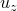
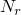
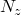
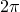
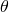
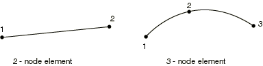

# 29.6.9 轴对称壳单元库


**产品：** Abaqus/Standard  Abaqus/Explicit  Abaqus/CAE  

##### **参考**

- ["壳单元：概述，" 第 29.6.1 节](pt06ch29s06abo27.md)
- ["选择壳单元，" 第 29.6.2 节](pt06ch29s06alm16.md)
- [*NODAL THICKNESS](../key/key-link.md#usb-kws-mnodalthickness)
- [*SHELL GENERAL SECTION](../key/key-link.md#usb-kws-mshellgensect)
- [*SHELL SECTION](../key/key-link.md#usb-kws-mshellsection)

### 概述

本节提供 Abaqus/Standard 和 Abaqus/Explicit 中可用轴对称壳单元的参考。对于预期非轴对称行为的轴对称壳几何，请使用 Abaqus/Standard 中可用的 SAXA 单元（见["具有非线性非对称变形的轴对称壳单元，" 第 29.6.10 节](pt06ch29s06ael20.md)）。

### 约定

坐标 1 是 *r*，坐标 2 是 *z*。*r* 方向对应全局 *X* 方向，*z* 方向对应全局 *Y* 方向。坐标 1 应大于或等于零。

自由度 1 是 ，自由度 2 是 ，自由度 6 是 *r*–*z* 平面内的旋转。

Abaqus 不会自动对位于对称轴上的节点施加任何边界条件。如果需要，您应该在这些节点上施加径向或对称边界条件。

集中载荷和集中通量应给出为绕周长的积分值（即完整环上的载荷）。

子午线方向是 *r*–*z* 平面中与单元相切的方向；即子午线方向是绕对称轴旋转以生成完整三维体的线所在的方向。

周向或环向方向是垂直于 *r*–*z* 平面的方向。

### 单元类型

#### 应力/位移单元

| SAX1 | 2 节点薄或厚线性壳 |
| --- | --- |
|  |

| SAX2(S) | 3 节点薄或厚二次壳 |
| --- | --- |
|  |

##### 激活的自由度

1, 2, 6

##### 附加解变量

无。

#### 热传导单元

| DSAX1(S) | 2 节点壳 |
| --- | --- |
|  |

| DSAX2(S) | 3 节点壳 |
| --- | --- |
|  |

##### 激活的自由度

11, 12, 13 等（穿过厚度的温度，如["选择壳单元，" 第 29.6.2 节](pt06ch29s06alm16.md)中所述）

##### 附加解变量

无。

#### 耦合温度-位移单元

| SAX2T(S) | 3 节点薄或厚壳，二次位移，壳表面线性温度 |
| --- | --- |
|  |

##### 激活的自由度

在所有三个节点处为 1, 2, 6

在端节点处为 11, 12, 13 等（穿过厚度的温度，如["选择壳单元，" 第 29.6.2 节](pt06ch29s06alm16.md)中所述）

##### 附加解变量

无。

### 需要的节点坐标

*r*, *z*，对于具有位移自由度的壳，还可选择 , ，节点处壳法线的方向余弦。

### 单元属性定义

| **输入文件用法：** | 对应力/位移单元使用以下任一选项： |
| --- | --- |
|  | ``` [*SHELL SECTION](../key/key-link.md#usb-kws-mshellsection) [*SHELL GENERAL SECTION](../key/key-link.md#usb-kws-mshellgensect) ``` 对热传导或耦合温度-位移单元使用以下选项： ``` [*SHELL SECTION](../key/link.md#usb-kws-mshellsection) ``` 此外，对变厚度壳使用以下选项： ``` [*NODAL THICKNESS](../key/key-link.md#usb-kws-mnodalthickness) ``` |

| **Abaqus/CAE 用法：** | Property 模块：**Create Section**：选择 **Shell** 作为 section **Category**，选择 **Homogeneous** 或 **Composite** 作为 section **Type** |
| --- | --- |

### 基于单元的加载

### 分布载荷

分布载荷可用于具有位移自由度的单元。如["分布载荷，" 第 34.4.3 节](pt07ch34s04aus122.md)中所述进行指定。

分布载荷幅度为单位面积或单位体积。不需要乘以 。

如果使用通用壳截面，必须将体积力和离心载荷给出为单位面积的力。

**载荷 ID (*DLOAD)：**  BR**Abaqus/CAE 载荷/相互作用：**  **体力****单位：**  [FL3](../popups/usb-int-iconventions-unitsym.md)**描述：**  径向方向单位体积的体力。

**载荷 ID (*DLOAD)：**  BZ**Abaqus/CAE 载荷/相互作用：**  **体力****单位：**  [FL3](../popups/usb-int-iconventions-unitsym.md)**描述：**  轴向方向单位体积的体力。

**载荷 ID (*DLOAD)：**  BRNU**Abaqus/CAE 载荷/相互作用：**  **体力****单位：**  [FL3](../popups/usb-int-iconventions-unitsym.md)**描述：**  径向方向单位体积的非均匀体力，幅度通过 Abaqus/Standard 中的用户子程序 [`DLOAD`](../sub/sub-link.md#sub-xsl-dload) 和 Abaqus/Explicit 中的 [`VDLOAD`](../sub/sub-link.md#sub-xsl-vdload) 提供。

**载荷 ID (*DLOAD)：**  BZNU**Abaqus/CAE 载荷/相互作用：**  **体力****单位：**  [FL3](../popups/usb-int-iconventions-unitsym.md)**描述：**  全局 *z* 方向单位体积的非均匀体力，幅度通过 Abaqus/Standard 中的用户子程序 [`DLOAD`](../sub/sub-link.md#sub-xsl-dload) 和 Abaqus/Explicit 中的 [`VDLOAD`](../sub/sub-link.md#sub-xsl-vdload) 提供。

**载荷 ID (*DLOAD)：**  CENT(S)**Abaqus/CAE 载荷/相互作用：**  不支持**单位：**  [FL4 (ML3T2)](../popups/usb-int-iconventions-unitsym.md)**描述：**  离心载荷（幅度给定为 ，其中  是质量密度， 是角速度）。由于仅允许轴对称变形，旋转轴必须是 *z* 轴。

**载荷 ID (*DLOAD)：**  CENTRIF(S)**Abaqus/CAE 载荷/相互作用：**  **旋转体力****单位：**  [T2](../popups/usb-int-iconventions-unitsym.md)**描述：**  离心载荷（幅度输入为 ，其中  是角速度）。由于仅允许轴对称变形，旋转轴必须是 *z* 轴。

**载荷 ID (*DLOAD)：**  GRAV**Abaqus/CAE 载荷/相互作用：**  **重力****单位：**  [LT2](../popups/usb-int-iconventions-unitsym.md)**描述：**  指定方向的重力加载（幅度输入为加速度）。

**载荷 ID (*DLOAD)：**  HP(S)**Abaqus/CAE 载荷/相互作用：**  不支持**单位：**  [FL2](../popups/usb-int-iconventions-unitsym.md)**描述：**  施加到单元参考表面并在全局 *Z* 中线性变化的静水压力。压力在正单元法线方向为正。

**载荷 ID (*DLOAD)：**  P**Abaqus/CAE 载荷/相互作用：**  **压力****单位：**  [FL2](../popups/usb-int-iconventions-unitsym.md)**描述：**  施加到单元参考表面的压力。压力在正单元法线方向为正。

**载荷 ID (*DLOAD)：**  PNU**Abaqus/CAE 载荷/相互作用：**  不支持**单位：**  [FL2](../popups/usb-int-iconventions-unitsym.md)**描述：**  非均匀压力施加到单元参考表面，幅度通过 Abaqus/Standard 中的用户子程序 [`DLOAD`](../sub/sub-link.md#sub-xsl-dload) 和 Abaqus/Explicit 中的 [`VDLOAD`](../sub/sub-link.md#sub-xsl-vdload) 提供。压力在正单元法线方向为正。

**载荷 ID (*DLOAD)：**  SBF(E)**Abaqus/CAE 载荷/相互作用：**  不支持**单位：**  [FL5T2](../popups/usb-int-iconventions-unitsym.md)**描述：**  径向和轴向方向的滞止体力。

**载荷 ID (*DLOAD)：**  SP(E)**Abaqus/CAE 载荷/相互作用：**  不支持**单位：**  [FL4T2](../popups/usb-int-iconventions-unitsym.md)**描述：**  施加到单元参考表面的滞止压力。

**载荷 ID (*DLOAD)：**  TRSHR**Abaqus/CAE 载荷/相互作用：**  **表面牵引****单位：**  [FL2](../popups/usb-int-iconventions-unitsym.md)**描述：**  单元参考表面上的剪切牵引。

**载荷 ID (*DLOAD)：**  TRSHRNU(S)**Abaqus/CAE 载荷/相互作用：**  不支持**单位：**  [FL2](../popups/usb-int-iconventions-unitsym.md)**描述：**  单元参考表面上的非均匀剪切牵引，幅度和方向通过用户子程序 [`UTRACLOAD`](../sub/sub-link.md#sub-xsl-utracload) 提供。

**载荷 ID (*DLOAD)：**  TRVEC**Abaqus/CAE 载荷/相互作用：**  **表面牵引****单位：**  [FL2](../popups/usb-int-iconventions-unitsym.md)**描述：**  单元参考表面上的一般牵引。

**载荷 ID (*DLOAD)：**  TRVECNU(S)**Abaqus/CAE 载荷/相互作用：**  不支持**单位：**  [FL2](../popups/usb-int-iconventions-unitsym.md)**描述：**  单元参考表面上的非均匀一般牵引，幅度和方向通过用户子程序 [`UTRACLOAD`](../sub/sub-link.md#sub-xsl-utracload) 提供。

**载荷 ID (*DLOAD)：**  VBF(E)**Abaqus/CAE 载荷/相互作用：**  不支持**单位：**  [FL4T](../popups/usb-int-iconventions-unitsym.md)**描述：**  径向和轴向方向的粘性体力。

**载荷 ID (*DLOAD)：**  VP(E)**Abaqus/CAE 载荷/相互作用：**  不支持**单位：**  [FL3T](../popups/usb-int-iconventions-unitsym.md)**描述：**  粘性表面压力。粘性压力与单元面法线方向的速度成正比并反对运动。

### 基础

基础可用于 Abaqus/Standard 中具有位移自由度的单元。如["单元基础，" 第 2.2.2 节](pt01ch02s02aus12.md)中所述进行指定。

**载荷 ID (*FOUNDATION)：**  F(S)**Abaqus/CAE 载荷/相互作用：**  **弹性基础****单位：**  [FL3](../popups/usb-int-iconventions-unitsym.md)**描述：**  壳法线方向的弹性基础。

### 分布热通量

分布热通量可用于具有温度自由度的单元。如["热载荷，" 第 34.4.4 节](pt07ch34s04aus123.md)中所述进行指定。

**载荷 ID (*DFLUX)：**  BF(S)**Abaqus/CAE 载荷/相互作用：**  **体积热通量****单位：**  [JL3 T1](../popups/usb-int-iconventions-unitsym.md)**描述：**  单位体积的体积热通量。

**载荷 ID (*DFLUX)：**  BFNU(S)**Abaqus/CAE 载荷/相互作用：**  **体积热通量****单位：**  [JL3 T1](../popups/usb-int-iconventions-unitsym.md)**描述：**  单位体积的非均匀体积热通量，幅度通过用户子程序 [`DFLUX`](../sub/sub-link.md#sub-xsl-dflux) 提供。

**载荷 ID (*DFLUX)：**  SNEG(S)**Abaqus/CAE 载荷/相互作用：**  **表面热通量****单位：**  [JL2 T1](../popups/usb-int-iconventions-unitsym.md)**描述：**  流入单元底面的单位面积表面热通量。

**载荷 ID (*DFLUX)：**  SPOS(S)**Abaqus/CAE 载荷/相互作用：**  **表面热通量****单位：**  [JL2 T1](../popups/usb-int-iconventions-unitsym.md)**描述：**  流入单元顶面的单位面积表面热通量。

**载荷 ID (*DFLUX)：**  SNEGNU(S)**Abaqus/CAE 载荷/相互作用：**  不支持**单位：**  [JL2 T1](../popups/usb-int-iconventions-unitsym.md)**描述：**  流入单元底面的单位面积非均匀表面热通量，幅度通过用户子程序 [`DFLUX`](../sub/sub-link.md#sub-xsl-dflux) 提供。

**载荷 ID (*DFLUX)：**  SPOSNU(S)**Abaqus/CAE 载荷/相互作用：**  不支持**单位：**  [JL2 T1](../popups/usb-int-iconventions-unitsym.md)**描述：**  流入单元顶面的单位面积非均匀表面热通量，幅度通过用户子程序 [`DFLUX`](../sub/sub-link.md#sub-xsl-dflux) 提供。

### 薄膜条件

薄膜条件可用于具有温度自由度的单元。如["热载荷，" 第 34.4.4 节](pt07ch34s04aus123.md)中所述进行指定。

**载荷 ID (*FILM)：**  FNEG(S)**Abaqus/CAE 载荷/相互作用：**  **表面薄膜条件****单位：**  [JL2 T11](../popups/usb-int-iconventions-unitsym.md)**描述：**  单元底面提供的薄膜系数和 sink 温度（  的单位）。

**载荷 ID (*FILM)：**  FPOS(S)**Abaqus/CAE 载荷/相互作用：**  **表面薄膜条件****单位：**  [JL2 T11](../popups/usb-int-iconventions-unitsym.md)**描述：**  单元顶面提供的薄膜系数和 sink 温度（  的单位）。

**载荷 ID (*FILM)：**  FNEGNU(S)**Abaqus/CAE 载荷/相互作用：**  不支持**单位：**  [JL2 T11](../popups/usb-int-iconventions-unitsym.md)**描述：**  单元底面提供的非均匀薄膜系数和 sink 温度（  的单位），幅度通过用户子程序 [`FILM`](../sub/sub-link.md#sub-xsl-film) 提供。

**载荷 ID (*FILM)：**  FPOSNU(S)**Abaqus/CAE 载荷/相互作用：**  不支持**单位：**  [JL2 T11](../popups/usb-int-iconventions-unitsym.md)**描述：**  单元顶面提供的非均匀薄膜系数和 sink 温度（  的单位），幅度通过用户子程序 [`FILM`](../sub/sub-link.md#sub-xsl-film) 提供。

### 辐射类型

辐射条件可用于具有温度自由度的单元。如["热载荷，" 第 34.4.4 节](pt07ch34s04aus123.md)中所述进行指定。

**载荷 ID (*RADIATE)：**  RNEG(S)**Abaqus/CAE 载荷/相互作用：**  **表面辐射****单位：**  [无量纲](../popups/usb-int-iconventions-unitsym.md)**描述：**  壳底面提供的发射率和 sink 温度（  的单位）。

**载荷 ID (*RADIATE)：**  RPOS(S)**Abaqus/CAE 载荷/相互作用：**  **表面辐射****单位：**  [无量纲](../popups/usb-int-iconventions-unitsym.md)**描述：**  壳顶面提供的发射率和 sink 温度（  的单位）。

### 基于面的加载

### 分布载荷

基于面的分布载荷可用于具有位移自由度的单元。如["分布载荷，" 第 34.4.3 节](pt07ch34s04aus122.md)中所述进行指定。

分布载荷幅度为单位面积或单位体积。不需要乘以 。

**载荷 ID (*DSLOAD)：**  HP(S)**Abaqus/CAE 载荷/相互作用：**  **压力****单位：**  [FL2](../popups/usb-int-iconventions-unitsym.md)**描述：**  单元参考表面上的静水压力，在全局 *Z* 中线性变化。压力在表面法线相反方向为正。

**载荷 ID (*DSLOAD)：**  P**Abaqus/CAE 载荷/相互作用：**  **压力****单位：**  [FL2](../popups/usb-int-iconventions-unitsym.md)**描述：**  单元参考表面上的压力。压力在表面法线相反方向为正。

**载荷 ID (*DSLOAD)：**  PNU**Abaqus/CAE 载荷/相互作用：**  **压力****单位：**  [FL2](../popups/usb-int-iconventions-unitsym.md)**描述：**  单元参考表面上的非均匀压力，幅度通过 Abaqus/Standard 中的用户子程序 [`DLOAD`](../sub/sub-link.md#sub-xsl-dload) 和 Abaqus/Explicit 中的 [`VDLOAD`](../sub/sub-link.md#sub-xsl-vdload) 提供。压力在表面法线相反方向为正。

**载荷 ID (*DSLOAD)：**  SP(E)**Abaqus/CAE 载荷/相互作用：**  **压力****单位：**  [FL4T2](../popups/usb-int-iconventions-unitsym.md)**描述：**  施加到单元参考表面的滞止压力。

**载荷 ID (*DSLOAD)：**  TRSHR**Abaqus/CAE 载荷/相互作用：**  **表面牵引****单位：**  [FL2](../popups/usb-int-iconventions-unitsym.md)**描述：**  单元参考表面上的剪切牵引。

**载荷 ID (*DSLOAD)：**  TRSHRNU(S)**Abaqus/CAE 载荷/相互作用：**  **表面牵引****单位：**  [FL2](../popups/usb-int-iconventions-unitsym.md)**描述：**  单元参考表面上的非均匀剪切牵引，幅度和方向通过用户子程序 [`UTRACLOAD`](../sub/sub-link.md#sub-xsl-utracload) 提供。

**载荷 ID (*DSLOAD)：**  TRVEC**Abaqus/CAE 载荷/相互作用：**  **表面牵引****单位：**  [FL2](../popups/usb-int-iconventions-unitsym.md)**描述：**  单元参考表面上的一般牵引。

**载荷 ID (*DSLOAD)：**  TRVECNU(S)**Abaqus/CAE 载荷/相互作用：**  **表面牵引****单位：**  [FL2](../popups/usb-int-iconventions-unitsym.md)**描述：**  单元参考表面上的非均匀一般牵引，幅度和方向通过用户子程序 [`UTRACLOAD`](../sub/sub-link.md#sub-xsl-utracload) 提供。

**载荷 ID (*DSLOAD)：**  VP(E)**Abaqus/CAE 载荷/相互作用：**  **压力****单位：**  [FL3T](../popups/usb-int-iconventions-unitsym.md)**描述：**  粘性表面压力。粘性压力与单元面法线方向的速度成正比并反对运动。

### 分布热通量

基于面的热通量可用于具有温度自由度的单元。如["热载荷，" 第 34.4.4 节](pt07ch34s04aus123.md)中所述进行指定。

**载荷 ID (*DSFLUX)：**  S(S)**Abaqus/CAE 载荷/相互作用：**  **表面热通量****单位：**  [JL2 T1](../popups/usb-int-iconventions-unitsym.md)**描述：**  流入单元表面的单位面积表面热通量。

**载荷 ID (*DSFLUX)：**  SNU(S)**Abaqus/CAE 载荷/相互作用：**  **表面热通量****单位：**  [JL2 T1](../popups/usb-int-iconventions-unitsym.md)**描述：**  流入单元表面的单位面积非均匀表面热通量，幅度通过用户子程序 [`DFLUX`](../sub/sub-link.md#sub-xsl-dflux) 提供。

### 薄膜条件

基于面的薄膜条件可用于具有温度自由度的单元。如["热载荷，" 第 34.4.4 节](pt07ch34s04aus123.md)中所述进行指定。

**载荷 ID (*SFILM)：**  F(S)**Abaqus/CAE 载荷/相互作用：**  **表面薄膜条件****单位：**  [JL2 T11](../popups/usb-int-iconventions-unitsym.md)**描述：**  单元表面上提供的薄膜系数和 sink 温度（  的单位）。

**载荷 ID (*SFILM)：**  FNU(S)**Abaqus/CAE 载荷/相互作用：**  **表面薄膜条件****单位：**  [JL2 T11](../popups/usb-int-iconventions-unitsym.md)**描述：**  单元表面上提供的非均匀薄膜系数和 sink 温度（  的单位），幅度通过用户子程序 [`FILM`](../sub/sub-link.md#sub-xsl-film) 提供。

### 辐射类型

基于面的辐射条件可用于具有温度自由度的单元。如["热载荷，" 第 34.4.4 节](pt07ch34s04aus123.md)中所述进行指定。

**载荷 ID (*SRADIATE)：**  R(S)**Abaqus/CAE 载荷/相互作用：**  **表面辐射****单位：**  [无量纲](../popups/usb-int-iconventions-unitsym.md)**描述：**  单元表面上提供的发射率和 sink 温度（  的单位）。

### 入射波加载

基于面的入射波加载可用。如["声学和冲击分析，" 第 6.10.1 节](pt03ch06s10at29.md)中所述进行指定。如果入射波场包括从网格边界外平面的反射，则可以包括此效果。

### 单元输出

#### 应力、应变和其他张量分量

应力和其他张量（包括应变张量）可用于具有位移自由度的单元。所有张量具有相同的分量。例如，应力分量如下：

| S11 | 子午线应力。 |
| --- | --- |

| S22 | 环向应力。 |
| --- | --- |

#### 截面力、弯矩和横向剪切力

可用于具有位移自由度的单元。

| SF1 | 子午线方向单位宽度的膜力。 |
| --- | --- |

| SF2 | 环向方向单位宽度的膜力。 |
| --- | --- |

| SF3 | 子午线方向单位宽度的横向剪切力（仅从 Abaqus/Standard 可用）。 |
| --- | --- |

| SF4 | 厚度方向单位宽度的积分应力；始终为零（仅从 Abaqus/Standard 可用）。 |
| --- | --- |

| SM1 | 绕环向方向单位宽度的弯矩。 |
| --- | --- |

| SM2 | 绕子午线方向单位宽度的弯矩。 |
| --- | --- |

#### 截面应变、曲率变化和横向剪切应变

可用于具有位移自由度的单元。

| SE1 | 子午线方向的膜应变。 |
| --- | --- |

| SE2 | 环向方向的膜应变。 |
| --- | --- |

| SE3 | 子午线方向的横向剪切应变（仅从 Abaqus/Standard 可用）。 |
| --- | --- |

| SE4 | 厚度方向的应变（仅从 Abaqus/Standard 可用）。 |
| --- | --- |

| SK1 | 绕环向方向的曲率变化。 |
| --- | --- |

| SK2 | 绕子午线方向的曲率变化。 |
| --- | --- |

#### 壳厚度

| STH | 壳厚度，对于 SAX1、SAX2 和 SAX2T 单元为当前厚度。 |
| --- | --- |

#### 热通量分量

可用于具有温度自由度的单元。

| HFL1 | 子午线方向的热通量。 |
| --- | --- |

| HFL2 | 厚度方向的热通量。 |
| --- | --- |

### 单元上的节点顺序



### 输出积分点编号


