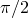
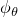
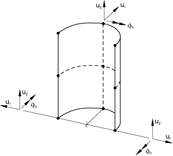
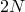
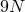
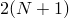
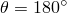
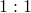
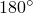

# 29.6.10 具有非线性非对称变形的轴对称壳单元


**产品：** Abaqus/Standard  

##### **参考**

- ["壳单元：概述，" 第 29.6.1 节](pt06ch29s06abo27.md)
- ["选择壳单元，" 第 29.6.2 节](pt06ch29s06alm16.md)
- [*NODAL THICKNESS](../key/key-link.md#usb-kws-mnodalthickness)
- [*SHELL GENERAL SECTION](../key/key-link.md#usb-kws-mshellgensect)
- [*SHELL SECTION](../key/key-link.md#usb-kws-mshellsection)

### 概述

本节提供 Abaqus/Standard 中可用具有非线性非对称变形的轴对称壳单元的参考。对于预期轴对称变形的轴对称参考几何，使用常规轴对称单元（见["轴对称壳单元库，" 第 29.6.9 节](pt06ch29s06ael19.md)）。对于预期非轴对称变形且厚度与特征半径比值较大或需要厚度方向详情的轴对称参考几何，使用 CAXA 型单元（见["具有非线性非对称变形的轴对称实体单元，" 第 28.1.7 节](pt06ch28s01ael06.md)）。

### 约定

坐标 1 是 *r*，坐标 2 是 *z*。*r* 方向在  平面中对应全局 *X* 方向，在  平面中对应全局 *Y* 方向，*z* 方向对应全局 *Z* 方向。坐标 1 应大于或等于零。

自由度 1 是 ，自由度 2 是 ，自由度 6 是 *r*–*z* 平面内的旋转。

尽管 *r*–*z* 平面中的对称性允许对初始轴对称结构的一半进行建模，但加载必须指定为完整轴对称体上的总载荷。例如，考虑由单位均匀轴向力加载的圆柱壳。要在具有四个模式的 SAXA 单元上产生单位载荷，在 、、、 和  处的节点力分别为 1/8、1/4、1/4、1/4 和 1/8。

子午线方向是 *r*–*z* 平面中与单元相切的方向；即子午线方向是绕对称轴旋转以生成完整三维体的线所在的方向。

周向或环向方向是垂直于 *r*–*z* 平面的方向。

### 单元类型

| SAXA1*N* | 线性插值，子午线方向 2 节点和 *N* 傅里叶模式的傅里叶壳单元 |
| --- | --- |
|  |

| SAXA2*N* | 二次插值，子午线方向 3 节点和 *N* 傅里叶模式的傅里叶壳单元 |
| --- | --- |
|  |

##### 激活的自由度

1, 2, 6

有关正节点位移和旋转方向，请参见[图 29.6.10-1](pt06ch29s06ael20.md#eshell-axiasymm-coord-sys)。节点旋转  与 SAX 单元一致；但是，正节点旋转在负  方向。

**图 29.6.10-1** 单元坐标系和正位移/旋转方向。显示 SAXA22 单元。



##### 附加解变量

SAXA  单元有  个变量，与 (, , ) 相关。

SAXA  单元有  个变量，与 (, , ) 相关。

### 需要的节点坐标

*r*, *z*（在  的 *r*–*z* 平面中给出）

可以沿节点数据指定节点法线场的两个方向余弦  和 ，或者通过用户指定的法线定义（见["节点处的法线定义，" 第 2.1.4 节](pt01ch02s01aus08.md)）。

### 单元属性定义

如果使用通用壳截面且截面刚度矩阵直接给出，应指定完整的 6×6 截面刚度（即，与三维壳相同的 21 个常数）。

| **输入文件用法：** | 使用以下任一选项： |
| --- | --- |
|  | ``` [*SHELL SECTION](../key/key-link.md#usb-kws-mshellsection) [*SHELL GENERAL SECTION](../key/key-link.md#usb-kws-mshellgensect) ``` 此外，对变厚度壳使用以下选项： ``` [*NODAL THICKNESS](../key/key-link.md#usb-kws-mnodalthickness) ``` |

### 基于单元的加载

### 分布载荷

分布载荷如["分布载荷，" 第 34.4.3 节](pt07ch34s04aus122.md)中所述进行指定。

分布载荷幅度为单位面积或单位体积。不需要乘以  乘以半径。

**载荷 ID (*DLOAD)：**  BX**单位：**  [FL3](../popups/usb-int-iconventions-unitsym.md)**描述：**  全局 *X* 方向单位体积的体力。

**载荷 ID (*DLOAD)：**  BZ**单位：**  [FL3](../popups/usb-int-iconventions-unitsym.md)**描述：**  全局 *Z* 方向单位体积的体力。

**载荷 ID (*DLOAD)：**  BXNU**单位：**  [FL3](../popups/usb-int-iconventions-unitsym.md)**描述：**  全局 *X* 方向的非均匀体力，幅度通过用户子程序 [`DLOAD`](../sub/sub-link.md#sub-xsl-dload) 提供。

**载荷 ID (*DLOAD)：**  BZNU**单位：**  [FL3](../popups/usb-int-iconventions-unitsym.md)**描述：**  全局 *Z* 方向的非均匀体力，幅度通过用户子程序 [`DLOAD`](../sub/sub-link.md#sub-xsl-dload) 提供。

**载荷 ID (*DLOAD)：**  HP**单位：**  [FL2](../popups/usb-int-iconventions-unitsym.md)**描述：**  壳表面上的静水压力，在全局 *Z* 方向线性变化。

**载荷 ID (*DLOAD)：**  P**单位：**  [FL2](../popups/usb-int-iconventions-unitsym.md)**描述：**  壳表面上的压力。

**载荷 ID (*DLOAD)：**  PNU**单位：**  [FL2](../popups/usb-int-iconventions-unitsym.md)**描述：**  壳表面上的非均匀压力，幅度通过用户子程序 [`DLOAD`](../sub/sub-link.md#sub-xsl-dload) 提供。

### 单元输出

关于  的数值积分使用梯形法则。在单元中有  个等间距的积分平面，包括  和  平面，其中 *N* 是傅里叶模式数。因此，对应于周向施加的压力载荷的径向节点力在该方向上以 1 傅里叶模式单元中  的比例分布，在 2 傅里叶模式单元中 ，在 4 傅里叶模式单元中 。这些一致节点力的总和等于完整周长上施加压力的积分（）。

#### 应力、应变和其他张量分量

应力和其他张量（包括应变张量）可用于具有位移自由度的单元。所有张量具有相同的分量。例如，应力分量如下：

| S11 | 子午线应力。 |
| --- | --- |

| S22 | 环向应力。 |
| --- | --- |

| S12 | 局部 12 剪切应力（在  和  处为零）。 |
| --- | --- |

#### 截面力

| SF1 | 局部 1 方向单位宽度的直接膜力。 |
| --- | --- |

| SF2 | 局部 2 方向单位宽度的直接膜力。 |
| --- | --- |

| SF3 | 局部 1-2 平面单位宽度的剪切膜力。 |
| --- | --- |

| SF4 | 厚度方向单位宽度的积分应力；始终为零。 |
| --- | --- |

| SM1 | 绕局部 2 轴单位宽度的弯矩。 |
| --- | --- |

| SM2 | 绕局部 1 轴单位宽度的弯矩。 |
| --- | --- |

| SM3 | 局部 1-2 平面单位宽度的扭曲力矩。 |
| --- | --- |

#### 截面应变

| SE1 | 局部 1 方向的直接膜应变。 |
| --- | --- |

| SE2 | 局部 2 方向的直接膜应变。 |
| --- | --- |

| SE3 | 局部 1-2 平面的剪切膜应变。 |
| --- | --- |

| SE4 | 厚度方向的应变。 |
| --- | --- |

| SK1 | 局部 1 方向的弯曲应变。 |
| --- | --- |

| SK2 | 局部 2 方向的弯曲应变。 |
| --- | --- |

| SK3 | 局部 1-2 平面的扭曲应变。 |
| --- | --- |

对于给定厚度 *h* 的层的单位长度法向基方向的截面力和弯矩矩，可以相对于该基定义为：


其中  是从中面到参考表面的偏移量。

局部方向在["定义常规壳单元的初始几何形状，" 第 29.6.3 节](pt06ch29s06alm17.md)中定义。

#### 当前壳厚度

| STH | 当前壳厚度。 |
| --- | --- |

### 单元上的节点顺序

每个单元的第一个生成器平面（）中的节点顺序如下所示。您可以像 SAX1 和 SAX2 单元一样在生成器平面中指定节点线或曲线。必须为每个单元定义 *N* 个更多的节点平面，其中 *N* 是所使用的傅里叶模式数。Abaqus/Standard 将通过向第一个平面中指定的节点添加常量偏移值来生成这些额外的周向节点并对其进行编号（见["单元定义，" 第 2.2.1 节](pt01ch02s02aus11.md)）。


