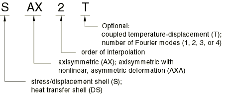
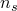
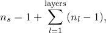
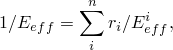
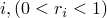

# 29.6.2 选择壳单元

**产品：** Abaqus/Standard  Abaqus/Explicit  Abaqus/CAE

##### **参考**

- ["壳单元：概述，" 第 29.6.1 节](pt06ch29s06abo27.md)
- ["三维常规壳单元库，" 第 29.6.7 节](pt06ch29s06ael17.md)
- ["连续壳单元库，" 第 29.6.8 节](pt06ch29s06ael18.md)
- ["轴对称壳单元库，" 第 29.6.9 节](pt06ch29s06ael19.md)
- ["具有非线性非对称变形的轴对称壳单元，" 第 29.6.10 节](pt06ch29s06ael20.md)
- ["创建均匀壳截面，" Abaqus/CAE User's Guide 第 12.13.6 节](../usi/usi-link.md#usi-prp-section-homogeneous-shell)
- ["创建复合壳截面，" Abaqus/CAE User's Guide 第 12.13.7 节](../usi/usi-link.md#usi-prp-section-composite-shell)

### 概述

Abaqus/Standard 壳单元库包括：
- 用于三维壳几何体的单元；
- 用于轴对称几何体和轴对称变形的单元；
- 用于关于一个平面对称的一般变形的轴对称几何体的单元；
- 用于应力/位移、热传导和完全耦合温度-位移分析的单元；
- 通用单元，以及特别适合分析"厚"或"薄"壳的单元；
- 通用、三维、一阶单元，使用减少积分或完全积分；
- 考虑有限膜应变的单元；
- 每个节点使用五个自由度的单元，以及在所有节点始终使用六个自由度的单元；和
- 连续壳单元。

Abaqus/Explicit 壳单元库包括：
- 用于模拟"厚"或"薄"壳并考虑有限膜应变的三维通用单元；
- 小应变单元；
- 完全耦合温度-位移分析单元；
- 用于轴对称几何体和轴对称变形的单元；和
- 连续壳单元。

### 命名约定

壳单元的命名约定取决于单元维数。

#### 三维壳单元

Abaqus 中的三维壳单元命名如下：


例如，S4R 是四节点、四边形、应力/位移壳单元，具有减少积分和大应变公式；SC8R 是八节点、四边形、一阶插值、应力/位移连续壳单元，具有减少积分。

#### 轴对称壳单元

Abaqus 中的轴对称壳单元命名如下：



例如，DSAX1 是具有一阶插值的轴对称热传导壳单元。

### 常规应力/位移壳单元

Abaqus 中的常规应力/位移壳单元可用于三维或轴对称分析。在 Abaqus/Standard 中，它们使用线性或二次插值，并允许机械和/或热（未耦合）加载；在 Abaqus/Explicit 中，它们使用线性插值，并允许机械加载。这些单元可用于静力或动力分析。有些单元包括横向剪切变形和厚度变化的影响，有些则没有。有些单元允许大旋转和有限膜变形，有些则允许大旋转但小应变。

#### 应力/位移壳单元中温度和场变量的插值

用于计算热应力的壳表面积分位置处的温度值取决于使用一阶还是二阶单元。线性单元在积分位置使用平均温度，使得热应变在整个壳表面上为常量。在高阶壳单元中使用线性变化的温度分布。应力/位移壳单元中场变量的插值方式与温度相同。

### 应力/位移连续壳单元

Abaqus 中的应力/位移连续壳单元可用于三维分析。连续壳离散化整个三维物体，与在参考表面离散化的常规壳不同（见["壳单元：概述，" 第 29.6.1 节](pt06ch29s06abo27.md)）。这些单元仅具有位移自由度，使用线性插值，并允许用于静力和动力分析的机械和/或热（未耦合）加载。连续壳单元是通用壳，允许有限膜变形和大旋转，因此适用于几何非线性分析。这些单元包括横向剪切变形和厚度变化的影响。

连续壳单元采用一阶层合复合理论，并从初始弹性模量估计穿过厚度的截面力。与常规壳不同，连续壳单元可以堆叠以提供更精细的厚度方向响应。堆叠连续壳单元可以提供更丰富的横向剪切应力和力预测。

虽然连续壳单元离散化三维物体，但应小心验证这些单元承受的整体变形是否与其层合平面应力假设一致；即，响应以弯曲为主，没有观察到明显的厚度变化（即，厚度变化大致小于 10%）。否则，应使用常规三维实体单元（["三维实体单元库，" 第 28.1.4 节](pt06ch28s01ael03.md)）。此外，厚度应变模式可能会为 Abaqus/Explicit 中的薄连续壳单元产生较小的稳定时间增量（见["壳截面行为，" 第 29.6.4 节](pt06ch29s06alm18.md)）。

### 耦合温度-位移连续壳单元

Abaqus 中的耦合温度-位移连续壳单元具有连续壳几何形状，并对几何和位移使用线性插值。温度也是线性插值的。热公式类似于用于具有减少积分的三维耦合温度-位移实体单元的公式，其中温度变化是三线性的（见["实体（连续）单元，" 第 28.1.1 节](pt06ch28s01alm01.md)）。穿过厚度的截面点处的温度从节点处的温度线性插值。

### 热传导壳单元

这些单元仅在 Abaqus/Standard 中可用，且仅适用于常规壳单元几何，用于模拟壳型结构中的热传导。它们在每个壳节点处提供穿过厚度的多个点处的温度值。此输出可直接输入等效应力分析壳单元进行顺序耦合热应力分析（["顺序耦合热应力分析，" 第 16.1.2 节](pt04ch16s01at39.md)）。

#### 穿过壳厚度的温度变化

温度变化在穿过厚度时被假定为分段二次的，而在壳参考表面上的插值与相应应力单元的插值相同。对于在分析过程中积分的壳截面（["使用在分析过程中积分的壳截面来定义截面行为，" 第 29.6.5 节](pt06ch29s06alm19.md)），您可以指定用于截面积分和每个节点厚度方向温度插值的截面点数。穿过壳厚度的积分只能使用 Simpson 法则。

壳底面（沿壳法线负方向的表面——见["定义常规壳单元的初始几何形状，" 第 29.6.3 节](pt06ch29s06alm17.md)）上的温度是自由度 11。顶面上的温度是自由度 。一个节点最多可以有 20 个温度自由度。对于单层壳， 是穿过壳截面使用的积分点总数。如果使用单个截面点进行截面积分，则壳厚度方向没有温度变化，整个壳截面的温度是自由度 11。对于多层壳，每层顶面的温度与下一层底面的温度相同。因此，



其中 （ > 1）是层 *l* 中使用的积分点数。如果 =1，则  等于复合层数。在这种情况下，穿过壳厚度没有温度变化，整个复合体的温度是自由度 11。壳的内能存储和热传导项的积分方式与相应连续单元相同（见["实体（连续）单元，" 第 28.1.1 节](pt06ch28s01alm01.md)）。

#### 在热应力分析中使用壳

要将在 Abaqus/Standard 结果文件中保存的温度直接用作热应力分析的输入，热传递和应力分析模型中的网格以及壳截面中温度点数的规范必须相同。此外，多层热传导壳单元必须在每一层中具有相同的积分点数。

### 耦合温度-位移壳单元

Abaqus 中可用的耦合温度-位移壳单元具有常规壳单元几何形状，并对几何和位移使用线性或二次插值。温度从角节点或端节点线性插值；二次壳中的较低阶温度插值被选择为使得与温度成正比的热应变以及总应变具有相同的插值阶次。控制方程中的所有项使用常规高斯格式在壳的参考表面上积分；穿过壳厚度的积分使用 Simpson 法则。

#### 穿过壳厚度的温度变化

穿过壳厚度的温度变化假定为分段二次的，并从每个节点处穿过壳厚度的系列点处的温度进行插值。在每个节点处使用的温度值数量由您在壳截面定义中指定的积分点数决定（见["定义壳截面积分" in "使用在分析过程中积分的壳截面来定义截面行为，" 第 29.6.5 节](pt06ch29s06alm19.md#usb-elm-eusingshellsection-intpt)）。最多存储 20 个温度值作为自由度 11、12、13 等（最高自由度 30），方式与热传导壳单元相同（见上文["热传导壳单元"](pt06ch29s06alm16.md#usb-elm-eshellheattransfer)）。

### "厚"与"薄"常规壳单元

Abaqus 包含通用常规壳单元以及适用于厚壳和薄壳问题的常规壳单元。有关"厚"或"薄"壳问题的讨论见下文。此概念仅与具有位移自由度的单元相关。

通用常规壳单元为大多数应用提供稳健和准确的解决方案，将用于大多数应用。然而，在某些情况下，对于特定应用，在 Abaqus/Standard 中可以获得更好的性能，例如，当仅发生小应变且每个节点需要五个自由度时。

连续壳单元可用于任何厚度；然而，薄连续壳单元可能在 Abaqus/Explicit 中产生较小的稳定时间增量。

#### 通用常规壳单元

这些单元允许横向剪切变形。当壳厚度增加时，它们使用厚壳理论；当厚度减少时，变成离散 Kirchhoff 薄壳单元；随着壳厚度减少，横向剪切变形变得非常小。

单元类型 S3/S3R、S3RS、S4、S4R、S4RS、S4RSW、SAX1、SAX2、SAX2T、SC6R 和 SC8R 是通用壳。

#### 厚常规壳单元

在 Abaqus/Standard 中，在横向剪切柔度重要且需要二阶插值的情况下需要厚壳。当壳在整个厚度上由相同材料制成时，当厚度大于壳表面特征长度（例如，对于静力情况为支撑之间的距离，或对于动力分析为显著自然模式的波长）的约 1/15 时，会发生这种情况。

Abaqus/Standard 提供单元类型 S8R 和 S8RT，仅用于厚壳问题。

#### 薄常规壳单元

在 Abaqus/Standard 中，在横向剪切柔度可忽略且必须准确满足 Kirchhoff 约束的情况下需要薄壳（即，壳法线保持与壳参考表面正交）。对于均匀壳，当厚度小于壳表面特征长度（例如，支撑之间的距离或显著特征模式的波长）的约 1/15 时，会发生这种情况。然而，厚度可能大于单元长度的 1/15。

Abaqus/Standard 有两种薄壳单元：求解薄壳理论的单元（Kirchhoff 约束被解析满足）和随着厚度减少收敛到薄壳理论的单元（Kirchhoff 约束被数值满足）。
- 求解薄壳理论的单元是 STRI3。STRI3 在节点处有六个自由度，是一个平的faceted单元（忽略初始曲率）。如果使用 STRI3 模拟厚壳问题，该单元将始终预测薄壳解。
- 通过数值满足 Kirchhoff 约束的单元是 S4R5、STRI65、S8R5、S9R5、SAXA1*n* 和 SAXA2*n*。这些单元不应用于横向剪切变形重要的应用。如果这些单元用于模拟厚壳问题，单元可能会预测不准确的结果。

### 有限应变与小应变壳单元

Abaqus 同时具有有限应变和小应变壳单元。此概念仅与具有位移自由度的单元相关。

#### 有限应变壳单元

单元类型 S3/S3R、S4、S4R、SAX1、SAX2、SAX2T、SAXA1*n* 和 SAXA2*n* 考虑有限膜应变和任意大旋转；因此，它们适用于大应变分析。底层公式在以下位置描述：["轴对称壳单元，" Abaqus 理论指南第 3.6.2 节](../stm/stm-link.md#stm-elm-axishells)；["有限应变壳单元公式，" Abaqus 理论指南第 3.6.5 节](../stm/stm-link.md#stm-elm-finitestrainshells)；和 ["允许非对称加载的轴对称壳单元，" Abaqus 理论指南第 3.6.7 节](../stm/stm-link.md#stm-elm-axiasymmshells)。

连续壳单元 SC6R 和 SC8R 考虑有限膜应变、任意大旋转，并允许厚度变化，使其适用于大应变分析。厚度的变化基于单元节点位移计算，而这些位移又根据分析开始时定义的有效弹性模量计算。

#### 小应变壳单元

在 Abaqus/Standard 中，三维"厚"和"薄"单元类型 STRI3、S4R5、STRI65、S8R、S8RT、S8R5 和 S9R5 提供任意大旋转，但仅限小应变。这些单元忽略变形时厚度的变化。

在 Abaqus/Explicit 中，提供单元类型 S3RS、S4RS 和 S4RSW，用于小膜应变和大旋转的壳问题。许多冲击动力学分析属于此类问题，包括承受大规模屈曲行为但膜拉伸和压缩相对较小的壳结构。虽然随着膜应变变大，解决方案准确性可能会下降，但 Abaqus/Explicit 中的小应变壳单元为适当应用提供了计算效率更高的替代方案。底层公式在以下位置描述：["Abaqus/Explicit 中的小应变壳单元，" Abaqus 理论指南第 3.6.6 节](../stm/stm-link.md#stm-elm-smallstrainshells)。

#### 壳厚度变化

厚度变化仅在几何非线性分析中考虑。对于常规壳，厚度方向的应力为零，应变仅来自泊松效应。对于连续壳，厚度方向的应力可能不为零，并可能产生超出泊松效应引起的额外应变。泊松效应引起的厚度应变称为"泊松应变"，超出"泊松应变"的任何额外应变称为"有效厚度应变"。

对于在分析过程中定义截面并进行积分的 Abaqus/Explicit 中的壳单元，通过在截面中的各个材料点处强制执行平面应力条件来计算泊松应变，然后从这些材料点积分泊松应变，或者使用"截面泊松比"在整个截面的积分站计算泊松应变。对于 Abaqus/Standard 中的壳单元，仅截面泊松比方法可用。对于由通用壳截面定义的壳单元，仅截面泊松比方法适用。

有关详细信息，请参阅["在壳截面行为中定义厚度方向的泊松应变" in "使用在分析过程中积分的壳截面来定义截面行为，" 第 29.6.5 节](pt06ch29s06alm19.md#usb-elm-eusingshellsection-poiss)，和["在壳截面行为中定义厚度方向的泊松应变" in "使用通用壳截面来定义截面行为，" 第 29.6.6 节](pt06ch29s06alm20.md#usb-elm-eusingshellgensect-poiss)。

#### 连续壳单元中厚度方向的应力

厚度方向的应力通过用恒定"厚度模量"惩罚有效厚度应变来计算。用于具有弹性或弹塑性材料的单层壳单元的厚度模量是面内弹性剪切模量的两倍。对于具有每层为弹性或弹塑性材料的复合壳，厚度模量计算为各层贡献的厚度加权调和平均值：



其中  是厚度模量， 是层索引， 是层数， 是层  的相对厚度， 是基于初始配置中层  材料定义的两倍初始面内弹性剪切模量。

有关详细信息，请参阅["在连续壳单元中定义厚度模量" in "使用在分析过程中积分的壳截面来定义截面行为，" 第 29.6.5 节](pt06ch29s06alm19.md#usb-elm-eusingshellsection-thick-cont)，和["在连续壳单元中定义厚度模量" in "使用通用壳截面来定义截面行为，" 第 29.6.6 节](pt06ch29s06alm20.md#usb-elm-eusingshellgensect-thick-cont)。

### 五自由度壳与六自由度壳

Abaqus/Standard 中提供了两种类型的三维常规壳单元：尽可能使用五个自由度（三个位移分量和两个面内旋转分量）的单元和在所有节点使用六个自由度（三个位移分量和三个旋转分量）的单元。

使用五个自由度（S4R5、STRI65、S8R5、S9R5）的单元可能更经济。但是，它们仅作为"薄"壳可用（不能用作"厚"壳），不能用于有限应变应用（尽管它们可以准确模拟小应变下的大旋转）。此外，五自由度壳单元的输出限制如下：
- 在使用两个面内旋转分量的节点处，这些面内旋转的值不可用于输出。
- 当请求输出变量 NFORC 时，与面内旋转对应的弯矩不可用于输出。

当使用五自由度壳单元时，Abaqus/Standard 将在满足以下条件的任何节点自动切换为使用三个全局旋转分量：
- 在旋转自由度上应用了运动边界条件，
- 用于涉及旋转自由度的多点约束（["通用多点约束，" 第 35.2.2 节](pt08ch35s02aus130.md)），
- 与使用所有节点三个全局旋转分量的梁单元或壳单元共享，
- 位于壳上的折叠线（即，具有不同表面法线的壳相交的位置），或
- 承受弯矩。

在所有在所有节点使用三个全局旋转分量的单元中（无论如上所述被激活还是始终存在），在表面假定为连续弯曲的任何节点处存在奇异性：使用三个旋转分量，但只有两个与刚度主动相关。为避免此困难，将一个小的刚度与法线方向的旋转相关联。使用的默认刚度值足够小，使得人工能量含量可以忽略不计。在某些极少数情况下，可能需要更改此刚度。您可以为此刚度定义缩放因子，如["使用在分析过程中积分的壳截面来定义截面行为，" 第 29.6.5 节](pt06ch29s06alm19.md)和["使用通用壳截面来定义截面行为，" 第 29.6.6 节](pt06ch29s06alm20.md)中所述。

### 减少积分

Abaqus 中的许多壳单元类型使用减少积分（低阶）来形成单元刚度。质量矩阵和分布载荷仍然精确积分。减少积分通常提供更准确的结果（前提是单元没有变形或面内弯曲加载），并显著减少运行时间，特别是在三维中。

当将减少积分与一阶（线性）单元一起使用时，需要沙漏控制。因此，当使用一阶减少积分单元时，必须检查是否发生沙漏；如果发生，可能需要更细的网格或将集中载荷分布在多个节点上。Abaqus/Standard 中可用的二阶减少积分单元通常没有同样的困难，在解决方案预期平滑的情况下推荐使用。一阶单元推荐用于预期大应变或非常高应变梯度的情况。

### 为壳单元指定截面控制

在 Abaqus/Standard 中，您可以为壳单元指定非默认沙漏控制参数。在 Abaqus/Explicit 中，您可以指定单元公式中的二阶精度，为 S4R、S4RS 和 S4RSW 单元指定非默认沙漏控制参数，或停用 S3RS 和 S4RS 单元的钻孔约束。有关更多信息，请参阅["截面控制，" 第 27.1.4 节](pt06ch27s01aus113.md)。

| **输入文件用法：** | 在 Abaqus/Standard 中使用以下选项： |
| --- | --- |
|  | ``` [*SHELL SECTION](../key/key-link.md#usb-kws-mshellsection) 或 [*SHELL GENERAL SECTION](../key/key-link.md#usb-kws-mshellgensect) [*HOURGLASS STIFFNESS](../key/key-link.md#usb-kws-mhourglasstiff) ``` 在 Abaqus/Explicit 中使用以下选项之一： ``` [*SHELL SECTION](../key/key-link.md#usb-kws-mshellsection), CONTROLS=*name* [*SHELL GENERAL SECTION](../key/key-link.md#usb-kws-mshellgensect), CONTROLS=*name* ``` |

| **Abaqus/CAE 用法：** | Mesh 模块：**Mesh****Element Type**：**Element Controls** |
| --- | --- |

### 建模问题

使用壳单元时必须考虑许多建模问题。

#### 使用 S3/S3R 和 S3RS 单元

S3 和 S3R 指的是同一个 3 节点三角形壳单元。该单元是 S4R 的退化版本，与 S4R 完全兼容，在 Abaqus/Standard 中与 S4 也完全兼容。

单元 S3RS 在 Abaqus/Explicit 中可用，是 S4RS 的退化版本，与 S4RS 完全兼容。

S3/S3R 和 S3RS 在大多数加载情况下提供准确的结果。但是，由于它们的恒定弯曲和膜应变近似，可能需要高网格细化来捕获纯弯曲变形或涉及高应变梯度的问题的解。退化单元公式的一个结果是，当单元连通性被置换时，解会略微改变。

#### 退化单元

单元类型 S4、S4R、S4R5、S4RS、S8R5 和 S9R5 可以退化为三角形。但是，对于单元 S4（退化为三角形的单元 S4 可能在膜变形中表现出过度刚硬响应）、S4R 和 S4RS，建议改用 S3R 和 S3RS。

四分点技术（将中节点移动到四分点，以给出弹性断裂力学应用的  奇异性）可与二次单元类型 S8R5 和 S9R5 一起使用（见["单元定义，" 第 2.2.1 节](pt01ch02s02aus11.md)）。当退化为三角形时，单元的准确性会显著降低；因此，这不推荐用于特殊应用，如断裂。

单元类型 S8R 和 S8RT 不能退化为三角形。单元类型 DS4 和 DS8 可以退化为三角形，但建议改用 DS3 和 DS6 单元。

#### 使用连续壳单元建模

从建模的角度来看，连续壳单元类似于连续实体。SC6R 和 SC8R 单元的单元几何形状分别是三角形棱柱和六面体，仅具有位移自由度。

必须正确取向连续壳单元，因为这些单元具有与之相关的厚度方向。关于单元连通性和方向的更多详细信息，请参阅["壳单元：概述，" 第 29.6.1 节](pt06ch29s06abo27.md)。

当分析经典壳结构（仅提供中面几何和运动约束的结构）时，必须小心指定适当的弯矩和旋转。例如，弯矩可以作为力偶系统施加在顶面和底面上相应的节点上。可以通过运动约束指定旋转边界条件，以在连续壳边缘上产生适当的位移边界条件。

连续壳单元可以直接连接到一阶连续实体，无需任何运动过渡。当常规壳单元连接到连续壳单元时，需要提供适当的运动过渡，以正确传递常规壳参考表面处的弯矩/旋转。这种过渡可以通过壳到实体耦合约束或任何其他运动约束（如基于表面的耦合约束、多点约束或线性约束方程）来定义。

##### 使用 SC6R 单元

SC6R 单元是 SC8R 单元的退化版本。SC6R 单元在大多数加载情况下提供准确的结果。但是，由于其恒定弯曲和膜应变近似，可能需要高网格细化来捕获纯弯曲变形或涉及高应变梯度的问题的解。

##### 使用连续壳单元建模接触

连续壳单元 SC6R 和 SC8R 允许双面接触和厚度变化，因此适用于建模接触。

##### Abaqus/Explicit 中的稳定时间增量

在 Abaqus/Explicit 中，单元稳定时间增量可以由连续壳单元厚度控制，特别是对于薄壳应用。与使用常规壳单元建模的相同问题相比，这可能会显著增加完成分析所需的增量数。可以通过在适当的情况下指定厚度方向的较低刚度来减轻较小的稳定时间增量大小。

##### 连续壳单元的局限性

连续壳单元不能与超泡沫材料定义一起使用，也不能与直接提供截面刚度的通用壳截面一起使用。

#### 建模"夹层"壳

对于"夹层"壳，其中截面部分由较软材料制成（特别是当层是各向异性的，使得某些层在特定方向上较弱时），横向剪切柔度可能很重要，即使壳相当薄。在这种情况下，推荐使用通用壳单元或堆叠连续壳单元。有关壳单元中横向剪切刚度的讨论，请参阅["壳截面行为，" 第 29.6.4 节](pt06ch29s06alm18.md)。

#### 在 Abaqus/Standard 中建模薄曲壳的弯曲

在 Abaqus/Standard 中，曲单元（STRI65、S8R5、S9R5）更适合建模薄曲壳的弯曲。

单元类型 STRI3 是一个平的faceted单元。如果使用此单元建模曲壳的弯曲，可能需要密集的网格来获得准确的结果。

#### 在 Abaqus/Standard 中建模双曲壳的屈曲

对于双曲壳的屈曲问题，单元类型 S8R5 可能由于内部定义的中心节点可能不在实际壳表面上这一事实而给出不准确的结果。应改用单元类型 S9R5。

#### 在接触分析中使用 S8R5

如果接触对中的从表面附加到单元，则单元类型 S8R5 会自动转换为单元类型 S9R5。

#### 对 S9R5 单元施加弯矩

不应将弯矩施加到 S9R5 单元的中心节点。

#### 使用 S4 单元

单元类型 S4 是一个完全积分的通用有限膜应变壳单元。单元的膜响应使用假定应变公式处理，该公式对面内弯曲问题给出准确解，对单元变形不敏感，并避免寄生锁定。

单元类型 S4 在膜或弯曲响应中都没有沙漏模式；因此，该单元不需要沙漏控制。该单元每个单元有四个积分位置，而 S4R 为一个积分位置，这使得该单元计算成本更高。S4 与 S4R 和 S3R 兼容。S4 可用于容易出现膜或弯曲模式沙漏的问题、需要更高解决方案准确性的区域，或预期会发生面内弯曲的问题。在所有这些情况下，S4 将优于单元类型 S4R。S4 不能与 Abaqus/Standard 中的超弹性或超泡沫材料定义一起使用。
