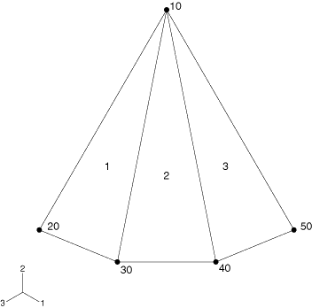

# 29.6.3 定义常规壳单元的初始几何形状

**产品：** Abaqus/Standard  Abaqus/Explicit  Abaqus/CAE  

##### **参考**

- ["壳单元：概述，" 第 29.6.1 节](pt06ch29s06abo27.md)
- ["分配截面，" Abaqus/CAE 用户指南第 12.15.1 节](../usi/usi-link.md#usi-prp-assign-section)
- ["分配壳/薄膜法线方向，" Abaqus/CAE 用户指南第 12.15.5 节](../usi/usi-link.md#usi-prp-assign-normals)

### 概述

初始壳几何形状：
- 必须准确定义，因为大多数壳单元是真正的曲线壳单元；
- 由初始法线方向定义，可以由用户定义或由 Abaqus 计算；
- 要求使用足够精细的网格划分，以使离散表面准确表示实际表面；和
- 可以包括参考表面与壳中面的偏移。

### 定义节点法线

此讨论仅适用于常规壳单元。连续壳单元的法线由顶部和底部节点沿壳角边的位置定义（见["壳单元：概述，" 第 29.6.1 节](pt06ch29s06abo27.md)）。

Abaqus 中的常规壳单元（单元类型 S3/S3R、S3RS、S4R、S4RS、S4RSW 和 STRI3 除外）是真正的曲线壳单元；真正的曲线壳单元需要特别注意准确计算表面的初始曲率。可以通过给出连接到壳单元的所有节点处表面法线的方向余弦来定义壳法线。这些方向余弦可以作为每个节点定义的第四、第五和第六坐标输入，或在用户指定的法线定义中输入，如下所述；更多信息见["节点处的法线定义，" 第 2.1.4 节](pt01ch02s01aus08.md)。如果用户定义的法线与中面法线相差超过 20 度，则会向数据（`.dat`）文件发出警告消息。但是，如果角度超过 160 度，则中面法线的方向被反转，不发出警告消息。如果节点法线与平均单元法线相差超过 10 度，则会发出额外的警告消息。

在节点处为所有连接到该节点的壳单元指定相同的法线会在该节点处创建光滑的壳表面。定义用户指定的法线以引入折叠线。

如果法线未作为节点定义的一部分定义或未通过用户指定的法线定义，Abaqus 将使用以下算法计算法线。由于此计算唯一可用的信息是节点坐标，因此可能无法准确定义法线方向。在模型边缘准确定义法线可能很重要，特别是当它们也是对称平面时，或者在壳曲率不连续变化的线上。当在高度弯曲的壳上使用相对粗糙的网格划分时，这也很重要，因为 Abaqus 可能估计从一个单元到其邻居的方向变化非常大，表示折叠线而不是光滑弯曲的表面。因此，当壳法线由节点坐标模糊定义时，建议您输入方向余弦。如果不这样做，可能导致不准确的结果。

节点处的法线方向需要用于温度输入和节点应力输出。该方向取自下方为相邻节点的元素定义的定义。如果在节点处产生冲突，则该节点处使用的正法线方向将由该节点处编号最低的单元定义。

#### Abaqus 计算平均节点法线

如果节点法线未作为节点定义的一部分定义，则为所有未定义用户指定法线的壳单元和梁单元（"剩余"单元）计算节点处的单元法线方向。对于壳单元，法线方向垂直于壳中面，如["壳单元：概述，" 第 29.6.1 节](pt06ch29s06abo27.md)中所述。对于梁单元，法线方向是第二个横截面方向，如["梁单元截面方向，" 第 29.3.4 节](pt06ch29s03alm09.md)中所述。

然后使用以下算法为需要定义法线的剩余单元获取平均法线（或多个平均法线）：

1. 如果节点连接到超过 30 个剩余单元，则不进行平均，并为每个单元分配其自己的法线。第一个节点法线存储为作为节点定义一部分定义的法线。每个随后生成的法线存储为用户指定的法线。
2. 如果节点由 30 个或更少的剩余单元共享，则计算连接到该节点的所有单元的法线。Abaqus 获取这些单元中的一个，并将其与所有其他法线在 20 度以内的单元放入一个集合中。然后：
   1. 每个法线在已添加单元 20 度以内的单元也被添加到该集合中（如果尚未包含）。
   2. 重复此过程，直到集合中包含集合中每个单元的所有其他法线在 20 度以内的单元。
   3. 如果最终集合中的所有法线彼此在 20 度以内，则为集合中的所有单元计算平均法线。如果集合中任何法线与集合中甚至单个其他法线的偏差超过 20 度，则集合中的单元不进行平均，并为每个单元存储单独的法线。
   4. 重复此过程，直到连接到节点的所有单元都为其计算了法线。
   5. 第一个节点法线存储为作为节点定义一部分定义的法线。每个随后生成的节点法线存储为用户指定的法线。此算法确保节点平均方案没有单元顺序依赖性。下面包括说明此过程的简单示例。

##### 示例：壳法线平均

考虑[图 29.6.3-1](pt06ch29s06alm17.md#eshellgeometry3elem) 中的三单元模型。单元 1、2 和 3 共享一个公共节点 10，未定义用户指定的法线。

**图 29.6.3-1** 节点平均算法的三单元示例。

在第一种情况下，假设在节点 10 处，单元 2 的法线在单元 1 和 3 的 20 度以内，但单元 1 和 3 的法线彼此不在 20 度以内。在这种情况下，每个单元分配其自己的法线：一个存储为节点定义的一部分，两个存储为用户指定的法线。

在第二种情况下，假设在节点 10 处，单元 2 的法线在单元 1 和 3 的 20 度以内，并且单元 1 和 3 的法线彼此在 20 度以内。在这种情况下，将为单元 1、2 和 3 计算单个平均法线，并存储为节点定义的一部分。

在最后一种情况下，假设在节点 10 处，单元 2 的法线在单元 1 的 20 度以内，但单元 3 的法线不在单元 1 或 2 的 20 度以内。在这种情况下，将为单元 1 和 2 计算并存储平均法线，单元 3 的法线单独存储：一个存储为节点定义的一部分，另一个存储为用户指定的法线。

#### 网格划分注意事项

在粗糙网格中，此算法可能在壳光滑处引入折叠线，或者如果折叠线角度小于 20 度，则可能在应有折叠线处创建光滑壳。大位移壳分析中的困难有时是由粗糙网格划分引入的虚假折叠线引起的。要对光滑壳建模，网格应足够精细以创建唯一的节点法线，或者必须作为节点定义的一部分或通过用户指定的法线定义来定义法线。要对带折叠线的板或壳建模，您应该定义用户指定的法线。

#### 验证法线定义

可以通过检查分析输入文件处理器输出来检查法线定义。与节点关联的参考法线的方向余弦在数据（`.dat`）文件的 `NODE DEFINITIONS` 输出下列出。用户指定的法线在数据文件的 `NORMAL DEFINITIONS` 输出下列出。

### 偏移：参考表面与中面

此讨论仅适用于常规壳单元。连续壳单元在所建模结构体的周围定义顶面和底面。壳参考表面的概念不适用于这些类型的单元。

常规壳单元的参考表面由壳的节点和法线定义。当使用壳单元进行建模时，参考表面通常与壳的中面重合。但是，经常会出现将参考表面定义为与壳中面偏移更方便的情况。例如，CAD 表面通常代表壳的顶面或底面。在这种情况下，定义参考表面与 CAD 表面重合可能更容易，因此与壳的中面偏移。

壳偏移也可用于为接触问题定义更精确的表面几何，其中壳厚度很重要。另一个中面偏移可能很重要的情形是当具有连续变化厚度的壳被建模时。在这种情况下，如果壳的一个表面光滑而另一个表面粗糙（如某些飞机结构中），使用光滑表面作为参考表面，从中面偏移壳厚度的一半，将更准确地表示物理几何。使用中面作为此情况的参考表面要复杂得多，可能导致不准确的模型。

您可以在截面定义中为分析过程中积分的壳截面和通用壳截面引入偏移。偏移值定义为从壳中面到壳参考表面的壳厚度的分数。详细信息见["使用在分析过程中积分的壳截面来定义截面行为，" 第 29.6.5 节](pt06ch29s06alm19.md)，和["使用通用壳截面来定义截面行为，" 第 29.6.6 节](pt06ch29s06alm20.md)。

壳的自由度与参考表面相关联。单元的面积和所有运动学量都在那里计算。因此，当使用非零偏移值时，参考表面平面内的任何加载将导致膜力和弯矩。对于弯曲壳，大的偏移值也可能导致表面积分误差，影响壳截面的刚度、质量和转动惯量。对于稳定性目的，Abaqus/Explicit 还会自动按与偏移平方成正比的因子缩放用于壳单元的转动惯量，这可能导致大偏移的误差。当需要与壳中面的大偏移时，请改用多点约束（见["通用多点约束，" 第 35.2.2 节](pt08ch35s02aus130.md)）。
