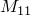
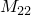

# 30.1.1 点质量

**产品：** Abaqus/Standard  Abaqus/Explicit  Abaqus/CAE

##### **参考**

- ["质量单元库，" 第 30.1.2 节](pt06ch30s01ael21.md)
- [*MASS](../key/key-link.md#usb-kws-mmass)
- ["定义点质量和旋转惯性，" Abaqus/CAE User's Guide 第 33.3 节](../usi/usi-link.md#usi-eng-help-pmi)

### 概述

质量单元：
- 允许在一点引入各向同性或各向异性的集中质量；
- 与节点处的三个平动自由度相关联。

如果还需要旋转惯性（例如，表示刚体），请使用单元类型 ROTARYI（["旋转惯性，" 第 30.2.1 节](pt06ch30s02alm22.md)）。

除了点质量，Abaqus 还提供了一种方便的非结构质量定义，可用于将具有可忽略结构刚度的特征的質量布满在与非结构特征相邻的区域。非结构质量可以指定为总质量值、单位体积质量、单位面积质量或单位长度质量的形式（见["非结构质量定义，" 第 2.7.1 节](pt01ch02s07aus25.md)）。

### 定义各向同性质量值

您指定质量大小，它与单元节点处的三个平动自由度相关联。指定质量，而不是重量。您必须将此质量与模型的某个区域相关联。

| **输入文件用法：** | ``` [*MASS](../key/key-link.md#usb-kws-mmass), ELSET=*name* *mass magnitude* ``` |
| --- | --- |
|  | 其中 ELSET 参数指一组 MASS 单元。 |

| **Abaqus/CAE 用法：** | Property 或 Interaction 模块：**Special****Inertia****Create**：**Point mass/inertia**：选择点：**Magnitude**：**Isotropic**：*mass magnitude* |
| --- | --- |

#### 在 Abaqus/Standard 中显式定义质量矩阵

如果您希望在质量矩阵的对角线上及其外部引入单独项，则可以在 Abaqus/Standard 中显式定义通用质量矩阵。详细信息请参阅["用户定义单元，" 第 32.15.1 节](pt06ch32s15alm60.md)。

| **输入文件用法：** | 同时使用以下两个选项： |
| --- | --- |
|  | ``` [*USER ELEMENT](../key/key-link.md#usb-kws-muserelement) [*MATRIX](../key/key-link.md#usb-kws-mmatrix) ``` |

| **Abaqus/CAE 用法：** | 在 Abaqus/CAE 中不支持显式定义质量矩阵。 |
| --- | --- |

### 定义各向异性质量张量

您可以通过给出三个主值和主方向来将质量指定为各向异性。当未指定主方向时，假定它们与全局轴重合。在大位移分析中，如果附加各向异性质量的节点旋转处于活动状态，则各向异性质量的局部轴将随旋转而旋转。如果节点连接到梁、常规壳、旋转惯性单元或刚体，则该节点处的旋转自由度处于活动状态。您可以指定作用于各向异性质量的質量比例载荷（如重力）。阻尼和质量缩放也可以与各向异性质量一起使用。

指定质量，而不是重量。您必须将此质量与模型的某个区域相关联。

| **输入文件用法：** | ``` [*MASS](../key/key-link.md#usb-kws-mmass), ELSET=*name*, TYPE=ANISOTROPIC, ORIENTATION=*orientation_name* , ,  ``` |
| --- | --- |
|  | 其中 ELSET 参数指一组 MASS 单元。 |

| **Abaqus/CAE 用法：** | Property 或 Interaction 模块：**Special****Inertia****Create**：**Point mass/inertia**：选择点：**Magnitude**：**Anisotropic**：、 和  |
| --- | --- |

### 为 MASS 单元定义阻尼

在 Abaqus/Standard 中，您可以为直接积分动态分析定义质量比例阻尼，或为模态动态分析定义复合阻尼。虽然可以为一组 MASS 单元指定两种阻尼定义，但只会使用与特定动态分析过程相关的阻尼。

在 Abaqus/Explicit 中，可以为 MASS 单元定义质量比例阻尼。

#### 动力学

您可以为直接积分动态分析或显式动态分析中的 MASS 单元定义惯性比例阻尼。详细信息请参阅["材料阻尼，" 第 26.1.1 节](pt05ch26s01abm51.md)。

| **输入文件用法：** | ``` [*MASS](../key/key-link.md#usb-kws-mmass), ALPHA= ``` |
| --- | --- |

| **Abaqus/CAE 用法：** | Property 或 Interaction 模块：**Special****Inertia****Create**：**Point mass/inertia**：选择点：**Damping**：**Alpha**： |
| --- | --- |

#### 模态动力学

当在模态动态分析中使用时，您可以为 MASS 单元定义要使用的临界阻尼分数，以在计算模态复合阻尼因子时使用。详细信息请参阅["材料阻尼，" 第 26.1.1 节](pt05ch26s01abm51.md)。

| **输入文件用法：** | ``` [*MASS](../key/key-link.md#usb-kws-mmass), COMPOSITE= ``` |
| --- | --- |

| **Abaqus/CAE 用法：** | Property 或 Interaction 模块：**Special****Inertia****Create**：**Point mass/inertia**：选择点：**Damping**：**Composite**： |
| --- | --- |
