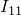
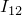
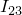

# 30.2.1 旋转惯性

**产品：** Abaqus/Standard  Abaqus/Explicit  Abaqus/CAE

##### **参考**

- ["旋转惯性单元库，" 第 30.2.2 节](pt06ch30s02ael22.md)
- [*ROTARY INERTIA](../key/key-link.md#usb-kws-mrotinertia)
- ["定义点质量和旋转惯性，" Abaqus/CAE User's Guide 第 33.3 节](../usi/usi-link.md#usi-eng-help-pmi)

### 概述

旋转惯性单元：
- 允许在节点处包括旋转惯性；
- 与节点处的三个旋转自由度相关联；和
- 可以与 MASS 单元（["点质量，" 第 30.1.1 节](pt06ch30s01alm21.md)）配对，以直接定义刚体的质量和惯性属性（["刚体定义，" 第 2.4.1 节](pt01ch02s04aus22.md)）。

### 定义旋转惯性

ROTARYI 单元允许在节点处包括旋转惯性。假定节点为物体质心，因此只需要二阶惯性矩。如果节点是刚体的一部分，则会考虑节点与刚体质心之间的偏移。刚体关于全局坐标系的旋转惯性张量的所有六个分量——、、、、 和 ——定义如下：


旋转惯性张量必须是正半定的。

您指定转动惯量，单位应为 [ML2](../popups/usb-int-iconventions-unitsym.md)。您必须将这些转动惯量与模型的某个区域相关联。

可选地，您可以引用局部方向（["方向，" 第 2.2.5 节](pt01ch02s02aus15.md)）来定义给出旋转惯性值的局部轴方向。如果您未指定局部方向，且旋转惯性单元在零件或零件实例内定义（见["定义装配，" 第 2.10.1 节](pt01ch02s10aus28.md)），则惯性张量的分量必须相对于局部零件轴给出。如果您未指定局部方向，且旋转惯性单元未在零件或零件实例内定义，则惯性张量的分量必须相对于全局轴给出。

| **输入文件用法：** | ``` [*ROTARY INERTIA](../key/key-link.md#usb-kws-mrotinertia), ELSET=*name*, ORIENTATION=*name* , , , , ,  ``` |
| --- | --- |
|  | 其中 ELSET 参数指一组 ROTARYI 单元。 |

| **Abaqus/CAE 用法：** | Property 或 Interaction 模块：**Special****Inertia****Create**：**Point mass/inertia**：选择点：**Magnitude**：**I11**：、**I22**：、**I33**：；如有必要，切换**Specify off-diagonal terms**：**I12**：、**I13**：、**I23**：；**CSYS**：**Edit** |
| --- | --- |

### 为 ROTARYI 单元定义阻尼

在 Abaqus/Standard 中，您可以为直接积分动态分析定义质量比例阻尼，或为模态动态分析定义复合阻尼。虽然可以为一组 ROTARYI 单元指定两种阻尼定义，但只会使用与特定动态分析过程相关的阻尼。

在 Abaqus/Explicit 中，可以为 ROTARYI 单元定义质量比例阻尼。

#### 动力学

您可以为直接积分动态分析或显式动态分析中的 ROTARYI 单元定义惯性比例阻尼。详细信息请参阅["材料阻尼，" 第 26.1.1 节](pt05ch26s01abm51.md)。

| **输入文件用法：** | ``` [*ROTARY INERTIA](../key/key-link.md#usb-kws-mrotinertia), ALPHA= ``` |
| --- | --- |

| **Abaqus/CAE 用法：** | Property 或 Interaction 模块：**Special****Inertia****Create**：**Point mass/inertia**：选择点：**Damping**：**Alpha**： |
| --- | --- |

#### 模态动力学

当在模态动态分析中使用时，您可以为 ROTARYI 单元定义要使用的临界阻尼分数，以在计算模态复合阻尼因子时使用。详细信息请参阅["材料阻尼，" 第 26.1.1 节](pt05ch26s01abm51.md)。

| **输入文件用法：** | ``` [*ROTARY INERTIA](../key/key-link.md#usb-kws-mrotinertia), COMPOSITE= ``` |
| --- | --- |

| **Abaqus/CAE 用法：** | Property 或 Interaction 模块：**Special****Inertia****Create**：**Point mass/inertia**：选择点：**Damping**：**Composite**： |
| --- | --- |

### 加速三维隐式分析中的收敛

在 Abaqus/Standard 的几何非线性分析中，当运动在三维中且旋转惯性关于三个轴不相同时，刚体旋转惯性会对系统矩阵产生一些非对称项。因此，在旋转惯性效应显著的情况下，如果对该步骤使用非对称矩阵存储和求解方案（["定义分析，" 第 6.1.2 节](pt03ch06s01abo05.md)），解决方案可能会更快收敛。
