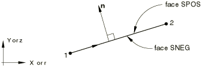
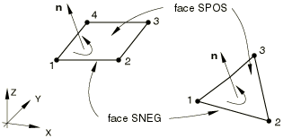

# 30.3.1 刚性单元

**产品：** Abaqus/Standard  Abaqus/Explicit  Abaqus/CAE

##### **参考**

- ["刚体定义，" 第 2.4.1 节](pt01ch02s04aus22.md)
- ["刚性单元库，" 第 30.3.2 节](pt06ch30s03ael23.md)
- [*RIGID BODY](../key/key-link.md#usb-kws-mrigidbody)
- ["定义刚体约束，" Abaqus/CAE User's Guide 第 15.15.2 节](../usi/usi-link.md#usi-itn-helptopic-rigid)

### 概述

刚性单元：
- 可用于定义刚体表面以进行接触；
- 可用于定义多体动力学模拟中的刚体；
- 可连接到可变形单元；
- 可用于约束模型的某些部分；
- 用于将 Abaqus/Aqua 载荷施加到刚性结构；和
- 与给定刚体相关联并共享称为刚体参考节点的公共节点。

### 选择合适的单元

在平面应变或平面应力分析中使用 R2D2 单元，在轴对称平面几何中使用 RAX2 单元，在三维分析中使用 R3D3 和 R3D4 单元。

RB2D2 和 RB3D2 单元通常在 Abaqus/Standard 中用于建模将传递 Abaqus/Aqua 载荷但不会变形的海洋结构。它们也可以用作可变形体上节点之间的刚性连杆。

### 命名约定

Abaqus 中的刚性单元命名如下：


例如，R2D2 是一个二维、2 节点、刚性单元。

### 单元法线定义

对于所有刚性单元，单元正向外法线一侧的面称为 SPOS。另一侧的面称为 SNEG。每个单元的正法线方向定义如下。

R2D2、RAX2、RB2D2、R3D3 和 R3D4 刚性单元可用于 Abaqus/Standard 中定义接触应用的主表面。主表面外法线的方向对于正确检测接触至关重要。接触表面定义的更详细讨论见["在 Abaqus/Standard 中定义接触对，" 第 36.3.1 节](pt09ch36s03aus145.md)。

#### 二维刚性单元

正外向法线方向  定义为从单元节点 1 到节点 2 的方向逆时针旋转 90 度。见[图 30.3.1-1](pt06ch30s03alm23.md#erigid-wire-normal)。

**图 30.3.1-1** 二维刚性单元的正法线。



#### 三维刚性单元

R3D3 和 R3D4 单元的正法线由按照单元连通性中给出的节点顺序围绕节点的右手定则给出。见[图 30.3.1-2](pt06ch30s03alm23.md#erigid-surf-normal)。

RB3D2 单元没有唯一的法线定义。

**图 30.3.1-2** R3D3 和 R3D4 单元的正法线。



### 定义刚性单元

刚性单元必须始终是刚体的一部分。关于刚体定义的完整详细信息，请参阅["刚体定义，" 第 2.4.1 节](pt01ch02s04aus22.md)。

| **输入文件用法：** | ``` [*RIGID BODY](../key/key-link.md#usb-kws-mrigidbody), ELSET=*name* ``` |
| --- | --- |
|  | 其中 ELSET 参数指一组刚性单元。 |

| **Abaqus/CAE 用法：** | Interaction 模块：**Create Constraint**：**Rigid body**：**Body (elements)** |
| --- | --- |

#### 质量分布

在 Abaqus/Standard 中，刚性单元不为其所属的刚体贡献质量。刚性表面上的质量分布可以通过在连接到刚性单元的节点上使用点质量（["点质量，" 第 30.1.1 节](pt06ch30s01alm21.md)）和旋转惯性单元（["旋转惯性，" 第 30.2.1 节](pt06ch30s02alm22.md)）来考虑。

在 Abaqus/Explicit 中，默认情况下，刚性单元不为其所属的刚体贡献质量。要定义质量分布，您可以指定刚体中所有刚性单元的密度。当指定非零密度和厚度时，将以类似于结构单元的方式计算来自刚性单元对刚体的质量和旋转惯性贡献。

| **输入文件用法：** | 在 Abaqus/Explicit 中使用以下选项指定刚性单元的密度： |
| --- | --- |
|  | ``` [*RIGID BODY](../key/key-link.md#usb-kws-mrigidbody), DENSITY=*density* ``` |

| **Abaqus/CAE 用法：** | 您不能在 Abaqus/CAE 中指定刚性单元的密度。 |
| --- | --- |

#### Abaqus/Explicit 中的几何

在 Abaqus/Explicit 中，您可以为刚体中所有刚性单元指定横截面积或厚度。如果您未指定，Abaqus/Explicit 假定默认的零横截面积或厚度。

为了考虑由刚性单元形成的表面厚度的连续变化，您可以指定节点处刚性单元的厚度。

为接触对定义中形成刚性表面的刚性单元指定非零厚度可用于考虑接触约束中表面厚度的影响。它还支持与由刚性单元形成的刚性表面一起使用双面表面接触功能。

| **输入文件用法：** | 在 Abaqus/Explicit 中使用以下选项为刚体中的所有刚性单元指定横截面积或厚度： |
| --- | --- |
|  | ``` [*RIGID BODY](../key/key-link.md#usb-kws-mrigidbody) *cross-sectional area or thickness* ``` 使用以下两个选项为由刚性单元形成的表面指定连续变化的厚度： ``` [*NODAL THICKNESS](../key/key-link.md#usb-kws-mnodalthickness) [*RIGID BODY](../key/key-link.md#usb-kws-mrigidbody), NODAL THICKNESS ``` |

| **Abaqus/CAE 用法：** | 您不能在 Abaqus/CAE 中指定刚性单元的横截面积或厚度。 |
| --- | --- |

#### Abaqus/Explicit 中的偏移

在 Abaqus/Explicit 中，您可以定义从刚性单元中面到包含单元节点的参考表面的距离（以刚性单元厚度的分数形式测量）。偏移的正值在单元法线方向上。当偏移距离为 0.5 时，顶面是参考表面。当偏移距离为 -0.5 时，底面是参考表面。默认偏移距离为 0，表示刚性单元的中间表面是参考表面。您可以指定大于刚性单元厚度一半的偏移距离值。

由于对刚性单元不执行单元级计算，指定的偏移仅影响具有由刚性单元形成的刚性表面的接触对处理（见["基于单元的表面定义，" 第 2.3.2 节](pt01ch02s03aus17.md)）。使用偏移定义的刚性单元对刚体的质量和旋转惯性贡献的计算如同偏移为零一样。

| **输入文件用法：** | 在 Abaqus/Explicit 中使用以下选项为刚性单元指定表面偏移： |
| --- | --- |
|  | ``` [*RIGID BODY](../key/key-link.md#usb-kws-mrigidbody), OFFSET=*offset* ``` OFFSET 参数接受一个值或标签（SPOS 或 SNEG）。指定 SPOS 等效于指定值 0.5；指定 SNEG 等效于指定值 -0.5。 |

| **Abaqus/CAE 用法：** | 您不能在 Abaqus/CAE 中为刚性单元指定偏移。 |
| --- | --- |
