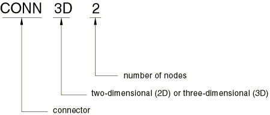

# 31.1.2 连接器单元


**产品：** Abaqus/Standard  Abaqus/Explicit  Abaqus/CAE  

##### **参考文献**

- ["连接器概述，" 第31.1.1节](pt06ch31s01abo28.md)
- ["连接器单元库，" 第31.1.4节](pt06ch31s01ael25.md)
- ["连接类型库，" 第31.1.5节](pt06ch31s01aus114.md)
- [*CONNECTOR SECTION](../key/key-link.md#usb-kws-mconnectorsection)
- ["创建连接器截面，" Abaqus/CAE用户指南第15.12.11节](../usi/usi-link.md#usi-itn-help-createconnprop)
- ["创建和修改连接器截面分配，" Abaqus/CAE用户指南第15.12.12节](../usi/usi-link.md#usi-itn-help-createconn)

### 概述

连接器单元：
- 可用于二维、轴对称和三维分析；
- 可定义两个节点之间的连接（每个节点可连接到刚性部件、变形部件或不连接任何部件）；
- 可定义节点与地面之间的连接；
- 具有相对于单元局部的相对位移和转动，称为相对运动分量；
- 通过指定连接器属性进行功能定义；
- 具有全面的运动学和动力学输出；以及
- 可用于在局部坐标系中监控运动学。

### 选择适当的单元

提供了两种连接器单元。选择的单元类型取决于分析的维度：二维和轴对称分析使用CONN2D2，三维分析使用CONN3D2。两种连接器单元最多有两个节点。连接器单元上第二个节点的位置和运动相对于第一个节点测量。

### 命名约定

Abaqus中的连接器单元命名如下：



例如，CONN2D2是二维2节点连接器单元。

### 定义点之间的连接

连接器单元可用于连接两个点。

| **输入文件用法：** | ``` [*ELEMENT](../key/key-link.md#usb-kws-melement), TYPE=*name* *connector element number*, *node_1*, *node_2* ``` |
| --- | --- |

| **Abaqus/CAE用法：** | 相互作用模块：****Connector****Assignment****Create****：选择线束 |
| --- | --- |

### 定义点与地面之间的连接

连接器单元可连接到地面，地面"节点"可以是连接器单元上的第一个或第二个点。用于计算相对位置和位移的地面节点初始位置是单元上其他点的初始位置。地面节点上的所有位移和转动（如果存在）是固定的。

| **输入文件用法：** | 使用以下选项之一： |
| --- | --- |
|  | ``` [*ELEMENT](../key/key-link.md#usb-kws-melement), TYPE=*name* *connector element number, node number on the body* [*ELEMENT](../key/key-link.md#usb-kws-melement), TYPE=*name* *connector element number, , node number on the body* ``` |

| **Abaqus/CAE用法：** | 相互作用模块：****Connector****Assignment****Create****：选择连接到地面的线束 |
| --- | --- |

### 相对运动分量

连接器单元具有相对于单元局部的相对位移和转动。这些相对位移和转动称为相对运动分量。在三维情况下，连接器单元使用12个节点自由度来定义六个相对运动分量：三个位移和三个单元局部方向上的转动。在二维情况下，六个节点自由度定义三个相对运动分量：两个位移和一个转动。相对运动分量要么是约束的，要么是无约束的（"可用的"），这取决于连接器单元的定义。

#### 约束的相对运动分量

约束的相对运动分量是由连接器单元固定的位移和转动。

对于具有约束相对运动分量的连接器单元，Abaqus/Standard使用拉格朗日乘子强制执行运动约束。因此，在Abaqus/Standard中，元素承载的约束力和力矩作为附加解变量出现。附加解变量的数量等于约束相对运动分量的数量。在Abaqus/Explicit中，使用增广拉格朗日技术强制执行约束，不需要附加解变量。

#### 可用的相对运动分量

可用的相对运动分量是运动学上未约束的位移和转动，因此仍可用于定义类材料行为、指定随时间变化的运动、施加加载或分配复杂相互作用（如接触或摩擦）。许多连接类型具有可用的相对运动分量，其含义在["连接类型库，" 第31.1.5节](pt06ch31s01aus114.md)中针对每个单独连接类型进行描述。

### 定义连接属性

连接属性定义了连接器单元的功能。在最一般情况下，您指定以下属性：
- 连接类型或多种连接类型，
- 与连接器节点相关的局部方向，
- 某些连接类型的附加数据，以及
- 连接器行为。

使用这些属性定义的连接器定义与一组连接器单元相关联。

| **输入文件用法：** | ``` [*CONNECTOR SECTION](../key/key-link.md#usb-kws-mconnectorsection), ELSET=*name* ``` |
| --- | --- |

| **Abaqus/CAE用法：** | 相互作用模块：****Connector****Geometry****Create Wire Feature********Connector****Section****Create****：**Name:** *connector section name*****Connector****Assignment****Create****：选择线束：**Section:** *connector section name* |
| --- | --- |

#### 定义连接类型

Abaqus提供了全面的连接类型库。参见["连接类型库，" 第31.1.5节](pt06ch31s01aus114.md)了解可用的连接类型。连接类型分为三类：基本连接组件、组合连接和复杂连接。基本连接组件影响第二个节点的平移或转动。连接器单元可包括一个平移基本连接组件和/或一个转动基本连接组件。组合连接由基本连接组件构建。它们为方便起见而提供，不能与基本连接组件或其他组合连接在同一连接器单元定义中组合。复杂连接影响连接中节点自由度的组合，不能与其他连接组件组合。

连接类型指定为：
- 单个基本连接类型（平移或转动），
- 一个平移和一个转动基本连接类型，
- 一个组合连接类型，或
- 一个复杂连接类型。

| **输入文件用法：** | 使用以下选项之一： |
| --- | --- |
|  | ``` [*CONNECTOR SECTION](../key/key-link.md#usb-kws-mconnectorsection), ELSET=*name* *basic connection type*, *basic connection type* [*CONNECTOR SECTION](../key/key-link.md#usb-kws-mconnectorsection), ELSET=*name* *assembled connection* or *complex connection* ``` |

| **Abaqus/CAE用法：** | 相互作用模块：****Connector****Section****Create****：**Connection Category**：****Basic**，**Translational type：** *translational basic connection type*和/或**Rotational type：** *rotational basic connection type*或****Connector****Section****Create****：**Connection Category**：****Assembled/Complex**，**Assembled/Complex type：** *assembled connection* or *complex connection* |
| --- | --- |

#### 定义局部连接器方向

通常需要节点处的局部方向来定义用于定义连接器单元的连接类型。节点处的局部方向及其用于定义连接的方式在["连接类型库，" 第31.1.5节](pt06ch31s01aus114.md)中描述。在最一般情况下，连接类型使用两组局部方向，按["方向，" 第2.2.5节](pt01ch02s02aus15.md)中的描述定义。与两个方向定义关联的名称必须从连接器截面定义中引用。

| **输入文件用法：** | 对于最一般情况，使用以下选项： |
| --- | --- |
|  | ``` [*ORIENTATION](../key/key-link.md#usb-kws-morientation), NAME=*orientation_1* [*ORIENTATION](../key/key-link.md#usb-kws-morientation), NAME=*orientation_2* [*CONNECTOR SECTION](../key/key-link.md#usb-kws-mconnectorsection), ELSET=*name* *basic connection type(s)* or *assembled connection* *orientation_1 for first node (or ground), orientation_2 for second node (or ground)* ``` |

| **Abaqus/CAE用法：** | 相互作用模块：****Connector****Assignment****Create****：选择线束：**Orientation 1**，**Orientation 2**：****Edit**：分别为第一点和第二点选择方向 |
| --- | --- |

##### 自由度激活和连接方向的共旋转

许多连接类型需要连接器单元上节点处的连接方向，或允许定义可选方向。在允许使用方向定义来定义连接方向的情况下（必需或可选），连接器单元会激活其附加节点的转动自由度（如果尚不存在）。唯一的例外是连接类型JOIN，其连接方向在单元第一个节点处是可选的，但不会激活转动自由度。

连接器单元的方向方向随连接器单元上相应节点处的转动自由度共旋转。如果没有具有转动自由度或转动约束（如方程或多点约束）的单元附加到节点，您必须确保提供足够的转动边界条件，以避免与无约束转动自由度相关的数值奇异性。连接类型JOIN在连接器单元节点处没有活动转动自由度时使用固定方向。

##### 示例

[图31.1.2-1](pt06ch31s01alm25.md#econnector-shock-usb-elm-econnectorelem)举例说明使用CONN3D2单元连接两个具有圆柱形连接器的物体，该连接器相对于全局1轴成60度角。左侧是要建模的连接示意图；右侧是等效有限元模型。参见["连接类型库，" 第31.1.5节](pt06ch31s01aus114.md)获取连接器类型名称列表。

**图31.1.2-1** 减震器的简化连接器模型。


连接要求节点b保持在减震器线上，该线由节点a的位置和方向决定。此外，节点b上垂直于减震器线的两个转动分量必须与节点a上的相同。因此，连接中唯一允许的相对运动分量是节点b相对于节点a沿减震器线的位移，以及节点b相对于节点a绕减震器线的转动。此位移和此转动是可用的相对运动分量。连接器使用输入文件中的以下行定义：

```
[*ELEMENT](../key/key-link.md#usb-kws-melement), TYPE=CONN3D2, ELSET=shock
101, 11, 12
[*CONNECTOR SECTION](../key/key-link.md#usb-kws-mconnectorsection), ELSET=shock
slot, revolute
ori60,
[*ORIENTATION](../key/key-link.md#usb-kws-morientation), NAME=ori60
**定义沿槽的局部1方向（必需）
**还定义转动轴（对于revolute是必需的）
0.5, 0.866025, 0.0, -0.866025, 0.5, 0.0
```

或者，您可以使用组合连接类型CYLINDRICAL代替两个基本连接类型SLOT和REVOLUTE。

#### 定义附加连接类型数据

某些连接类型允许附加数据来定义连接器的运动行为。例如，连接类型FLOW-CONVERTER允许您指定节点b处材料流的缩放因子。参见["连接类型库，" 第31.1.5节](pt06ch31s01aus114.md)获取更多信息。

#### 定义连接器行为

Abaqus在可用的相对运动分量中提供全面的动力学行为建模。定义连接器行为是可选的，可用于包含弹簧、阻尼器、节点对节点接触、锁定、摩擦、类塑性效应和破坏。连接器中的动力学建模功能在["连接器行为，" 第31.2.1节](pt06ch31s02alm27.md)中详细描述。

### 在二维和轴对称分析中使用连接器单元

并非所有连接类型都可与CONN2D2单元类型一起使用。连接类型库包含许多仅对三维分析有效的连接类型。在其他情况下，连接类型定义中要求的局部方向与二维坐标系冲突。参见["连接类型库，" 第31.1.5节](pt06ch31s01aus114.md)获取更多信息。

### 并行使用多个连接器单元

Abaqus中的连接器单元允许用单个连接器单元建模大多数物理连接。然而，在某些情况下，更复杂的连接或输出考虑可能需要并行使用多个连接器单元。这通过在同一节点之间定义两个或多个连接器单元来实现。在这种情况下，您必须确保一个连接器单元中的约束相对运动分量不被其他连接器单元之一约束（通过运动约束或通过["连接器驱动，" 第31.1.3节](pt06ch31s01alm26.md)中描述的规定运动）。

有时并行使用多个连接器单元以获得不同坐标系中的输出。对于两个物体之间的连接器单元，节点处的局部方向可由连接类型的要求确定。然而，可能需要在不同的、可能是共旋转的坐标系中输出。例如，可通过使用第二个连接器单元（如不施加运动约束或使用连接器行为的连接类型CARDAN）来报告局部物体固定坐标系（而非用于定义连接器单元的坐标系）中的角加速度历史。

### 在包含部件和装配的模型中定义连接器

Abaqus模型可以基于部件实例的装配来定义（参见["定义装配，" 第2.10.1节](pt01ch02s10aus28.md)）。在此类模型中，连接器单元可在部件级别或装配级别定义。

### 将连接器单元与节点变换一起使用

可为连接器单元附加的任一节点定义节点变换（参见["变换坐标系，" 第2.1.5节](pt01ch02s01aus09.md)）。由于这些变换仅影响节点自由度，其使用不影响连接器单元的行为。连接器单元对局部连接的运动分量进行操作。

### 在几何线性分析中使用非线性连接

如果在几何线性分析中使用具有非线性运动约束的连接器单元，则运动约束被线性化。例如，如果在几何线性分析中使用连接类型LINK，则两个节点之间的距离在投影到节点原始位置之间的方向后保持不变。仅当转动和位移的幅度不小的时候，这种差异才应该很明显。

### Abaqus/Explicit中连接器节点的质量不匹配

如果在Abaqus/Explicit中连接器单元的节点质量高度不匹配，隐式求解器可能由于由此产生的病态系数矩阵而遇到收敛问题。为防止这种情况发生，如果连接器单元的节点质量或转动惯量相差超过三个数量级，Abaqus/Explicit会向具有较小质量/转动惯量的连接器单元节点添加质量/转动惯量。添加的质量/转动惯量可以忽略不计（小于连接器单元节点惯量中较大者的三个数量级）。此附加质量几乎不会显著影响解决方案。然而，在某些情况下（例如，对于具有高度不匹配节点质量的连接器单元的强动态分析），此调整可能产生明显影响。

### 连接器输出

连接器单元的力、力矩和运动输出在["连接器单元库，" 第31.1.4节](pt06ch31s01ael25.md)中定义。这些输出量包括总弹性、黏性和摩擦力及力矩。此外，还可获得由连接器停止和锁引起的反力和力矩，以及用于摩擦计算的连接器接触力。

要从Abaqus/Explicit获得准确的连接器反力和力矩输出，有时可能需要以双精度运行分析。在这种情况下，双精度运行也将更好地估计反力和力矩所做的功，从而提供更准确的Abaqus/Explicit报告的外功能量的值。

运动学输出包括相对位置、相对位移、相对速度、相对加速度、摩擦滑移和本构位移（用于弹力和滞后摩擦计算的位移，定义为当前相对位置与参考位置之间的差值；参见["定义本构响应的参考长度和角度"中的"连接器行为，" 第31.2.1节](pt06ch31s02alm27.md#usb-elm-econnectorbehavior-reflengths))。对于相对转动，Abaqus报告角度的约定不使用在-π到π弧度之间的约定。连接器单元的角度和转动分量或相对运动输出包括累积的多重转动，其幅度可以任意大。可用能量输出以及输出标志来识别连接器是否已破坏（在Abaqus/Explicit中仅）、锁定或达到连接器停止。

在Abaqus/Standard的几何线性步骤中，相对位置输出变量不会改变（与输出节点坐标的方式相同）。因此，在解释连接器停止和锁的输出时必须小心，因为它们使用更新后的坐标。

### 仅将连接器单元用于输出

未定义运动约束或本构行为的连接器单元可用于在局部坐标系中监控运动学输出。感兴趣的量包括局部坐标参数化中的相对位置、位移、速度和加速度。有限转动参数化包括欧拉角和卡登角、转动矢量以及屈曲-扭转-扫频。有关使用连接器单元监控欧拉角的示例，请参见["Abaqus/Standard中刚体的运动，" Abaqus基准指南第1.3.6节](../bmk/bmk-link.md#bmk-anl-rigidbodymotion)。

在Abaqus/Explicit中，所有此类连接器都不调用隐式求解器求解，这会在域并行模式中产生更好的性能（特别是当此类连接器节点与其他约束（如绑定约束的从节点）重叠时）。


