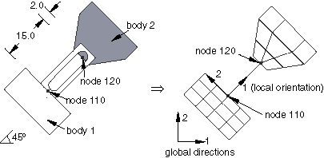

# 31.1.3 连接器驱动


**产品：** Abaqus/Standard  Abaqus/Explicit  Abaqus/CAE  

##### **参考文献**

- ["连接器概述，" 第31.1.1节](pt06ch31s01abo28.md)
- [*CONNECTOR LOAD](../key/key-link.md#usb-kws-hconnectorload)
- [*CONNECTOR MOTION](../key/key-link.md#usb-kws-hconnectormotion)
- ["定义连接器力，" Abaqus/CAE用户指南第16.9.13节](../usi/usi-link.md#usi-lbi-loadeditors-connforce)
- ["定义连接器力矩，" Abaqus/CAE用户指南第16.9.14节](../usi/usi-link.md#usi-lbi-loadeditors-connmom)
- ["定义连接器位移边界条件，" Abaqus/CAE用户指南第16.10.5节](../usi/usi-link.md#usi-lbi-bceditors-conn-disp)
- ["定义连接器速度边界条件，" Abaqus/CAE用户指南第16.10.6节](../usi/usi-link.md#usi-lbi-bceditors-conn-vel)
- ["定义连接器加速度边界条件，" Abaqus/CAE用户指南第16.10.7节](../usi/usi-link.md#usi-lbi-bceditors-conn-acc)

### 概述

连接器驱动：
- 用于模拟这样的情况：例如部署机动中，连接到物体的电机以内部力或力矩历史加载连接，或者液压系统规定运动；
- 可用于固定可用的相对运动分量；以及
- 由规定的位移（转动）或规定的力（力矩）驱动可用的相对运动分量。

规定的相对运动和加载位于与连接器可用的相对运动分量相关的局部方向上。

对同时包含连接器停止或连接器锁定行为的可用相对运动分量规定位移/转动可能导致过约束。Abaqus将在发生过约束时发出警告消息。

### 固定可用的相对运动分量

常见做法是固定可用的运动分量。这种固定运动条件可用于自定义特定应用的连接类型。例如，REVOLUTE连接类型使用局部1方向作为共享转动轴，因此是可用的相对运动分量。如果需要局部3方向上的转动连接，为方便起见，您可以在CARDAN连接类型中固定局部1和2方向上的相对转动。这样做将创建一个与REVOLUTE连接类型相同的连接类型；但是，共享轴将是局部3方向而不是局部1方向。

本节后文提供了一个示例，其中槽销连接的销部分使用带有固定转动的CARDAN连接类型建模。

| **输入文件用法：** | 在输入文件的模型部分使用以下选项来固定可用的连接器相对运动分量： |
| --- | --- |
|  | ``` [*CONNECTOR MOTION](../key/key-link.md#usb-kws-hconnectormotion) ``` |

| **Abaqus/CAE用法：** | 加载模块：**Create Boundary Condition**：**Step: Initial**：**Mechanical**：**Connector displacement** |
| --- | --- |

### 位移控制的驱动

您可以指定连接器局部方向中两个部件之间的相对位移、速度或加速度，方式类似于定义边界条件（参见["Abaqus/Standard和Abaqus/Explicit中的边界条件，" 第34.3.1节](pt07ch34s03aus118.md)）。您指定连接器单元集名称或连接器单元编号；识别被驱动的可用相对运动分量的分量编号；以及相对位移、速度或加速度的值。

用于强制执行连接器运动的惩罚可能导致嘈杂的解决方案，特别是在某些模型的单精度情况下。因此，在这种情况下使用双精度更好。如果对双精度性能有顾虑，您可以运行约束打包和约束求解器双精度（参见["Abaqus/Standard、Abaqus/Explicit和Abaqus/CFD执行，" 第3.2.2节](pt01ch03s02abx02.md)）。

您不能在子空间动态分析中指定连接器的运动。

| **输入文件用法：** | 在输入文件的历史部分使用以下选项来指定连接器的相对位移： |
| --- | --- |
|  | ``` [*CONNECTOR MOTION](../key/key-link.md#usb-kws-hconnectormotion), AMPLITUDE=*name*, OP=MOD *or* NEW, TYPE=DISPLACEMENT ``` 在输入文件的历史部分使用以下选项来指定连接器的相对速度： ``` [*CONNECTOR MOTION](../key/key-link.md#usb-kws-hconnectormotion), AMPLITUDE=*name*, OP=MOD *or* NEW, TYPE=VELOCITY ``` 在输入文件的历史部分使用以下选项来指定连接器的相对加速度： ``` [*CONNECTOR MOTION](../key/key-link.md#usb-kws-hconnectormotion), AMPLITUDE=*name*, OP=MOD *or* NEW, TYPE=ACCELERATION ``` |

| **Abaqus/CAE用法：** | 加载模块：**Create Boundary Condition**：**Mechanical**：**Connector displacement**、**Connector velocity**或**Connector acceleration** |
| --- | --- |

#### 示例

[图31.1.3-1](pt06ch31s01alm26.md#econnector-pininslot)举例说明用单元类型CONN3D2建模的槽销连接，该连接相对于全局1轴成45度角。

**图31.1.3-1** 使用SLOT和CARDAN连接类型建模的槽销连接。



左侧图是要建模的连接示意图，而右侧图是有限元网格。槽中位移仅允许沿槽线，连接类型SLOT适用于强制执行这些运动学。假设销和槽的构造方式使得销相对于槽的唯一转动沿局部3方向。这是一个转动约束；但是基本转动连接类型REVOLUTE使用局部1方向作为转动轴。在这种情况下，连接类型CARDAN与规定的约束结合使用可用来定义具有适当转动轴的类转动型连接。

为便于说明，假设连接由绕销轴的每秒弧度旋转速度驱动。使用方便输入参数化，以下行使用：

```
[*PARAMETER](../key/key-link.md#usb-kws-mparameter)
PI = 3.141592
rotangvel = PI/4
*...*
[*ELEMENT](../key/key-link.md#usb-kws-melement), TYPE=CONN3D2, ELSET=pininslot
101, 110, 120
[*CONNECTOR SECTION](../key/key-link.md#usb-kws-mconnectorsection), ELSET=pininslot
cardan, slot
ori45,
[*CONNECTOR MOTION](../key/key-link.md#usb-kws-hconnectormotion)
pininslot, 4
pininslot, 5
[*ORIENTATION](../key/key-link.md#usb-kws-morientation), NAME=ori45
0.707, 0.707, 0.0, -0.707, 0.707, 0.0
*...*
[*STEP](../key/key-link.md#usb-kws-hstep)
*...*
[*CONNECTOR MOTION](../key/key-link.md#usb-kws-hconnectormotion), TYPE=VELOCITY
pininslot, 6, <rotangvel>
*...*
[*END STEP](../key/key-link.md#usb-kws-hendstep)
```

### 力控制的驱动

您可以指定施加到可用的相对运动分量的集中加载，方式类似于为Abaqus中其他单元定义集中加载（参见["集中加载，" 第34.4.2节](pt07ch34s04aus121.md)）。但是，连接器加载始终是随动加载，随连接器单元运动时可用相对运动分量的转动而转动。您指定连接器单元集名称或连接器单元编号，识别被加载的可用相对运动分量，以及驱动载荷或力矩的值。

| **输入文件用法：** | 在输入文件的历史部分使用以下选项来指定连接器的集中加载： |
| --- | --- |
|  | ``` [*CONNECTOR LOAD](../key/key-link.md#usb-kws-hconnectorload), AMPLITUDE=*name*, OP=MOD ``` |

| **Abaqus/CAE用法：** | 加载模块：**Create Load**：**Mechanical**：**Connector force**或**Connector moment** |
| --- | --- |

#### 示例

回到[图31.1.3-1](pt06ch31s01alm26.md#econnector-pininslot)中的示例，假设销沿槽被恒定力1000.0个单位推动（例如，通过液压系统）。应将以下行添加到输入文件：

```
[*STEP](../key/key-link.md#usb-kws-hstep)
*...*
[*CONNECTOR LOAD](../key/key-link.md#usb-kws-hconnectorload)
pininslot, 1, 1000.0
*...*
[*END STEP](../key/key-link.md#usb-kws-hendstep)
```

### 线性扰动过程中的连接器驱动

仅在特征值屈曲、直接解稳态动态和线性静态扰动过程中允许非零幅值连接器运动。在特征频率提取过程中指定的任何非零幅值将被忽略，并且规定的可用相对运动分量将保持固定。连接器运动不能用于任何基于模态的过程。

在直接解稳态动态分析中，任何可用连接器相对运动分量的实部和虚部同时被约束或不受约束；同时约束一个部件而另一个不受约束在物理上是不可能的。Abaqus/Standard将自动约束相对运动分量的实部和虚部，即使只规定了一个部件。未指定的部件将假定具有零扰动幅值。

特征值屈曲步骤中非零规定的连接器运动将贡献增量应力，因此将贡献差分初始应力刚度。在规定非零连接器运动时，必须仔细解释由此产生的特征值问题。参见["特征值屈曲预测，" 第6.2.3节](pt03ch06s02at02.md)中边界条件的讨论，获取更多详细信息。

在稳态动态分析中，实部和虚部连接器加载都可以以类似于集中加载的方式施加（参见["基于模态的稳态动态分析，" 第6.3.8节](pt03ch06s03at13.md)；["直接解稳态动态分析，" 第6.3.4节](pt03ch06s03at09.md)；和["基于子空间的稳态动态分析，" 第6.3.9节](pt03ch06s03at14.md)）。随机响应分析中可定义多个连接器载荷情况（参见["随机响应分析，" 第6.3.11节](pt03ch06s03at16.md)），方式类似于集中加载。连接器加载在特征频率提取分析期间被忽略。

