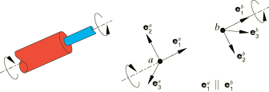
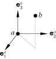
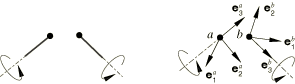
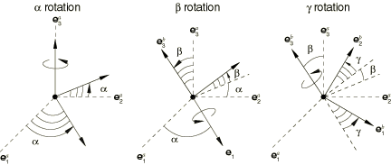
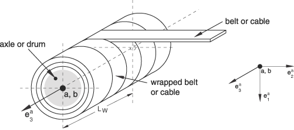
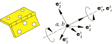
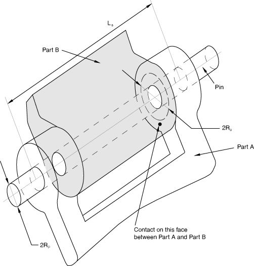

# 31.1.5 连接类型库

**产品：** Abaqus/Standard  Abaqus/Explicit  Abaqus/CAE  

##### **参考文献**

- ["连接器单元，" 第31.1.2节](pt06ch31s01alm25.md)
- ["连接器单元库，" 第31.1.4节](pt06ch31s01ael25.md)
- [*CONNECTOR BEHAVIOR](../key/key-link.md#usb-kws-mconnectorbehavior)
- [*CONNECTOR SECTION](../key/key-link.md#usb-kws-mconnectorsection)

### 概述

连接类型库包含：
- 平移基本连接组件，影响两个节点处的平移自由度，可能影响连接器单元第一个节点或两个节点处的转动自由度；
- 转动基本连接组件，仅影响连接器单元两个节点处的转动自由度；
- 专用转动基本连接组件，除了转动自由度外还影响连接器单元节点处的其他自由度；
- 组合连接，是平移和转动或平移和专用转动基本连接组件的预定义组合；以及
- 复杂连接，影响连接器单元节点处自由度的组合，不能与任何其他连接组件组合。

### 使用连接类型库

每个连接类型都在连接类型库中描述。每个库条目包括一个图形，它将物理行为与理想化模型关联并定义局部坐标方向。在图形之后，每个库条目定义运动约束；连接内部的约束力和力矩；可用于定义连接器行为、连接器运动或连接器加载的相对运动分量（称为可用分量）；以及与可用相对运动分量共轭的动力学力和力矩。如果适当，文中还讨论了连接中预测的类库仑摩擦。最后，连接类型在表格中总结。

#### 连接图形

每个连接类型都包含一个示意图以及连接的Abaqus理想化模型。理想化模型指示可用相对运动分量的测量方式，以及节点位置和方向如何定义连接。当使用方向定义连接时，理想化模型会在相应节点处显示这些局部方向。如果连接中存在可用的相对运动分量，则在图中将其表示为自由相对运动。[图31.1.5-1](pt06ch31s01aus114.md#econnect-connectionfig)显示了REVOLUTE连接类型的连接图形，它仅影响转动。它有一个可用分量（绕共享轴的转动），需要在节点a处指定方向，在节点b处允许可选方向。

**图31.1.5-1** 示例连接类型：REVOLUTE。

#### 方向

节点a（连接器单元上的第一个节点）处的方向表示为单位基向量，其中。同样，节点b处的方向表示为。当需要在节点处指定方向时，您必须按["方向，" 第2.2.5节](pt01ch02s02aus15.md)中的描述定义它们。如果方向在节点a处是可选但未提供，则默认使用全局方向。如果方向在节点b处是可选但未提供，则默认使用节点a处的方向。

连接器单元会在其附加的节点处激活转动自由度（如果尚不存在且该节点允许方向）。唯一的例外是连接类型JOIN，其在节点a处方向是可选的，但不激活转动自由度。

方向随其附加节点的转动共旋转（连接类型JOIN除外，当节点a处没有活动转动自由度时使用固定方向）。如果没有具有附加到节点的转动自由度或转动多点约束或转动方程的单元，您必须确保提供足够的转动边界条件，以避免与无约束转动自由度相关的数值奇异性。

#### 相对运动分量以及连接器力和力矩

六个相对运动分量，记为和对于，在需要时在每个连接的描述中定义。这些分量包括约束和可用的相对运动分量。力和力矩记为和。这些量可以是强制约束相对运动分量约束的约束力和力矩，或者是可用的相对运动分量的功共轭变量。例如，REVOLUTE连接类型有一个可用的相对运动分量，以及两个运动转动约束（等效于将两个转动分量和设置为零）。与可用转动分量共轭的是绕局部方向作用的动力学力矩。

一般来说，动力学力和力矩包括连接器行为的影响，如弹性弹簧、黏性阻尼、摩擦以及由连接器停止和锁引起的反力和力矩。对于定义为位移或转动函数的本构响应，初始位置可能不对应于本构力和力矩为零的参考位置。您可以为连接器行为定义参考长度和角度（以度为单位），如["连接器行为"中"定义本构响应的参考长度和角度"第31.2.1节](pt06ch31s02alm27.md#usb-elm-econnectorbehavior-reflengths)所述。这些参考量定义了和，即连接器本构位移和转动。这些本构位移和转动仅用于定义本构响应，并且仅在您定义参考长度或角度时与连接器单元中测量的相对位移和转动不同。

例如，如果REVOLUTE连接包含线性弹簧和阻尼器行为以及连接器停止，

其中是弹簧刚度，是阻尼器系数，是由连接器停止引起的反力矩。在REVOLUTE连接中有两个约束力矩分量，和关于。

##### 解释连接器力和力矩

运动约束和动力学力和力矩始终作为连接中运动学的功共轭量计算。在大多数连接类型中，一个直接后果是连接中的约束力（和力矩）被报告为施加在第二个节点上但在与第一个节点关联的局部系统中的力（和力矩）。由于许多连接类型中的运动学很复杂，连接器力和力矩在第一次检查时可能有些令人惊讶。例如，考虑铰链连接的情况，其局部方向与全局X方向对齐，局部方向与全局Y方向对齐。假设第二个连接器节点接地，第一个节点承受沿全局Y方向的集中加载。如果铰链中唯一可用的相对转动被零值连接器运动约束，则第二个节点不会相对于第一个节点转动，并且沿局部方向的连接器反力与施加的加载匹配，而其他两个连接器反力为零。然而，如果指定了非零连接器运动，第一个连接器反力仍然为零，而第二和第三个连接器反力都不为零，并且只有这两个力的矢量范数与施加的加载匹配。在两种情况下，第二个连接器节点处的唯一非零节点反力是沿全局Y方向的力，如自由体图中的平衡所决定的。因此，在大多数情况下，连接器反力和节点反力不相等。

#### 类库仑摩擦行为

对于任何具有可用相对运动分量的连接类型都可能存在类库仑摩擦行为；详见["连接器摩擦行为，" 第31.2.5节](pt06ch31s02alm31.md)。摩擦行为需要"切向"方向（可能发生滑移的方向）和"法向"方向（垂直于接触表面的方向）。在最一般情况下，您定义在连接中产生摩擦的法向力。但是，Abaqus为有限数量的连接类型预定义了摩擦行为，如本节的连接类型库中所讨论的。在这些预定义摩擦情况下，您不必定义接触法向力。

#### 总结表

每个连接库条目都包含一个总结表，总结连接类型。该总结表指示连接类型是基本的、组合的还是复杂的。它给出运动约束；约束力或力矩分量；可用的相对运动分量；由可用的相对运动分量中的本构行为引起的"动力学"力或力矩分量；哪些方向是必需的、可选的还是被忽略的；连接器停止如何限制可用的相对运动分量；哪些参考长度和角度用于定义本构行为；哪些参数用于预定义类库仑摩擦；以及Abaqus如何定义与预定义类库仑摩擦相关的接触法向力。

### 基本连接组件

基本连接组件分为三类：
- 平移基本连接组件，影响两个节点处的平移自由度，可能影响第一个节点或两个节点处的转动自由度
- 转动基本连接组件，仅影响两个节点处的转动自由度
- 专用转动基本连接组件，除了转动自由度外还影响节点处的其他自由度

在连接器单元的定义中只能使用一个平移基本连接组件和一个转动或专用转动基本连接组件。如果更复杂的连接需要比这更多的基本连接组件，请使用附加到同一节点的多个连接器单元。

#### 平移基本连接组件

以下基本连接组件影响节点a和节点b两个节点处的平移自由度。其中一些连接器组件影响节点a处或节点a和节点b两个节点处的转动自由度。此列表中的任何基本连接组件都可用于定义连接器单元的平移行为。

| ACCELEROMETER | 提供两个节点之间的连接，用于测量局部坐标系中物体的相对加速度、速度和位置。此连接类型仅在Abaqus/Explicit中可用。如果在Abaqus/Standard模型中定义，它将在内部转换为CARTESIAN连接器类型。 |
| --- | --- |
| AXIAL | 提供沿连接节点的线起作用的两个节点之间的连接。 |
| CARTESIAN | 提供两个节点之间的连接，允许在跟随节点a处的系统的三个局部笛卡尔方向上独立行为。 |
| JOIN | 连接两个节点的位置。 |
| LINK | 提供两个节点之间的销钉刚性连杆，保持两个节点之间的距离恒定。 |
| PROJECTION CARTESIAN | 提供两个节点之间的连接，允许在节点a和节点b两个节点处的系统上独立行为。 |
| RADIAL-THRUST | 提供两个节点之间的连接，允许径向和推力位移的不同行为。 |
| SLIDE-PLANE | 提供滑动平面连接，使第二个节点保持在由第一个节点的方向和第二个节点的初始位置定义的平面上。 |
| SLOT | 提供槽连接，使第二个节点保持在由第一个节点的方向和第二个节点的初始位置定义的线上。 |

#### 转动基本连接组件

以下基本连接组件仅影响连接中节点处的转动自由度。此列表中的任何基本连接组件都可用于定义连接器单元的转动行为。

| ALIGN | 提供两个节点之间的连接，对齐其局部方向。 |
| --- | --- |
| CARDAN | 提供由卡登角（或 Bryant角）参数化的两个节点之间的转动连接。 |
| CONSTANT VELOCITY | 提供两个节点之间的等速连接。 |
| EULER | 提供由欧拉角参数化的两个节点之间的转动连接。 |
| FLEXION-TORSION | 提供两个节点之间的连接，允许弯曲和扭转转动的不同行为。 |
| PROJECTION FLEXION-TORSION | 提供两个节点之间的连接，允许两个弯曲转动和一个扭转转动的不同行为。 |
| REVOLUTE | 提供两个节点之间的转动连接。 |
| ROTATION | 提供由转动矢量参数化的两个节点之间的转动连接。 |
| ROTATION-ACCELEROMETER | 提供两个节点之间的连接，用于测量局部坐标系中物体的相对角加速度、速度和位置。此连接类型仅在Abaqus/Explicit中可用。如果在Abaqus/Standard模型中定义，它将在内部转换为CARDAN连接器类型。 |
| UNIVERSAL | 提供两个节点之间的万向连接。 |

#### 专用转动基本连接组件

以下基本连接组件影响连接中节点处的转动和其他非平移自由度。专用转动基本连接组件可与平移基本连接组件组合。

| FLOW-CONVERTER | 提供将连接节点处的材料流（自由度10）转换为转动的手段。 |
| --- | --- |

### 组合连接

组合连接为方便起见而包含。每个组合连接由基本连接组件组合创建。每个组合连接使用的等效基本连接组件在括号中列出。

| BEAM | 提供两个节点之间的刚性梁连接。(JOIN + ALIGN) |
| --- | --- |
| BUSHING | 提供两个节点之间的连接，允许在节点a和节点b两个节点处的系统上三个局部笛卡尔方向上独立行为，以及两个弯曲转动和一个扭转转动的不同行为。(PROJECTION CARTESIAN + PROJECTION FLEXION-TORSION) |
| CVJOINT | 连接两个节点的位置，并在其转动自由度之间提供等速连接。(JOIN + CONSTANT VELOCITY) |
| CYLINDRICAL | 提供两个节点之间的槽连接，并通过转动连接约束转动。(SLOT + REVOLUTE) |
| HINGE | 连接两个节点的位置，并在其转动自由度之间提供转动连接。(JOIN + REVOLUTE) |
| PLANAR | 提供两个节点之间的滑动平面连接，绕平面的法向方向进行转动。PLANAR连接在三维分析中创建局部二维系统。(SLIDE-PLANE + REVOLUTE) |
| RETRACTOR | 连接两个节点的位置，并将材料流转换为转动。(JOIN + FLOW-CONVERTER) |
| TRANSLATOR | 提供两个节点之间的槽连接，并对齐其三个局部轴方向。(SLOT + ALIGN) |
| UJOINT | 连接两个节点的位置，并在节点处的转动自由度之间提供万向连接。(JOIN + UNIVERSAL) |
| WELD | 连接两个节点的位置，并对齐其三个局部轴方向。(JOIN + ALIGN) |

### 复杂连接

复杂连接影响连接中节点处自由度的组合，不能与其他连接组件组合。它们通常模拟高度耦合的物理连接。

| SLIPRING | 模拟皮带系统（如汽车安全带）两点之间的材料流和拉伸。 |
| --- | --- |

### 连接类型库

以下描述按字母顺序列出所有基本连接组件和组合连接。

#### ACCELEROMETER

连接类型ACCELEROMETER提供了一种在局部坐标系中测量物体相对位置、速度和加速度的便捷方法。所有运动量都相对于节点a测量。虽然位置和位移在节点a的坐标系中报告，但速度和加速度在节点b的坐标系中报告。连接器的每个节点都可以独立平移和转动，尽管更常见的是将两个节点中的第一个固定到地面。固定第一个节点后，连接类型ACCELEROMETER提供了一种在固定到运动物体（例如加速度计）的坐标系中测量速度和加速度局部分量的便捷方法。

连接类型ACCELEROMETER仅在Abaqus/Explicit中可用。它是连接类型ROTATION-ACCELEROMETER的平移对应物，后者测量相对角位置、速度和加速度。ACCELEROMETER连接不能用于Abaqus/Explicit中的二维和轴对称分析。

**图31.1.5-2** 连接类型ACCELEROMETER。

##### 描述

ACCELEROMETER连接不施加运动约束。它在节点a处定义三个局部方向，在节点b处定义三个局部方向。ACCELEROMETER连接的公式类似于CARTESIAN连接。ACCELEROMETER连接测量节点b相对于节点a的位置

可用相对运动分量对于ACCELEROMETER连接不可用。连接器位移分量为

其中，是节点b相对于节点a的初始坐标。

ACCELEROMETER连接在节点a处的局部方向上测量速度和加速度，就好像节点a是惯性框架一样。与CARTESIAN连接相反，ACCELEROMETER连接在节点b处的局部方向上报告计算的速度和加速度。

在二维和轴对称分析中。

##### 总结

| ACCELEROMETER |
| --- |
| 基本、组合或复杂： | 基本 |
| 运动约束： | 无 |
| 约束力输出： | 无 |
| 可用分量： | 无 |
| 动力学力输出： | 无 |
| a处方向： | 可选 |
| b处方向： | 可选 |
| 连接器停止： | 无 |
| 本构参考长度： | 无 |
| 预定义摩擦参数： | 无 |
| 预定义摩擦接触力： | 无 |

#### ALIGN

连接类型ALIGN提供两个节点之间的连接，其中所有三个局部方向都对齐。如果给出了两个局部轴且最初不对齐，则保持它们之间的初始相对角位置恒定。

**图31.1.5-3** 连接类型ALIGN。

##### 描述

ALIGN连接仅施加运动约束。节点b处的局部方向设置为与节点a处的局部方向相等。如果局部方向最初不对齐，ALIGN连接保持节点b处局部方向与节点a处局部方向之间的卡登角固定。这些固定的角位置是连接器位置输出量。参见CARDAN连接类型获取卡登角定义。

##### 总结

| ALIGN |
| --- |
| 基本、组合或复杂： | 基本 |
| 运动约束： |  |
| 约束力矩输出： |  |
| 可用分量： | 无 |
| 动力学力矩输出： | 无 |
| a处方向： | 可选 |
| b处方向： | 可选 |
| 连接器停止： | 无 |
| 本构参考角度： | 无 |
| 预定义摩擦参数： | 无 |
| 预定义摩擦接触力： | 无 |

#### AXIAL

连接类型AXIAL提供两个节点之间的连接，其中相对位移沿分离两个节点的线。它模拟离散物理连接，如轴向弹簧、轴向阻尼器或节点对节点（间隙状）接触。

**图31.1.5-4** 连接类型AXIAL。

##### 描述

AXIAL连接不约束任何相对运动分量。节点a和b之间的距离是

可用相对运动分量沿连接两个节点的线起作用，测量分离两个节点的距离变化，定义为

其中，是从节点a到b的初始距离。连接器本构位移为

动力学力为

在Abaqus/Standard中，可以在AXIAL连接的一个节点处提供可选方向，以便在节点重合或其中一个节点是"地面节点"时提供力方向。如果在两个重合节点处都提供了方向，则将使用连接中第一个节点处的方向。方向定义在分析过程中保持固定，当两个节点分离时将被忽略。连接类型AXIAL不激活转动自由度。

Abaqus/CAE可视化模块中的符号图在第一个节点方向处沿1方向显示AXIAL连接器的矢量场输出，而不是沿连接两个节点的线。如果未为连接器的第一个节点定义方向，则矢量沿全局坐标系的1方向显示。

##### 总结

| AXIAL |
| --- |
| 基本、组合或复杂： | 基本 |
| 运动约束： | 无 |
| 约束力输出： | 无 |
| 可用分量： |  |
| 动力学力输出： |  |
| a处方向： | 可选 |
| b处方向： | 可选 |
| 连接器停止： |  |
| 本构参考长度： |  |
| 预定义摩擦参数： | 无 |
| 预定义摩擦接触力： | 无 |

#### BEAM

连接类型BEAM提供两个节点之间的刚性梁连接。

**图31.1.5-5** 连接类型BEAM。

##### 描述

连接类型BEAM施加运动约束，使用等效于组合连接类型JOIN和ALIGN的局部方向定义。

##### 总结

| BEAM |
| --- |
| 基本、组合或复杂： | 组合 |
| 运动约束： | JOIN + ALIGN |
| 约束力和力矩输出： |  |
| 可用分量： | 无 |
| 动力学力和力矩输出： | 无 |
| a处方向： | 可选 |
| b处方向： | 可选 |
| 连接器停止： | 无 |
| 本构参考长度和角度： | 无 |
| 预定义摩擦参数： | 无 |
| 预定义摩擦接触力： | 无 |

#### BUSHING

连接类型BUSHING在两个节点之间提供衬套状连接。它不能用于二维或轴对称分析。

**图31.1.5-6** 连接类型BUSHING。

##### 描述

连接类型BUSHING不约束任何相对运动分量，使用等效于组合连接类型PROJECTION CARTESIAN和PROJECTION FLEXION-TORSION的局部方向定义。

##### 总结

| BUSHING |
| --- |
| 基本、组合或复杂： | 组合 |
| 运动约束： | 无 |
| 约束力和力矩输出： | 无 |
| 可用分量： |  |
| 动力学力和力矩输出： |  |
| a处方向： | 必需 |
| b处方向： | 可选 |
| 连接器停止： |  |
| 本构参考长度和角度： |  |
| 预定义摩擦参数： | 无 |
| 预定义摩擦接触力： | 无 |

#### CARDAN

连接类型CARDAN提供两个节点之间的转动连接，其中节点之间的相对转动由卡登角（或Bryant角）参数化。有限转动的卡登角参数化也称为1-2-3或偏航-俯仰-滚动参数化。连接类型CARDAN不能用于二维或轴对称分析。

当连接类型CARDAN与连接器行为一起使用时，应将抵抗转动运动最强的相对转动轴分配给第二个相对转动分量（分量编号5），以避免万向节锁，即相对转动角度奇异性。

**图31.1.5-7** 连接类型CARDAN。

##### 描述

CARDAN连接不施加运动约束。CARDAN连接是有限转动连接，其中节点b处的局部方向相对于节点a处的局部方向用卡登角（或Bryant角）参数化。局部方向相对于通过三次有限转动定位如下：

1. 绕轴旋转弧度；
2. 绕中间2轴旋转弧度；和
3. 绕轴旋转弧度。

转动角度应该适中（幅度小于），而可以任意大。卡登角由局部方向确定为

CARDAN连接中的三个可用相对运动分量是定位节点b相对于节点a的局部方向的卡登角变化。因此，

其中，是初始卡登角。连接器本构转动为

CARDAN连接中的动力学力矩由三个分量关系确定：

##### 总结

| CARDAN |
| --- |
| 基本、组合或复杂： | 基本 |
| 运动约束： | 无 |
| 约束力矩输出： | 无 |
| 可用分量： |  |
| 动力学力矩输出： |  |
| a处方向： | 必需 |
| b处方向： | 可选 |
| 连接器停止： |  |
| 本构参考角度： |  |
| 预定义摩擦参数： | 无 |
| 预定义摩擦接触力： | 无 |

#### CARTESIAN

连接类型CARTESIAN提供两个节点之间的连接，其中位置变化在节点a的三个局部连接方向上测量。

**图31.1.5-8** 连接类型CARTESIAN。

##### 描述

CARTESIAN连接不施加运动约束。它在节点a处定义三个局部方向，并测量节点b沿这些局部坐标方向的位置变化。节点a处的局部方向随节点a的转动转动。

节点b相对于节点a的位置为

可用相对运动分量为

其中，是节点b相对于节点a局部坐标系的初始坐标。连接器本构位移为

动力学力为

在二维分析中。

##### 总结

| CARTESIAN |
| --- |
| 基本、组合或复杂： | 基本 |
| 运动约束： | 无 |
| 约束力输出： | 无 |
| 可用分量： |  |
| 动力学力输出： |  |
| a处方向： | 可选 |
| b处方向： | 忽略 |
| 连接器停止： |  |
| 本构参考长度： |  |
| 预定义摩擦参数： | 无 |
| 预定义摩擦接触力： | 无 |

#### CONSTANT VELOCITY

连接类型CONSTANT VELOCITY提供连接类型CVJOINT的转动部分。它不能用于二维或轴对称分析。此外，连接类型没有可用的相对运动分量。要在弯曲运动中包含连接器行为，请使用连接类型FLEXION-TORSION并将扭转角度设置为零。

此连接类型模拟在某些条件下沿不对齐轴传递恒定转速的物理连接器。

**图31.1.5-9** 连接类型CONSTANT VELOCITY。

##### 描述

节点a处的轴方向为，节点b处的轴方向为。等速约束陈述如下。在任何构型中，在垂直于节点b处轴的平面中有两个单位长度正交向量。这些向量可以写成

选择角度使得

等速约束要求角度始终保持恒定。等速约束等效于在FLEXION-TORSION连接中约束扭转角恒定。

此连接类型的"等速"名称源于以下特性。如果两个轴的角速度只有沿各自轴的分量，以及沿包含两个轴的平面法向方向的分量（即沿方向），则沿各自轴方向的角速度分量相等：

因此，"旋转"角速度分量关于每个轴是相同的。

施加等速约束的约束力矩关于平均轴方向有一个分量，写为

##### 总结

| CONSTANT VELOCITY |
| --- |
| 基本、组合或复杂： | 基本 |
| 运动约束： |  |
| 约束力矩输出： |  |
| 可用分量： | 无 |
| 动力学力矩输出： | 无 |
| a处方向： | 必需 |
| b处方向： | 可选 |
| 连接器停止： | 无 |
| 本构参考角度： | 无 |
| 预定义摩擦参数： | 无 |
| 预定义摩擦接触力： | 无 |

#### CVJOINT

连接类型CVJOINT连接两个节点的位置，并在其转动自由度之间提供等速约束。连接类型CVJOINT不能用于二维或轴对称分析。

**图31.1.5-10** 连接类型CVJOINT。

##### 描述

连接类型CVJOINT施加运动约束，使用等效于组合连接类型JOIN和CONSTANT VELOCITY的局部方向定义。

##### 总结

| CVJOINT |
| --- |
| 基本、组合或复杂： | 组合 |
| 运动约束： | JOIN + CONSTANT VELOCITY |
| 约束力和力矩输出： |  |
| 可用分量： | 无 |
| 动力学力和力矩输出： | 无 |
| a处方向： | 必需 |
| b处方向： | 可选 |
| 连接器停止： | 无 |
| 本构参考长度和角度： | 无 |
| 预定义摩擦参数： | 无 |
| 预定义摩擦接触力： | 无 |

#### CYLINDRICAL

连接类型CYLINDRICAL提供两个节点之间的槽连接，以及自由转动绕槽线的转动约束。它不能用于二维或轴对称分析。

**图31.1.5-11** 连接类型CYLINDRICAL。

##### 描述

连接类型CYLINDRICAL施加运动约束，使用等效于组合连接类型SLOT和REVOLUTE的局部方向定义。

报告的连接器约束力和力矩强烈依赖于连接中节点的顺序和位置（参见["连接器行为，" 第31.2.1节](pt06ch31s02alm27.md)）。由于运动约束在节点b（连接器单元的第二个节点）处强制执行，报告的力和力矩是在节点b处强制执行CYLINDRICAL约束的约束力和力矩。因此，在大多数情况下，当节点b位于强制约束设备中心时，最好解释与CYLINDRICAL连接关联的连接器输出。当在连接器中基于力矩建模摩擦时，这个选择是必不可少的，如下所示。运动约束的正确强制执行与节点的顺序或位置无关。

##### 摩擦

CYLINDRICAL连接中的预定义类库仑摩擦沿瞬时滑移方向在两个接触圆柱表面（销和套筒）上定义摩擦力（CSFC）。下表总结了在连接类型中指定预定义摩擦所用的参数。

摩擦效应正式写为

其中，势表示连接中沿接触发生的圆柱表面切向方向的摩擦切向牵引力的大小，是同一圆柱表面上的摩擦产生法向力，是摩擦系数。如果发生摩擦黏着；如果发生滑移，则摩擦力为。

法向力是和自平衡内部接触力（如来自压配组装）的和：

摩擦产生连接接触力量的量值通过求和以下两项来定义：
- 径向力贡献（强制SLOT约束的约束力的大小）：
- "弯曲"力贡献，通过长度因子缩放弯曲力矩（强制REVOLUTE约束的约束力矩的大小）得到：

因此，

其中。

摩擦切向力矩的大小使用计算，其中R是局部2-3平面中轴横截面的有效半径。势表示由同时平移和转动在这些方向上产生的圆柱接触表面上的连接器切向牵引力的大小。瞬时滑移方向是这些方向中组合运动的结果。

##### 总结

| CYLINDRICAL |
| --- |
| 基本、组合或复杂： | 组合 |
| 运动约束： | SLOT + REVOLUTE |
| 约束力和力矩输出： |  |
| 可用分量： |  |
| 动力学力和力矩输出： |  |
| a处方向： | 必需 |
| b处方向： | 可选 |
| 连接器停止： |  |
| 本构参考长度和角度： |  |
| 预定义摩擦参数： | 必需：R；可选：L、 |
| 预定义摩擦接触力： |  |

#### EULER

连接类型EULER提供两个节点之间的转动连接，其中节点之间的总相对转动由欧拉角参数化。有限转动的欧拉角参数化也称为3-1-3或进动-章动-自旋参数化。连接类型EULER不能用于二维或轴对称分析。

**图31.1.5-12** 连接类型EULER。

##### 描述

EULER连接不施加运动约束。EULER连接是有限转动连接，其中节点b处的局部方向相对于节点a处的局部方向用欧拉角参数化。局部方向相对于通过三次有限转动定位如下：

1. 绕轴旋转弧度；
2. 绕中间1轴旋转弧度；
3. 绕轴旋转弧度。

欧拉角由局部方向确定为

这里i、j和k是整数，用于处理幅度大于的转动。最初，中间转动角在区间内选择。

如果中间转动是偶数倍，其中，其他两个欧拉角变得不唯一。在这种情况下

类似地，如果中间转动是奇数倍，其中0，其他两个欧拉角也变得不唯一。在这种情况下

在这两种情况下，当和轴对齐时，转动参数化中都会产生奇点。EULER连接的使用方式应确保这些轴在整个计算过程中不对齐。对于无奇点条件，Abaqus将选择和，使得对于上述中间角值产生平滑的参数化。

EULER连接中的可用相对运动分量是定位节点b相对于节点a的局部方向的欧拉角变化。因此，

其中，是初始欧拉角。连接器本构转动为

EULER连接中的动力学力矩由三个分量关系确定：

##### 总结

| EULER |
| --- |
| 基本、组合或复杂： | 基本 |
| 运动约束： | 无 |
| 约束力矩输出： | 无 |
| 可用分量： |  |
| 动力学力矩输出： |  |
| a处方向： | 必需 |
| b处方向： | 可选 |
| 连接器停止： |  |
| 本构参考角度： |  |
| 预定义摩擦参数： | 无 |
| 预定义摩擦接触力： | 无 |

#### FLEXION-TORSION

连接类型FLEXION-TORSION提供两个节点之间的转动连接。它模拟两个轴之间圆柱耦合的弯曲和扭转。在这种情况下，绕轴的扭转转动响应可能不同于轴的弯曲响应。连接类型FLEXION-TORSION不能用于二维或轴对称分析。

连接的弯曲部分抵抗两个轴的角不对齐，而连接的扭转部分抵抗关于轴的相对转动。连接类型FLEXION-TORSION可与连接类型RADIAL-THRUST结合使用，以模拟相对径向和推力位移的阻力。

**图31.1.5-13** 连接类型FLEXION-TORSION。

##### 描述

FLEXION-TORSION连接不施加运动约束。FLEXION-TORSION连接用三个角度描述有限转动：弯曲、扭转和扫频（、和）。然而，弯曲、扭转和扫频角度不代表三次连续转动。两个轴之间的弯曲角度测量两个轴的不对齐角度，始终报告为正角度。扭转角度测量一个轴相对于另一个轴的扭转。

扫频角度或取向转动矢量，在平面中用于弯曲运动。由于弯曲角度从不为负，扫频角度可能在弯曲角度过零时跳跃多达弧度。分析可能在扫频角度发生任何跳跃时给出不准确的结果或不收敛。通常，扫频角度不用作定义连接器行为的可用相对运动分量。相反，它用于定义弯曲变形中弹性本构响应的角度依赖性（作为连接器弹性行为定义中的独立分量）。由于扫频角度限制在到的区间，任何扫频角度依赖应该是周期性的，使得对于的行为与相同。由于是扫频角度不唯一定义的奇异点，强烈建议任何定义弯曲力矩与弯曲角度的连接器行为在零弯曲角度时给出零力矩。如果在扫频可用分量中定义连接器行为，则扫频力矩必须在弯曲角度和时为零。

FLEXION-TORSION连接类似于有限连续转动参数化3-2-3。然而，就3-2-3参数化而言，扫频角度是第一个转动角度，弯曲角度是第二个转动角度，扭转角度是第一个和第三个转动角度之和。

节点a处的第一个轴方向为，节点b处的第二个轴方向为。设两个轴形成角度（称为弯曲角度）。然后，

弯曲角度是绕单位转动矢量旋转。

两个轴之间的扭转角度定义为

其中正扭转角度是绕正方向的反转，m是一个整数。

扫频角度测量从到的角度。然后

因此，弯曲转动矢量可以写为

当弯曲角度消失时，扫频角度定义中出现奇点。在这种情况下，即扭转和扫频角度轴重合，两个角度不再独立。当假设扫频角度为零，。

FLEXION-TORSION连接中的可用相对运动分量是弯曲、扭转和扫频角度的变化，定义为

其中，分别是初始弯曲和扭转角度。初始扫频角度选择为零（如果轴最初对齐）。连接器本构转动为

FLEXION-TORSION连接中的动力学力矩由三个分量关系确定：

##### 总结

| FLEXION-TORSION |
| --- |
| 基本、组合或复杂： | 基本 |
| 运动约束： | 无 |
| 约束力矩输出： | 无 |
| 可用分量： |  |
| 动力学力矩输出： |  |
| a处方向： | 必需 |
| b处方向： | 可选 |
| 连接器停止： |  |
| 本构参考角度： |  |
| 预定义摩擦参数： | 无 |
| 预定义摩擦接触力： | 无 |

#### FLOW-CONVERTER

连接类型FLOW-CONVERTER将连接两个节点之间关于用户指定轴的相对转动转换为连接器单元第二个节点处的材料流自由度（10）。此连接类型可用于模拟汽车安全带中的收紧器和预紧器装置（参见["简化碰撞假人的安全带分析，" Abaqus示例问题指南第3.3.1节](../exa/exa-link.md#exa-veh-seatbelt)）或绞盘类设备中的电缆鼓。皮带或电缆材料被认为缠绕在轴或鼓上，材料可以收进或放出连接器单元。

在某些情况下，材料流需要转换为位移而不是转动。例如，需要指定实验力与位移数据的预紧器装置。尽管此连接类型始终将材料流转换为转动，但两种建模情况是等效的。实验可用的力与位移数据可以直接输入为相同最终结果的力矩与转动数据。

此连接类型在连接器的第二个节点处激活自由度10。与任何其他节点自由度一样，您必须小心约束它。这通常通过将连接器附加到作为皮带系统一部分的SLIPRING连接或施加边界条件来完成。FLOW-CONVERTER连接不能用于Abaqus/Explicit中的二维和轴对称分析。

**图31.1.5-14** 连接类型FLOW-CONVERTER。

##### 描述

FLOW-CONVERTER连接约束两个节点之间关于第三个局部方向的相对转动，到节点b处的材料流。约束可写为

其中，是节点a和b之间的相对节点转动，是指定为关联连接截面定义一部分的缩放因子。默认情况下，。局部方向随节点a处的节点转动转动。

此连接类型没有可用的相对运动分量；因此，无法指定动力学行为。但是，以下运动量可用于输出：

它们将分别输出为CPR1和CPR2。

约束力矩为

##### 限制

最多两个FLOW-CONVERTER连接可以共享其第二个节点，其中自由度10处于活动状态。

##### 总结

| FLOW-CONVERTER |
| --- |
| 基本、组合或复杂： | 专用基本转动 |
| 运动约束： |  |
| 约束力矩输出： |  |
| 可用分量： | 无 |
| 动力学力输出： | 无 |
| a处方向： | 必需 |
| b处方向： | 忽略 |
| 连接器停止： | 无 |
| 本构参考长度： | 无 |
| 预定义摩擦参数： | 无 |
| 预定义摩擦接触力： | 无 |

#### HINGE

连接类型HINGE连接两个节点的位置，并在其转动自由度之间提供转动约束。连接类型HINGE不能用于二维或轴对称分析。

**图31.1.5-15** 连接类型HINGE。

##### 描述

连接类型HINGE施加运动约束，使用等效于组合连接类型JOIN和REVOLUTE的局部方向定义。

报告的连接器约束力和力矩强烈依赖于连接器单元中节点的顺序和位置（参见["连接器行为，" 第31.2.1节](pt06ch31s02alm27.md)）。由于运动约束在节点b（连接器单元的第二个节点）处强制执行，报告的力和力矩是在节点b处强制执行HINGE约束的约束力和力矩。因此，在大多数情况下，当节点b位于强制约束设备中心时，最好解释与HINGE连接关联的连接器输出。当在连接器中基于力矩建模摩擦时，这个选择是必不可少的，如下所示。运动约束的正确强制执行与节点的顺序或位置无关。

##### 摩擦

HINGE连接中的预定义类库仑摩擦将连接中的运动约束力和力矩与绕铰链轴转动的摩擦力矩（CSM1）相关联。下表总结了在连接类型中指定预定义摩擦所用的参数。几何缩放常量的典型解释如下图所示。

**图31.1.5-16** HINGE连接的几何缩放常量图示。

由于关于1方向的转动是连接中唯一可能的相对运动，摩擦效应正式根据切向牵引力产生的力矩和接触力产生的力矩来写，如下所示：

其中，势表示连接中沿接触发生的圆柱表面切向方向摩擦力矩的大小，是同一圆柱表面上的摩擦产生法向力矩，是摩擦系数。如果发生摩擦黏着；如果发生滑移，则摩擦力矩为。

法向力矩是和自平衡内部接触力矩（如来自压配组装）的和：

摩擦产生连接接触力矩的量值通过求和以下贡献来定义：
- 轴向力的力矩，其中，是一个有效摩擦臂，与轴向方向约束力相关（半径可以解释为典型门铰链中外套筒圆柱截面的平均半径，或者如果存在的话，与铰链端盖相关的有效半径；如果为0.0，则忽略）；
- 圆柱面法向力的力矩，其中，是局部2-3平面中销横截面的半径，本身是以下两项的和：- 径向力贡献（强制局部2-3平面中平移约束的约束力的大小）：- "弯曲"力贡献，通过长度因子缩放弯曲力矩（强制REVOLUTE约束的约束力矩的大小）得到：

其中表示销和套筒之间的特征重叠长度。如果为0.0，则忽略。

因此，

