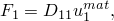
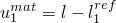
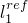
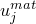
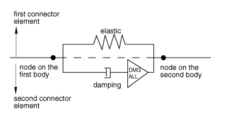
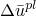
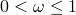

# 31.2.1 连接单元行为


**产品：** Abaqus/Standard  Abaqus/Explicit  Abaqus/CAE  

##### **参考资料**

- ["连接器概述，" 第31.1.1节](pt06ch31s01abo28.md)
- ["连接弹性行为，" 第31.2.2节](pt06ch31s02alm28.md)
- ["连接阻尼行为，" 第31.2.3节](pt06ch31s02alm29.md)
- ["用于耦合行为的连接函数，" 第31.2.4节](pt06ch31s02alm30.md)
- ["连接摩擦行为，" 第31.2.5节](pt06ch31s02alm31.md)
- ["连接塑性行为，" 第31.2.6节](pt06ch31s02alm32.md)
- ["连接损伤行为，" 第31.2.7节](pt06ch31s02alm33.md)
- ["连接止动器和锁，" 第31.2.8节](pt06ch31s02alm34.md)
- ["连接失效行为，" 第31.2.9节](pt06ch31s02alm35.md)
- ["连接单轴行为，" 第31.2.10节](pt06ch31s02alm36.md)
- [*CONNECTOR BEHAVIOR](../key/key-link.md#usb-kws-mconnectorbehavior)
- [*CONNECTOR CONSTITUTIVE REFERENCE](../key/key-link.md#usb-kws-mconnectorconstref)
- [*CONNECTOR SECTION](../key/key-link.md#usb-kws-mconnectorsection)
- ["创建连接截面，" Abaqus/CAE 用户指南第15.12.11节](../usi/usi-link.md#usi-itn-help-createconnprop)
- ["定义参考长度，" Abaqus/CAE 用户指南第15.17.12节](../usi/usi-link.md#usi-itn-help-reflength)
- ["定义时间积分，" Abaqus/CAE 用户指南第15.17.13节](../usi/usi-link.md#usi-itn-help-integration)

### 概述

连接行为：
- 可为由相对运动可用分量定义的连接类型；
- 可包含简单的弹簧、阻尼器和节点对节点接触作为特定应用；
- 可包含力-位移和力-速度的非线性或线性响应，用于无约束相对运动分量；
- 可包含解耦或耦合行为规范；
- 可允许由连接中任意力或力矩在无约束相对运动分量中产生摩擦力；
- 可允许对单个分量或使用用户定义屈服函数的耦合塑性定义；
- 可用于指定具有各种损伤演化规律的复杂损伤机制；
- 可用于指定用户定义的锁定标准，以锁定连接单元中所有相对运动或单个无约束相对运动分量；
- 可用于指定连接单元的失效；以及
- 可通过在相对运动的可用分量中指定加载和卸载行为来指定复杂的单轴模型。

### 为连接单元分配连接行为

您可以为特定的连接单元分配连接行为的名称。

| **输入文件用法：** | 使用以下选项定义连接行为： |
| --- | --- |
|  | ``` [*CONNECTOR SECTION](../key/key-link.md#usb-kws-mconnectorsection), ELSET=*name*, BEHAVIOR=*behavior name* [*CONNECTOR BEHAVIOR](../key/key-link.md#usb-kws-mconnectorbehavior), NAME=*behavior name* ``` |

| **Abaqus/CAE 用法：** | 相互作用模块：****连接****截面****创建****：**名称：** *连接截面名称*：**行为选项**，**添加******连接****分配****创建****：选择线：**截面**：*连接截面名称* |
| --- | --- |

### 连接行为模型

连接行为允许对以下类型的效果进行建模：
- 弹簧状弹性行为；
- 刚性状弹性行为；
- 阻尼器状（阻尼）行为；
- 摩擦；
- 塑性；
- 损伤；
- 止动器；
- 锁；
- 失效；和
- 单轴行为。

只能为相对运动的可用分量指定行为。 每种连接类型的相对运动可用分量列表在 ["连接类型库，" 第31.1.5节](pt06ch31s01aus114.md) 中给出。 连接行为可以按以下方式指定：
- 解耦：行为分别在单个相对运动的可用分量中指定；
- 耦合：所有或几个相对运动的可用分量同时以耦合方式用于定义行为；或
- 组合：解耦和耦合定义同时组合使用。

[图31.2.1-1](pt06ch31s02alm27.md#usb-elm-econnectbehav-conceptual) 显示了连接行为如何相互作用的概念模型。 大多数行为（弹性、阻尼、止动器、锁、摩擦）并行作用。 塑性模型始终与弹簧状或刚性状弹性定义结合定义。 由损伤引起的降解可以仅为弹性-塑性或刚性-塑性响应指定，或为整个连接中的整体运动响应指定。 失效行为将应用于整个连接响应。

**图31.2.1-1** 连接行为的概念说明。


允许同一行为类型的多个定义。 例如，如果以解耦方式、耦合方式或两种方式为相同的相对运动可用分量多次定义连接弹性（或阻尼），则弹簧状（或阻尼器状）响应会相加。 只要遵循相应行为章节中概述的规则，允许对摩擦、塑性和损伤行为进行多个定义。 允许对相同分量的多个解耦止动器和锁定义，但一次只能强制执行一个。

### 定义耦合和解耦连接行为

在许多情况下，连接行为以解耦方式在相对运动的单个可用分量中指定。 可以为连接中相对运动的所有或部分可用分量定义耦合行为。

对于耦合塑性、损伤以及某些情况下的摩擦行为，必须定义描述耦合效应性质的附加函数（参见 ["用于耦合行为的连接函数，" 第31.2.4节](pt06ch31s02alm30.md)）。 这些函数本身不定义行为，而是用作构建所需行为的工具。 例如，这些函数可用于定义：
- 耦合塑性行为连接力空间中的复杂屈服函数；
- 用于摩擦行为的摩擦产生接触力；或
- 用于损伤行为规范的力或相对运动量级度量。

| **输入文件用法：** | 使用以下输入定义解耦行为： |
| --- | --- |
|  | ``` **CONNECTOR BEHAVIOR OPTION*, COMPONENT=*n* ``` 使用以下输入定义耦合行为： ``` **CONNECTOR BEHAVIOR OPTION* ``` |

| **Abaqus/CAE 用法：** | 相互作用模块：连接截面编辑器：****添加*****连接行为****：****耦合**：**解耦**或**耦合** |
| --- | --- |

### 定义依赖于相对位置或本构位移/旋转的非线性连接行为属性

在所有非线性解耦连接行为中，独立变量是定义响应的方向上连接可用分量的分量。 在对以下连接行为进行建模时，属性也可以依赖于几个分量方向上的相对位置或本构位移/旋转：
- 连接弹性，
- 连接阻尼，
- 连接导出分量，和
- 连接摩擦。

在对连接单轴行为进行建模时，属性也可以依赖于几个分量方向上的本构位移/旋转； 有关更多信息，请参见 ["连接单轴行为，" 第31.2.10节](pt06ch31s02alm36.md)。

| **输入文件用法：** | 使用以下选项指定连接行为属性依赖于行为定义中包含的相对位置分量： |
| --- | --- |
|  | ``` **CONNECTOR BEHAVIOR OPTION*, INDEPENDENT COMPONENTS=POSITION (default) ``` 使用以下选项指定连接行为属性依赖于行为定义中包含的本构相对位移或旋转分量： ``` **CONNECTOR BEHAVIOR OPTION*, INDEPENDENT COMPONENTS=CONSTITUTIVE MOTION ``` 在任一情况下，第一数据行标识用于确定依赖项的独立分量编号，连接行为定义的其他数据从第二数据行开始。 |

| **Abaqus/CAE 用法：** | 对于弹性或阻尼行为，使用以下输入指定连接行为属性依赖于相对位置或本构相对位移/旋转： |
| --- | --- |
|  | 相互作用模块：连接截面编辑器：****添加****弹性****或**阻尼**：****耦合**：**基于位置耦合**或**基于运动耦合**，选择分量并输入数据 对于连接导出分量，使用以下输入指定连接行为属性依赖于相对位置或本构相对位移/旋转： 相互作用模块：连接截面编辑器：****添加****摩擦****、**塑性**或**损伤**：**力势**、**起始势**或**演化势** 指定导出分量，**使用局部方向**：**独立位置分量**或**独立本构运动分量**，选择分量并输入数据 对于指定内部接触力的摩擦行为，使用以下输入指定连接行为属性依赖于相对位置或本构相对位移/旋转： 相互作用模块：连接截面编辑器：****添加****摩擦****：****摩擦模型**：**用户定义**、**接触力**、**使用独立分量：位置**或**运动**，选择分量并输入数据 |

### 定义本构响应的参考长度和角度

在许多连接行为定义中，材料类行为具有力或力矩为零的参考位置，这与初始位置不同。 例如，在初始配置中具有非零力或力矩的弹簧就是这种情况。 在这些情况下，最方便的方式是相对于力或力矩消失的名义或参考几何来定义连接行为。

您可以通过指定多达六个参考值（每个相对运动分量一个）来定义本构力和力矩为零的平移或角位置：三个长度和三个角度（以度为单位）。 参考长度和角度仅影响弹簧状弹性连接行为，并且如果摩擦产生接触力（力矩）是相对位移（旋转）的函数，则影响连接摩擦行为。 默认情况下，参考长度和角度是由初始几何形状确定的长度值和角度值。 有关每种连接类型的参考长度和角度的含义，请参见 ["连接类型库，" 第31.1.5节](pt06ch31s01aus114.md)。

| **输入文件用法：** | ``` [*CONNECTOR CONSTITUTIVE REFERENCE](../key/key-link.md#usb-kws-mconnectorconstref) *length 1*, *length 2*, *length 3*, *angle 1*, *angle 2*, *angle 3* ``` |
| --- | --- |

| **Abaqus/CAE 用法：** | 相互作用模块：连接截面编辑器：****添加****参考长度****：****与*CORM*关联的长度** |
| --- | --- |

#### 定义预压缩或预拉伸线性弹性行为

在许多情况下，连接器在安装到组件中时会被预压缩或预拉伸。 在这种情况下，连接力在初始配置中为非零。 虽然可以使用非线性弹性来定义初始配置中的非零力，但通常更方便的是指定（线性）弹簧刚度加上力或力矩为零的参考长度或角度。 例如，使用连接类型 AXIAL 定义的线性解耦弹性行为的力由以下方程给出



其中 。  是 AXIAL 连接的当前长度， 是用户定义的本构参考长度。 连接本构位移量 ，如 ["连接类型库，" 第31.1.5节](pt06ch31s01aus114.md) 中所述，为不同的连接类型定义。

#### 示例

[图31.2.1-2](pt06ch31s02alm27.md#econnector-shock-usb-elm-econnectorbehavior-reflengths) 中减震器的连接模型输入文件模板在 ["连接器概述，" 第31.1.1节](pt06ch31s01abo28.md) 中给出。 对于非线性扭转弹簧，参考角度定义为22.5，作为连接本构参考中第四个数据项（对应于连接的第四个相对运动分量）：

```
[*CONNECTOR BEHAVIOR](../key/key-link.md#usb-kws-mconnectorbehavior), NAME=sbehavior
*...*
[*CONNECTOR CONSTITUTIVE REFERENCE](../key/key-link.md#usb-kws-mconnectorconstref)
 , , , 22.5
```

此参考角度的效果是非线性扭转弹簧在22.5度时具有零力矩。

**图31.2.1-2** 减震器的简化连接模型。


### 在 Abaqus/Explicit 中定义本构响应的时间积分方法

在 Abaqus/Explicit 中，连接单元中的运动约束、止动器、锁和致动运动使用隐式时间积分处理。 默认情况下，连接本构行为（例如弹性、阻尼和摩擦）也使用隐式积分。 隐式时间积分的优点是具有这些行为的单元不会以任何方式影响分析的稳定性或时间增量。

当使用具有"软"弹簧的连接器建模时，可以使用更传统的本构响应显式时间积分。 这种显式积分可能会提高计算性能。 然而，相对较硬弹簧的显式积分将减少全局时间增量大小，因为此类连接单元包含在稳定时间增量大小计算中。

| **输入文件用法：** | 使用以下选项指定本构响应的隐式积分： |
| --- | --- |
|  | ``` [*CONNECTOR BEHAVIOR](../key/key-link.md#usb-kws-mconnectorbehavior), INTEGRATION=IMPLICIT ``` 使用以下选项指定本构响应的显式积分： ``` [*CONNECTOR BEHAVIOR](../key/key-link.md#usb-kws-mconnectorbehavior), INTEGRATION=EXPLICIT ``` |

| **Abaqus/CAE 用法：** | 相互作用模块：连接截面编辑器：****添加****积分****：****积分**：**隐式**或**显式** |
| --- | --- |

### 在线 性扰动过程中定义连接行为

在线性扰动过程中（参见 ["常规和线性扰动过程，" 第6.1.3节](pt03ch06s01aus44.md)），连接单元运动学在线性化到基态。 因此，应用运动约束的线性化版本，连接行为在线性化到前一个常规分析步骤结束时的状态。

### 使用多个串联或并联的连接器

连接单元行为允许在单个连接单元内正确建模大多数物理连接行为。 但是，在极少数情况下，更复杂的连接行为可能需要使用多个并联或串联的连接单元。 通过在相同节点之间定义两个或多个连接单元，将连接单元并联放置。 通过指定附加节点（通常与感兴趣节点位于同一位置），然后在这些节点之间串联连接单元，从而串联放置连接器。

例如，假设您希望定义一个在接触时表现出弹塑性行为的连接止动器。 由于在一个连接行为定义中不允许这样做，您可以通过使用两个串联的连接单元来规避此限制。 [图31.2.1-3](pt06ch31s02alm27.md#usb-elm-econnectbehav-series) 中说明了这个概念。 第一个连接器定义止动器，第二个定义弹塑性行为。 由于两个单元受到相同的载荷（因为它们是串联的），因此获得了所需的行为。

**图31.2.1-3** 两个串联的连接单元/行为的概念说明。


并联连接器也可用于建模复杂的运动行为。 例如，假设您需要定义具有并联弹簧状和阻尼器状行为的弹性-粘性连接器（例如汽车悬架中的减震柱）。 假设只有在拉伸/压缩超过指定限制时，阻尼器才会发生损伤。 由于在一个连接行为定义中不允许这样做，您可以通过使用两个并联的连接单元来规避此限制。 [图31.2.1-4](pt06ch31s02alm27.md#usb-elm-econnectbehav-parallel) 中说明了这个概念。

**图31.2.1-4** 两个并联的连接单元/行为的概念说明。



第一个连接器定义弹性行为，第二个定义阻尼器行为。 由于两个连接单元并联，它们经历相同的运动（拉伸/压缩）。 基于运动的损伤行为（参见 ["连接损伤行为，" 第31.2.7节](pt06ch31s02alm33.md)）可用于降低第二个单元中整个行为的强度。 因此，只有阻尼器行为最终会降低。

### 使用表格数据定义连接行为

表格数据通常用于定义连接行为，例如非线性弹性、各向同性硬化等。 如图 [图31.2.1-5](pt06ch31s02alm27.md#espring-nonlinear-usb-elm-econnectorbehavior) 所示，数据点在构成空间中组成非线性曲线。

**图31.2.1-5** 定义为表格数据的非线性连接行为。


下面描述定义表格查找的选项。

#### 外推选项

默认情况下，独立变量在指定范围外时，将外推因变量为常数（对应于曲线端点的值）。 此选择可能导致零刚度响应，这可能导致收敛问题。 您可以指定线性外推，以在独立变量指定范围外假设由曲线端点给出的斜率保持不变的方式来外推因变量。 外推行为如图 [图31.2.1-5](pt06ch31s02alm27.md#espring-nonlinear-usb-elm-econnectorbehavior) 所示。

您可以为所有连接行为全局定义外推选择，但可以分别为以下连接行为重新定义外推选择：
- 连接弹性；
- 连接塑性（连接硬化）；
- 连接阻尼；
- 连接单元的导出分量；
- 连接摩擦；
- 连接损伤（连接损伤起始和演化）；
- 连接锁；和
- 连接单轴行为。

Abaqus/CAE 不支持连接止动器和锁行为选项的表格数据。

##### 为所有连接行为指定常数外推

您可以为所有连接行为的表格数据指定常数外推。

| **输入文件用法：** | ``` [*CONNECTOR BEHAVIOR](../key/key-link.md#usb-kws-mconnectorbehavior), EXTRAPOLATION=CONSTANT (default) ``` |
| --- | --- |

| **Abaqus/CAE 用法：** | 相互作用模块：连接截面编辑器：**表格选项**标签页：**外推**：**常数** |
| --- | --- |

##### 为所有连接行为指定线性外推

您可以为所有连接行为的表格数据指定线性外推。

| **输入文件用法：** | ``` [*CONNECTOR BEHAVIOR](../key/key-link.md#usb-kws-mconnectorbehavior), EXTRAPOLATION=LINEAR ``` |
| --- | --- |

| **Abaqus/CAE 用法：** | 相互作用模块：连接截面编辑器：**表格选项**标签页：**外推**：**线性** |
| --- | --- |

##### 重新定义单个连接行为的外推选择

您可以为单个连接行为重新定义外推选择。

| **输入文件用法：** | 使用以下任一选项： |
| --- | --- |
|  | ``` **CONNECTOR BEHAVIOR OPTION*, EXTRAPOLATION=CONSTANT ``` ``` **CONNECTOR BEHAVIOR OPTION*, EXTRAPOLATION=LINEAR ``` 例如，使用以下选项对所有连接行为使用常数外推，但连接弹性除外： ``` [*CONNECTOR BEHAVIOR](../key/key-link.md#usb-kws-mconnectorbehavior), EXTRAPOLATION=CONSTANT ``` ``` [*CONNECTOR ELASTICITY](../key/key-link.md#usb-kws-mconnectorelasticity), EXTRAPOLATION=LINEAR ``` |

| **Abaqus/CAE 用法：** | 对弹性、阻尼、摩擦、塑性和损伤行为使用以下输入： |
| --- | --- |
|  | 相互作用模块：连接截面编辑器：**行为选项**标签页：**表格选项**按钮：**外推**：切换关闭**使用行为设置**并选择**常数**或**线性** 对连接导出分量使用以下输入： 相互作用模块：导出分量编辑器：**添加**：**表格选项**按钮：**外推**：切换关闭**使用行为设置**并选择**常数**或**线性** |

#### Abaqus/Explicit 的正则化选项

默认情况下，Abaqus/Explicit 将数据正则化为以独立变量均匀间隔定义的表格，因为如果插值来自独立变量的均匀间隔，表格查找是最经济的。 在某些情况下，当需要准确捕获连接行为中的剧烈变化时，您可以通过关闭正则化直接使用用户定义的表格连接行为数据。 但是，与使用均匀间隔相比，表格查找在计算上更昂贵。 因此，几乎总是建议使用正则化。

Abaqus/Explicit 使用容差来正则化输入数据。 每个独立变量范围内的间隔数是这样选择的：分段线性正则化数据与您定义的每个点之间的误差小于因变量范围乘以容差。 默认容差为0.03。 在某些情况下，当因数量以不均匀间隔的独立变量定义且独立变量的范围与最小间隔相比较时，Abaqus/Explicit 可能无法以合理数量的间隔获得数据的准确正则化。 在这种情况下，Abaqus/Explicit 在处理所有数据后停止，并发出错误消息，您必须重新定义行为数据。 有关数据正则化的更详细讨论，请参见 ["材料数据定义，" 第21.1.2节](pt05ch21s01aus109.md)。

您可以全局定义正则化选择和正则化容差，但可以为以下连接行为单独重新定义正则化和正则化容差选择：
- 连接弹性；
- 连接塑性（连接硬化）
- 连接阻尼；
- 连接单元的导出分量；
- 连接摩擦；
- 连接损伤（连接损伤起始和演化）；
- 连接锁；和
- 连接单轴行为。

Abaqus/CAE 不支持连接止动器和锁行为选项的表格数据。

##### 为所有连接行为指定用户定义表格数据的正则化

您可以指定表格数据的正则化以及要全局用于所有连接行为的正则化容差。

| **输入文件用法：** | ``` [*CONNECTOR BEHAVIOR](../key/key-link.md#usb-kws-mconnectorbehavior), REGULARIZE=ON (default), RTOL=*tolerance* ``` |
| --- | --- |

| **Abaqus/CAE 用法：** | 相互作用模块：连接截面编辑器：**表格选项**标签页：**正则化**：切换打开**正则化数据（仅限显式）**、**指定**：*容差* |
| --- | --- |

##### 指定对所有连接行为使用不带正则化的用户定义表格数据

您可以通过关闭所有连接行为的正则化来直接指定使用用户定义的表格数据。

| **输入文件用法：** | ``` [*CONNECTOR BEHAVIOR](../key/key-link.md#usb-kws-mconnectorbehavior), REGULARIZE=OFF ``` |
| --- | --- |

| **Abaqus/CAE 用法：** | 相互作用模块：连接截面编辑器：**表格选项**标签页：**正则化**：切换关闭**正则化数据（仅限显式）** |
| --- | --- |

##### 重新定义单个连接行为的正则化选项

您可以为单个连接行为重新定义正则化和正则化容差选择。

| **输入文件用法：** | 使用以下任一选项： |
| --- | --- |
|  | ``` **CONNECTOR BEHAVIOR OPTION*, REGULARIZE=ON, RTOL=*tolerance* ``` ``` **CONNECTOR BEHAVIOR OPTION*, REGULARIZE=OFF ``` 例如，使用以下选项对所有连接行为正则化用户定义数据，但连接弹性除外： ``` [*CONNECTOR BEHAVIOR](../key/key-link.md#usb-kws-mconnectorbehavior), REGULARIZE=ON, RTOL=0.05 ``` ``` [*CONNECTOR ELASTICITY](../key/key-link.md#usb-kws-mconnectorelasticity), REGULARIZE=OFF ``` |

| **Abaqus/CAE 用法：** | 对弹性、阻尼、摩擦、塑性和损伤行为使用以下输入： |
| --- | --- |
|  | 相互作用模块：连接截面编辑器：**行为选项**标签页：**表格选项**按钮：**正则化**：切换关闭**使用行为设置**；切换打开**正则化数据（仅限显式）**和**指定**：*容差*，或切换关闭**正则化数据（仅限显式）** 对连接导出分量使用以下输入： 相互作用模块：导出分量编辑器：**添加**：**表格选项**按钮：**正则化**：切换关闭**使用行为设置**；切换打开**正则化数据（仅限显式）**和**指定**：*容差*，或切换关闭**正则化数据（仅限显式）** |

#### 率相关数据的评估

连接塑性中的表格各向同性硬化数据（["定义各向同性硬化分量"（通过指定表格数据）在"连接塑性行为"第31.2.6节](pt06ch31s02alm32.md#usb-elm-econnplastbehav-isohardtabular)）和基于塑性运动的损伤起始准则（["基于塑性运动的损伤起始准则"在"连接损伤行为"第31.2.7节](pt06ch31s02alm33.md#usb-elm-econndamagebehav-plasticmotion)）可以指定为依赖于等效相对塑性运动率。 率相关连接单轴行为模型的加载/卸载数据可以指定为依赖于变形率。

##### 指定率相关数据插值的线性间隔

默认情况下，Abaqus/Standard 和 Abaqus/Explicit 使用相对运动率的线性间隔对率相关数据进行插值。

| **输入文件用法：** | 使用以下选项指定各向同性硬化数据的线性插值： |
| --- | --- |
|  | ``` [*CONNECTOR HARDENING](../key/key-link.md#usb-kws-mconnectorhardening), RATE INTERPOLATION=LINEAR ``` 使用以下选项指定损伤起始数据的线性插值： ``` [*CONNECTOR DAMAGE INITIATION](../key/key-link.md#usb-kws-mconnectordamageinit), RATE INTERPOLATION= LINEAR ``` 使用以下两个选项指定单轴行为加载/卸载数据的线性插值： ``` [*CONNECTOR UNIAXIAL BEHAVIOR](../key/key-link.md#usb-kws-mconnectorunibehavior) [*LOADING DATA](../key/key-link.md#usb-kws-mloadingdata), RATE INTERPOLATION=LINEAR ``` Abaqus/Standard 始终使用等效相对塑性运动率的线性间隔对率相关数据进行插值。 |

| **Abaqus/CAE 用法：** | 对各向同性硬化数据使用以下输入： |
| --- | --- |
|  | 相互作用模块：连接截面编辑器：****添加****塑性****：****各向同性硬化**：****定义**：****表格**，**表格选项**按钮：**插值**：**线性** 对损伤起始数据使用以下输入： 相互作用模块：连接截面编辑器：****添加****损伤****：****起始**：**表格选项**按钮：**插值**：**线性** 无法在 Abaqus/CAE 中定义连接单轴行为。 |

##### 在 Abaqus/Explicit 中指定率相关数据插值的对数间隔

在 Abaqus/Explicit 中，如果以对数间隔测量数据的率相关性，则可以指定使用相对运动率的对数间隔进行率相关数据插值。

| **输入文件用法：** | 使用以下选项指定各向同性硬化数据的线性插值： |
| --- | --- |
|  | ``` [*CONNECTOR HARDENING](../key/key-link.md#usb-kws-mconnectorhardening), RATE INTERPOLATION=LOGARITHMIC ``` 使用以下选项指定损伤起始数据的线性插值： ``` [*CONNECTOR DAMAGE INITIATION](../key/key-link.md#usb-kws-mconnectordamageinit), RATE INTERPOLATION=LOGARITHMIC ``` 使用以下两个选项指定单轴行为加载/卸载数据的线性插值： ``` [*CONNECTOR UNIAXIAL BEHAVIOR](../key/key-link.md#usb-kws-mconnectorunibehavior) [*LOADING DATA](../key/key-link.md#usb-kws-mloadingdata), RATE INTERPOLATION=LOGARITHMIC ``` |

| **Abaqus/CAE 用法：** | 对各向同性硬化数据使用以下输入： |
| --- | --- |
|  | 相互作用模块：连接截面编辑器：****添加****塑性****：****各向同性硬化**：****定义**：****表格**，**表格选项**按钮：**插值**：**对数** 对损伤起始数据使用以下输入： 相互作用模块：连接截面编辑器：****添加****损伤****：****起始**：**表格选项**按钮：**插值**：**对数** 无法在 Abaqus/CAE 中定义连接单轴行为。 |

#### 在 Abaqus/Explicit 中过滤等效塑性运动率

率敏感连接本构行为可能在显式动态分析中引入非物理高频振荡。 为克服此问题，Abaqus/Explicit 使用过滤的等效塑性运动率


用于评估率相关数据。  是时间增量  和  分别是增量开始和结束时的塑性运动率。 因子  () 有助于过滤与率相关连接行为相关的高频振荡。 您可以直接指定率滤波因子的值 , RATE FILTER FACTOR= ``` ``` [*CONNECTOR DAMAGE INITIATION](../key/key-link.md#usb-kws-mconnectordamageinit), RATE FILTER FACTOR= ``` |

| **Abaqus/CAE 用法：** | 对各向同性硬化数据使用以下输入： |
| --- | --- |
|  | 相互作用模块：连接截面编辑器：****添加****塑性****：****各向同性硬化**：****定义**：****表格**，**表格选项**按钮：**滤波因子**：****指定**：  对损伤起始数据使用以下输入： 相互作用模块：连接截面编辑器：****添加****损伤****：****起始**：**表格选项**按钮：**滤波因子**：****指定**：  |


