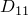
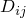
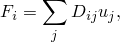
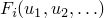
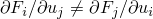
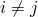
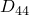
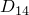
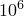

# 31.2.2 连接弹性行为


**产品：** Abaqus/Standard  Abaqus/Explicit  Abaqus/CAE  

##### **参考资料**

- ["连接器概述，" 第31.1.1节](pt06ch31s01abo28.md)
- ["连接行为，" 第31.2.1节](pt06ch31s02alm27.md)
- [*CONNECTOR BEHAVIOR](../key/key-link.md#usb-kws-mconnectorbehavior)
- [*CONNECTOR ELASTICITY](../key/key-link.md#usb-kws-mconnectorelasticity)
- ["定义弹性，" Abaqus/CAE 用户指南第15.17.1节](../usi/usi-link.md#usi-itn-help-elasticity)

### 概述

类弹簧弹性连接行为：
- 可在任何具有相对运动可用分量的连接器中定义；
- 可独立为每个相对运动的可用分量指定，在这种情况下，行为可以是线性或非线性的；
- 可指定为依赖于几个局部方向中的相对位置或本构运动；以及
- 可作为耦合线性弹性行为为所有相对运动的可用分量指定。

或者，可在任何相对运动的可用分量中使用自动选择的刚性弹簧指定刚性状行为。

力和力矩作用的方向以及位移和旋转的测量方向由每种连接类型的局部方向决定，如 ["连接类型库，" 第31.1.5节](pt06ch31s01aus114.md) 中所述。

### 定义线性解耦弹性行为

在线性解耦弹性的最简单情况下，您为所选分量定义弹簧刚度（即分量1的 、分量2的 ，等等），用于方程


其中  是相对运动  分量中的力或力矩， 是  方向中的连接位移或旋转。 弹性刚度可以依赖于频率（在 Abaqus/Standard 中）、温度和场变量。 有关将数据定义为频率、温度和场变量的函数更多信息，请参见 ["输入语法规则，" 第1.2.1节](pt01ch01s02aus01.md)。

如果在除直接解稳态动力学之外的 Abaqus/Standard 分析过程中指定了依赖于频率的阻尼行为，将使用给定最低频率的数据。

| **输入文件用法：** | 使用以下选项定义线性解耦弹性连接行为： |
| --- | --- |
|  | ``` [*CONNECTOR BEHAVIOR](../key/key-link.md#usb-kws-mconnectorbehavior), NAME=*name* [*CONNECTOR ELASTICITY](../key/key-link.md#usb-kws-mconnectorelasticity), COMPONENT=*component number*, DEPENDENCIES=*n* ``` |

| **Abaqus/CAE 用法：** | 相互作用模块：连接截面编辑器：****添加****弹性****：****定义**：**线性**，**力/力矩：** *分量或分量*，****耦合**：**解耦** |
| --- | --- |

### 定义线性耦合弹性行为

在线性耦合情况下，定义弹簧刚度矩阵分量 ，用于方程



其中  是相对运动  分量中的力， 是  分量的运动， 是  和  分量之间的耦合。 *D* 矩阵被假定为对称的，因此仅指定矩阵的上三角。 在具有运动约束的连接器中，对应于相对运动约束分量的条目将被忽略。 弹性刚度可以依赖于温度和场变量。 有关将数据定义为温度和场变量的函数更多信息，请参见 ["输入语法规则，" 第1.2.1节](pt01ch01s02aus01.md)。

| **输入文件用法：** | 使用以下选项定义线性耦合弹性连接行为： |
| --- | --- |
|  | ``` [*CONNECTOR BEHAVIOR](../key/key-link.md#usb-kws-mconnectorbehavior), NAME=*name* [*CONNECTOR ELASTICITY](../key/key-link.md#usb-kws-mconnectorelasticity), DEPENDENCIES=*n* ``` |

| **Abaqus/CAE 用法：** | 相互作用模块：连接截面编辑器：****添加****弹性****：****定义**：**线性**，**力/力矩：** *分量或分量*，****耦合**：**耦合** |
| --- | --- |

### 建模非对称线性刚度的耦合

根据定义，线性弹性行为应由对称弹簧刚度矩阵定义。 但是，Abaqus/Standard 允许您定义非对称耦合弹簧刚度矩阵。 预期用例是近似支撑旋转结构中旋转结构的流体膜轴承（参见 [Genta, 2005](pt06ch31s02alm28.md#econnelasticbehav-genta)，和 ["分布载荷，" 第34.4.3节](pt07ch34s04aus122.md)）。 Abaqus/Standard 不会检查非对称弹簧刚度矩阵的稳定性；因此，您必须确保正确定义。

在线性耦合情况下，定义弹簧刚度矩阵分量 ，用于方程


其中  是相对运动  分量中的力， 是  分量的运动， 是  和  分量之间的耦合。 在这种情况下，*D* 矩阵被假定为非对称的，因此指定整个矩阵。 对应于相对运动约束分量的条目将被忽略。 当使用非对称矩阵存储和求解方案时，刚度可以依赖于频率、温度和场变量。 有关将数据定义为频率、温度和场变量的函数更多信息，请参见 ["输入语法规则，" 第1.2.1节](pt01ch01s02aus01.md)。

| **输入文件用法：** | 使用以下选项定义非对称线性耦合刚度连接行为： |
| --- | --- |
|  | ``` [*CONNECTOR BEHAVIOR](../key/key-link.md#usb-kws-mconnectorbehavior), NAME=*name* [*CONNECTOR ELASTICITY](../key/key-link.md#usb-kws-mconnectorelasticity), UNSYMM, FREQUENCY DEPENDENCE=ON ``` |

| **Abaqus/CAE 用法：** | Abaqus/CAE 不支持非对称线性耦合刚度行为。 |
| --- | --- |

### 定义非线性弹性行为

对于非线性弹性，您可以将力或力矩指定为一个或多个相对运动可用分量的非线性函数 。 这些函数也可以依赖于温度和场变量。 有关将数据定义为温度和场变量的函数更多信息，请参见 ["输入语法规则，" 第1.2.1节](pt01ch01s02aus01.md)。

#### 定义依赖于一个分量方向的非线性弹性行为

默认情况下，每个非线性力或力矩函数仅依赖于指定相对运动分量方向中位移或旋转。

| **输入文件用法：** | 使用以下选项： |
| --- | --- |
|  | ``` [*CONNECTOR BEHAVIOR](../key/key-link.md#usb-kws-mconnectorbehavior), NAME=*name* [*CONNECTOR ELASTICITY](../key/key-link.md#usb-kws-mconnectorelasticity), COMPONENT=*component number*, NONLINEAR, DEPENDENCIES=*n* ``` |

| **Abaqus/CAE 用法：** | 相互作用模块：连接截面编辑器：****添加****弹性****：****定义**：**非线性**，**力/力矩：** *分量或分量*，****耦合**：**解耦** |
| --- | --- |

#### 定义依赖于多个分量方向的非线性弹性行为

或者，这些函数可以依赖于几个分量方向中的相对位置或本构位移/旋转，如 ["定义非线性连接行为属性以依赖于相对位置或本构位移/旋转" 在 "连接行为" 第31.2.1节](pt06ch31s02alm27.md#usb-elm-econnectbehav-indcomps) 中所述。 在这种情况下，当 （对于 ）时，算子矩阵是非对称的，并且可能需要在 Abaqus/Standard 中使用非对称矩阵存储和求解来改善收敛。

| **输入文件用法：** | 使用以下选项定义依赖于相对位置分量的非线性弹性连接行为： |
| --- | --- |
|  | ``` [*CONNECTOR BEHAVIOR](../key/key-link.md#usb-kws-mconnectorbehavior), NAME=*name* [*CONNECTOR ELASTICITY](../key/key-link.md#usb-kws-mconnectorelasticity), COMPONENT=*component number*, NONLINEAR, INDEPENDENT COMPONENTS=POSITION, DEPENDENCIES=*n* ``` 使用以下选项定义依赖于本构位移或旋转分量的非线性弹性连接行为： ``` [*CONNECTOR BEHAVIOR](../key/key-link.md#usb-kws-mconnectorbehavior), NAME=*name* [*CONNECTOR ELASTICITY](../key/key-link.md#usb-kws-mconnectorelasticity), COMPONENT=*component number*, NONLINEAR, INDEPENDENT COMPONENTS=CONSTITUTIVE MOTION, DEPENDENCIES=*n* ``` |

| **Abaqus/CAE 用法：** | 相互作用模块：连接截面编辑器：****添加****弹性****：****定义**：**非线性**，**力/力矩：** *分量或分量*，****耦合**：**基于位置耦合**或**基于运动耦合** |
| --- | --- |

### 示例

[图31.2.2-1](pt06ch31s02alm28.md#econnectorbehavior-shock-elast) 中的组合连接器具有两个相对运动可用分量： 沿1方向（来自 SLOT 连接）的相对位移和绕1方向（来自 REVOLUTE 连接）的旋转——见 ["连接类型库，" 第31.1.5节](pt06ch31s01aus114.md)。 因此，连接器相对运动分量1和4可用于指定连接行为。

**图31.2.2-1** 减震器的简化连接模型。


要定义非线性扭转弹簧以抵抗沿局部1方向顶部和底部连接点之间的相对旋转，请使用以下输入：
```
[*CONNECTOR SECTION](../key/key-link.md#usb-kws-mconnectorsection), ELSET=shock, BEHAVIOR=sbehavior
slot, revolute
ori,
[*CONNECTOR BEHAVIOR](../key/key-link.md#usb-kws-mconnectorbehavior), NAME=sbehavior
[*CONNECTOR ELASTICITY](../key/key-link.md#usb-kws-mconnectorelasticity), COMPONENT=4, NONLINEAR 
-900., -0.7
   0.,  0.0
1250.,  0.7
```

虽然假定两个相对运动可用分量之间不会发生弹性耦合，但您可以用耦合线性弹性行为替换非线性力矩-旋转数据，以定义耦合到轴向位移的减震轴周围的旋转刚度。

在另一个应用中，相同的连接器可能具有耦合线性弹性行为，即相对旋转和滑动通过线性耦合相互影响。 要定义2000.0单位的平移刚度， 常数（对称矩阵的第一个条目）在连接弹性定义中输入。 要定义1000.0单位的扭转刚度， 常数（对称矩阵的第10个条目）被输入；并且要在可用旋转和平移之间定义50.0单位的耦合刚度， 常数（第7个条目）被输入。

```
[*CONNECTOR ELASTICITY](../key/key-link.md#usb-kws-mconnectorelasticity)
2000.0, , , , , , 50.0,
0.0, 1000.0, , , , , ,
, , , ,
```

### 定义刚性连接行为

刚性状弹性连接行为可用于使相对运动的可用分量变为刚性。 考虑一个没有固有运动约束的 CARTESIAN 连接器。 如果在局部2和3方向指定刚性行为，连接器将以类似于 SLOT 连接器的形式表现。

使用具有相对运动可用分量的连接器（而不是具有固有运动约束的连接器）来定制连接器中约束分量的技术特别有用，因为您需要：
- 在具有相对运动可用分量的连接器中自定义约束分量；例如，您可以约束 CARTESIAN 连接器中的局部1和2方向，以在3方向定义类似 SLOT 的连接器；
- 定义刚性塑性行为（参见 ["连接塑性行为，" 第31.2.6节](pt06ch31s02alm32.md)）；或
- 定义刚性损伤行为（参见 ["连接损伤行为，" 第31.2.7节](pt06ch31s02alm33.md)）。

例如，如果您使用 SLOT 连接器，则无法在固有约束的2和3方向中指定塑性和损伤行为。 为解决此问题，您可以使用具有分量2和3刚性行为的 CARTESIAN 连接器，如上所述，然后在这些分量中定义刚性塑性（和/或损伤）。 有关示例，请参见 ["连接塑性行为，" 第31.2.6节](pt06ch31s02alm32.md) 中的示例。

在 Abaqus/Standard 中，如果在与活动连接止动器、连接锁或指定连接运动的相同局部方向中定义了刚性分量，则可能发生过度约束。

| **输入文件用法：** | 使用以下选项为相对运动的指定分量定义刚性连接行为： |
| --- | --- |
|  | ``` [*CONNECTOR ELASTICITY](../key/key-link.md#usb-kws-mconnectorelasticity), RIGID, COMPONENT=*n* ``` 使用以下选项为相对运动的多个指定分量定义刚性连接行为： ``` [*CONNECTOR ELASTICITY](../key/key-link.md#usb-kws-mconnectorelasticity), RIGID *data line listing components to be made rigid* ``` 使用以下选项为相对运动的所有可用分量定义刚性连接行为： ``` [*CONNECTOR ELASTICITY](../key/key-link.md#usb-kws-mconnectorelasticity), RIGID *(no data lines)* ``` |

| **Abaqus/CAE 用法：** | 相互作用模块：连接截面编辑器：****添加****弹性****：****定义**：**刚性**，**分量**：*分量或分量* |
| --- | --- |

#### 强制执行刚性状弹性行为

通过在该分量中使用刚性线性弹性弹簧来强制执行特定分量中的刚性状弹性行为。 弹簧的刚度是自动选择的，取决于连接器使用的情况。 在 Abaqus/Standard 中，刚度取为连接单元所附着的周围元素平均刚度的10倍。 如果无法计算平均刚度（如连接单元未附着到其他元素或附着到刚体的情况），则使用刚度 。 在 Abaqus/Explicit 中，首先通过考虑连接单元节点处的平均质量和分析中的稳定时间增量来计算 Courant 刚度。 在大多数情况下，然后使用启发式方法根据建模情况和分析精度（单精度或双精度）来计算刚性状弹性行为的值。 例如，如果在连接器中定义了塑性，则参与塑性定义的分量中的刚性状弹性刚度不超过初始屈服值的千分之一。 如果未定义塑性，则刚性状刚度计算为 Courant 刚度的倍数。

在大多数情况下，用于刚性状刚度计算的启发式方法产生的刚度值是足够的。 如果此刚度不能满足您的应用需求，您可以始终直接指定线性刚度值来自定义弹性刚度。

由于在 Abaqus/Standard 和 Abaqus/Explicit 中用于刚性状弹性行为的刚度值不同，当将此类模型从一个求解器导入到另一个求解器时，您可能会注意到行为的不连续性。

### 在线姓扰动过程中定义弹性连接行为

具有连接弹性的相对运动可用分量使用来自基态的线性化弹性刚度。 在直接解稳态动态和基于子空间的稳态动态分析中，由解耦连接弹性行为定义的线性弹性刚度可能依赖于频率。

### 输出

连接的可用 Abaqus 输出变量列在 ["Abaqus/Standard 输出变量标识符，" 第4.2.1节](pt02ch04s02abv01.md) 和 ["Abaqus/Explicit 输出变量标识符，" 第4.2.2节](pt02ch04s02xbv01.md) 中。 在连接中定义弹性时，以下输出变量特别令人关注：

| CU | 连接相对位移/旋转。 |
| --- | --- |

| CUE | 连接弹性位移/旋转。 |
| --- | --- |

| CEF | 连接弹性力/力矩。 |
| --- | --- |

#### 其他参考

- Genta, G., *Dynamics of Rotating Systems, *Springer, 2005.


