# 31.2.3 连接阻尼行为


**产品：** Abaqus/Standard  Abaqus/Explicit  Abaqus/CAE  

##### **参考资料**

- ["连接器概述，" 第31.1.1节](pt06ch31s01abo28.md)
- ["连接行为，" 第31.2.1节](pt06ch31s02alm27.md)
- [*CONNECTOR BEHAVIOR](../key/key-link.md#usb-kws-mconnectorbehavior)
- [*CONNECTOR DAMPING](../key/key-link.md#usb-kws-mconnectordamping)
- ["定义阻尼，" Abaqus/CAE 用户指南第15.17.2节](../usi/usi-link.md#usi-itn-help-damping)

### 概述

连接阻尼行为：
- 在瞬态或稳态动力学分析中可为粘性阻尼类；
- 可为支持非对角阻尼的稳态动力学过程提供与复刚度相关的"结构"特性；
- 可在任何具有相对运动可用分量的连接器中定义；
- 可独立为每个相对运动可用分量指定，在这种情况下，行为对于粘性阻尼可以是线性或非线性的；
- 可指定为依赖于几个局部方向中的相对位置或本构运动（对于粘性阻尼）；以及
- 可作为耦合阻尼行为为所有相对运动可用分量指定。

力和力矩作用的方向以及相对速度的测量方向由每种连接类型的局部方向决定，如 ["连接类型库，" 第31.1.5节](pt06ch31s01aus114.md) 中所述。 在动态分析中，相对速度作为积分算子的一部分获得； 在 Abaqus/Standard 准静态分析中，相对速度通过将相对位移增量除以时间增量获得。

### 定义线性解耦粘性阻尼行为

在线性解耦阻尼的最简单情况下，您为所选分量定义阻尼系数（即分量1的 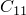、分量2的 ，等等），用于方程

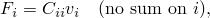

其中 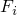 是相对运动 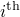 分量中的力或力矩， 是  方向中的速度或角速度。 阻尼系数可以依赖于频率（在 Abaqus/Standard 中）、温度和场变量。 有关将数据定义为频率，温度和场变量的函数更多信息，请参见 ["输入语法规则，" 第1.2.1节](pt01ch01s02aus01.md)。

如果在除直接解稳态动力学之外的 Abaqus/Standard 分析过程中指定了依赖于频率的阻尼行为，将使用给定最低频率的数据。

| **输入文件用法：** | 使用以下选项定义线性解耦阻尼连接行为： |
| --- | --- |
|  | ``` [*CONNECTOR BEHAVIOR](../key/key-link.md#usb-kws-mconnectorbehavior), NAME=*name* [*CONNECTOR DAMPING](../key/key-link.md#usb-kws-mconnectordamping), COMPONENT=*component number*, DEPENDENCIES=*n* ``` |

| **Abaqus/CAE 用法：** | 相互作用模块：连接截面编辑器：****添加****阻尼****：****定义**：**线性**，**力/力矩：** *分量或分量*，****耦合**：**解耦** |
| --- | --- |

### 定义线性耦合粘性阻尼行为

在线性耦合情况下，定义阻尼系数矩阵分量 ，用于方程


其中  是相对运动  分量中的力， 是 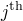 分量中的速度， 是  和  分量之间的耦合。 *C* 矩阵被假定为对称的，因此仅指定矩阵的上三角。 在具有运动约束的连接器中，对应于相对运动约束分量的条目将被忽略。 阻尼系数可以依赖于温度和场变量。 有关将数据定义为温度和场变量的函数更多信息，请参见 ["输入语法规则，" 第1.2.1节](pt01ch01s02aus01.md)。

| **输入文件用法：** | 使用以下选项定义线性耦合阻尼连接行为： |
| --- | --- |
|  | ``` [*CONNECTOR BEHAVIOR](../key/key-link.md#usb-kws-mconnectorbehavior), NAME=*name* [*CONNECTOR DAMPING](../key/key-link.md#usb-kws-mconnectordamping), DEPENDENCIES=*n* ``` |

| **Abaqus/CAE 用法：** | 相互作用模块：连接截面编辑器：****添加****阻尼****：****定义**：**线性**，**力/力矩：** *分量或分量*，****耦合**：**耦合** |
| --- | --- |

### 定义非对称线性耦合粘性阻尼行为

与线性耦合弹性行为一样（["连接弹性行为，" 第31.2.2节](pt06ch31s02alm28.md)），Abaqus/Standard 允许您定义非对称耦合粘性阻尼矩阵。 在线形耦合情况下，定义阻尼系数矩阵分量 ，用于方程


其中  是相对运动  分量中的力， 是  分量中的速度， 是  和  分量之间的耦合。 *C* 矩阵被假定为非对称的，因此指定整个矩阵。 对应于相对运动约束分量的条目将被忽略。 当使用非对称矩阵存储和求解方案时，阻尼系数可以依赖于频率、温度和场变量。 有关将数据定义为频率，温度和场变量的函数更多信息，请参见 ["输入语法规则，" 第1.2.1节](pt01ch01s02aus01.md)。

| **输入文件用法：** | 使用以下选项定义非对称线性耦合粘性阻尼连接行为： |
| --- | --- |
|  | ``` [*CONNECTOR BEHAVIOR](../key/key-link.md#usb-kws-mconnectorbehavior), NAME=*name* [*CONNECTOR DAMPING](../key/key-link.md#usb-kws-mconnectordamping), UNSYMM, FREQUENCY DEPENDENCE=ON ``` |

| **Abaqus/CAE 用法：** | Abaqus/CAE 不支持非对称线性耦合粘性阻尼行为。 |
| --- | --- |

### 定义非线性粘性阻尼行为

对于非线性阻尼，您可以将力或力矩指定为相对运动可用分量方向中速度的非线性函数 。 这些函数也可以依赖于温度和场变量。 有关将数据定义为温度和场变量的函数更多信息，请参见 ["输入语法规则，" 第1.2.1节](pt01ch01s02aus01.md)。

#### 定义依赖于一个分量方向非线性粘性阻尼行为

默认情况下，每个非线性力或力矩函数仅依赖于指定相对运动分量方向中的速度。

| **输入文件用法：** | 使用以下选项： |
| --- | --- |
|  | ``` [*CONNECTOR BEHAVIOR](../key/key-link.md#usb-kws-mconnectorbehavior), NAME=*name* [*CONNECTOR DAMPING](../key/key-link.md#usb-kws-mconnectordamping), COMPONENT=*component number*, NONLINEAR, DEPENDENCIES=*n* ``` |

| **Abaqus/CAE 用法：** | 相互作用模块：连接截面编辑器：****添加****阻尼****：****定义**：**非线性**，**力/力矩：** *分量或分量*，****耦合**：**解耦** |
| --- | --- |

#### 定义依赖于多个分量方向非线性粘性阻尼行为

或者，这些函数可以依赖于几个分量方向中的相对位置或本构位移/旋转，如 ["定义非线性连接行为属性以依赖于相对位置或本构位移/旋转" 在 "连接行为" 第31.2.1节](pt06ch31s02alm27.md#usb-elm-econnectbehav-indcomps) 中所述。

| **输入文件用法：** | 使用以下选项定义依赖于相对位置分量的非线性阻尼连接行为： |
| --- | --- |
|  | ``` [*CONNECTOR BEHAVIOR](../key/key-link.md#usb-kws-mconnectorbehavior), NAME=*name* [*CONNECTOR DAMPING](../key/key-link.md#usb-kws-mconnectordamping), COMPONENT=*component number*, NONLINEAR, INDEPENDENT COMPONENTS=POSITION, DEPENDENCIES=*n* ``` 使用以下选项定义依赖于本构位移或旋转分量的非线性阻尼连接行为： ``` [*CONNECTOR BEHAVIOR](../key/key-link.md#usb-kws-mconnectorbehavior), NAME=*name* [*CONNECTOR DAMPING](../key/key-link.md#usb-kws-mconnectordamping), COMPONENT=*component number*, NONLINEAR, INDEPENDENT COMPONENTS=CONSTITUTIVE MOTION, DEPENDENCIES=*n* ``` |

| **Abaqus/CAE 用法：** | 相互作用模块：连接截面编辑器：****添加****阻尼****：****定义**：**非线性**，**力/力矩：** *分量或分量*，****耦合**：**基于位置耦合**或**基于运动耦合** |
| --- | --- |

### 示例

请参阅 [图31.2.3-1](pt06ch31s02alm29.md#econnectorbehavior-shock-damping) 中的示例。

**图31.2.3-1** 减震器的简化连接模型。


除了抵抗相对旋转的扭转弹簧外，减震器还沿减震器直线用阻尼器阻尼平移运动。 要包含依赖于附着点之间相对位置的非线性阻尼器行为，请使用以下输入：
```
[*CONNECTOR BEHAVIOR](../key/key-link.md#usb-kws-mconnectorbehavior), NAME=sbehavior
*...*
[*CONNECTOR DAMPING](../key/key-link.md#usb-kws-mconnectordamping), COMPONENT=1,
 INDEPENDENT COMPONENTS=POSITION, NONLINEAR
1
1500.0, 0.1, 0.0
1625.0, 0.2, 0.0
1750.0, 0.1, 10.0
1925.0, 0.2, 10.0
```

### 定义线性结构阻尼行为

结构连接阻尼在支持非对角阻尼的稳态动力学和模态瞬态过程中受支持（例如，直接解稳态动力学）。

#### 定义线性解耦结构阻尼行为

您为所选分量定义阻尼系数 （即分量1的 、分量2的 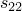，等等），用于方程


其中


是结构阻尼矩阵， 是相对运动  方向中力或力矩的虚部，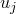 是  方向中的位移，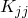 是刚度矩阵。 阻尼系数可以依赖于频率。

| **输入文件用法：** | 使用以下选项： |
| --- | --- |
|  | ``` [*CONNECTOR BEHAVIOR](../key/key-link.md#usb-kws-mconnectorbehavior), NAME=*name* [*CONNECTOR DAMPING](../key/key-link.md#usb-kws-mconnectordamping), COMPONENT=*component number*, TYPE=STRUCTURAL ``` |

| **Abaqus/CAE 用法：** | Abaqus/CAE 不支持线性解耦结构阻尼行为。 |
| --- | --- |

#### 定义线性耦合结构阻尼行为

您定义21个  阻尼系数（6×6 阻尼系数矩阵的对称半部），用于方程


其中

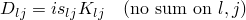

是结构阻尼矩阵， 是相对运动 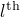 方向中力的虚部， 是  方向中的位移，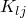 是刚度矩阵。 阻尼系数矩阵不能依赖于频率。

| **输入文件用法：** | 使用以下选项： |
| --- | --- |
|  | ``` [*CONNECTOR BEHAVIOR](../key/key-link.md#usb-kws-mconnectorbehavior), NAME=*name* [*CONNECTOR DAMPING](../key/key-link.md#usb-kws-mconnectordamping), TYPE=STRUCTURAL ``` |

| **Abaqus/CAE 用法：** | Abaqus/CAE 不支持线性耦合结构阻尼行为。 |
| --- | --- |

### 在 线性扰动过程中定义连接阻尼行为

在直接解和基于子空间的稳态动态过程中，使用解耦连接阻尼行为定义的粘性或结构阻尼可能依赖于频率。 在其他线性扰动过程中，连接阻尼行为被忽略。

### 输出

连接的可用 Abaqus 输出变量列在 ["Abaqus/Standard 输出变量标识符，" 第4.2.1节](pt02ch04s02abv01.md) 和 ["Abaqus/Explicit 输出变量标识符，" 第4.2.2节](pt02ch04s02xbv01.md) 中。 在连接中定义阻尼时，以下输出变量特别令人关注：

| CV | 连接相对速度/角速度。 |
| --- | --- |

| CVF | 连接粘性力/力矩。 |
| --- | --- |


