# 31.2.4 用于耦合行为的连接函数


**产品：** Abaqus/Standard  Abaqus/Explicit  Abaqus/CAE  

##### **参考资料**

- ["连接器概述，" 第31.1.1节](pt06ch31s01abo28.md)
- ["连接摩擦行为，" 第31.2.5节](pt06ch31s02alm31.md)
- ["连接塑性行为，" 第31.2.6节](pt06ch31s02alm32.md)
- ["连接损伤行为，" 第31.2.7节](pt06ch31s02alm33.md)
- [*CONNECTOR BEHAVIOR](../key/key-link.md#usb-kws-mconnectorbehavior)
- [*CONNECTOR DERIVED COMPONENT](../key/key-link.md#usb-kws-mconnectorderivedcomp)
- [*CONNECTOR POTENTIAL](../key/key-link.md#usb-kws-mconnectorpotential)
- ["指定连接导出分量，" Abaqus/CAE 用户指南第15.17.15节](../usi/usi-link.md#usi-itn-help-createderivedcomp)
- ["指定势函数项，" Abaqus/CAE 用户指南第15.17.16节](../usi/usi-link.md#usi-itn-help-potential)

### 概述

本节描述如何在 Abaqus 中定义两种用于指定连接单元复杂耦合行为的特殊函数：导出分量和势函数。

连接导出分量是基于相对运动内在（1到6）分量函数的用户指定分量定义。 它们可用于：
- 将摩擦产生法向力指定为连接力和力矩的复杂组合，以及
- 作为连接势函数中的中间结果。

连接势函数是内在相对运动分量或导出分量的用户定义函数。 这些函数可以是二次、椭圆或最大范数。 它们可用于定义：
- 当同时涉及多个相对运动可用分量时，用于连接耦合塑性的屈服函数，
- 当滑移方向与相对运动的可用分量不对齐时，用于耦合用户定义摩擦的势函数，
- 作为耦合函数用于检测连接中损伤起始的连接力或运动的量级度量，以及
- 作为驱动连接中损伤演化的连接运动的耦合函数的有效运动度量。

### 为连接单元定义导出分量

超出简单线性弹性或阻尼的连接单元耦合行为定义通常需要：定义涉及多个内在分量（1到6）的合力或反作用力的定义，或者定义与任何内在分量不对齐的"方向"。 这些用户定义的合力或方向称为导出分量。 与这些导出分量相关的力和运动是连接单元中内在相对运动分量中的力和运动的函数。

考虑一个 SLOT 连接的情况，在该连接中定义了摩擦效应（参见 ["连接摩擦行为，" 第31.2.5节](pt06ch31s02alm31.md)），在唯一的相对运动可用分量（1方向）中定义。 此连接类型强制的两个约束将产生两个反作用力（ 和 ），如图 [图31.2.4-1](pt06ch31s02alm30.md#usb-elm-econnect-derivecompslot) 所示。 两个力以耦合方式在1方向产生摩擦。

**图31.2.4-1** SLOT 连接中的合力接触力。


合理估计合接触力为


其中  是内在分量中连接力和力矩的集合。 函数  可以被指定为导出分量。

可以定义为导出分量的合力可能采用更复杂的形式。 考虑 BUSHING 连接类型，其中在1方向指定了具有失效的拉伸（I型）损伤机制。 您可能希望包括轴向力  和"弯曲"力矩  和  的效应，以在轴向方向定义总合力，损伤起始（和失效）可以在该合力上被触发，如图 [图31.2.4-2](pt06ch31s02alm30.md#usb-elm-econnect-derivecompbush) 所示。

**图31.2.4-2** BUSHING 连接中的合轴向力。


一种选择是将合轴向力定义为


其中  是与旋转具有相同单位的几何因子（长度的倒数）。 函数  可以被指定为导出分量。

导出分量也可以被解释为不与连接分量方向对齐的用户指定方向。 例如，如果具有弹性行为的 CARTESIAN 连接中基于运动的损伤与失效准则与内在分量方向不对齐，则可以将损伤准则定义为代表不同方向的导出分量，如图 [图31.2.4-3](pt06ch31s02alm30.md#usb-elm-econnect-derivecompcart) 所示。

**图31.2.4-3** CARTESIAN 连接中的用户定义方向。

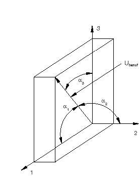

方向的一种可能选择为

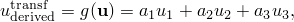

其中  是分量中连接相对运动的集合，、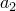 和 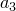 可以被解释为方向余弦（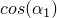、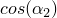、）。 函数 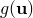 可以被指定为导出分量。

#### 导出分量的函数形式

Abaqus 中导出分量  的函数形式非常通用；您指定其确切形式。 导出分量被指定为项的总和


其中  是连接内在分量值的通用名称（例如力，，或运动，）， 是总和中  项，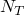 是项数。 根据上下文使用导出分量， 的合适分量值被选择。  也是几个贡献的总和，可以采用以下三种形式之一：
- 范数（型）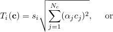
- 直接和（型）
- Macauley 和（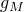型）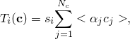

其中  是项的符号（加或减）， 是比例因子， 是  的  分量， 是 Macauley 括号（）。 一般来说，比例因子  的单位取决于上下文。 在大多数情况下，它们是无量纲的，具有长度单位，或具有长度倒数的单位。 应选择比例因子，使得结果导出分量中的所有项具有相同单位，并且这些单位必须与后来在连接势或连接接触力中使用导出分量一致。

#### 使用仅一项（*NT = 1*）定义导出分量

连接导出分量由分配给它们的名称标识。 如果一项（, NAME=*derived_component_name* ``` |
| --- | --- |

| **Abaqus/CAE 用法：** | Abaqus/CAE 不支持连接导出分量名称；您定义各个导出分量项。 |
| --- | --- |
|  | 使用以下输入为摩擦产生用户定义接触力定义连接导出分量项： 相互作用模块：连接截面编辑器：****添加****摩擦****：****摩擦模型**：**用户定义**、**接触力**、****指定分量**：**导出分量**，点击****编辑**显示导出分量编辑器：点击****添加**并选择分量 使用以下输入将连接导出分量项定义为连接势函数中的中间结果： 相互作用模块：连接截面编辑器：****添加****摩擦****、**塑性**或**损伤**：势贡献编辑器：****指定导出分量**，点击****编辑**显示导出分量编辑器：点击****添加**并选择分量 |

#### 定义包含多项（*NT > 1*）的导出分量

如果需要多项（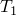、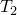，等等）来定义导出分量 *g*，则必须定义各个项。

| **输入文件用法：** | 您必须使用相同名称指定  个连接导出分量定义，以定义各个项。 具有相同名称的所有定义将相加，以产生所需的导出分量 *g*。 有关示例，请参阅下面的点焊示例。 |
| --- | --- |
|  | ``` [*CONNECTOR DERIVED COMPONENT](../key/key-link.md#usb-kws-mconnectorderivedcomp), NAME=*derived_component_name* [*CONNECTOR DERIVED COMPONENT](../key/key-link.md#usb-kws-mconnectorderivedcomp), NAME=*derived_component_name* ... ``` |

| **Abaqus/CAE 用法：** | Abaqus/CAE 不支持连接导出分量名称；您定义各个导出分量项。 |
| --- | --- |
|  | 相互作用模块：导出分量编辑器：点击****添加**并选择分量。 根据需要重复添加项。 |

#### 将导出分量项指定为范数

默认情况下，导出分量项计算为每个内在分量贡献平方和的平方根。 如果项只有一个贡献（），则范数与绝对值具有相同的含义。

| **输入文件用法：** | ``` [*CONNECTOR DERIVED COMPONENT](../key/key-link.md#usb-kws-mconnectorderivedcomp), NAME=*derived_component_name*, OPERATOR=NORM (default) ``` |
| --- | --- |
|  | 例如，以下输入可用于定义上面讨论的  分量： ``` [*CONNECTOR DERIVED COMPONENT](../key/key-link.md#usb-kws-mconnectorderivedcomp), NAME=axial 1 1.0, **  [*CONNECTOR DERIVED COMPONENT](../key/key-link.md#usb-kws-mconnectorderivedcomp), NAME=axial 5, 6 ,  **  ``` `axial` 导出分量是 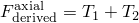。 |

| **Abaqus/CAE 用法：** | 相互作用模块：导出分量编辑器：****添加**：****项算子**：**平方和的平方根** |
| --- | --- |

#### 将导出分量项指定为直接和

或者，您可以选择将导出分量项计算为内在分量贡献的直接和。

| **输入文件用法：** | ``` [*CONNECTOR DERIVED COMPONENT](../key/key-link.md#usb-kws-mconnectorderivedcomp), NAME=*derived_component_name*, OPERATOR=SUM ``` |
| --- | --- |
|  | 例如，以下输入可用于定义上面讨论的 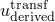 分量： ``` [*CONNECTOR DERIVED COMPONENT](../key/key-link.md#usb-kws-mconnectorderivedcomp), NAME=transf, OPERATOR=SUM 1, 2, 3 , ,  **  ``` `transf` 导出分量是 。 |

| **Abaqus/CAE 用法：** | 相互作用模块：导出分量编辑器：****添加**：****项算子**：**直接和** |
| --- | --- |

#### 将导出分量项指定为 Macauley 和

或者，您可以选择将导出分量项计算为内在分量贡献的 Macauley 和。

| **输入文件用法：** | ``` [*CONNECTOR DERIVED COMPONENT](../key/key-link.md#usb-kws-mconnectorderivedcomp), NAME=*derived_component_name*, OPERATOR=MACAULEY SUM ``` |
| --- | --- |
|  | 例如，以下输入可用于定义下面讨论的点焊示例中力的法向分量的第一项（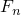）： ``` [*CONNECTOR DERIVED COMPONENT](../key/key-link.md#usb-kws-mconnectorderivedcomp), NAME=normal, OPERATOR=MACAULEY SUM 3 1.0 **  ``` |

| **Abaqus/CAE 用法：** | 相互作用模块：导出分量编辑器：****添加**：****项算子**：**Macauley 和** |
| --- | --- |

#### 指定项的符号

您可以指定导出分量项的符号应为正还是负。

| **输入文件用法：** | 使用以下选项之一： |
| --- | --- |
|  | ``` [*CONNECTOR DERIVED COMPONENT](../key/key-link.md#usb-kws-mconnectorderivedcomp), NAME=*derived_component_name*, SIGN=POSITIVE (default) [*CONNECTOR DERIVED COMPONENT](../key/key-link.md#usb-kws-mconnectorderivedcomp), NAME=*derived_component_name*, SIGN=NEGATIVE ``` |

| **Abaqus/CAE 用法：** | 相互作用模块：导出分量编辑器：****添加**：****整体项符号**：**正**或**负** |
| --- | --- |

#### 定义导出分量贡献以依赖于局部方向

导出分量定义中使用的比例因子  可以依赖于几个分量方向中的相对位置或本构位移/旋转，如 ["定义非线性连接行为属性以依赖于相对位置或本构位移/旋转" 在 "连接行为" 第31.2.1节](pt06ch31s02alm27.md#usb-elm-econnectbehav-indcomps) 中所述。 有关示例，请参见 ["连接摩擦行为，" 第31.2.5节](pt06ch31s02alm31.md) 中的第一个示例。

| **输入文件用法：** | 使用以下选项定义依赖于相对位置分量的连接导出分量： |
| --- | --- |
|  | ``` [*CONNECTOR DERIVED COMPONENT](../key/key-link.md#usb-kws-mconnectorderivedcomp), INDEPENDENT COMPONENTS=POSITION ``` 使用以下选项定义依赖于本构位移或旋转分量的连接导出分量： ``` [*CONNECTOR DERIVED COMPONENT](../key/key-link.md#usb-kws-mconnectorderivedcomp), INDEPENDENT COMPONENTS=CONSTITUTIVE MOTION ``` |

| **Abaqus/CAE 用法：** | 相互作用模块：导出分量编辑器：****添加**：****使用局部方向**：**独立位置分量**或**独立本构运动分量** |
| --- | --- |

#### 构建用于塑性或摩擦定义的导出分量的要求

当导出分量用于构建塑性或摩擦定义的屈服函数时，必须满足以下简单要求：
- 导出分量的所有  项必须兼容（参见 ["导出分量的函数形式](pt06ch31s02alm30.md#usb-elm-econnbehav-cdc)"）；范数型项（型）不能与同一导出分量定义中的直接和型项（型）混合，但可以与 Macauley 和型项（型）混合。
- 如果所有  项都是范数型项，则每项的符号必须为正（默认）。

如果  大于1，则使用导出分量的相关函数（势函数）可能变得不平滑。 更准确地说，由势函数定义的超曲面在其法线可能经历方向突然变化的位置。 在这些情况下，Abaqus 将通过略微改变导出分量函数定义来自动平滑定义的函数。 这些变化应该是透明的，因为分析结果只会发生很小的变化。

#### 示例：点焊

如图 [图31.2.4-4](pt06ch31s02alm30.md#usb-elm-econnect-weldexample-phist) 所示的点焊承受 *F* 方向的载荷。

**图31.2.4-4** 点焊连接的载荷。


选择用于对点焊建模的连接器具有六个相对运动可用分量：三个平移（分量1–3）和三个旋转（分量4–6）。 选择此连接类型是因为您正在对一般变形状态进行建模。 但是，您希望用如图 [图31.2.4-5](pt06ch31s02alm30.md#usb-elm-econnect-weldexample-der) 所示的法向和剪切力来定义连接中的非弹性行为，因为实验数据以此格式提供。

**图31.2.4-5** 点焊连接：导出分量定义。


因此，您希望按如下方式导出法向和剪切分量力：

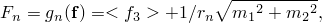


在这些方程中  和 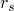 具有长度单位； 如果将点焊视为沿点焊轴线（3方向）的短梁，它们的解释相对简单。 如果点焊的平均横截面积为 *A*，关于一个平面内轴的二次矩为 （或 ），则  可以解释为比值 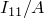（或 ）的平方根。 此外，如果横截面被认为是圆形的， 等于点焊半径的一部分。 在所有情况下， 可以取为 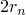。

上面关于方程中校准常数解释的推理只是一个建议。 一般而言，任何能与其他结果（实验、分析等）良好比较的常数组合同样有价值。

要定义 ，您应指定以下两个具有相同名称的连接导出分量定义：

```
[*PARAMETER](../key/key-link.md#usb-kws-mparameter) 
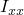=30.68 
*A*=19.63 
=sqrt() 
=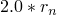 
 
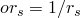 
[*CONNECTOR DERIVED COMPONENT](../key/key-link.md#usb-kws-mconnectorderivedcomp), NAME=normal, OPERATOR=MACAULEY SUM 
3 
1.0 
[*CONNECTOR DERIVED COMPONENT](../key/key-link.md#usb-kws-mconnectorderivedcomp), NAME=normal 
4, 5 
, 
```

 符号表示  是使用参数定义指定的。 法向力导出分量  定义为两项之和 。 第一个连接导出分量定义第一项 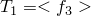，而第二个定义第二项 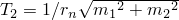。

类似地，要定义 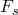，您应为分量 `shear` 指定以下两个连接导出分量定义：

```
[*CONNECTOR DERIVED COMPONENT](../key/key-link.md#usb-kws-mconnectorderivedcomp), NAME=shear 
6 
 
[*CONNECTOR DERIVED COMPONENT](../key/key-link.md#usb-kws-mconnectorderivedcomp), NAME=shear 
1, 2 
1.0, 1.0
```

### 定义连接势函数

连接势函数是用户定义的数学函数，表示连接中相对运动分量所跨越空间中的屈服面、极限面或量级度量。 函数可以是二次、一般椭圆或最大范数。 连接势函数本身并不定义连接行为；相反，它用于定义以下耦合连接行为：
- 摩擦，
- 塑性，或
- 损伤。

考虑 SLIDE-PLANE 连接中的情况，其中摩擦滑动发生在连接平面上，如图 [图31.2.4-6](pt06ch31s02alm30.md#usb-elm-econnect-derivecompslide) 所示。

**图31.2.4-6** SLIDE-PLANE 连接中的摩擦。


控制粘滑摩擦行为的函数（参见 ["连接摩擦行为，" 第31.2.5节](pt06ch31s02alm31.md)）可以写为

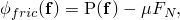

其中  是定义伪屈服函数的连接势（接触发生的连接平面中切向牵引力的大小）， 是摩擦产生的法向（接触）力， 是摩擦系数。 如果 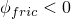，则发生粘着；如果 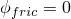，则发生滑动。 在这种情况下，势可以定义为切向牵引力的大小，

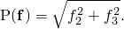

连接势函数在定义具有力耦合损伤起始准则的连接损伤时也很有用。 例如，在具有六个相对运动可用分量的连接类型中，您可以定义势


当势  的值大于用户指定的极限值（通常为1.0）时，可以引发损伤（失效）。  和  系数的单位必须与最终乘积的单位一致。 例如，如果  的预期单位是牛顿，则  系数是无量纲的，而  系数具有长度倒数的单位。

连接势函数可以采用更复杂的形式。 假设要在点焊中定义耦合塑性，在这种情况下，塑性屈服准则可以定义为

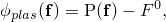

其中  是定义屈服函数的连接势， 是屈服力/力矩。 势可以定义为

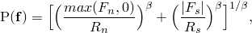

其中  和  可以是上面 ["为连接单元定义导出分量](pt06ch31s02alm30.md#usb-elm-econnectbehav-derivedcomps)" 示例中定义的命名导出分量 `normal` 和 `shear`。 如果  具有力的单位， 和  也具有力的单位， 和  是无量纲的。

| **输入文件用法：** | [*CONNECTOR POTENTIAL](../key/key-link.md#usb-kws-mconnectorpotential) |
| --- | --- |

| **Abaqus/CAE 用法：** | 使用以下输入为摩擦行为定义连接势函数： |
| --- | --- |
|  | 相互作用模块：连接截面编辑器：****添加****摩擦****：****摩擦模型：用户定义**、**滑移方向：使用力势计算**、**力势** 使用以下输入为塑性行为定义连接势函数： 相互作用模块：连接截面编辑器：****添加****塑性****：****耦合**：**耦合**、**力势** 使用以下输入为损伤行为定义连接势函数： 相互作用模块：连接截面编辑器：****添加****损伤****：****耦合**：**耦合**、**起始势**或**演化势** |

#### 势的函数形式

Abaqus 中势  的函数形式非常通用；您指定其确切形式。 势被指定为以下直接函数之一：

二次形式

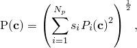

一般椭圆形式

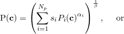

最大形式

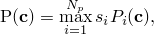

其中  是连接内在分量值（例如力， 是势的  贡献， 是贡献数， 和  是正数（默认值 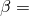 2.0，）， 是贡献的总体符号（1.0——默认，或-1.0）。 根据势使用时的上下文选择  的合适分量值。 正指数（、 的选择应使得贡献  产生实数。

 是内在连接分量（1到6）或导出连接分量的直接函数。 由于导出分量最终是内在分量的函数（参见 ["为连接单元定义导出分量](pt06ch31s02alm30.md#usb-elm-econnectbehav-derivedcomps)"），贡献  定义为

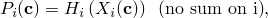

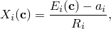

其中

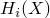

是用于生成贡献的函数：
- 绝对值（默认，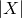），
- Macauley 括号（），或
- 恒等式（*X*）；


是偏移因子（默认0.0）；和

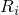

是比例因子（默认1.0）。

函数  仅在 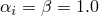 时可以是恒等函数。 上述方程中各种系数的单位取决于势使用的上下文。 在大多数情况下，方程中的系数要么是无量纲的，要么具有长度单位，要么具有长度倒数的单位。 在所有情况下，您必须小心定义势的单位是一致的。

#### 将势定义为二次或一般椭圆形式

要将势定义为一般椭圆形式，必须指定整体指数的倒数 。

| **输入文件用法：** | 要将势定义为二次形式，您可以省略指定  *component name or number*, , , , ,  ... ``` 使用以下选项将势定义为一般椭圆形式： ``` [*CONNECTOR POTENTIAL](../key/key-link.md#usb-kws-mconnectorpotential), OPERATOR=SUM, EXPONENT= *component name or number*, , , , ,  ... ``` 每个数据行定义势的一个贡献  可以是 ABS（绝对值和默认）、MACAULEY（Macauley 括号）或 NONE（恒等式）。 |

| **Abaqus/CAE 用法：** | 相互作用模块：连接截面编辑器：摩擦、塑性或损伤行为选项：**力势**、**起始势**或**演化势**：****算子**：**和**，**指数**：2（对于二次形式）或 , OPERATOR=MAX *component name or number*, , , , ,  ... ``` |
| --- | --- |
|  | 每个数据行定义势的一个贡献  可以是 ABS（绝对值和默认）、MACAULEY（Macauley 括号）或 NONE（恒等式）。 |

| **Abaqus/CAE 用法：** | 相互作用模块：连接截面编辑器：摩擦、塑性或损伤行为选项：**力势**、**起始势**或**演化势**：****算子**：**最大**，选择****添加**并输入势贡献的数据。 根据需要重复添加贡献。 |
| --- | --- |

#### 构建用于塑性或摩擦定义的势的要求

连接势  可以使用相对运动的内在分量、导出分量或两者来定义。 势的特定贡献可以是以下两种类型之一：
- 使用绝对值或 Macauley 括号函数定义的范数型贡献（），或使用任何可用函数将范数型  和 Macauley 和型  导出分量组合定义的贡献（参见 ["构建用于塑性或摩擦定义的导出分量的要求](pt06ch31s02alm30.md#usb-elm-econnect-req-cdc)"）。
- 使用相对运动的内在分量或  型（参见 ["构建用于塑性或摩擦定义的导出分量的要求](pt06ch31s02alm30.md#usb-elm-econnect-req-cdc)"）的导出分量以及恒等函数定义的求和型贡献（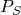）。

当在连接塑性或连接摩擦的上下文中使用时，必须构建势以满足以下要求：
- 势的所有  贡献必须属于同一类型。 在同一势定义中不允许混合  贡献。
- 如果所有  项都是  型项，则每项的符号必须为正（默认）。
- 正数  所示的点焊和上面定义的屈服函数  
=0.02 
=0.05 
=1.5 
[*CONNECTOR POTENTIAL](../key/key-link.md#usb-kws-mconnectorpotential), EXPONENT= 
normal, , , MACAULEY 
shear, , , ABS
```

### 输出

连接的可用 Abaqus/Explicit 输出变量列在 ["Abaqus/Explicit 输出变量标识符，" 第4.2.2节](pt02ch04s02xbv01.md) 中。 定义耦合行为的连接函数时，以下变量（仅在 Abaqus/Explicit 中可用）特别令人关注：

| CDERF | 具有附加到输出变量的连接导出分量名称的连接导出力/力矩。 如果导出连接分量与连接塑性、连接摩擦和连接损伤起始（力型）一起使用，则用于形成势的导出分量代表力，此量可用于场和历史输出。 如果连接摩擦与接触力一起使用，则不使用导出分量形成势，导出力求实际上是连接法向力 CNF（可用于连接历史输出）。 |
| --- | --- |

| CDERU | 具有附加到输出变量的连接导出分量名称的连接导出位移/旋转。 如果导出连接分量与连接损伤起始和连接损伤演化的运动类型一起使用，则用于形成势的导出分量代表位移，此量可用于场和历史输出。 |
| --- | --- |


