# 31.2.5 连接摩擦行为


**产品：** Abaqus/Standard  Abaqus/Explicit  Abaqus/CAE  

##### **参考资料**

- ["连接器概述，" 第31.1.1节](pt06ch31s01abo28.md)
- ["连接行为，" 第31.2.1节](pt06ch31s02alm27.md)
- ["用于耦合行为的连接函数，" 第31.2.4节](pt06ch31s02alm30.md)
- [*CHANGE FRICTION](../key/key-link.md#usb-kws-hchangefriction)
- [*CONNECTOR BEHAVIOR](../key/key-link.md#usb-kws-mconnectorbehavior)
- [*CONNECTOR DERIVED COMPONENT](../key/key-link.md#usb-kws-mconnectorderivedcomp)
- [*CONNECTOR FRICTION](../key/key-link.md#usb-kws-mconnectorfriction)
- [*CONNECTOR POTENTIAL](../key/key-link.md#usb-kws-mconnectorpotential)
- [*FRICTION](../key/key-link.md#usb-kws-hfriction)
- ["定义摩擦，" Abaqus/CAE 用户指南第15.17.3节](../usi/usi-link.md#usi-itn-help-friction)

### 概述

摩擦效应可在任何具有相对运动可用分量的连接器中定义。 典型连接器可能具有多个相互运动并接触的部件。 因此，连接器的相对运动可用分量中可能产生摩擦力和摩擦力矩。

要在 Abaqus 中定义连接摩擦，必须指定以下内容：
- 由摩擦系数控制的摩擦定律；
- 对摩擦产生连接接触力或力矩的贡献；和
- 摩擦力/力矩作用的局部"切向"方向。

摩擦系数可以
- 以滑移率、接触力、温度和场变量的通用形式表示；
- 由具有由指数曲线定义的光滑过渡区的静态和动态项定义；和
- 受切向最大力 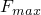 限制，这是滑动发生前连接器可以承受的最大切向力值。

Abaqus 提供了用于指定摩擦相互作用其他方面的两种替代方案：
- 预定义摩擦相互作用，您需要为要建模摩擦的连接类型指定一组特征参数。 Abaqus 自动定义接触力贡献和发生摩擦的局部"切向"方向。 预定义摩擦相互作用表示常见情况，可用于多种连接类型（参见 ["连接类型库，" 第31.1.5节](pt06ch31s01aus114.md)）。 如果需要，也可以将已知内部接触力（如来自压配装配）定义为。
- 用户定义摩擦相互作用，您定义所有摩擦产生接触力贡献和发生摩擦的局部"切向"方向。 如果预定义摩擦不适用于感兴趣的连接类型，或者预定义摩擦相互作用不能充分描述正在分析的结构，则可以使用用户定义的摩擦相互作用。 虽然使用起来更复杂，但用户定义相互作用：
  - 由于可以通过连接势和连接导出分量定义任意滑移方向的灵活性，本质上非常通用；
  - 允许将滑移方向、接触力和附加内部接触力指定为连接相对位置或运动、温度和场变量的函数（内部接触力也可以依赖于累积滑移）；和
  - 允许在同一连接的不同相对运动分量中使用多个摩擦定义。

### 连接中的摩擦公式

库仑摩擦两个接触体之间的基本概念是最大允许摩擦（剪切）力与接触体之间的接触力之间的关系。 在库仑摩擦模型的基本形式中，两个接触面可以承受剪切力 ，直到它们开始相对滑动之前达到一定大小；这种状态称为粘滞。 库仑摩擦模型将此临界剪切力定义为 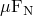，其中  是摩擦系数，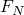 是接触力。 粘滞/滑移计算确定点何时从粘滞过渡到滑移或从滑移过渡到粘滞。 从数学上讲，关系可以形式化为


如果 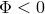，则发生摩擦粘滞；如果 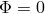，则发生滑动，此时摩擦力为 。

连接中的摩擦基于以下类比：连接器内部各个接触面的各种部件在它们的界面上传递切向以及法向力。 法向（接触）力 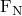 通常由连接中的运动约束或弹性力/力矩产生。 连接摩擦可用于对相对运动可用分量空间中粘滞和滑移条件下的切向（剪切）力  进行建模。 [图31.2.5-1](pt06ch31s02alm31.md#usb-elm-econnect-fricslot) 说明了连接中最简单的摩擦机制，二维分析中的 SLOT 连接器。

**图31.2.5-1** 二维 SLOT 连接中的摩擦。


发生摩擦滑动的局部切向方向是1方向（切向牵引 ），法向力由在2方向强制 SLOT 约束的运动约束产生 。 此时摩擦模型由

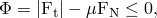

定义，在滑动情况下，该模型预测摩擦力 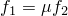，正如预期。 在这种情况下，摩擦模型很容易理解，因为滑移方向沿着内在（1到6）相对运动分量，而法向力仅由另一个与滑移方向正交的分量中的力给出。

在许多连接器中，切向牵引的定义更为复杂。 例如，摩擦可能发生在跨越两个或多个相对运动可用分量的切向方向。 考虑 ["用于耦合行为的连接函数，" 第31.2.4节](pt06ch31s02alm30.md) 中所示的 SLIDE-PLANE 连接中的摩擦滑动情况。 在这种情况下，摩擦产生法向力由1方向中的约束力给出 。 然而，切向牵引的大小由

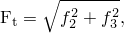

给出，因此包括来自两个相对运动分量的贡献。 2-3平面中摩擦滑动的瞬时方向先验未知。

在许多连接器中，法向力可能具有来自多个连接分量的贡献。 考虑如图 ["用于耦合行为的连接函数，" 第31.2.4节](pt06ch31s02alm30.md) 所示的三维 SLOT。 在这种情况下，切向牵引的大小由  给出，但法向力由2和3方向的约束力产生，可以写为

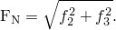

在最一般情况下，切向牵引和法向力都可能具有来自多个分量的贡献。 此外，分量方向可能包括平移（力）和旋转（力矩）。 因此，连接中的摩擦建模以更通用的形式定义，如下所示。 首先，控制粘滑条件的函数  定义为

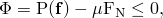

其中  是连接中力的集合；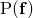 是连接势（参见 ["用于耦合行为的连接函数，" 第31.2.4节](pt06ch31s02alm30.md)），表示接触发生的表面上连接中切向牵引力的大小；和  是同一接触表面上的摩擦产生法向（接触）力。 如果 ，则发生摩擦粘滞；如果 ，则发生滑动，此时摩擦力为 。

法向力  是接触力产生连接力的量级测度 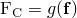 和自平衡内部接触力（如来自压配装配） 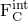 的和：

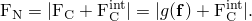

函数  由连接导出分量定义给出，如 ["用于耦合行为的连接函数，" 第31.2.4节](pt06ch31s02alm30.md) 中所示。 使用此形式，我们可以轻松重建上面说明的示例：
- 在二维 SLOT 情况下， 和 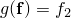。
- 在 SLIDE-PLANE 情况下， 和 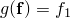。
- 在三维 SLOT 情况下， 和 。

有关连接中摩擦定义的更复杂说明，请参见本节末尾的示例。

如果为相对运动的旋转分量（如 HINGE 连接器中的）定义摩擦效应，通常更方便的是定义"切向"力矩和"法向"力矩，而不是切向牵引/力和法向力。 控制粘滑行为的伪屈服函数以类似的方式定义：

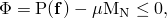

其中"法向"力矩  写为

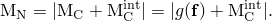

 是自平衡摩擦产生内部"接触"力矩（例如来自压配）。 有关示例，请参见本节末尾的 ["在 HINGE 连接中指定摩擦"](pt06ch31s02alm31.md#usb-elm-econnectbehav-fric-hinge)。

### 预定义摩擦行为

预定义摩擦相互作用允许您对常用连接类型中的典型摩擦机制进行建模，而无需定义摩擦响应的力学原理。 您不是直接指定势  来定义切向牵引量级测度和通过导出分量定义的接触力 ，而是指定：
- 与连接类型关联的一组摩擦相关参数，包括特定于连接类型的几何参数，以及可选的内部接触力  或接触力矩 " 中所术）。

然后 Abaqus 根据提供的连接类型和几何参数自动在内部生成势  和接触力 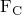。 [表31.2.5-1](pt06ch31s02alm31.md#usb-elm-econnectbehav-predef-params) 显示了预定义摩擦相互作用可用的连接类型以及相关的摩擦参数。 几何参数的含义以及 Abaqus 自动生成的相应势和导出分量在 ["连接类型库，" 第31.1.5节](pt06ch31s01aus114.md) 中描述。

**表31.2.5-1** 预定义摩擦相关参数。
| 连接类型 | 摩擦相关参数 |
| --- | --- |
| 几何参数 | 内部接触力/力矩 |
| CYLINDRICAL | *R*, *L* |  |
| HINGE | , , 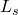 |  |
| PLANAR | *R* | ,  |
| SLIDE-PLANE | 无 |  |
| SLOT | 无 |  |
| TRANSLATOR | 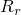, *L* |  |
| UJOINT | , , 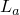 | 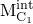, 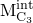 |
| SLIPRING | 无 | 无 |

有关预定义摩擦的示例，请参见本节末尾的示例。

| **输入文件用法：** | ``` [*CONNECTOR FRICTION](../key/key-link.md#usb-kws-mconnectorfriction), PREDEFINED *friction-related parameters outlined in [Table 31.2.5-1](pt06ch31s02alm31.md#usb-elm-econnectbehav-predef-params)* ``` |
| --- | --- |

| **Abaqus/CAE 用法：** | 相互作用模块：连接截面编辑器：****添加****摩擦****：****摩擦模型：预定义**，****预定义摩擦参数**，*在数据表中输入 [表31.2.5-1](pt06ch31s02alm31.md#usb-elm-econnectbehav-predef-params) 中概述的摩擦相关参数* |
| --- | --- |

### 用户定义摩擦行为

如果预定义摩擦不适用于感兴趣的连接类型，或者预定义摩擦相互作用不能充分描述正在分析的结构，则可以使用用户定义摩擦行为。 对于用户定义摩擦，您必须指定：
- "切向"方向信息，如下所示：
  - 如果滑移方向已知，您直接指定摩擦力/力矩作用的方向，Abaqus 从中构建势 ；
  - 如果滑移方向未知，您指定势 ，Abaqus 计算瞬时滑移方向；
- 通过定义以下至少一项来指定摩擦产生法向力  或法向力矩 ：
  - 接触力  或接触力矩 ；和/或
  - 内部接触力  或内部接触力矩 " 中所术）。

#### 指定与相对运动可用分量对齐的滑移方向

摩擦切向方向通过指定可用分量（1-6）来识别，以在指定的内在连接局部方向定义摩擦力或力矩。 当连接单元只有一个相对运动可用分量时（例如 SLOT、REVOLUTE 或 TRANSLATOR），这是自然选择； 在这些情况下，形成物理连接的各种部件之间的相对滑动仅发生在一个局部方向。 在具有两个或多个相对运动可用分量的连接中，如果您愿意，指定特定相对运动可用分量允许您仅在那个方向指定摩擦效应。 例如，对于 CYLINDRICAL 连接，指定分量1仅定义翻译中的摩擦效应，而忽略绕轴的旋转以进行摩擦。

Abaqus 自动将势构建为


其中  是指定分量 *i* 中的力/力矩。

| **输入文件用法：** | ``` [*CONNECTOR FRICTION](../key/key-link.md#usb-kws-mconnectorfriction), COMPONENT=*i* ``` |
| --- | --- |

| **Abaqus/CAE 用法：** | 相互作用模块：连接截面编辑器：****添加****摩擦****：****摩擦模型：用户定义**，****滑移方向：指定方向**，*分量* |
| --- | --- |

#### 当滑移方向未知时指定势

在具有两个或多个相对运动可用分量的连接类型中，摩擦滑动不一定仅沿相对运动的可用分量之一发生。 在这种情况下，瞬时滑移方向未知，如 SLIDE-PLANE 情况在 ["连接中的摩擦公式"](pt06ch31s02alm31.md#usb-elm-econnectbehav-fricform)" 中所示。 另一个示例是 CYLINDRICAL 连接，其中摩擦滑动发生在与圆柱表面相切的方向，因此同时涉及局部1方向中的平移滑动和绕相同轴的旋转滑动（参见下面本节末尾的第一个示例）。 因此，摩擦滑动可能以耦合方式同时跨越多个可用分量发生。

在这种情况下，您必须使用连接势定义指定假定接触表面上切向牵引的量级测度 。 然后 Abaqus 同时计算瞬时滑移方向和粘滑确定，类似于 ["库仑摩擦，" Abaqus 理论指南第5.2.3节](../stm/stm-link.md#stm-ifc-coulombfric) 中描述的基于表面的三维摩擦接触计算。 对于 SLIDE-PLANE 情况，此过程最好如下所示：
- 首先，评估势 。
- 如果伪屈服函数 ，则发生滑动。
- 两个矢量分量（局部2和3方向）的瞬时滑移方向由两个剪切力  和  给出，以势的大小归一化。

通常，此策略扩展到与最终参与势定义的连接类型相关联的相对运动可用分量所跨越的空间（参见 ["用于耦合行为的连接函数，" 第31.2.4节](pt06ch31s02alm30.md)）。 例如，对于 SLIDE-PLANE 或 CYLINDRICAL 连接，多达两个分量；对于 CARDAN 连接，三个分量；对于使用 CARTESIAN 和 CARDAN 连接的用户组装连接，六个分量可以包含在势中。 有关多个示例，请参见下面的示例。

| **输入文件用法：** | 使用以下两个选项指定耦合用户定义摩擦： |
| --- | --- |
|  | ``` [*CONNECTOR FRICTION](../key/key-link.md#usb-kws-mconnectorfriction) [*CONNECTOR POTENTIAL](../key/key-link.md#usb-kws-mconnectorpotential) ``` |

| **Abaqus/CAE 用法：** | 相互作用模块：连接截面编辑器：****添加****摩擦****：****摩擦模型：用户定义**，****滑移方向：使用力势计算**，**力势** |
| --- | --- |

#### 指定接触力

您通过引用相对运动内在分量编号（1到6）或命名连接导出分量（参见 ["为连接单元定义导出分量" 在 "用于耦合行为的连接函数，" 第31.2.4节](pt06ch31s02alm30.md#usb-elm-econnectbehav-derivedcomps)）来指定摩擦产生用户定义接触力  或接触力矩 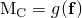。

在后一种情况下，用于定义  的比例参数可以制为与识别的局部方向、温度和场变量的函数。 在连接力和力矩的贡献都包含在导出分量定义中的情况下，通常需要这样做。 在这些情况下，用于定义导出分量的比例参数应具有长度或长度倒数的单位，以便有意义的接触力/力矩定义。

| **输入文件用法：** | 使用以下选项使用内在连接分量定义连接摩擦的接触力： |
| --- | --- |
|  | ``` [*CONNECTOR FRICTION](../key/key-link.md#usb-kws-mconnectorfriction), CONTACT FORCE=*component number (1--6)* ``` 使用以下选项使用连接导出分量定义连接摩擦的接触力： ``` [*CONNECTOR DERIVED COMPONENT](../key/key-link.md#usb-kws-mconnectorderivedcomp), NAME=*derived_component_name* [*CONNECTOR FRICTION](../key/key-link.md#usb-kws-mconnectorfriction), CONTACT FORCE=*derived_component_name* ``` |

| **Abaqus/CAE 用法：** | 相互作用模块：连接截面编辑器：****添加****摩擦****：****摩擦模型：用户定义**，**接触力**，****指定分量**：**内在分量**或**导出分量**，*分量*或指定导出分量 |
| --- | --- |
|  | Abaqus/CAE 不支持连接导出分量名称。 |

#### 指定内部接触力

内部接触力（如接触干涉）可能在连接物理装配期间形成连接器的各个部件时发生（例如，压配轴进入 CYLINDRICAL 连接套筒）。 当连接部件之间发生相对运动时，这些自平衡接触应力将产生接触力  或接触力矩 "。

内部接触力/力矩通过将接触力/力矩曲线（仅正值）指定为累积滑移、温度和场变量的函数来创建。 累积滑移计算为瞬时滑移方向中所有滑移增量绝对值之和。 因此，对于振荡或周期性运动，累积滑移单调递增，可用于建模与连接中磨损或发热相关的依赖性。

| **输入文件用法：** | ``` 内部接触力限制曲线在 [*CONNECTOR FRICTION](../key/key-link.md#usb-kws-mconnectorfriction) 选项的数据行上定义。 ``` |
| --- | --- |

| **Abaqus/CAE 用法：** | 相互作用模块：连接截面编辑器：****添加****摩擦****：****摩擦模型：用户定义**，**接触力**，并在数据表中输入**内部接触力** |
| --- | --- |

##### 指定内部接触力以依赖于局部方向

内部接触力也可以定义为依赖于连接相对位置或本构相对运动。

| **输入文件用法：** | 使用以下选项定义依赖于相对位置分量的内部接触力： |
| --- | --- |
|  | ``` [*CONNECTOR FRICTION](../key/key-link.md#usb-kws-mconnectorfriction), INDEPENDENT COMPONENTS=POSITION ``` 使用以下选项定义依赖于本构位移或旋转分量的内部接触力： ``` [*CONNECTOR FRICTION](../key/key-link.md#usb-kws-mconnectorfriction), INDEPENDENT COMPONENTS=CONSTITUTIVE MOTION ``` |

| **Abaqus/CAE 用法：** | 相互作用模块：连接截面编辑器：****添加****摩擦****：****摩擦模型：用户定义**，**接触力**，****使用独立分量：位置**或**运动** |
| --- | --- |

### 定义摩擦系数

连接摩擦定义使用标准摩擦模型（如 ["摩擦行为，" 第37.1.5节](pt09ch37s01aus169.md) 中所述）来定义摩擦系数。 对于连接单元，各向异性摩擦和与第二接触方向相关的摩擦数据被忽略。 如果未指定摩擦系数或设置为零，则连接摩擦对连接行为没有影响。 如果指定了等效剪切力/力矩极限 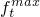（参见 ["使用可选剪切应力极限" 在 "摩擦行为，" 第37.1.5节](pt09ch37s01aus169.md#usb-cni-afriction-taumax)），则伪屈服函数 （参见 ["连接中的摩擦公式"](pt06ch31s02alm31.md#usb-elm-econnectbehav-fricform)"）中的极限摩擦力  被替换为 。

粗糙、Lagrange 和用户定义摩擦不能用于连接单元。

| **输入文件用法：** | 使用以下选项： |
| --- | --- |
|  | ``` [*CONNECTOR BEHAVIOR](../key/key-link.md#usb-kws-mconnectorbehavior), NAME=*name* [*CONNECTOR FRICTION](../key/key-link.md#usb-kws-mconnectorfriction) [*FRICTION](../key/key-link.md#usb-kws-hfriction) ``` |

| **Abaqus/CAE 用法：** | 相互作用模块：连接截面编辑器：****添加****摩擦****：****切向行为**，**摩擦系数**，并在数据表中输入**摩擦系数。** |
| --- | --- |

#### 在 Abaqus/Standard 分析期间更改摩擦系数

在 Abaqus/Standard 中，摩擦系数可以在分析期间更改，如同任何包含摩擦的分析一样（有关详细信息，请参见 ["在 Abaqus/Standard 分析期间更改摩擦属性" 在 "摩擦行为，" 第37.1.5节](pt09ch37s01aus169.md#usb-cni-afriction-change-std)）。

#### 在 Abaqus/Standard 中控制非对称求解器

在 Abaqus/Standard 中，当连接节点相互滑动时，摩擦约束产生非对称项。 如果摩擦应力对整体位移场有重大影响且摩擦应力大小高度依赖于解，则这些项对收敛率有很强的影响。 如果摩擦系数大于0.2，Abaqus/Standard 将自动使用非对称求解方法。 如果需要，您可以关闭非对称求解方法，如 ["定义分析，" 第6.1.2节](pt03ch06s01abo05.md) 中所述。

### 定义粘滞刚度

Abaus 以与所有接触相互作用类似的方式确定连接器是粘滞还是滑动（如 ["摩擦行为，" 第37.1.5节](pt09ch37s01aus169.md) 中所述），如 ["连接中的摩擦公式"](pt06ch31s02alm31.md#usb-elm-econnectbehav-fricform)" 中所概述。 如果模型粘滞，则响应弹性刚度由作为连接摩擦定义一部分指定的可选粘滞刚度确定。

如果未指定粘滞刚度，Abaus 将计算通常合适的粘滞刚度。 在 Abaqus/Standard 中，首先使用滑移容差值  以及模型中自动计算的特征长度（角度）或绝对容许弹性滑移  来定义最大容许弹性滑移长度（或角度），以直接用于粘滞摩擦的刚度方法（参见 ["在 Abaqus/Standard 中施加摩擦约束的刚度方法" 在 "摩擦行为，" 第37.1.5节](pt09ch37s01aus169.md#usb-cni-afriction-stiffness-std)）。 然后，通过简单地将当前连接极限摩擦力除以此最大容许弹性滑移长度（或角度）来确定弹性粘滞刚度。 在 Abaqus/Explicit 中，弹性粘滞刚度由 Courant（稳定性）条件确定。

| **输入文件用法：** | ``` [*CONNECTOR FRICTION](../key/key-link.md#usb-kws-mconnectorfriction), STICK STIFFNESS=*elastic stiffness* ``` |
| --- | --- |

| **Abaqus/CAE 用法：** | 相互作用模块：连接截面编辑器：****添加****摩擦****：****粘滞刚度：指定**：*弹性刚度* |
| --- | --- |

### 使用多个连接摩擦定义

多个连接摩擦可用作同一连接行为定义的一部分。 但是，每个相对运动可用分量只能使用一个连接摩擦定义来定义摩擦相互作用。 如果使用预定义摩擦，则一个连接行为定义只能关联一个连接摩擦定义。 一个连接行为定义最多只能关联一个耦合用户定义摩擦定义。 仅当每个定义的相对运动分量空间不重叠时，才允许同一连接行为定义的其他连接摩擦定义；例如，您可以定义分量1、2和6中的解耦连接摩擦，以及使用分量3、4和5的耦合连接摩擦（通过定义势）。 所有连接摩擦定义并行作用，必要时将相加。 对于特定连接单元，将进行与连接摩擦定义一样多的粘滞-滑移计算。 参见下面的示例。

### 示例

以下示例说明如何定义连接单元中的摩擦。

#### 在 CYLINDRICAL 连接中指定摩擦行为的等效方式

在 [图31.2.5-2](pt06ch31s02alm31.md#usb-elm-econnect-fricshock) 中的示例中，假设类似库仑的摩擦影响沿减震器的平移运动和绕减震器轴的旋转运动。

**图31.2.5-2** 减震器的简化连接模型。

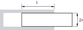

摩擦系数为 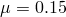，两部件在未变形配置中重叠长度为  长度单位。 认为两圆柱的平均半径为  单位。 还假定连接中的轴向运动相对较小，因此连接部件之间的重叠长度不会在分析过程中发生很大变化。 摩擦产生接触力有两个来源的贡献：
- 相互推动的内壁法向力（强制 SLOT 约束的 Lagrange 乘子的向量大小），和
- REVOLUTE 约束中的"弯曲"（强制 REVOLUTE 约束的 Lagrange 乘子的向量大小）。

有关 CYLINDRICAL 连接中预定义接触力和切向牵引的详细讨论，请参见 ["连接类型库，" 第31.1.5节](pt06ch31s01aus114.md)。 下面显示了对这些摩擦效应进行建模的两种等效替代方案：

1. 使用 Abaqus 预定义摩擦行为：
```
[*PARAMETER](../key/key-link.md#usb-kws-mparameter)
*r*=0.24
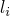=0.55
*...*
[*CONNECTOR FRICTION](../key/key-link.md#usb-kws-mconnectorfriction), PREDEFINED
, 
[*FRICTION](../key/key-link.md#usb-kws-hfriction)
0.15
```
使用预定义连接摩擦行为会产生最紧凑的摩擦效应定义。 此定义仅需要指定两个摩擦相关几何缩放常数。

2. 使用用户定义摩擦行为：
```
[*PARAMETER](../key/key-link.md#usb-kws-mparameter)
*r*=0.24
=0.55
=1.0
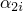=2.0/
*...*
[*CONNECTOR BEHAVIOR](../key/key-link.md#usb-kws-mconnectorbehavior), NAME=*shock*
[*CONNECTOR DERIVED COMPONENT](../key/key-link.md#usb-kws-mconnectorderivedcomp), NAME=normal
2, 3
, 
**()
[*CONNECTOR DERIVED COMPONENT](../key/key-link.md#usb-kws-mconnectorderivedcomp), NAME=normal, 5, 6
, 
**(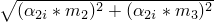)
[*CONNECTOR FRICTION](../key/key-link.md#usb-kws-mconnectorfriction), CONTACT FORCE=normal
[*CONNECTOR POTENTIAL](../key/key-link.md#usb-kws-mconnectorpotential)
1, 4, 
[*FRICTION](../key/key-link.md#usb-kws-hfriction)
0.15
```
接触力"normal"由  定义
连接势将切向牵引的大小定义为 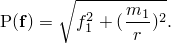
此力大小与连接上发生接触的圆柱表面相切。 在这种情况下，正向力定义和势的选择确保建模与情况A中定义的相同摩擦效应。

#### 在 CYLINDRICAL 连接中指定摩擦相互作用以考虑位置依赖性

在 [图31.2.5-2](pt06ch31s02alm31.md#usb-elm-econnect-fricshock) 中的示例中，假设两个连接部件之间发生大的轴向运动，因此重叠长度将在分析过程中显着变化。 为讨论起见，假设两个连接节点在初始配置中指定为重叠。 因此，在 CP1=0.0 时，初始重叠如上所述为 。 如果在分析过程中连接相对位置沿1分量达到 CP1=0.45 单位，则最终重叠为 。 如果连接承受"弯曲状"载荷，则可以认为随着重叠长度减小，两个部件之间产生的接触力越来越高。 使用以下用户定义摩擦行为定义来对接触力对相对位置的依赖性进行建模：

```
[*PARAMETER](../key/key-link.md#usb-kws-mparameter)
*r*=0.24
=0.55
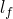=0.1
=1.0
=2.0/
=2.0/
*...*
[*CONNECTOR BEHAVIOR](../key/key-link.md#usb-kws-mconnectorbehavior), NAME=*shock*
[*CONNECTOR DERIVED COMPONENT](../key/key-link.md#usb-kws-mconnectorderivedcomp), NAME=normal
2, 3
, 
**()
[*CONNECTOR DERIVED COMPONENT](../key/key-link.md#usb-kws-mconnectorderivedcomp), NAME=normal,
INDEPENDENT COMPONENTS=POSITION
1
5, 6
, , 0
**( at CP1=0.0)
, , 0.45
**( at CP1=0.45)
[*CONNECTOR FRICTION](../key/key-link.md#usb-kws-mconnectorfriction), CONTACT FORCE=normal
[*CONNECTOR POTENTIAL](../key/key-link.md#usb-kws-mconnectorpotential)
1,
4, 
[*FRICTION](../key/key-link.md#usb-kws-hfriction)
 0.15
```

#### 指定由于装配接触干涉引起的摩擦

假设 CYLINDRICAL 连接单元中的轴被压配到套筒中，如图 [图31.2.5-3](pt06ch31s02alm31.md#usb-elm-econnect-friccylpres) 的初始配置（相对运动 = 0.0）中所示。

**图31.2.5-3** 具有略微圆锥形销的 CYLINDRICAL 连接。


轴不是完美的圆柱形，而是略微圆锥形，因此其横截面直径沿轴方向线性增加。 如果沿轴方向的相对位移为正，接触力将增加（更多接触干涉）；如果相对位移变为负（较少干涉），它们将减小。 假定指数衰减模型从静态摩擦系数过渡到动态摩擦系数。 只需指定正值接触力与位移值。 可以使用以下用户定义摩擦行为定义：

```
[*PARAMETER](../key/key-link.md#usb-kws-mparameter)
*r*=0.24
*...*
[*CONNECTOR FRICTION](../key/key-link.md#usb-kws-mconnectorfriction), INDEPENDENT COMPONENTS=CONSTITUTIVE MOTION
1
** (independent component 1)
0.70, -0.7854
0.85, -0.3927
1.0 ,  0.0
1.15,  0.3927
1.30,  0.7854
[*CONNECTOR POTENTIAL](../key/key-link.md#usb-kws-mconnectorpotential)
1,
4, ...
[*FRICTION](../key/key-link.md#usb-kws-hfriction), EXPONENTIAL DECAY
 0.25, 0.10, 0.2
```

内部接触力直接在数据行上指定，以将已知接触干涉力建模为沿分量1的连接本构相对运动的函数。 由于未指定相对运动分量编号或命名连接导出分量来定义接触力，因此接触力的唯一贡献是指定的内部接触力。

#### 在 HINGE 连接中指定摩擦

本示例说明使用连接摩擦定义在 HINGE 连接中指定摩擦效应的用法。 摩擦行为定义了绕1方向的摩擦力矩，因为没有其他相对运动可用分量。 如 ["连接类型库，" 第31.1.5节](pt06ch31s01aus114.md) 中所示，需要为预定义摩擦指定的三个几何缩放常数为：销横截面半径 =0.12；轴向方向的有效摩擦臂 =0.14；以及销和套筒之间的重叠长度 =0.65。 假定摩擦系数为 =0.15。 假定连接器已装配有产生接触力矩的初始已知接触干涉  单位。 可以使用以下输入在 HINGE 连接中指定预定义摩擦行为：

```
[*PARAMETER](../key/key-link.md#usb-kws-mparameter)
=0.12
=0.14
=0.65
*...*
[*CONNECTOR FRICTION](../key/key-link.md#usb-kws-mconnectorfriction), PREDEFINED
, , , 100.0
[*FRICTION](../key/key-link.md#usb-kws-hfriction)
 0.15
```

或者，可以指定用户定义摩擦行为来定义相同的摩擦效应（参见 ["连接类型库，" 第31.1.5节](pt06ch31s01aus114.md)）。 此外，当销由于累积滑动而磨损时，可以对干涉接触力作为累积滑移的函数而减小进行建模。 可以使用以下输入：

```
[*PARAMETER](../key/key-link.md#usb-kws-mparameter)
=0.12
=0.14
=0.65
=
=
=2.0*
*...*
[*CONNECTOR DERIVED COMPONENT](../key/key-link.md#usb-kws-mconnectorderivedcomp), NAME=contact_moment
1,
,
** (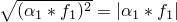)
[*CONNECTOR DERIVED COMPONENT](../key/key-link.md#usb-kws-mconnectorderivedcomp), NAME=contact_moment
2, 3
, 
**(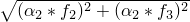)
[*CONNECTOR DERIVED COMPONENT](../key/key-link.md#usb-kws-mconnectorderivedcomp), NAME=contact_moment
5, 6
, 
**(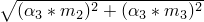)
[*CONNECTOR FRICTION](../key/key-link.md#usb-kws-mconnectorfriction), COMPONENT=4, CONTACT FORCE=contact_moment
100, 0.0
90 , 1000.0
** *interference contact moments decreasing due to wear effects*
[*FRICTION](../key/key-link.md#usb-kws-hfriction)
0.15
```

接触干涉引起的附加摩擦力矩通过将内部接触力矩指定为绕1方向累积旋转滑移的函数来建模。 连接导出分量定义用于定义在相同方向（分量4）中产生摩擦的接触力矩。 接触力矩由

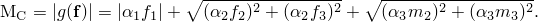

定义。

连接势由 Abaqus 自动定义为 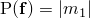。

#### 在球窝连接中指定摩擦

本示例说明在球窝连接中指定摩擦效应的规范。 定义球窝连接的首选是 JOIN 和 ROTATION，但可以使用其他旋转参数化（JOIN 和 CARDAN、JOIN 和 EULER，或 JOIN 和 FLEXION-TORSION）。 假设球半径为 ，摩擦系数为 ，可以使用以下行定义摩擦相互作用：

```
[*PARAMETER](../key/key-link.md#usb-kws-mparameter)
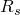=0.30
*...*
[*CONNECTOR DERIVED COMPONENT](../key/key-link.md#usb-kws-mconnectorderivedcomp), NAME=normal
1, 2, 3
1.0, 1.0, 1.0
**()
[*CONNECTOR FRICTION](../key/key-link.md#usb-kws-mconnectorfriction), CONTACT FORCE=normal
[*CONNECTOR POTENTIAL](../key/key-link.md#usb-kws-mconnectorpotential)
4, 
5, 
6, 
[*FRICTION](../key/key-link.md#usb-kws-hfriction)
 0.15
```

计算的连接摩擦力矩以及连接节点处的摩擦引起的力矩取决于连接类型。

### 在 线性扰动过程中定义连接摩擦行为

摩擦滑动在线性扰动过程中不允许。 如果连接在上一个常规分析步骤结束时正在滑动，它将在当前线性扰动步骤中自由滑动。 否则，Abaus 将允许连接以指定的粘滞刚度弹性滑动，或者如果未指定粘滞刚度，则强制执行粘滞条件。

### 输出

连接的可用 Abaqus 输出变量列在 ["Abaqus/Standard 输出变量标识符，" 第4.2.1节](pt02ch04s02abv01.md) 和 ["Abaqus/Explicit 输出变量标识符，" 第4.2.2节](pt02ch04s02xbv01.md) 中。 在连接中定义摩擦时，以下变量特别令人关注：

| CSF | 连接摩擦力/力矩。 除与连接输出变量相关常规六个分量外，CSF 还包括标量 CSFC，这是由耦合摩擦定义产生的摩擦力。 |
| --- | --- |

| CNF | 连接法向力/力矩。 CNF 包括标量 CNFC，这是与耦合摩擦定义相关的摩擦产生法向力。 |
| --- | --- |

| CASU | 连接累积滑移。 CASU 包括标量 CASUC，这是与耦合摩擦定义相关的累积滑移。 |
| --- | --- |

| CIVC | 与耦合摩擦定义相关的连接瞬时速度。 |
| --- | --- |


