# 31.2.6 连接塑性行为


**产品：** Abaqus/Standard  Abaqus/Explicit  Abaqus/CAE  

##### **参考资料**

- ["连接器概述，" 第31.1.1节](pt06ch31s01abo28.md)
- ["连接行为，" 第31.2.1节](pt06ch31s02alm27.md)
- ["连接弹性行为，" 第31.2.2节](pt06ch31s02alm28.md)
- ["连接耦合行为的函数，" 第31.2.4节](pt06ch31s02alm30.md)
- [*CONNECTOR BEHAVIOR](../key/key-link.md#usb-kws-mconnectorbehavior)
- [*CONNECTOR DERIVED COMPONENT](../key/key-link.md#usb-kws-mconnectorderivedcomp)
- [*CONNECTOR ELASTICITY](../key/key-link.md#usb-kws-mconnectorelasticity)
- [*CONNECTOR HARDENING](../key/key-link.md#usb-kws-mconnectorhardening)
- [*CONNECTOR PLASTICITY](../key/key-link.md#usb-kws-mconnectorplasticity)
- [*CONNECTOR POTENTIAL](../key/key-link.md#usb-kws-mconnectorpotential)
- ["定义塑性，" Abaqus/CAE 用户指南第15.17.6节](../usi/usi-link.md#usi-itn-help-plasticity)

### 概述

Abaqus 中的连接塑性：
- 可用于模拟形成实际连接设备的部件的塑性/不可逆变形；例如，
  - 门铰链中的销或套筒可能在作用于其上的力/力矩足够大时发生塑性变形；
  - 汽车悬架系统中的连接单元可能因滥用载荷而发生不可逆变形；或
  - 汽车车架中的点焊和飞机中的铆钉可能在它们所组成的结构构件上的力大于预期时发生非弹性变形；
- 根据连接中的合力和力矩定义；
- 使用理想塑性或各向同性/运动硬化行为模型；
- 可在率相关效应重要时使用；
- 可在任何具有相对运动可用分量的连接器中指定；
- 可用于已指定弹性或刚性行为的相对运动可用分量；
- 可以解耦方式使用，定义单个相对运动可用分量中的弹塑性或刚性塑性响应；以及
- 可用于指定耦合弹塑性或刚性塑性行为，在这种情况下，几个相对运动可用分量中的响应同时以耦合方式参与以定义塑性效应。

要在 Abaqus 中定义连接塑性，以下是必要的：
- 塑性开始前的弹性或刚性行为；
- 引发塑性流动的屈服函数；以及
- 硬化行为，用于定义初始屈服值，以及塑性运动开始后可选的屈服值演化。

### 连接中的塑性公式

连接中的塑性公式与金属塑性中的塑性公式类似（参见 ["经典金属塑性，" 第23.2.1节](pt05ch23s02abm17.md)）。在连接器中，应力（）对应于力（），应变（）对应于本构运动（），塑性应变（）对应于塑性相对运动（），等效塑性应变（）对应于等效塑性相对运动（）。屈服函数  定义为


其中  是最终有助于屈服函数的相对运动可用分量中的力和力矩集合；连接势能  定义了连接牵引力的大小，类似于在 Mises 塑性中定义等效应力状态，由 Abaqus 自动定义或用户定义；并且  是屈服力/力矩。只要 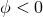，连接相对运动  保持弹性；当发生塑性流动时，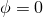。

如果发生屈服，塑性流动规则假定是相关的；因此，塑性相对运动定义为

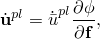

其中  是塑性相对运动率， 是等效塑性相对运动率。

#### 加载和卸载行为

当连接器不主动屈服时，Abaqus 允许与塑性定义相关的以下三种类型的行为：
- 线性弹性行为，如 [图31.2.6-1](pt06ch31s02alm32.md#usb-elm-econnectbehav-linnonlin-elast)(a) 所示，是最常见的情况，因为可以通过指定杨氏模量在金属塑性中建模类似行为。弹性运动发生在塑性开始之前，从塑性状态卸载发生在与初始加载平行的直线上。
  **图31.2.6-1** 线性弹塑性（a）、刚性塑性（b）和非线性弹塑性（c）响应。
  
- 刚性行为，如 [图31.2.6-1](pt06ch31s02alm32.md#usb-elm-econnectbehav-linnonlin-elast)(b) 所示，假定线性弹性行为的斜率为无穷大；因此，塑性开始前的弹性运动为零，从塑性状态卸载发生在垂直线上。实际上，刚性行为使用自动选择的高惩罚刚度来强制执行。
- 非线性弹性行为，如 [图31.2.6-1](pt06ch31s02alm32.md#usb-elm-econnectbehav-linnonlin-elast)(c) 所示，其中初始弹性加载沿定义的非线性路径发生。弹性卸载沿非线性曲线（C  Oc）发生，该曲线只是用户定义的非线性弹性曲线运动平移后经过点 C。用户rained 定义的非线性弹性行为必须使得卸载路径（C  Oc）不与加载路径（O  I  C）相交；否则，将发生局部不稳定。

可以除了弹性/刚性/塑性规范之外还指定其他行为（如阻尼或摩擦），但这些行为在塑性计算中不会被考虑，因为它们被认为与弹塑性/刚性塑性行为并行（参见 ["连接行为，" 第31.2.1节](pt06ch31s02alm27.md) 中的概念模型）。

### 定义弹塑性或刚性塑性行为

与任何其他连接行为类型一样，连接塑性只能为相对运动的可用分量定义。例如，您不能在 BEAM 连接器中或在 SLOT 连接器的分量2和3中定义塑性行为，因为这些分量不适用于行为定义。此问题的解决方案是：
- 定义具有相对运动可用分量的连接类型，以最好地模拟您的连接设备在塑性开始前后的运动学；
- 将所需分量定义为刚性（参见 ["连接弹性行为，" 第31.2.2节](pt06ch31s02alm28.md)）；以及
- 在某些或所有这些分量中指定刚性塑性行为。

例如，要为其他刚性类梁连接器定义刚性塑性，您可以使用 PROJECTION CARTESIAN 连接以及 PROJECTION FLEXION-TORSION 连接，将所有分量定义为刚性，然后继续进行您的塑性定义。

弹塑性行为通常为可能发生塑性变形的相对运动可用分量指定弹簧状行为。

| **输入文件用法：** | 使用以下选项在连接器中定义刚性塑性： |
| --- | --- |
|  | ``` [*CONNECTOR BEHAVIOR](../key/key-link.md#usb-kws-mconnectorbehavior), NAME=*name* [*CONNECTOR ELASTICITY](../key/key-link.md#usb-kws-mconnectorelasticity), RIGID [*CONNECTOR PLASTICITY](../key/key-link.md#usb-kws-mconnectorplasticity) [*CONNECTOR HARDENING](../key/key-link.md#usb-kws-mconnectorhardening) ``` 使用以下选项在连接器中定义弹塑性： ``` [*CONNECTOR BEHAVIOR](../key/key-link.md#usb-kws-mconnectorbehavior), NAME=*name* [*CONNECTOR ELASTICITY](../key/key-link.md#usb-kws-mconnectorelasticity) [*CONNECTOR PLASTICITY](../key/key-link.md#usb-kws-mconnectorplasticity) [*CONNECTOR HARDENING](../key/key-link.md#usb-kws-mconnectorhardening) ``` |

| **Abaqus/CAE 用法：** | 使用以下输入在连接器中定义刚性塑性： |
| --- | --- |
|  | 相互作用模块：连接截面编辑器：****添加****弹性****，**定义**：**刚性**；****添加****塑性**** 使用以下输入在连接器中定义弹塑性：相互作用模块：连接截面编辑器：****添加****弹性****；****添加****塑性**** |

### 定义解耦塑性行为

解耦弹塑性或刚性塑性行为，为每个相对运动分量独立指定，类似于一维塑性。您必须在指定的相对运动分量中定义弹性或刚性行为。在这种情况下，连接势能函数自动选择为

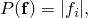

其中  是指定塑性行为的相对运动  可用分量中的力或力矩。在这种情况下，相关的塑性流动变为

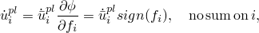

其中 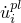 是塑性相对运动率，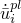 是  分量中的等效塑性相对运动率。

| **输入文件用法：** | 使用以下选项定义解耦刚性塑性连接行为： |
| --- | --- |
|  | ``` [*CONNECTOR BEHAVIOR](../key/key-link.md#usb-kws-mconnectorbehavior), NAME=*name* [*CONNECTOR ELASTICITY](../key/key-link.md#usb-kws-mconnectorelasticity), RIGID, COMPONENT=*i* [*CONNECTOR PLASTICITY](../key/key-link.md#usb-kws-mconnectorplasticity), COMPONENT=*i* [*CONNECTOR HARDENING](../key/key-link.md#usb-kws-mconnectorhardening) ``` 使用以下选项定义解耦弹塑性连接行为： ``` [*CONNECTOR BEHAVIOR](../key/key-link.md#usb-kws-mconnectorbehavior), NAME=*name* [*CONNECTOR ELASTICITY](../key/key-link.md#usb-kws-mconnectorelasticity), COMPONENT=*i* [*CONNECTOR PLASTICITY](../key/key-link.md#usb-kws-mconnectorplasticity), COMPONENT=*i* [*CONNECTOR HARDENING](../key/key-link.md#usb-kws-mconnectorhardening) ``` |

| **Abaqus/CAE 用法：** | 使用以下输入定义解耦刚性塑性连接行为： |
| --- | --- |
|  | 相互作用模块：连接截面编辑器：****添加****弹性****，**定义**：**刚性**；****添加****塑性****，**耦合**：**解耦** 使用以下输入定义解耦弹塑性连接行为：相互作用模块：连接截面编辑器：****添加****弹性****，**定义**：**线性**或**非线性**，**耦合**：**解耦**；****添加****塑性****，**耦合**：**解耦** |

### 定义耦合塑性行为

当几个相对运动可用分量同时以耦合方式参与屈服函数  的定义时，您应该在连接器中定义耦合塑性。在这种情况下，您必须通过连接势能定义定义势能 *P*。塑性流动最终仅发生在最终参与势能的相对运动内在分量中。弹性或刚性行为应该为参与势能定义的所有相对运动分量指定。这些分量的弹性/刚性行为可以以解耦方式、耦合方式或两者的组合方式指定。在连接行为中指定的所有与势能定义相关的相对运动分量有关的弹性定义被共同用于定义耦合弹塑性或刚性塑性的弹性。

| **输入文件用法：** | 使用以下选项定义耦合弹塑性或刚性塑性连接行为： |
| --- | --- |
|  | ``` [*CONNECTOR BEHAVIOR](../key/key-link.md#usb-kws-mconnectorbehavior), NAME=*name* [*CONNECTOR ELASTICITY](../key/key-link.md#usb-kws-mconnectorelasticity) [*CONNECTOR PLASTICITY](../key/key-link.md#usb-kws-mconnectorplasticity) [*CONNECTOR POTENTIAL](../key/key-link.md#usb-kws-mconnectorpotential) [*CONNECTOR HARDENING](../key/key-link.md#usb-kws-mconnectorhardening) ``` |

| **Abaqus/CAE 用法：** | 相互作用模块：连接截面编辑器：****添加****弹性****；****添加****塑性****，**耦合**：**耦合**，**力势能** |
| --- | --- |

#### 模式混合比

如果耦合塑性定义在相关势能定义中至少包含两个项（参见 ["连接单元的派生分量定义" 在 "连接耦合行为的函数，" 第31.2.4节](pt06ch31s02alm30.md#usb-elm-econnectbehav-derivedcomps)），则可以定义模式混合比以反映前两项对其势能贡献的相对权重。模式混合比可用于基于塑性运动的连接损伤定义（参见 ["连接损伤行为，" 第31.2.7节](pt06ch31s02alm33.md)）以指定损伤起始和损伤演化的依赖性。它定义为


其中 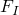 是为塑性势能指定的第一个分量中的力/力矩， 是为同一势能指定的第二个分量中的力/力矩。如果 ，则 ；如果 ，则 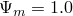；如果两者都不为 0.0，则  在 1.0 和 1.0 之间的某个位置。

### 定义塑性硬化行为

Abaqus 提供了从简单理想塑性到非线性各向同性/运动硬化的多种硬化模型。连接硬化类似于 Abaqus 用于承受循环载荷的金属的硬化模型，参见 ["金属循环载荷模型，" 第23.2.2节](pt05ch23s02abm18.md)。

#### 定义理想塑性

理想塑性意味着屈服力不随塑性相对运动变化。

| **输入文件用法：** | 使用以下选项定义理想塑性： |
| --- | --- |
|  | ``` [*CONNECTOR HARDENING](../key/key-link.md#usb-kws-mconnectorhardening)  ``` |

| **Abaqus/CAE 用法：** | 相互作用模块：连接截面编辑器：****添加****塑性****：**指定各向同性硬化**，**各向同性硬化**，并在数据表中输入**屈服力/力矩** |
| --- | --- |

#### 定义非线性各向同性硬化

各向同性硬化行为定义了屈服面大小  随等效塑性相对运动  的演化。这种演化可以通过以表格形式将  直接指定为  的函数来引入，或者使用简单的指数定律

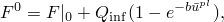

其中  是零塑性相对运动时的屈服值， 和 *b* 是材料参数。 是屈服面大小的最大变化，*b* 定义了屈服面大小随塑性变形发展的变化率。当定义屈服面大小的等效力保持不变时（），则没有各向同性硬化。

##### 通过指定表格数据定义各向同性硬化分量

可以通过将定义屈服面大小的等效力  指定为等效相对塑性运动 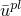 的表格函数来引入各向同性硬化，如果需要，还可以作为等效相对塑性运动率 、温度和/或其他预定义场变量的函数。给定状态下的屈服值简单地从此数据表中插值得到。

| **输入文件用法：** | ``` [*CONNECTOR HARDENING](../key/key-link.md#usb-kws-mconnectorhardening), TYPE=ISOTROPIC, DEFINITION=TABULAR (default) ``` |
| --- | --- |

| **Abaqus/CAE 用法：** | 相互作用模块：连接截面编辑器：****添加****塑性****：**指定各向同性硬化**，**各向同性硬化**，**定义**：**表格** |
| --- | --- |

##### 使用指数定律定义各向同性硬化分量

如果这些参数已从测试数据校准，则直接指定指数定律的材料参数（、 和 *b*）。可以将这些参数指定为温度和/或场变量的函数。

| **输入文件用法：** | ``` [*CONNECTOR HARDENING](../key/key-link.md#usb-kws-mconnectorhardening), TYPE=ISOTROPIC, DEFINITION=EXPONENTIAL LAW ``` |
| --- | --- |

| **Abaqus/CAE 用法：** | 相互作用模块：连接截面编辑器：****添加****塑性****：**指定各向同性硬化**，**各向同性硬化**，**定义**：**指数定律** |
| --- | --- |

#### 定义非线性运动硬化

当指定非线性运动硬化时，屈服面的中心允许在力空间中平移。反向力  是屈服面的当前中心，其解释类似于 ["经典金属塑性，" 第23.2.1节](pt05ch23s02abm17.md) 中讨论的反向应力 。

屈服面由函数定义


其中  是屈服值，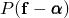 是关于反向力  的势能。

运动硬化分量被定义为纯运动项（线性 Ziegler 硬化定律）和松弛项（记忆项）的加法组合，后者引入非线性。当省略温度和场变量依赖性时，硬化定律为


其中 *C* 和  是必须从循环测试数据校准的材料参数。*C* 是初始运动硬化模量， 决定了运动硬化模量随塑性变形增加而减小的速率。当 *C* 和  为零时，该模型简化为各向同性硬化模型。当  为零时，恢复线性 Ziegler 硬化定律。有关校准材料参数的讨论，请参见 ["金属循环载荷模型，" 第23.2.2节](pt05ch23s02abm18.md)。

##### 通过指定半周期测试数据定义运动硬化分量

如果有有限的测试数据，*C* 和  可以基于单向拉伸或压缩实验第一个半周期获得的力-本构运动数据。此类测试数据的示例如 [图31.2.6-2](pt06ch31s02alm32.md#usb-elm-econnect-half-cycle) 所示。

**图31.2.6-2** 半周期力-运动数据。


这种方法通常适用于模拟仅涉及少量加载循环的情况。

对于每个数据点（），从测试数据中获得  的值，如下所示：

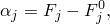

其中  是与各向同性硬化定义的相应塑性运动处的用户定义屈服面大小，或者如果未定义各向同性硬化分量，则是初始屈服力。

对反向力演化定律在半周期上的积分产生表达式


该表达式用于校准 *C* 和 。

当测试数据被给定为温度和/或场变量的函数时，建议首先运行数据检查分析。在数据检查运行期间，Abaqus 将确定几对材料参数（*C*，），其中每对对应于温度和/或场变量的给定组合。由于 Abaqus 要求参数  为常量，如果  不为常量，数据检查分析将终止并显示错误消息。但是，可以从数据检查运行期间数据文件中提供的信息确定  的适当常数值。然后可以如下所述直接输入参数 *C* 和常量  的值。

| **输入文件用法：** | ``` [*CONNECTOR HARDENING](../key/key-link.md#usb-kws-mconnectorhardening), TYPE=KINEMATIC, DEFINITION=HALF CYCLE (default) ``` |
| --- | --- |

| **Abaqus/CAE 用法：** | 相互作用模块：连接截面编辑器：****添加****塑性****：**指定运动硬化**，**运动硬化**，**定义**：**半周期** |
| --- | --- |

##### 通过指定稳定周期测试数据定义运动硬化分量

力-本构运动数据可以从承受对称循环的试样的稳定周期获得。通过在固定运动范围  上循环试样直到达到稳态条件来获得稳定周期；即，直到力-运动曲线不再从下一个周期改变形状。这种稳定周期如 [图31.2.6-3](pt06ch31s02alm32.md#usb-elm-econnect-stable-cycle) 所示。

**图31.2.6-3** 稳定周期的力-运动数据。

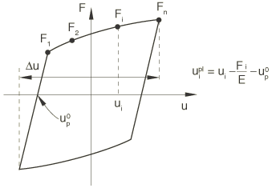

有关在连接硬化定义中指定数据之前应如何处理数据的信息，请参见 ["金属循环载荷模型，" 第23.2.2节](pt05ch23s02abm18.md)。

| **输入文件用法：** | ``` [*CONNECTOR HARDENING](../key/key-link.md#usb-kws-mconnectorhardening), TYPE=KINEMATIC, DEFINITION=STABILIZED ``` |
| --- | --- |

| **Abaqus/CAE 用法：** | 相互作用模块：连接截面编辑器：****添加****塑性****：**指定运动硬化**，**运动硬化**，**定义**：**稳定** |
| --- | --- |

##### 直接指定材料参数定义运动硬化分量

如果 *C* 和  已从测试数据校准，则可以直接指定。参数 *C* 可以作为温度和/或场变量的函数提供，但  的温度和场变量依赖性不可用。当前用于积分非线性各向同性/运动硬化模型的算法在  的值由于温度和/或场变量依赖性而在增量中显著变化时无法提供准确的解决方案。

| **输入文件用法：** | ``` [*CONNECTOR HARDENING](../key/key-link.md#usb-kws-mconnectorhardening), TYPE=KINEMATIC, DEFINITION=PARAMETERS ``` |
| --- | --- |

| **Abaqus/CAE 用法：** | 相互作用模块：连接截面编辑器：****添加****塑性****：**指定运动硬化**，**运动硬化**，**定义**：**参数** |
| --- | --- |

#### 定义非线性各向同性/运动硬化

组合各向同性/运动硬化模型的演化定律由两部分组成：一个各向同性硬化分量，描述屈服面大小的等效力  随塑性相对运动的变化；和一个非线性运动硬化分量，描述屈服面通过反作用力  在力空间中的平移。

最多可以有两个连接硬化定义（一个各向同性和一个运动）与一个连接塑性定义相关联。如果只指定了一个连接硬化定义，则它可以是各向同性或运动硬化。

| **输入文件用法：** | 使用以下两个选项定义非线性各向同性/运动硬化： |
| --- | --- |
|  | ``` [*CONNECTOR HARDENING](../key/key-link.md#usb-kws-mconnectorhardening), TYPE=KINEMATIC [*CONNECTOR HARDENING](../key/key-link.md#usb-kws-mconnectorhardening), TYPE=ISOTROPIC ``` |

| **Abaqus/CAE 用法：** | 相互作用模块：连接截面编辑器：****添加****塑性****：**指定各向同性硬化**和**指定运动硬化** |
| --- | --- |

### 使用多个塑性定义

多个连接塑性定义可用作同一连接行为定义的一部分。但是，每个相对运动可用分量只能使用一个连接塑性定义来定义塑性。最多可以有一个耦合塑性定义与连接行为定义相关联。只有当两个空间不重叠时，才允许同一连接行为定义使用额外的连接塑性定义；例如，您可以为分量1、2和6定义解耦连接塑性，并让一个耦合连接塑性定义涉及分量3、4和5。

每个连接塑性定义必须有自己的硬化定义。

### 示例

以下示例展示了解耦和耦合塑性行为。

#### 类 SLOT 连接器中的解耦塑性

考虑一个您用于高效建模物理设备的 SLOT 连接器。您已经检查了强制 SLOT 约束在局部2和3方向上的反作用力；由于它们看起来相当大，您需要评估设备中是否可能发生塑性变形。您可以选择的一种方法是为您使用的插槽和设备中的销创建详细网格，定义它们之间的接触相互作用，并使用底层材料的弹塑性材料定义。虽然这是最准确的建模解决方案，但它可能不切实际，特别是当您建模的设备是较大模型的一部分时。或者，您可以执行以下操作：
- 使用 CARTESIAN 连接类型代替 SLOT 连接，第一个轴与插槽方向对齐；
- 将分量2和3定义为刚性；以及
- 分别在每个分量中定义刚性塑性。

可以使用以下输入：

```
[*CONNECTOR SECTION](../key/key-link.md#usb-kws-mconnectorsection), BEHAVIOR=slot
CARTESIAN
 orientation at node a
[*CONNECTOR BEHAVIOR](../key/key-link.md#usb-kws-mconnectorbehavior), NAME=slot
[*CONNECTOR ELASTICITY](../key/key-link.md#usb-kws-mconnectorelasticity), RIGID
 2, 3
[*CONNECTOR PLASTICITY](../key/key-link.md#usb-kws-mconnectorplasticity), COMPONENT=2
[*CONNECTOR HARDENING](../key/key-link.md#usb-kws-mconnectorhardening), TYPE=ISOTROPIC
 100, 0.0
 110, 0.12
[*CONNECTOR PLASTICITY](../key/key-link.md#usb-kws-mconnectorplasticity), COMPONENT=3
[*CONNECTOR HARDENING](../key/key-link.md#usb-kws-mconnectorhardening), TYPE=ISOTROPIC
 50, 0.0
 75, 0.23
```

您在连接硬化定义中指定的屈服力来自实验结果或从"虚拟实验"评估，如下所示：
- 使用上面讨论的插槽网格模型。
- 通过约束设备的插槽部分并使用边界条件将销驱动到插槽壁来运行两个简单的单独分析。
- 绘制销节点处反作用力与其运动的图表。
- 使用这些数据创建力-运动硬化曲线，以在连接硬化定义中指定。

#### 点焊中的耦合塑性

参考 [图31.2.6-4](pt06ch31s02alm32.md#usb-elm-econnect-weldexample-plast) 中所示的点焊和 ["连接势能定义" 在 "连接耦合行为的函数，" 第31.2.4节](pt06ch31s02alm30.md#usb-elm-econnectbehav-potential) 中描述的屈服函数，

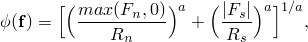

例如，您可以通过指定表格各向同性硬化和通过参数的运动硬化来完成塑性定义。

**图31.2.6-4** 点焊连接。


```
[*PARAMETER](../key/key-link.md#usb-kws-mparameter)
=0.02
=0.05
[*CONNECTOR ELASTICITY](../key/key-link.md#usb-kws-mconnectorelasticity), RIGID
[*CONNECTOR PLASTICITY](../key/key-link.md#usb-kws-mconnectorplasticity)
[*CONNECTOR POTENTIAL](../key/key-link.md#usb-kws-mconnectorpotential), EXPONENT=a
normal, , , MACAULEY
shear, , , ABS
[*CONNECTOR HARDENING](../key/key-link.md#usb-kws-mconnectorhardening), TYPE=ISOTROPIC
, 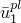
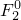, 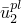
[*CONNECTOR HARDENING](../key/key-link.md#usb-kws-mconnectorhardening), TYPE=KINEMATIC, DEFINITION=PARAMETERS
*C*, 
```

### 在线姓扰动过程中定义塑性连接行为

在线性扰动分析期间，不允许塑性相对运动。因此，连接相对运动将是关于塑性变形基础状态的线性弹性扰动，类似于金属塑性。

### 输出

连接的可用 Abaqus 输出变量列在 ["Abaqus/Standard 输出变量标识符，" 第4.2.1节](pt02ch04s02abv01.md) 和 ["Abaqus/Explicit 输出变量标识符，" 第4.2.2节](pt02ch04s02xbv01.md) 中。在连接中定义塑性时，以下输出变量特别令人关注：

| CUE | 连接弹性位移/旋转。 |
| --- | --- |

| CUP | 连接塑性位移/旋转。 |
| --- | --- |

| CUPEQ | 连接等效塑性相对位移/旋转。除了与连接输出变量相关的通常六个分量外，CUPEQ 还包括标量 CUPEQC，这是与耦合塑性定义相关的等效塑性相对运动。 |
| --- | --- |

| CALPHAF | 连接运动硬化偏移力/力矩。 |
| --- | --- |


